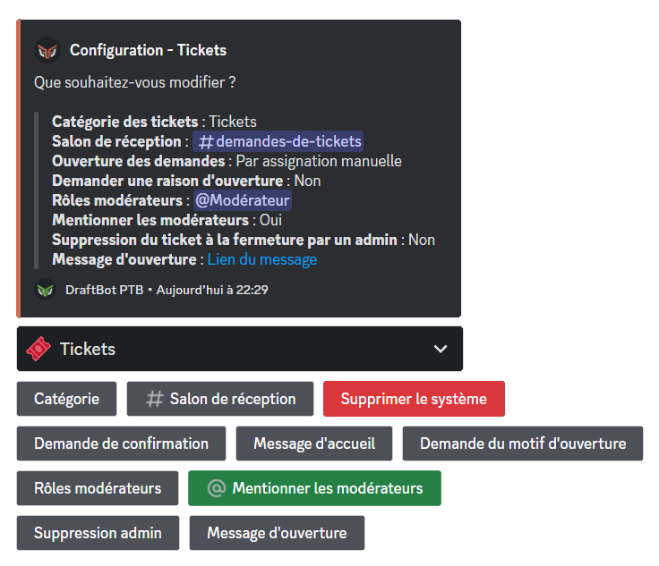
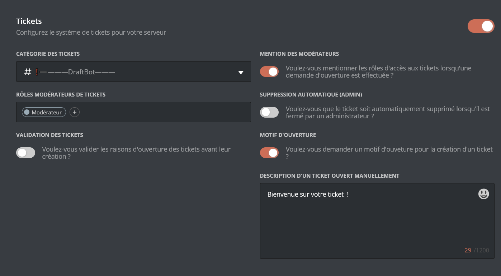

### Créer un ticket

Vous pouvez créer ou demander la création d'un ticket en utilisant la commande \</ticket>.

::hint{ type="info" }
La variable `raison` bien que facultative, peut être rendue obligatoire par les gérants du serveur. Il est conseillé de toujours la remplir de manière générale.
::

### Modération des tickets

Les administrateurs et modérateurs de tickets disposent des commandes suivantes permettant un contrôle supplémentaire sur les accès aux tickets :

* </ticketmod ouvrir> ➜ Permet d'ouvrir un ticket pour un membre dans un objectif de contact privé.
* </ticketmod ajouter> ➜ Permet d'autoriser l'accès au contenu du ticket à un membre quelconque.
* </ticketmod retirer> ➜ Permet de retirer l'accès au contenu du ticket à un membre.

### Salon de réception

Le salon de réception des tickets permet de recevoir les demandes de tickets des membres, qu'elles soient réalisées via l'utilisation de la commande \</ticket> ou bien via un **message d'ouverture**.

::hint{ type="info" }
La réception des demandes de tickets dans ce salon nécessite obligatoirement que les ouvertures de demandes soient configurées en mode **Manuel**.
::

## Configuration

::tabs
  ::tab{ label="Via la commande /config" }
    Pour configurer le système de tickets, vous pouvez utiliser la commande \</config> puis cliquer dans la section "Tickets".

    ::hint{ type="warning" }
    Si le système n'est pas configuré, un seul bouton "Configurer le système" sera visible. Cliquez dessus pour commencer la configuration.
    ::

    

    >**Catégorie** ➜ Permet de définir la catégorie de création des tickets. Vous pouvez demander à DraftBot de la créer automatiquement pour vous ou bien d'en utiliser une existante.

    > **Salon de réception** ➜ Permet de définir le salon qui recevra les demandes d'ouverture de ticket. Si la validation est en mode **Automatique**, seul l'historique des fermetures et suppressions de ticket sera affiché dans ce salon. Vous pouvez demander à DraftBot de créer automatiquement le salon ou bien d'en utiliser un existant.

    ::hint{ type="info" }
    Le salon de réception des tickets se trouve par défaut dans la catégorie que vous avez indiquée, mais peut être déplacé dans une autre catégorie.
    ::

    > **Supprimer le système** ➜ Permet de réinitialiser le système et revenir au bouton "Configurer le système".

    ::hint{ type="warning" }
    Cette action est irréversible, toute la configuration sera perdue.
    ::

    > **Demande de confirmation** ➜ Permet de modifier le message de confirmation affiché lorsqu'un ticket est demandé (modifiable, uniquement, si la validation des tickets est en mode **Manuel**). Vous pouvez choisir la présentation "Par défaut" de DraftBot ou votre texte personnalisé en cliquant sur "Modifier".

    > **Demande du motif d'ouverture** ➜ Permet d'obliger les membres à indiquer une raison d'ouverture du ticket. La raison fournie est indiquée dans le message d'accueil du ticket ainsi que sur la demande d'ouverture si la validation des tickets est en mode **Manuel**.

    > **Message d'accueil** ➜ Permet de modifier la description du message d'accueil d'un ticket **uniquement** lorsqu'il a été ouvert via la commande </ticketmod ouvrir>. Lorsqu'un ticket est ouvert via la commande \</ticket> la description du message d'accueil contient alors la raison indiquée par le membre.

    > **Rôles modérateurs** ➜ Ajouter ou retirer des rôles n'ayant pas la permission "Administrateur" qui auront accès aux tickets. Plusieurs rôles peuvent être ajoutés.

    > **Mentionner les modérateurs** ➜ Activer/désactiver la mention automatique des rôles indiqués comme rôles modérateurs à chaque nouveau ticket ouvert. Si cette option est activée, tous les rôles modérateurs seront mentionnés, il n'est actuellement pas possible de choisir les rôles à mentionner parmi la liste des rôles modérateurs.

    > **Suppression admin** ➜ Les tickets sont directement supprimés si un administrateur de serveur ferme un ticket.
  ::

  ::tab{ label="Via le panel" }
    

    Sur le panel, dans la catégorie **Communautaire**, vous retrouverez sur la partie des **Tickets**, les mêmes possibilités de configuration qu'avec les commandes Slash sur Discord. Le message d'ouverture sera prochainement configurable sur le panel.

    > ⚠️ Une fois vos modifications effectuées, n'oubliez pas d'enregistrer avec le bouton "Enregistrer" situé en bas de la page.

    * **Catégorie des tickets** ➜ Permet de définir la catégorie de création des tickets. La catégorie doit avoir été préalablement créée. Pensez à actualiser la page du panel si vous avez créé une catégorie entre-temps.

    * **Mention des modérateurs** ➜ Permet d'activer la mention automatique des modérateurs lors de l'ouverture d'un ticket.

    * **Rôles modérateurs de tickets** ➜ Ajouter ou retirer des rôles n'ayant pas la permission Administrateur qui auront accès aux tickets. Plusieurs rôles peuvent être ajoutés.

    * **Suppression automatique (admin)** ➜ Lorsque cette option est activée, les tickets sont directement supprimés si un administrateur ferme un ticket.

    * **Validation des tickets** ➜ Lorsque la validation est activée, les demandes de tickets sont transférées dans le **salon de réception** et doivent être acceptées/refusées par les **modérateurs de tickets** ou administrateurs.

    * **Motif d'ouverture** ➜ Permet d'astreindre ou non les membres à spécifier un motif d'ouverture du ticket lors de l'utilisation de \</ticket>. Son activation est conseillée afin d'éviter les abus de création de tickets ou les demandes sans raison particulière.
  ::
::

### Message d'ouverture

Le message d'ouverture permet aux membres de sélectionner une raison d'ouverture prédéfinie à partir d'un bouton ou sélecteur pour demander un ticket. Il peut être utilisé comme alternative ou complément de la commande \</ticket>.
Lors de sa première configuration, depuis la commande \</config> dans la section **Tickets** puis en cliquant sur "Message d'ouverture", vous devrez sélectionner le type de message d'ouverture souhaité :

* **Bouton** ➜ Une seule raison d'ouverture qui se présentera sur le texte du bouton sera configurable via ce mode.

* **Sélecteur** ➜ Ce mode permet d'ajouter plusieurs raisons d'ouverture de tickets. En suivant les instructions et questions posées par le bot, vous aurez la possibilité de personnaliser le nom des raisons, leurs émojis associés et descriptions.

::hint{ type="info" }
Vous pouvez vous servir d'un message préalablement créé depuis l'Embed Creator sur le panel en cliquant sur "Message existant" sur la question posée après sélection du type de message d'ouverture pour personnaliser à votre guise l'embed de présentation ou via la commande \</envoyer>.
::
