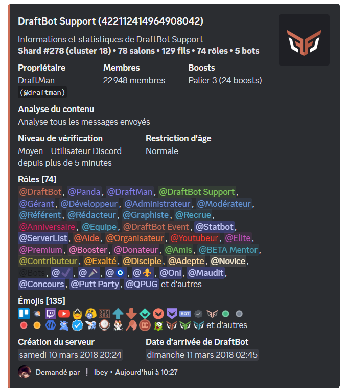
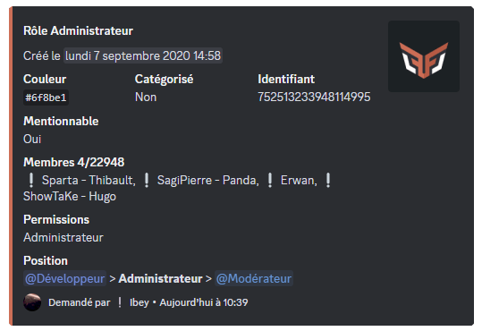
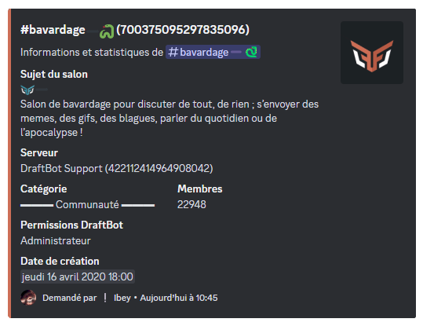

## /info utilisateur

La commande </info utilisateur> vous permet d'obtenir les informations détaillées d'un utilisateur :

- La mention et l'identifiant de l'utilisateur.
- Les différents rôles qu'il possède sur le serveur.
- La date d'arrivée sur le serveur.
- La date de création de son compte.
- Les badges de DraftBot : le premium, les membres de l'équipe de DraftBot.
- Les badges de Discord : la HypeSquad, le partenaire, le développeur actif, le développeur de bot certifié de la première heure, etc.

::hint{ type="info" }
Si l'utilisateur n'est pas présent sur votre serveur, la date d'arrivée et les rôles ne seront pas affichés.
::

::hint{ type="info" }
Il est possible de voir les informations d'un utilisateur autre que le vôtre en utilisant son **pseudonyme** ou son **identifiant** après la commande. Par exemple : </info utilisateur>.
::

## /info serveur

La commande </info serveur> vous permet d'obtenir les informations détaillées de votre serveur Discord :

- Le nom du serveur.
- Le shard et le cluster où il se trouve dans la page "[Statuts](/statuts)".
- Le pseudonyme du propriétaire.
- Le nombre de membres, de salons, de fils, de rôles, d'émojis, de bots et de boosts.
- Le niveau de sécurité : la vérification et la restriction d'âge.
- La date de création du serveur.
- La date d'arrivée de DraftBot sur le serveur.

## /info rôle

La commande </info rôle> vous permet d'obtenir les informations détaillées sur un rôle bien précis :

- L'identifiant du rôle.
- Le code couleur héxadécimal du rôle.
- S'il est catégorisé ou non.
- S'il est mentionnable ou non.
- Le nombre de membres qui le possède.
- Les permissions qu'il possède.
- Sa position hiéarchique parmi les autres rôles.

## /info salon

La commande </info salon> vous permet d'obtenir les informations détaillées sur un salon ou une catégorie bien précis :

- L'identifiant du salon ou de la catégorie.
- Le sujet du salon.
- Le nom du serveur et son identifiant.
- La catégorie où le salon se trouve.
- Le nombre de membres qui ont la permission de voir le salon.
- Les permissions de DraftBot.
- La date de création du salon ou de la catégorie.

::hint{ type="info" }
Pour distinguer les différents types de salons et catégories, une icône apparaîtra à côté de leur nom : une icône "#" pour les salons textuels, une icône "📁" pour les catégories, une icône "🔊" pour les salons vocaux, une icône "📢" pour les salons d'annonces.
::

## /profil

La commande \</profil> vous permet d'obtenir les informations détaillées sur le profil d'un membre du serveur :

- La mention du membre.
- La localité, qui n'apparaît que si le membre l'a configuré.
- Le niveau et le rang dans le classement du serveur.
- L'argent en sa possession sur le serveur.
- La date de son anniversaire, si elle a été activée et rendue visible.
- Les profils de jeux : son pseudonyme sur les différents jeux et les plateformes.
- La date de création du compte.
- La date d'arrivée sur le serveur.

::hint{ type="info" }
Vous pouvez ajouter une description sur votre profil avec la commande \</description>.
::

::hint{ type="info" }
Il est possible de voir le profil d'un utilisateur autre que le vôtre en utilisant son **pseudonyme** ou son **identifiant** après la commande. Par exemple : \</profil>.
::
