## Consulter votre niveau

Pour connaître votre niveau ou celui d'autres membres, utilisez la commande \</niveau> suivie du nom du membre.

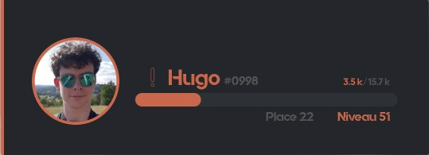

## Classement des membres

La commande \</topniveau> vous permet de consulter le classement des niveaux sur le serveur, affichant les cinq premiers membres et votre propre position. Pour voir le classement complet, cliquez sur **"Voir l'ensemble du classement"**.

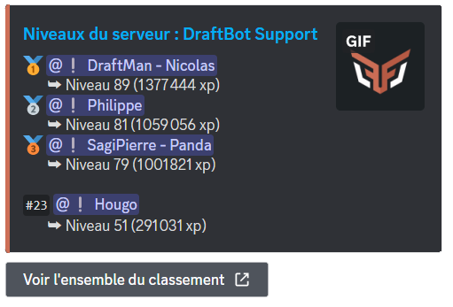

## Récompenses de niveau

Utilisez la commande \</recompenses> pour voir les récompenses disponibles sur votre serveur.

## Gérer les niveaux des membres

Voici des commandes pour gérer l'expérience des membres :

- _</adminxp définir>_ : Permet de définir le nombre d'expérience ou de niveaux d'un membre.
- _</adminxp ajouter>_ : Permet d'ajouter de l'expérience ou des niveaux à un membre.
- _</adminxp réinitialiser server>_ : Permet de réinitialiser l'expérience et les niveaux de tous les membres du serveur.
- _</adminxp retirer>_ : Permet de retirer de l'expérience ou des niveaux à un membre.

::hint{ type="warning" }
La commande _</adminxp réinitialiser serveur>_ est définitive et ne permet pas de restaurer l'expérience des membres après exécution.
::

## Configuration

### Système de niveaux

::tabs
  ::tab{ label="Commande /config" }
    Pour ajuster les paramètres de niveaux directement sur Discord, utilisez la commande \</config>, puis sélectionnez l'onglet "Niveaux".

    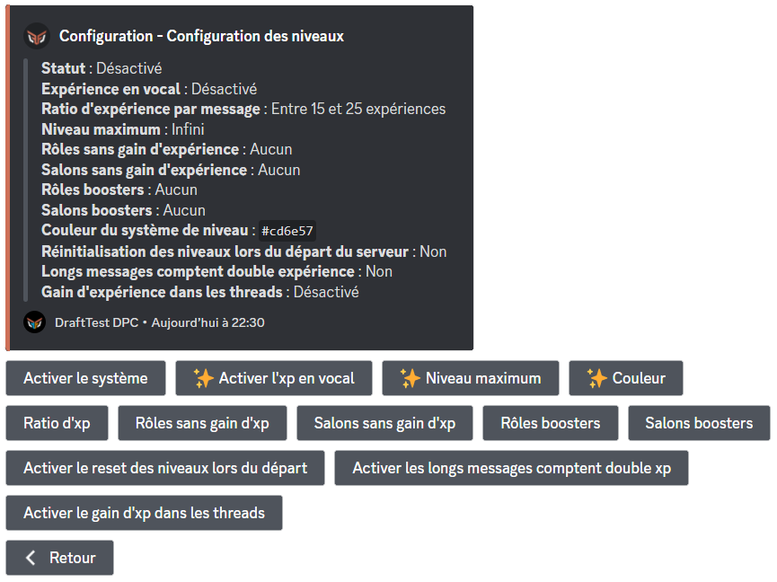
  ::

  ::tab{ label="Panel" }

    [Accéder au panel de **DraftBot**](/dashboard/first/levels)

    Le panel offre une interface simple pour configurer le système de niveaux.

    Pour configurer le système de niveau, accédez au panel via le lien ci-dessus et rendez-vous dans la séction "Niveaux" sur le serveur de votre choix.

    ::hint{type="warning"}
    N'oubliez pas de sauvegarder vos modifications en cliquant sur le bouton "Enregistrer" en bas de la page.
    ::

    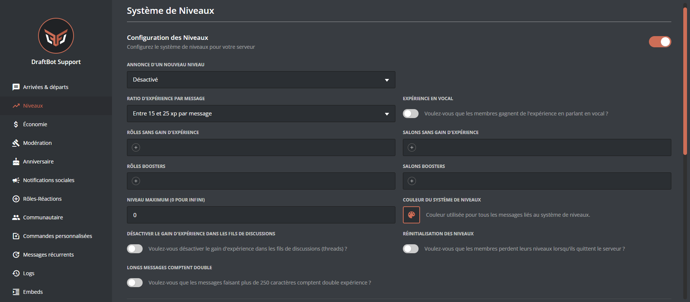
  ::
::

#### Fonctionnalitées

- **Expérience de messages** : Expérience variable pour chaque message envoyé (1 par minute).
- **Expérience en vocal** : Expérience variable toutes les 2 minutes dans une discussion vocale. [**(✨ premium)**](/premium)
  - Minimum 2 humains dans le salon vocal.
  - Le salon vocal ne doit pas être paramétré comme "AFK".
  - Le membre ne doit pas être mute dans le salon vocal.

- **Ratio d'xp** : Ajuste la quantité d'expérience obtenue par message.
- **Rôles / Salons sans gain d'xp** : Exclut certains rôles ou salons du gain d'expérience.
- **Rôles / Salons boosters** : Augmente l'expérience obtenue dans certains rôles ou salons.
- **Activer le reset des niveaux lors du départ** : Les membres perdent leur expérience en quittant le serveur.
- **Activer les longs messages comptent double xp** : Les messages plus longs rapporteront plus d'expérience.
- **Activer le gain d'xp dans les threads** : Permet de gagner de l'expérience dans les threads du serveur.
- **Couleur** : Personnalise la couleur du système de niveaux. [**(✨ premium)**](/premium)
- **Niveau maximum** : Définit un niveau maximal. [**(✨ premium)**](/premium)

### Récompenses de niveau

Pour définir les récompenses liées aux niveaux sur votre serveur, vous avez deux options :

::tabs
  ::tab{ label="Commande /config" }
    Pour configurer les récompenses de niveaux sur Discord, utilisez la commande \</config>, accédez à l'onglet "Niveaux" puis sélectionnez "Récompenses de niveaux".

    Vous pourrez alors :

    - **Créer** : Ajoute une nouvelle récompense.
    - **Modifier** : Change les détails d'une récompense existante.
    - **Supprimer** : Enlève une récompense spécifiée.
    - **Réinitialiser** : Efface toutes les récompenses définies sur le serveur.

    ::hint{ type="warning" }
    L'option "Réinitialiser" ne peut pas être annulée. Une fois les récompenses supprimées, elles devront être recréées manuellement.
    ::

    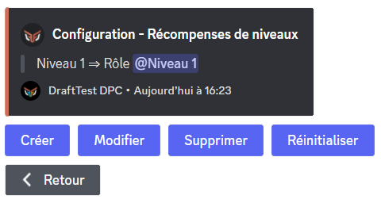
  ::

  ::tab{ label="Panel" }
    [Accéder au panel de DraftBot](/dashboard/first/levels)

    Rendez-vous sur le panel via [ce lien](/dashboard). Dans la section "Niveaux", cliquez sur **"Créer une récompense"**. Un formulaire vous permettra de spécifier les détails de la récompense.

    ::hint{type="warning"}
    N'oubliez pas de sauvegarder vos modifications en cliquant sur le bouton "Enregistrer" en bas de la page.
    ::

    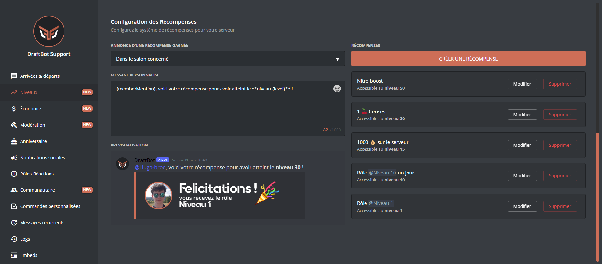
  ::
::

### Annonces de niveaux

Gérez les annonces de progression de niveaux et de récompenses pour motiver vos membres et reconnaître leurs efforts.
    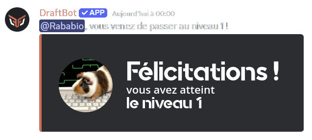
::tabs
  ::tab{ label="Commande /config" }
    Dans "Niveaux" de la commande \</config>, sélectionnez "Annonce d'un nouveau niveau" pour :

    Pour définir des récompenses de niveaux directement sur Discord, utilisez la commande \</config>, puis sélectionnez l'onglet "Niveaux" et "Récompenses de niveaux".

    - **Activer les annonces** : Commence à annoncer les passages de niveaux.
    - **Salon** : Détermine où les annonces seront publiées.
    - **Message personnalisé** : Permet de personnaliser le message d'annonce.

    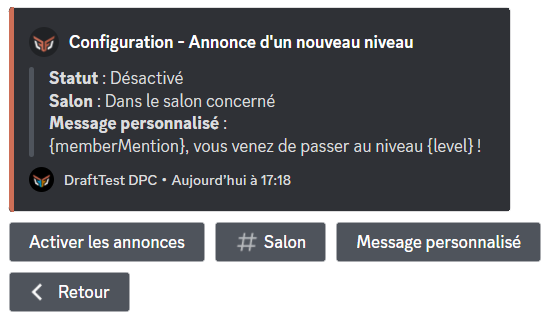
  ::

  ::tab{ label="Panel" }
    [Accéder au panel de DraftBot](/dashboard/first/levels)

    Rendez-vous sur le panel via [ce lien](/dashboard). Dans la section "Niveaux", activez les annonces de nouveaux niveaux en choisissant le salon d'envoi et en personnalisant le message si désiré.

    ::hint{ type="info" }
    Utilisez les variables disponibles pour personnaliser davantage vos messages.
    ::

    ::hint{type="warning"}
    Assurez-vous de cliquer sur "Enregistrer" une fois les modifications effectuées.
    ::

    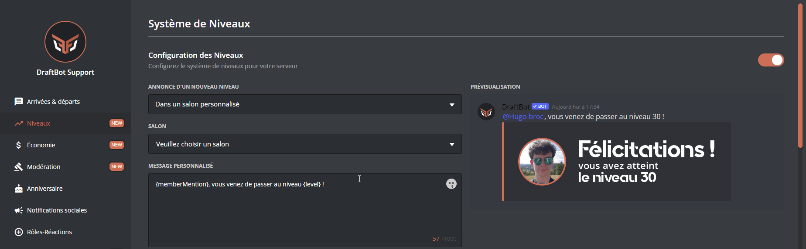
  ::
::

### Annonces de récompenses

Pour gérer les annonces des récompenses obtenues par les membres, vous disposez de plusieurs options, à configurer selon votre préférence soit directement via Discord avec une commande, soit à travers le panel de DraftBot.

::tabs
  ::tab{ label="Commande /config" }
    Accédez à la section "Niveaux" via la commande \</config>, puis sélectionnez "Annonce d'une récompense" pour activer ou personnaliser les annonces de récompenses. Vous pouvez :

    - **Activer les annonces** : Pour commencer à annoncer l'attribution de récompenses.
    - **Salon** : Sélectionner le salon où les annonces seront publiées.
    - **Message personnalisé** : Modifier le message d'annonce par défaut.

    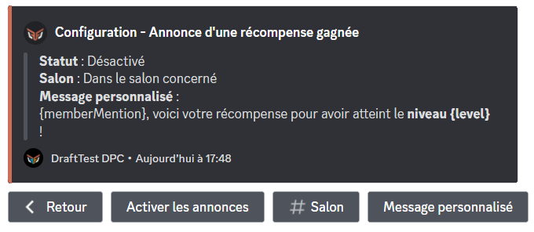
  ::

  ::tab{ label="Panel" }
    Visitez le panel de DraftBot pour une configuration plus intuitive à [ce lien](/dashboard). Dans la section "Niveaux", activez et personnalisez les annonces pour les récompenses obtenues :

    - Sélectionnez le salon d'annonce.
    - Personnalisez le message d'annonce avec les variables disponibles pour une touche personnelle.

    N'oubliez pas de sauvegarder vos changements en cliquant sur "Enregistrer" à la fin.

    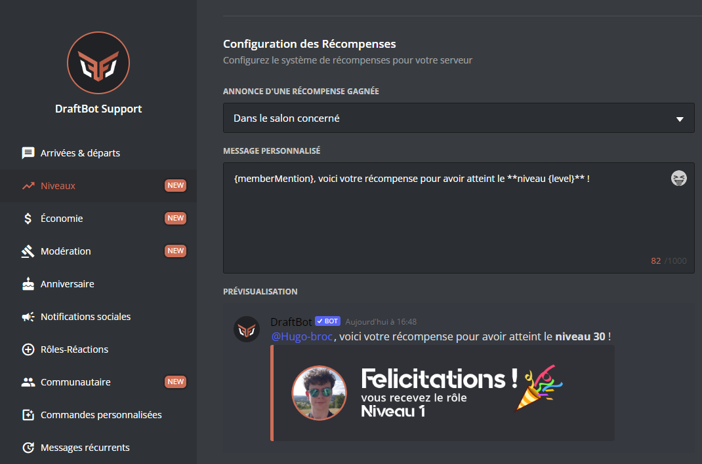
  ::
::

### Migration depuis MEE6

Si vous passez de MEE6 à DraftBot, vous avez la possibilité d'importer les niveaux de vos membres pour ne pas perdre leur progression.

::hint{ type="info" }
Assurez-vous que MEE6 est présent sur votre serveur et que son classement est accessible publiquement.
::

Après avoir cliqué sur **Importer MEE6**, DraftBot vous demandera de confirmer l'importation.

::hint{ type="success" }
Les niveaux de MEE6 ont été importés avec succès.
::
