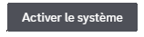

**DraftBot** propose différents systèmes de modération automatiques tel que l'auto-modération ou encore les auto-sanctions. Par exemple expulser un membre, l'avertir et bien plus encore ! Sans oublier le système de sanctions prédéfinies.

## Détection d'infractions

Envie d'automatiser certains actes de modération tel que la censure des invitations discord ou du vocabulaire interdit ? Alors découvrez l'auto-modération de **DraftBot** !

::tabs
  ::tab{ label="Via la commande /config" }
    Rendez-vous d'abord dans la catégorie **`🔨 Modération`** de la commande \</config> puis appuyez sur **`Détection d'infractions`**. Vous pourrez ensuite configurer les différents modules :

    

  ::hint{ type="warning" }
    Sachez que certaine fonctionnalitée apparaiçant dans le screen ci-dessus *(`Masquer le nom du modérateur en MP`, `Cacher les réponses des commandes` et `Sanctions prédéfinies`)* disponible dans la commande \</config> n'apparaisse pas apparaitre dans cette page. **Cette page traite uniquement de l'auto-modération.** Si vous rechercher des informations concernant la modération, consultez la page prévu à cette effet ➜ **`🔨 Modération`**.
  ::

    ::collapse{ label="Vocabulaire interdit" }
    Détection de mots ou vocabulaire interdit.

    #### Mots interdits
    #### Censure
    #### Mode strict
    #### Rôles ignorés
    #### Salons ignorés
    #### Mode silencieux
    ::

    ::collapse{ label="Invitations Discord" }

    #### Censure
    #### Invitations autorisées 
    #### Serveurs immunisés
    #### Rôles ignorés
    #### Salons ignorés
    #### Mode silencieux
    ::
    ::collapse{ label="Liens externes" }

    #### Domaine autorisés / interdits
    #### Censure
    #### Rôles ignorés
    #### Salons ignorés
    #### Mode silencieux
    ::
    ::collapse{ label="Majuscules excessives" }

    #### Pourcentage de majuscules
    #### Limite de caractères
    #### Rôles ignorés
    #### Salons ignorés
    #### Mode silencieux
    ::
    ::collapse{ label="Émojis excessifs" }

    #### Pourcentage d'émojis 
    #### Limite d'émojis maximum
    #### Rôles ignorés
    #### Salons ignorés
    #### Mode silencieux
    ::
    
    ::collapse{ label="Mentions excessives" }

    #### Supprimer les abus
    #### Intervalle de temps
    #### Limite de mentions
    #### Rôles ignorés
    #### Salons ignorés
    #### Supprimer
    #### Mode silencieux
    ::
    ::collapse{ label="Spam de messages" }

    #### Intervalle de temps
    #### Limite de messages
    #### Rôles ignorés
    #### Salons ignorés
    #### Mode silencieux
    ::

    ::hint{ type="info" }

    **N'oublier pas à activer le système**, via le premier bouton :

    

    ::
  ::

  ::tab{ label="Via le panel" }
    [Accéder au panel de **DraftBot**](/dashboard/first/auto-moderation)

    Rendez-vous dans la rubrique **`🛡️ Auto-Modération`**.

    

    ::collapse{ label="Vocabulaire interdit" }
    Détection de mots ou vocabulaire interdit.

    #### Mots interdits
    #### Rôles ignorés
    #### Salons ignorés
    #### Censure
    #### Mode strict
    #### Mode silencieux
    ::

    ::collapse{ label="Invitations Discord" }

    #### Rôles ignorés
    #### Salons ignorés
    #### Invitations autorisées 
    #### Serveurs immunisés
    #### Censure
    #### Mode silencieux
    ::
    ::collapse{ label="Liens externes" }

    #### Noms de domaine autorisés / interdits
    #### Rôles ignorés
    #### Salons ignorés
    #### Censure
    #### Mode silencieux
    ::
    ::collapse{ label="Majuscules excessives" }

    #### Pourcentage de majuscules
    #### Nombre de caractères minimum 
    #### Rôles ignorés
    #### Salons ignorés
    #### Mode silencieux
    ::
    ::collapse{ label="Émojis excessifs" }

    #### Pourcentage d'émojis du message 
    #### Nombre d'émojis maximum
    #### Rôles ignorés
    #### Salons ignorés
    #### Censure
    ::
    
    ::collapse{ label="Mentions excessives" }

    #### Intervalle de temps
    #### Limite de mentions
    #### Rôles ignorés
    #### Salons ignorés
    #### Supprimer
    #### Mode silencieux
    ::
    ::collapse{ label="Spam de messages" }

    #### Intervalle de temps
    #### Limite de messages
    #### Rôles ignorés
    #### Salons ignorés
    #### Censure
    ::
    ::hint{ type="warning" }
      Une fois fini, n'oubliez pas d'enregistrer vos modifications avec le bouton **`Sauvegarder`** en bas de la page.
    ::
  ::
::

## Sanctions automatiques

Système permettant d'**appliquer des sanctions automatiques aux membres ayant commis des actions interdites dans l'auto-modération**.

### Configuration

::tabs
  ::tab{ label="Via la commande /config" }
    Rendez-vous d'abord dans la catégorie **`🔨 Modération`** de la commande \</config> puis appuyez sur **`Sanctions automatiques`**. Vous pourrez ensuite configurer les différents modules :

    

  ::

  ::tab{ label="Via le panel" }
    Rendez-vous ensuite dans la rubrique **`🛡️ Auto-Modération`**.

    

    Programer une sanction automatique 

    ::collapse{ label="Sanction" }
    ::

    ::collapse{ label="Durée" }
    ::

    ::collapse{ label="Nombre d'infractions" }
    ::

    ::collapse{ label="Intervalle de temps" }
    ::
    ::hint{ type="warning" }
      Une fois fini, n'oubliez pas d'enregistrer vos modifications avec le bouton **`Sauvegarder`** à droite de la page.
    ::
  ::
::
