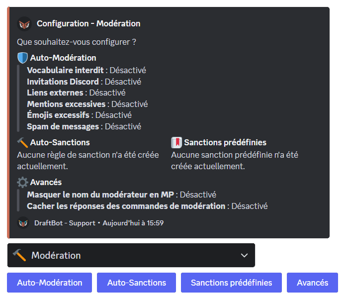

**DraftBot** propose différents systèmes de modération automatiques tel que l'auto-modération ou encore les auto-sanctions. Par exemple expulser un membre, l'avertir et bien plus encore ! Sans oublier le système de sanctions prédéfinies.

## Détection d'infractions

Envie d'automatiser certains actes de modération tel que la censure des invitations discord ou du vocabulaire interdit ? Alors découvrez l'auto-modération de **DraftBot** !

## Configuration

::tabs
  ::tab{ label="Via la commande /config" }
    Rendez-vous d'abord dans la catégorie "🔨 Modération" de la commande <mark style="color:orange;">/config</mark> puis appuyez sur "Auto-Modération". Vous pourrez ensuite configurer les différents modules :

    

    ### Vocabulaire interdit

    En cliquant sur
  ::

  ::tab{ label="Via le panel" }
    [Accéder au panel de **DraftBot**](/dashboard/first/auto-moderation)

    Rendez-vous ensuite dans la rubrique "Modération" puis "Infractions".

    ### Vocabulaire interdit

    En cliquant sur l'engrenage (⚙️) vous aurez accès à la configuration du système :

    Vous pourrez configurer les différents mots interdits.

    ### Invitations Discord

    En cliquant sur l'engrenage (⚙️) vous aurez accès à la configuration du système :

    ### Liens externes

    En cliquant sur l'engrenage (⚙️) vous aurez accès à la configuration du système :

    ### Mentions excessives

    En cliquant sur l'engrenage (⚙️) vous aurez accès à la configuration du système :

    ### Émojis excessifs

    En cliquant sur l'engrenage (⚙️) vous aurez accès à la configuration du système :

    ### Spam messages

    En cliquant sur l'engrenage (⚙️) vous aurez accès à la configuration du système :
  ::
::

## Sanctions automatiques

::tabs
  ::tab{ label="Via la commande /config" }
    Here is first tab content.
  ::

  ::tab{ label="Via le panel" }
    Here is second tab content.
  ::
::