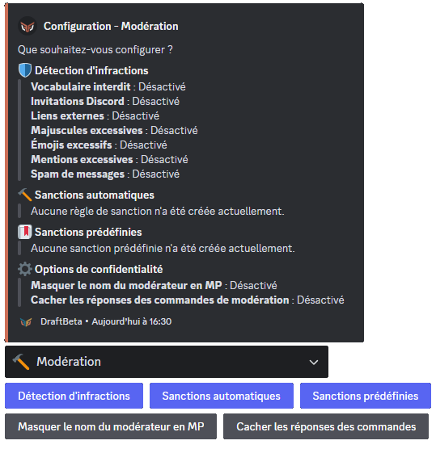
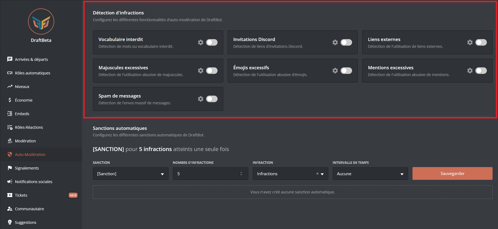
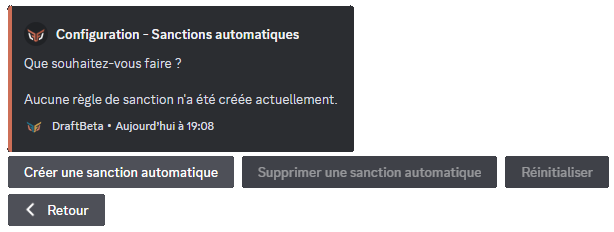
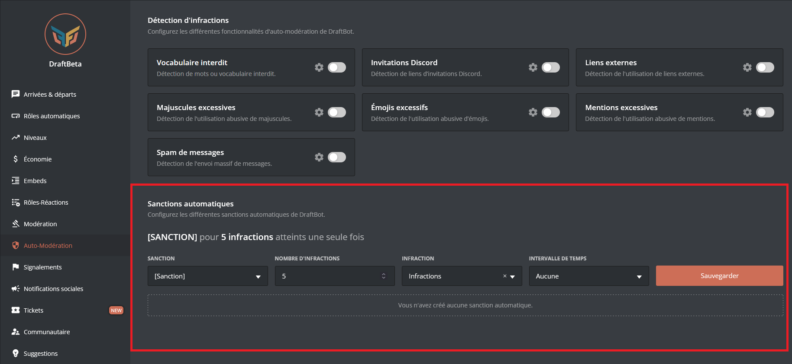

**DraftBot** propose différents systèmes de modération automatiques tel que l'auto-modération ou encore les auto-sanctions. Par exemple expulser un membre, l'avertir et bien plus encore ! Sans oublier le système de sanctions prédéfinies.

## Détection d'infractions

Envie d'automatiser certains actes de modération tel que la censure des invitations discord ou du vocabulaire interdit ? Alors découvrez l'auto-modération de **DraftBot** !

::tabs
  ::tab{ label="Via la commande /config" }
    Rendez-vous d'abord dans la catégorie **`🔨 Modération`** de la commande \</config> puis appuyez sur **`Détection d'infractions`**. Vous pourrez ensuite configurer les différents modules :

    

  ::hint{ type="warning" }
    Sachez que certaine fonctionnalitée apparaiçant dans le screen ci-dessus *(`Masquer le nom du modérateur en MP`, `Cacher les réponses des commandes` et `Sanctions prédéfinies`)* la commande \</config> peuvent ne pas apparaitre dans cette page. **Cette page traite uniquement de l'auto-modération.** Si vous rechercher des informations concernant la  modération, consultez la page prévu à cette effet ➜ **`🔨 Modération`**.
  ::

    ### Vocabulaire interdit

    ### Invitations Discord

    ### Liens externes

    ### Majuscules excessives

    ### Émojis excessifs

    ### Mentions excessives

    ### Spam de messages
  ::

  ::tab{ label="Via le panel" }
    [Accéder au panel de **DraftBot**](/dashboard/first/auto-moderation)

    Rendez-vous dans la rubrique **`🛡️ Auto-Modération`**.

    

    ### Vocabulaire interdit

    ### Invitations Discord

    ### Liens externes

    ### Majuscules excessives

    ### Émojis excessifs

    ### Mentions excessives

    ### Spam de messages

  ::
::

## Sanctions automatiques

Système **permettant d'appliquer des sanctions automatiques aux membres ayant commis des actions interdites par l'auto-modération.**

### Configuration

::tabs
  ::tab{ label="Via la commande /config" }
    Rendez-vous d'abord dans la catégorie **`🔨 Modération`** de la commande \</config> puis appuyez sur **`Sanctions automatiques`**. Vous pourrez ensuite configurer les différents modules :

    

  ::

  ::tab{ label="Via le panel" }
    Rendez-vous ensuite dans la rubrique **`🛡️ Auto-Modération`**.

    
  ::
::
