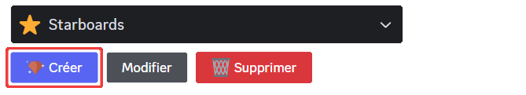
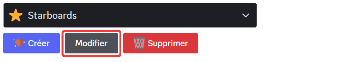
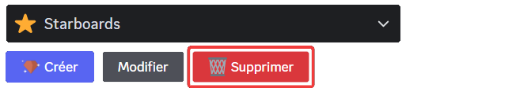
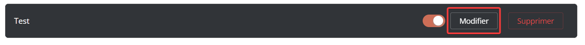
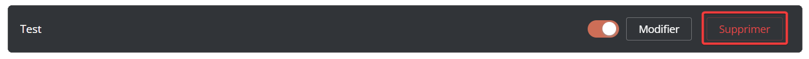
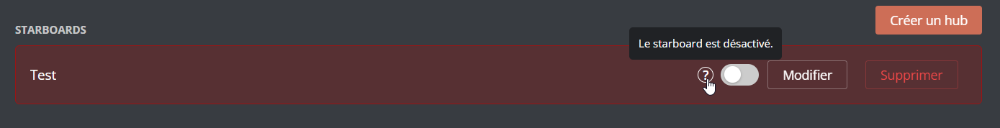
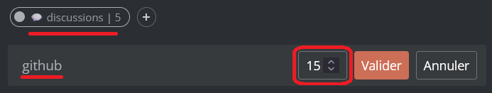

## Comment ça marche ?

Le système de starboard met en avant les messages qui reçoivent un certain nombre de réactions `⭐`, qui seront alors affichés par DraftBot dans un salon dédié, choisi ou créé lors de la configuration.

## Configuration du système

::tabs
  ::tab{ label="Via la commande /config" }

    ### Créer un starboard

    La configuration d'un starboard depuis la commande \</config> se trouve dans la catégorie starboards. Après avoir cliqué sur le bouton "Créer", laissez-vous guider par les questions afin de configurer le starboard à l'image de votre serveur.

    

    ::hint{ type="info" }
      En devenant [premium ✨](https://www.draftbot.fr/premium/), vous pourrez personnaliser l'émoji et créer jusqu'à 5 starboards.
    ::

    

    ### Modifier un starboard

    Pour modifier un starboard, cliquez sur "Modifier". DraftBot affichera alors un panel de configuration.

    

    ::hint{ type="info" }
      Vous pouvez définir entre 1 et 25 réactions minimum avant qu'un message apparaisse dans le salon dédié à ce starboard.
    ::

    ### Supprimer un starboard

    Pour supprimer un starboard, cliquez sur "Supprimer" en rouge.

    

  ::

  ::tab{ label="Via le panel" }
    Pour configurer le système via le [panel](https://www.draftbot.fr/dashboard/), il vous suffit de vous diriger dans l'onglet ''Communautaire''. Ensuite, descendez dans la liste des systèmes et vous trouverez le système de starboards.

    

    ### Créer un starboard

    Pour créer un starboard, descendez dans la partie dédié aux starboards et cliquez sur "Créer un hub". Par la suite, DraftBot vous proposera une sorte de menu de configuration pour configurer votre premier starboard.

    

    ::hint{ type="info" }
      Pour créer jusqu'à 5 starboards et choisir l'émoji associé aux réactions, le [premium ✨](https://www.draftbot.fr/premium) est nécessaire.
    ::

    ### Modifier un starboard

    Pour modifier un starboard, il vous suffit de cliquer sur "Modifier". Vous pouvez choisir si la représentation du message dans le salon est dans un embed ou pas, mais vous pouvez également choisir dans quel salon vous souhaitez qu'il s'y trouve.

    

    ::hint{ type="info" }
    Vous avez la possibilité de définir un nombre minimum de réactions, compris entre 1 et 25, avant qu'un message n'apparaisse dans le salon dédié à ce starboard.
    ::

    ### Supprimer un starboard

    Pour supprimer un starboard, cliquez sur le bouton "Supprimer".

    

    ::hint{ type="info" }
      Si vous le souhaitez, vous pouvez désactiver votre starboard tout en le conservant. Il vous suffit de décocher la case à gauche du bouton "Modifier".

      
    ::
  ::
::

## Options disponibles

::tabs
  ::tab{ label="Via la commande /config" }

    ### Salon

    #### Conditions par salon

    - Cette option particulière vous permet de **modifier le nombre de réactions nécessaires pour publier un message de manière individuelle, pour chaque salon**.

    #### Salon pouvant être mis en avant

    - Permet de **choisir des salons dont les messages pourront ou ne pourront pas apparaitre dans le starboard** malgré la demande d'un utilisateur et inversement.

    ### Réaction

    #### Émoji

    - Cette option vous **permet de modifier l'émoji par défaut du starboard *(Avantage [premium ✨](https://www.draftbot.fr/premium/)) !***

    #### Réactions minimum

    - Vous avez la possibilité de **définir un nombre minimum de réactions**.

    ::hint{ type="info" }
      Le nombre doit être compris entre 1 et 25, avant qu'un message n'apparaisse dans le salon dédié à ce starboard.
    ::

    ### Rôles

    #### Rôles pouvant être mis en avant

    - Grâce à cette option, vous pouvez **définir uniquement les messages d'un groupe d'utilisateur *(via des rôles)* pouvant apparaitre dans le starboard** et inversement.

    #### Rôles pouvant voter

    - Vous pouvez définir, via cette option, **un ou des rôles, limitant ainsi la possibilité de voter pour qu'un message se retrouve dans le starboard** et inversement.

    ### Personnalisation

    - Avec ces options, vous pouvez **modifier le contenu du message**. Le **mettre ou non dans un embed** et aussi de **changer sa couleur**.

    ::hint{ type="info" }
      Changer la couleur : on parle ici de changer la couleur de l'embed, donc il faut activer l'option pour avoir celle-ci. *(Avantage [**premium** ✨](https://www.draftbot.fr/premium/))*
    ::

    Les variables ci-dessous peuvent être utilisée dans le message envoyé dans le starboard. Voici celles utilisables pour le système de starboard :

    ::collapse{ label="Variables disponibles" }

      - `{user}` ➜ Surnom du membre sur le serveur.
      - `{user.username}` ➜ Pseudo du compte du membre.
      - `{user.globalname}` ➜ Nom affiché du compte du membre.
      - `{emoji}` ➜ Emoji du starboard.
      - `{emoji.count}` ➜ Nombre de réactions.
      - `{message.url}` ➜ Lien vers le message.

      
  ::

  ::tab{ label="Via le panel" }
    ### Salon

    #### Réaction requises par salon

    - Cette option particulière vous permet de **modifier le nombre de réactions nécessaires pour publier un message de manière individuelle, pour chaque salon**.

    

    #### Salons autorisés / interdits

    - Permet de **choisir des salons dont les messages pourront ou ne pourront pas apparaitre dans le starboard** malgré la demande d'un utilisateur et inversement.

    ### Réaction

    #### Émoji

    - Cette option vous **permet de modifier l'émoji par défaut du starboard *(Avantage [premium ✨](https://www.draftbot.fr/premium/)) !***

    #### Réactions requise

    - Vous avez la possibilité de **définir un nombre minimum de réactions**.

    ::hint{ type="info" }
      Le nombre doit être compris entre 1 et 25, avant qu'un message n'apparaisse dans le salon dédié à ce starboard.
    ::

    ### Rôles

    #### Rôles autorisés/interdits

    - Grâce à cette option, vous pouvez **définir uniquement les messages d'un groupe d'utilisateur *(via des rôles)* pouvant apparaitre dans le starboard** et inversement.

    #### Rôles autorisés/interdits  à réagir

    - Vous pouvez définir, via cette option, **un ou des rôles, limitant ainsi la possibilité de voter pour qu'un message se retrouve dans le starboard** et inversement.

    ### Contenu du message

    - Avec ces options, vous pouvez **modifier le contenu du message**. Le **mettre ou non dans un embed** et aussi de **changer sa couleur**.

    ::hint{ type="info" }
      Changer la couleur : on parle ici de changer la couleur de l'embed, donc il faut activer l'option pour avoir celle-ci. *(Avantage [**premium** ✨](https://www.draftbot.fr/premium/))*
    ::

    Les variables ci-dessous peuvent être utilisée dans le message envoyé dans le starboard. Voici celles utilisables pour le système de starboard :

    ::collapse{ label="Variables disponibles" }

      - `{user}` ➜ Surnom du membre sur le serveur.
      - `{user.username}` ➜ Pseudo du compte du membre.
      - `{user.globalname}` ➜ Nom affiché du compte du membre.
      - `{emoji}` ➜ Emoji du starboard.
      - `{emoji.count}` ➜ Nombre de réactions.
      - `{message.url}` ➜ Lien vers le message.

      
    ::
  ::
::

## Les différents formats

::tabs
  ::tab{ label="Message via un Embed" }
    
  ::

  ::tab{ label="Message sans Embed" }
    
  ::
::
