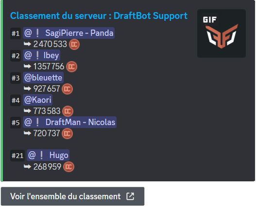
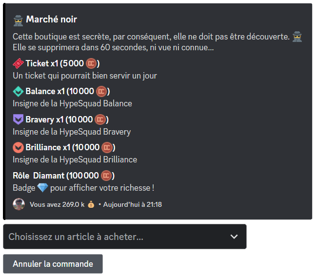
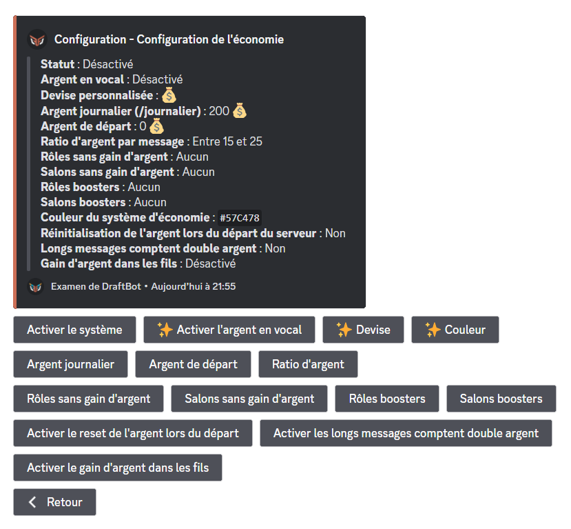
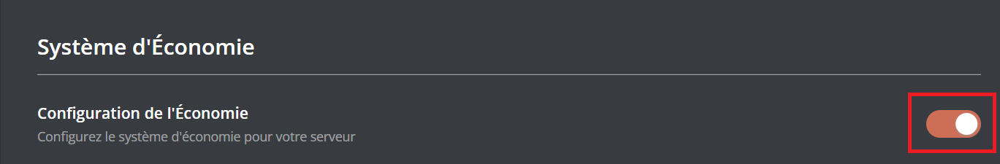
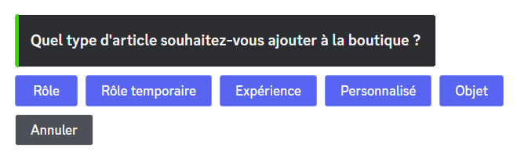
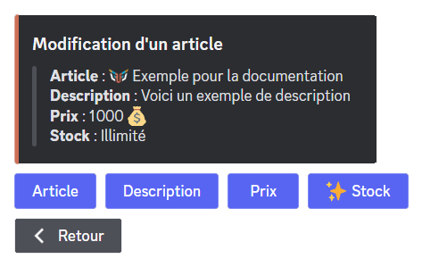
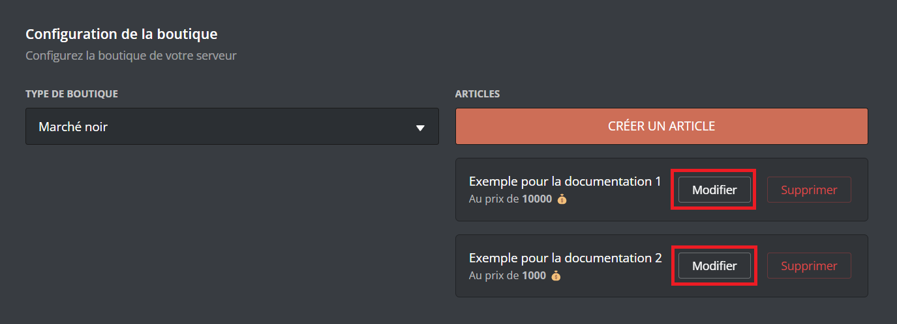
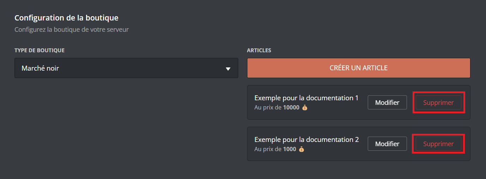
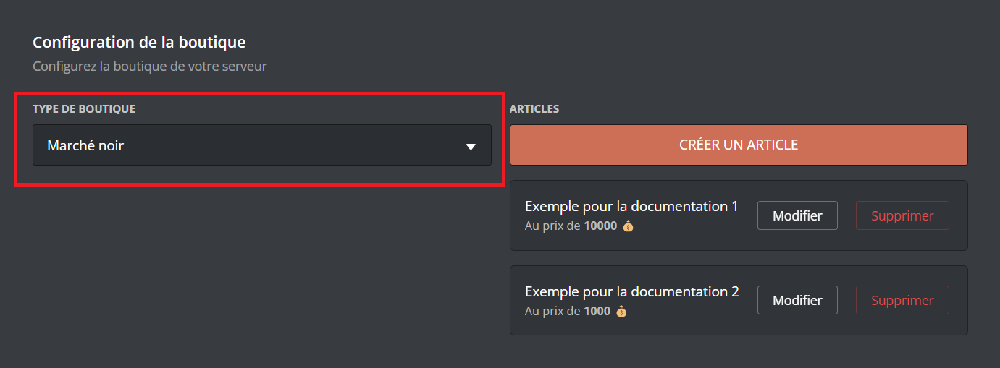
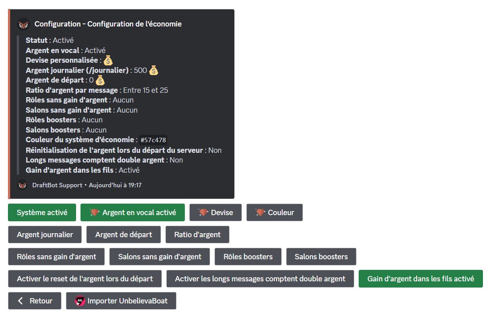

## Votre Argent

Vous pouvez voir votre somme d'argent, ainsi que celle des autres membres en indiquant leur pseudo dans l'argument "Membre" avec \</argent>.

- \</journalier> ➜ Commande journalière permettant de gagner un montant défini au préalable par les administrateurs.
- \</payer> ➜ Donner de l'argent à un membre de votre choix.

::hint{ type="info" }
Pour pouvoir obtenir de l'argent, il vous faut [__configurer__](#configuration) le système d'économie.
::

## Classement

Grâce à la commande \</topargent>, vous avez accès au classement économique du serveur. Vous y verrez les cinq premiers membres ainsi que votre position. Pour voir l'ensemble du classement, cliquez sur le bouton __"Voir l'ensemble du classement"__ situé sous le message de __DraftBot__.

## Boutique

Vous pouvez dans la boutique acheter des rôles (temporaires ou non), de l'expérience, des objets d'inventaire ou des articles personnalisés.
Elle est accessible avec la commande \</boutique>\.

::hint{ type="info" }
Le marché noir est une variante de la boutique consistant à se supprimer au bout de 60 secondes d'inactivité, ni vu ni connu ! Plus d'informations [__ici__](#type-de-la-boutique).

::

## Objets d'inventaire

Vous avez la possibilité avec __DraftBot__ de pouvoir animer la vie de votre serveur avec des objets d'inventaire. Une fois achetés dans la __[boutique](#boutique)__ ou gagnés, vous pouvez exécuter des commandes qui vous permettront __d'effectuer des échanges__ entre membres et __la gestion des inventaires__ !

Pour plus d'informations, rendez-vous sur la page des [inventaires](/docs/modules/inventaire).

## Modifier l'argent des utilisateurs

Plusieurs commandes sont disponibles pour gérer l'argent de vos membres :

- </adminargent ajouter> ➜ Ajouter de l'argent à un membre en plus de son montant actuel.
- </adminargent définir> ➜ Définir l'argent d'un membre en ne tenant pas compte de son montant actuel.
- </adminargent retirer> ➜ Retirer de l'argent à un membre en se basant sur le montant actuel.
- </adminargent réinitialiser serveur> ➜ Remettre à zéro l'argent de tout le serveur.
- \</dropargent> ➜ Créer un message qui offre de l'argent au premier qui clique sur le bouton.

## Configuration

Vous pouvez configurer le système d'économie depuis le [__panel__](/dashboard) ou depuis la commande \</config>.

Vous aurez la possibilité de configurer :

- [Le système d'économie](#systeme-deconomie)
- [La configuration de la boutique](#configuration-de-la-boutique)

_Retrouvez le détail de la configuration ci-dessous._

### Système d'économie

::tabs
  ::tab{ label="Via la commande /config" }

    Voici les différents boutons ainsi que leurs utilités :

    - "**Activer le système**" ➜ Permet d'activer ou désactiver le système.
    - "**Activer l'argent en vocal**" ➜ Une fois activé, les membres pourront gagner de l'argent en vocal. **_([✨ premium](/premium))_**

    ::hint{ type="info" }
    Conditions : être plus de deux humains dans le salon vocal ; le salon vocal ne doit pas être paramétré comme "AFK" ; avoir un micro actif.
    ::

    - "**Devise**" ➜ Permet de définir l'émoji symbolisant la monnaie du serveur. **(_[✨ premium](/premium)_)**
    - "**Couleur**" ➜ Paramétrer une couleur pour tout le système d'économie. **_([✨ premium](/premium))_**
    - "**Argent journalier**" ➜ Permet de définir l'argent que vos membres pourront gagner chaque jour via la commande \</journalier>.
    - "**Argent de départ**" ➜ Une fois activé, vous pourrez définir l'argent qu'auront vos membres à leur arrivée sur le serveur.
    - "**Ratio d'argent**" ➜ Permet de définir la quantité d'argent gagnée par message.
    - "**Rôles sans gain d'argent**" ➜ Permet de définir les rôles qui ne gagneront pas d'argent.
    - "**Salons sans gain d'argent**" ➜ Permet de définir les salons où les membres ne gagneront pas d'argent.
    - "**Rôles boosters**" ➜ Permet de donner plus d'argent à un membre s'il possède un certain rôle.
    - "**Salons boosters**" ➜ Permet de donner plus d'argent à un membre s'il envoie son message dans un certain salon.
    - "**Activer le reset de l'argent lors du départ**" ➜ Une fois activé, les membres perdront tout l'argent en leur possession s'ils quittent le serveur.
    - "**Activer les longs messages comptent double argent**" ➜ Si un de vos membres fait un message de plus de 250 caractères, il gagnera le double d'expérience.
    - "**Activer le gain d'argent dans les fils**" ➜ Une fois cette option activée, vos membres pourront gagner de l'argent dans les fils et posts.

    

  ::

  ::tab{ label="Depuis le panel" }
    [Accéder au panel de **DraftBot**](/dashboard)

    Une fois sur le panel de **DraftBot**, rendez-vous sur la page "Économie".

    Vous devez d'abord activer le système en cliquant sur le bouton d'activation du module. Si vous voulez le désactiver, recliquez sur ce même bouton.

    

    ::hint{type="warning"}
    Une fois fini, n'oubliez pas d'enregistrer vos modifications avec le bouton "Enregistrer" en bas de la page.
    ::

    

  ::
::

### Configuration de la boutique

::tabs
  ::tab{ label="Via la commande /config" }
    Rendez-vous d'abord dans la catégorie "💰 Économie" de la commande \</config> puis appuyez sur "Configuration de la boutique".

    ### Créer un article dans votre boutique

    Après avoir cliqué sur le bouton "Créer", un menu va s'ouvrir :

    - "Rôle" ➜ Vos membres pourront acheter un rôle prédéfini.
    - "Rôle temporaire" ➜ Vos membres pourront acheter un rôle prédéfini qu'ils garderont durant une durée choisie.
    - "Expérience" ➜ Vos membres pourront acheter de l'[expérience](/docs/modules/niveaux).
    - "Personnaliser"➜ Créer une récompense personnalisée (quelque chose que **DraftBot** ne peut pas offrir).

    ::hint{ type="info" }
    Un message privé sera envoyé au créateur du serveur pour qu'il vous donne la récompense.
    ::

    - "Objet" ➜ Créer un item qui sera affiché dans votre \</inventaire>.

    ::hint{ type="info" }
    **Conseil :** si vous voulez illustrer vos objets d'inventaire et ne pas avoir que du texte, vous pouvez ajouter des émojis.
    _Exemple : "🍒 Cerises"_
    ::

    

    ### Modifier un article dans votre boutique

    Si vous vous rendez compte qu'une erreur s'est glissée dans un de vos articles, vous pouvez le modifier, en cliquant sur le bouton "Modifier"" :

    - "Article" ➜ Modifier le nom de l'article.
    - "Description" ➜ Modifier la description de l'article.
    - "Prix" ➜ Modifier le prix de l'article.
    - "Stock" ➜ Modifier la quantité d'articles disponible dans la boutique. **_([✨ premium](/premium))_**

    

    ### Supprimer un article dans votre boutique

    Si vous souhaitez supprimer un article dans votre boutique, cliquez sur le bouton "Supprimer" puis choisissez l'article à retirer.

    

    ### Réinitialiser votre boutique

    Si vous souhaitez réinitialiser votre boutique, cliquez sur le bouton "Réinitialiser".

    ::hint{ type="warning" }
    Une fois la boutique réinitialisée, il vous sera impossible de récupérer ce que vous aviez fait.
    ::

    ### Type de la boutique

    Si vous souhaitez modifier le type de la boutique, cliquez sur le bouton "Type de la boutique".

    - "Normal" ➜ Le message de la boutique est conservé.
    - "Noir" ➜ Le message de la boutique est supprimé automatiquement après 60 secondes d'inactivité.
  ::

  ::tab{ label="Depuis le panel" }
    [Accéder au panel de **DraftBot**](/dashboard)

    Une fois sur le panel de **DraftBot**, rendez-vous en bas de la page "Économie".

    ### Créer un article dans votre boutique

    Pour créer un article, cliquez sur le bouton "`Créer un article`".

    

    Un pop-up s'ouvrira dans laquel vous pourrez configurer votre article.

    

    Pour créer un article, cliquez sur le bouton "`Créer un article`". Les options de configuration sont les mêmes que sur la commande \</config>. Vous pouvez donc vous rendre dans l'onglet `(Via la commande /config)` pour les comparer.
    ㅤ
    ::hint{ type="info" }
    Si vous souhaitez mettre des émojis sur vos items, vous devrez récupérer l'affichage de l'émoji avec son [__identifiant__](/docs/autres/recuperer-un-identifiant#identifiant-dun-emoji) (en mettant un antislash (\\) devant celui-ci).
    ::
    ㅤ

    ### Modifier un article dans votre boutique

    Si vous vous rendez compte qu'une erreur s'est glissée dans un de vos articles, vous pouvez le modifier en cliquant sur le bouton nommé ci-dessus dans la liste de vos articles.

    

    ### Supprimer un article dans votre boutique

    Si vous souhaitez supprimer un article, cliquez sur le bouton "Supprimer".

    

    ### Type de la boutique

    Pour modifier le type de la boutique, rendez vous sur le sélecteur (voir image) puis sélectionnez le modèle voulu.

    - "Normal" ➜ Le message de la boutique est conservé.
    - "Noir" ➜ Le message de la boutique est supprimé automatiquement après 60 secondes d'inactivité.

    

    ::hint{type="warning"}
    Une fois fini, n'oubliez pas d'enregistrer vos modifications avec le bouton "Enregistrer" en bas de la page.
    ::
  ::
::

## Migration

Si vous utilisiez UnbelievaBoat auparavant, il est possible d'importer l'économie de vos membres directement sur DraftBot afin qu'ils ne perdent pas leur progression.

::hint{ type="info" }
Il faut impérativement que le bot UnbelievaBoat soit sur votre serveur lors de la migration.
::

Pour migrer vers le système de DraftBot, utiliser la commande \</config>.

