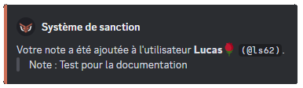
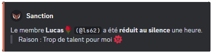
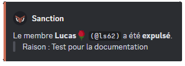
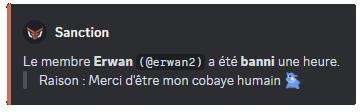
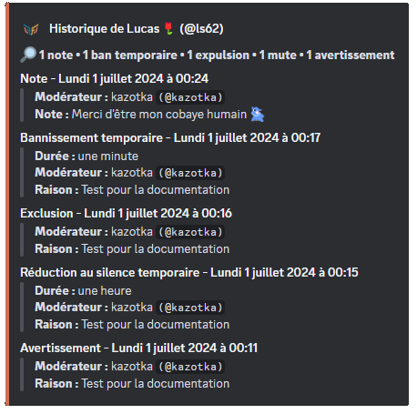
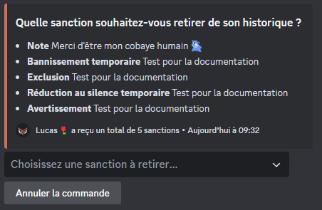
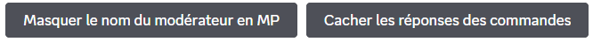
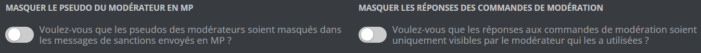
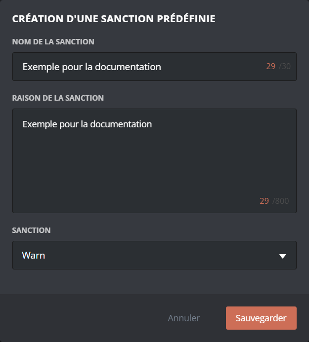

Les systèmes de modération de **DraftBot** sont là pour vous aider dans la gestion de votre serveur. Ici, vous trouverez toutes les informations nécessaires à leur utilisation. Des simples commandes de modération aux sanctions prédéfinies !

## Sanctions

### Note

**Vous pouvez ajouter une note à un membre dans son historique de sanctions** avec \</note>.
Cela permet d'ajouter un commentaire visible par les modérateurs à ce dernier, sans avertir le membre en message privé.

::hint{ type="danger" }
  Vous pouvez utiliser la commande </note> si vous disposez de la permission **`"Gérer les messages"`** ou que l'un de vos rôles possède la dérogation pour l'exécuter.
  
  ::hint{ type="warning" }
    **DraftBot** doit, dans tous les cas, sur le serveur, avoir la permission **`"Gérer les messages"`**.
  ::
::

### Avertissement

**Vous pouvez avertir un membre** avec la commande \</avertir>. Ce dernier recevra alors un message privé avec le motif de son avertissement. Si vous souhaitez que seuls les modérateurs puissent voir la raison de sanction, consultez-la [**`note`**](#note) dans le sommaire.

::hint{ type="warning" }
  Le membre recevra son avertissement par message privé uniquement s'il accepte les messages privés venant du serveur.
::

::hint{ type="danger" }
  **DraftBot** peut sanctionner un membre avec un avertissement si vous disposez de la permission **`"Gérer les messages"`** ou que l'un de vos rôles peut utiliser la commande \</avertir> sur votre serveur.
::

### Mute

**Vous pouvez réduire au silence un membre** avec la commande \</mute>.

::hint{ type="info" }
  Vous pouvez, si vous le souhaitez, acquitter un membre de sa réduction au silence avec la commande \</demute>.
::

::hint{ type="danger" }
  - **DraftBot** peut sanctionner un membre avec un mute si vous disposez de la permission **`"Exclure temporairement des membres"`** ou que l'un de vos rôles peut utiliser la commande \</mute> sur votre serveur.

  - **DraftBot** doit avoir son rôle au-dessus des autres rôles pour rendre muet un membre.
  ::hint{ type="warning" }
    - **DraftBot** doit dans tous les cas avoir la permission **`"Exclure temporairement des membres"`**.

    - La durée d'un mute ne peut pas dépasser **28 jours**.
  ::
::

### Expulsion

Le fait d'expulser un membre fera quitter le membre du serveur, mais il pourra toujours revenir avec une autre invitation. Si vous souhaitez qu'il ne puisse pas revenir, consultez-le [**`bannissement`**](#bannissement) dans le sommaire.

**Vous pouvez expulser un membre** de votre serveur avec la commande \</expulser>.

::hint{ type="danger" }
  - **DraftBot** peut expulser un membre uniquement si vous disposez de la permission **`"Expulser des membres"`** ou que l'un de vos rôles peut utiliser la commande \</expulser> sur votre serveur.

  - **DraftBot** doit avoir son rôle au-dessus des autres rôles pour expulser un membre.
  ::hint{ type="warning" }
    **DraftBot** doit, dans tous les cas, avoir la permission **`"Expulser des membres"`**.
  ::
::

### Bannissement

Le fait de **bannir un membre fera quitter le membre du serveur et il ne pourra jamais y revenir**. Vous pouvez également bannir temporairement le membre en question. Si vous souhaitez qu'il puisse revenir sur votre serveur, consultez l'[**`expulsion`**](#expulsion) dans le sommaire.

Vous pouvez bannir un membre via la commande \</ban>.

Après avoir choisi l'utilisateur et donné une raison, deux options facultatives supplémentaires s'offrent à vous :

- `[temps]` pour définir une durée de bannissement
- `[messages_supprimés]` période (en fonction du moment du bannissement) durant laquelle tous les messages envoyés par le membre sont supprimés (jusqu'à un maximum de 7 jours).

Si vous souhaitez révoquer le bannissement d'un membre, sur votre serveur. Vous pouvez le débannir avec la commande \</deban> ou bien, depuis l'onglet **`Bannissement`** de votre serveur Discord.

::hint{ type="danger" }
  - **DraftBot** peut bannir un membre uniquement si vous disposez de la permission **`"Bannir des membres"`** ou que l'un de vos rôles peut utiliser la commande \</ban> sur votre serveur.
  
  - **DraftBot** doit avoir son rôle au-dessus des autres rôles pour bannir un membre.

  ::hint{ type="warning" }
    **DraftBot** doit, dans tous les cas, avoir la permission **`"Bannir des membres"`**.
  ::
::

## Gestion des sanctions

### Historique des sanctions

- **Vous pouvez voir toutes les sanctions** de votre serveur avec la commande </sanctions lister>.
De même, vous pouvez retrouver la liste de toutes les sanctions d'un membre avec cette même commande

### Retirer des sanctions

- Vous pouvez **enlever une sanction à un membre** de votre serveur avec la commande </sanctions retirer>.

- Il est également possible de réinitialiser toutes les sanctions à un membre d'un coup via </adminreinitialiser sanctions membre>.

::hint{ type="info" }
De même, si vous souhaitez retirer toutes les sanctions de tous les membres de votre serveur, vous pouvez utiliser </adminreinitialiser sanctions serveur>.
::

::hint{ type="warning" }
  Notez que les commandes </adminreinitialiser sanctions membre> et </adminreinitialiser sanctions serveur> sont irréversibles.
::

## Options

Grâce aux options, **vous pouvez décider de masquer le nom du modérateur ou les réponses aux commandes de modération**.

::tabs
  ::tab{ label="Via la commande /config" }
    Rendez-vous d'abord dans la catégorie **`🔨 Modération`** de la commande \</config>.

    Vous aurez ensuite différents boutons à votre disposition :

    

    - **Masquer le nom du modérateur en MP ➜** Le nom du modérateur ne sera pas visible par le membre dans le message reçu en message privé.
    - **Cacher les réponses des commandes ➜** Lorsqu'un modérateur effectuera une commande de modération *(voir les commandes ci-dessus)*, le message indiquant cette sanction sera uniquement visible par le modérateur et non par l'ensemble des membres.
  ::

  ::tab{ label="Via le panel" }
    [Accéder au panel de **DraftBot**](/dashboard)

    Une fois sur le panel de **DraftBot**, rendez-vous dans la rubrique **`🔨 Modération`** et dans les **`Options`**. Vous n'aurez plus qu'à activer les options voulues :

    

    - **Masquer le nom du modérateur en MP ➜** Le nom du modérateur ne sera pas visible par le membre dans le message reçu en message privé.
    - **Masquer les réponses des commandes ➜** Lorsqu'un modérateur effectuera une commande de modération *(voir les commandes ci-dessus)*, le message indiquant cette sanction sera purement visible par le modérateur et non par l'ensemble des membres.

    ::hint{ type="warning" }
      Une fois fini, n'oubliez pas d'enregistrer vos modifications avec le bouton **`Sauvegarder`** en bas de la page.
    ::
  ::
::

## Sanctions prédéfinies

Une sanction prédéfinie est **une sanction préconfigurée exécutable directement via la commande \</mod>**. Vous pouvez ainsi regrouper des sanctions prédéfinies dans une seule commande, ce qui vous fera gagner du temps pour la modération.

::hint{ type="info" }
  Assurez-vous que les modérateurs ont les permissions nécessaires pour exécuter des sanctions via la commande </mod>.
::

::tabs
  ::tab{ label="Via la commande /config" }
    Rendez-vous d'abord dans la catégorie **`🔨 Modération`** de la commande \</config> puis appuyez sur **`Sanctions prédéfinies`**.

    

    #### Création d'une sanction prédéfinie

    Pour créer une sanction prédéfinie, cliquez sur **`Créer`**. Vous pourrez ensuite choisir la sanction à appliquer ainsi que la raison indiquée lors de l'utilisation de cette dernière.

    ::hint{ type="info" }
      Vous aurez également la possibilité de définir un nom lors de la sélection de la sanction prédéfinie dans la commande \</mod>.
    ::
    #### Gestion d'une sanction prédéfinie existante

    Pour supprimer une sanction prédéfinie, cliquez sur **`Supprimer`**, **DraftBot** vous demandera par la suite de sélectionner la sanction à retirer.

    ::hint{ type="info" }
      Vous avez par ailleurs la possibilité de retirer toutes les sanctions prédéfinies en cliquant sur le bouton **`Réinitialiser`**.
    ::
    ::hint{ type="warning" }
      Notez que ces actions sont irréversibles ; une fois effectuées, il vous sera impossible de revenir en arrière.
    ::
  ::

  ::tab{ label="Via le panel" }
    [Accéder au panel de **DraftBot**](/dashboard)

    1. Rendez-vous d'abord dans la rubrique modération.

    2. Cliquer ensuite sur **`Créer une sanction prédéfinie`**. Vous pourrez ensuite choisir la sanction à appliquer ainsi que la raison indiquée lors de l'utilisation de cette dernière. Vous aurez de plus la possibilité de définir un nom lors de la sélection de la sanction prédéfinie dans la commande \</mod>. 

    3. Vous n'avez ensuite qu'à sauvegarder votre sanction et le tour est joué !

    

    ::hint{ type="warning" }
      Une fois fini, n'oubliez pas d'enregistrer vos modifications avec le bouton **`Sauvegarder`** en bas de la page.
    ::
  ::
::
