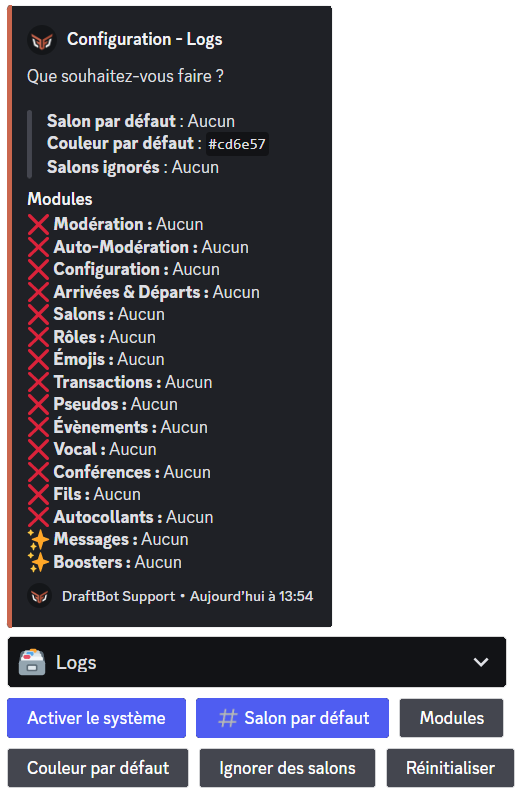
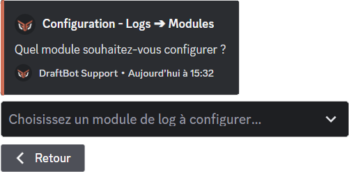

## Les logs, c'est quoi ?

Les logs sont un historique des actions faites sur votre serveur. Ils vous permettent de pouvoir retrouver une action qui vous intrigue ou bien de voir qui a fait quelle action.

Les logs sont des embeds qui sont envoyés non pas par **DraftBot**, mais par des webhooks. Un webhook vous permet d'envoyer un message avec une photo de profil, un nom et un contenu personnalisé.
> ***DraftBot** gère ses propres webhooks et l'envoi des messages avec ses derniers. Si vous supprimez son webhook de logs, il le recréera automatiquement lors de l'envoi du prochain log.*

## Configuration générale

::tabs
  ::tab{ label="Via la commande /config" }
    Vous pouvez configurer les logs avec la commande \</config>, en vous rendant ensuite dans l'onglet "Logs" du sélecteur.

    **DraftBot** vous affichera alors la configuration actuelle :
    * *Salon par défaut* ➜ Salon dans lequel les logs seront envoyés si le salon n'a pas été paramétré individuellement pour chaque log.
    * *Couleur par défaut* ➜ Couleur des logs si la couleur n'a pas été paramétrée individuellement pour chaque log.
    * *Salons ignorés* ➜ Salons qui sont ignorés par les logs : vous n'aurez aucun log des actions qui sont faites dedans.

    La catégorie "*Modules*" résume la configuration de chaque log.\
    Ici sera affiché, pour chaque modules :
    * Log activé (✅) ou non (❌).
    * Salon d'envoi.
    * Couleur.

    ::hint{ type="info" }
    ✨ Les logs de messages et de boosts sont réservés aux [premiums](/premium).
    ::

    Sous ce message, retrouvez les boutons permettant de configurer les logs :
    * ***Activer le système*** / ***Système activé*** ➜ Pour activer ou désactiver le système de logs.
    * ***Salon par défaut*** ➜ Salon dans lequel les logs seront envoyés si le salon n'a pas été paramétré individuellement pour chaque log.
    * ***Modules*** ➜ Pour configurer individuellement chaque log.
    * ***Couleur par défaut*** ➜ Pour configurer la couleur des logs si la couleur n'a pas été paramétrée individuellement pour chaque log.
    * ***Ignorer des salons*** ➜ Pour configurer les salons qui seront ignorés par les logs : vous n'aurez aucun log des actions qui sont faites dedans.
    * ***Réinitialiser*** ➜ Pour réinitialiser toute la configuration des logs.

    ::hint{ type="warning" }
    Le bouton "Réinitialiser" est irréversible : impossible d'annuler l'action et de recréer votre configuration des logs de votre serveur.
    ::

    ::hint{ type="info" }
    Les boutons bleus signifient que leur configuration doit être entièrement réalisée pour que le système de logs soit opérationnel, lors de la première configuration.
    ::

    
  ::

  ::tab{ label="Depuis le panel" }
    [Accéder au panel de **DraftBot**](/dashboard)

    Pour configurer les logs de **DraftBot**, rendez-vous dans la catégorie "Logs" du panel.\
    En haut de la page, vous trouverez la configuration des logs globaux par défaut.

    Vous pouvez configurer la couleur par défaut des logs avec la palette de peinture, le salon par défaut avec le menu déroulant et les salons ignorés en appuyant sur "+".

    
  ::
::

## Configuration par module

::tabs
  ::tab{ label="Via la commande /config" }
    Vous pouvez configurer les logs individuellement avec la commande \</config>, en vous rendant ensuite dans l'onglet "Logs" du sélecteur.\
    Dans les boutons en dessous du message, sélectionnez "Modules".

    

    Une fois le module sélectionné, laissez-vous guider par **DraftBot** pour terminer la configuration du module !
    * Pour changer le salon d'envoi : Indiquez la mention ou l'identifiant du salon voulu.
    * Pour changer la photo de profil du log, lors de l'envoi : Envoyez une image respectant les normes indiquées dans la description de la question correspondante. ***(✨ premium)***
    * Pour changer la couleur du log, lors de l'envoi : Indiquez un code couleur au format hexadécimal ***(✨ premium)***

    ::hint{ type="success" }
    La configuration du module est faite ! Vous aurez désormais accès aux logs de ce module dans le salon défini.
    ::

    Exemple de log de modération reçu sur le serveur :

    
  ::

  ::tab{ label="Depuis le panel" }
    [Accéder au panel de **DraftBot**](/dashboard)

    Pour configurer les modules des logs de **DraftBot**, rendez-vous dans la catégorie "Logs" du panel, puis activez les modules.

    Lors de la première configuration, tous les logs sont grisés (cela signifie qu'ils sont désactivés).\
    Activez alors individuellement les logs que vous souhaitez mettre en place pour accéder à leur configuration.

    

    Vous aurez alors la possibilité de configurer votre module :
    * Pour changer le salon d'envoi : ouvrez le menu déroulant et sélectionnez le salon voulu.
    * Pour changer la photo de profil du log, lors de l'envoi : cliquez sur le logo de **DraftBot**. ***(✨ premium)***
    * Pour changer la couleur du log, lors de l'envoi : cliquez sur la palette de peinture et sélectionnez la couleur voulue. ***(✨ premium)***

    

    Exemple de log de modération reçu sur le serveur :

    
  ::
::
