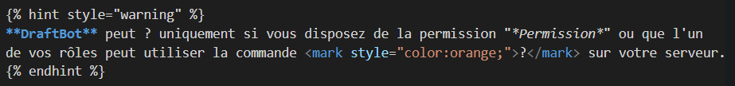

# ❕Consignes❕
Cette page a pour objectif d'unifier la mise en page de la documentation. Merci donc de vous y référer dès que vous avez un doute sur la mise en page de quelque chose.\
Si un élément ne figure pas dans cette page mais qu'il le devrait, merci de contacter DraftMan - Nicolas ou bien Hugo-broc.


#### Comment se retrouver dans cette page ?
La mise en page de chaque élément se trouve sous un titre. Vous pouvez donc très facilement vous repérer dans cette page via le menu à droite. Des détails sur la mise en page de l'élément seront détaillés en-dessous du titre.


#### Menu
Tous les points d'attention sont catégorisés dans les 4 catégories ci-dessous :
- <mark style="color:blue;">[Markdown](/CONTRIBUTE.md#markdown)</mark> : Le markdown à utiliser sur vos pages de documentation.
- <mark style="color:blue;">[Général](/CONTRIBUTE.md#general)</mark> : La mise en page concernant **et** les commandes permettant de configurer votre serveur sur Discord **et** le panel de DraftBot.
- <mark style="color:blue;">[Commandes](/CONTRIBUTE.md#commandes)</mark> : La mise en page concernant uniquement les commandes permettant de configurer votre serveur sur Discord.
- <mark style="color:blue;">[Panel](/CONTRIBUTE.md#panel)</mark> : La mise en page concernant uniquement le panel de DraftBot.


# Markdown
#### Gras
Syntaxe : `** **` ou `__ __`\
Exemple : `**Texte en gras**`\
Rendu : **Texte en gras**


#### Italique
Syntaxe : `* *` ou `_ _`\
Exemple : `*Texte en italique*`\
Rendu : *Texte en italique*


#### Barré
Syntaxe : `~~ ~~`\
Exemple : `~~Texte barré~~`\
Rendu : ~~Texte barré~~


#### Petit bloc de code
Syntaxe : ``` `Texte` ```\
Exemple : ``` `Texte dans un petit bloc de code` ```\
Rendu : `Texte dans un petit bloc de code`


#### Gros bloc de code
Syntaxe : ` ```Texte``` `\
Exemple :\
` ```\
Texte dans un gros bloc de code\
``` `\
Rendu :
```
Texte dans un gros bloc de code
```


#### Texte en couleur
Syntaxe : `<mark style="color:orange;"> </mark>`\
Exemple : `<mark style="color:orange;">Texte en orange</mark>`\
Rendu : <mark style="color:orange;">Texte en orange</mark>
> D'autres couleurs sont aussi disponibles.


#### Liens
##### Externes
Syntaxe : `[Texte](lien)`\
Exemple : `[Site DraftBot](https://draftbot.fr)`\
Rendu : <mark style="color:blue;">[Site DraftBot](https://draftbot.fr)</mark>
##### Internes
Syntaxe : `[Texte](page.md)`\
Exemple : `[Guide d'installation](installation.md)`\
Rendu : <mark style="color:blue;">[Guide d'installation](installation.md)</mark>
##### Ancrés à la page
Syntaxe : `[Lien ancré](page.md#ancrage)`\
Exemple: `[Liens](CONTRIBUTE.md#general)`\
Rendu : <mark style="color:blue;">[Général](CONTRIBUTE.md#general)</mark>


Les liens externes, internes et ancrés sont toujours à mettre en <mark style="color:blue;">bleu</mark>. Le orange est exclusivement réservé aux commandes.



#### Titres
Les titres vous permettent de structurer votre texte.\
Syntaxe : `# `\
Exemple : `# Titre 1`\
Rendu : 

Syntaxe : `## `\
Exemple : `## Titre 2`\
Rendu : 

Syntaxe : `### `\
Exemple : `### Titre 3`\
Rendu : 


# Général
## DraftBot
Pour bien différencier la documentation et mettre en avant DraftBot, mettre son nom au format **gras** tout le temps :
> `**DraftBot**` ➜ **DraftBot**

↪️ **DraftBot** vous propose plusieurs systèmes.


## Premium
Dès qu'une option est premium, appliquer le format suivant **à la fin de la ligne** :
> `***(premium ✨)***` ➜ ***(premium ✨)***

↪️ Pour changer la couleur du log, lors de l'envoi : cliquez sur la palette de peinture et sélectionnez la couleur voulue. ***(premium ✨)***


## Permissions nécessaires
Quand une ou des permissions sont nécessaires pour pouvoir effectuer une action, utiliser le format avec avertissement :



↪️ Exemple de rendu :

**DraftBot** peut ? uniquement si vous disposez de la permission "*Permission*" ou que l'un de vos rôles peut utiliser la commande <mark style="color:orange;">?</mark> sur votre serveur.



## Conseils, avertissements...
Ils permettent tous de conseiller les membres. Voici les différentes syntaxes à utiliser :
### Conseil
Permet de donner un conseil aux membres pour avoir une meilleure utilisation de DraftBot.

Exemple :\


↪️ Rendu :

La configuration du système de captcha n'est pas encore disponible sur le panel de **DraftBot**.



### Avertissement
Permet d'avertir les membres sur une utilisation difficile ou sur un retour en arrière impossible.

Exemple :\


↪️ Rendu :

Si le membre ne répond pas bout de 2 minutes ou qu'il échoue plus de 3 fois au captcha, il sera automatiquement expulsé !



### Danger
Permet de signaler un danger aux membres pour la fonctionnalité.

Exemple :\


↪️ Rendu :

En retirant la réaction ✅ les membres perdent également le rôle associé.


```\

En retirant la réaction ✅ les membres perdent également le rôle associé.
\
```


### Succès
Permet de montrer la fin d'une configuration ou bien le succès d'une configuration.

Exemple :\


↪️ Rendu :

La configuration du module est faite ! Vous aurez désormais accès aux logs de ce module dans le salon défini.



# Commandes
## Citer une commande
- Les commandes de DraftBot doivent être toutes mises en orange avec le slash `/` devant.
- Les variables des slash commandes doivent être intégrées en fonction de votre configuration sous la forme <mark style="color:orange;">[variable 1][variable 2]</mark>.

> ⚠️ Les slash commandes sont des commandes donc il ne faut pas mettre "le <mark style="color:orange;">/config</mark>" mais "la commande <mark style="color:orange;">/config</mark>".
 
Exemple : `<mark style="color:orange;">/config [système]</mark>`\
↪️ Rendu : <mark style="color:orange;">/config [système]</mark>


## Citer un bouton
Les boutons sont un indispensable des configuration de DraftBot !\
Si un bouton est en <mark style="color:blue;">[couleur](CONTRIBUTE.md#texte-en-couleur)</mark>, remettre la <mark style="color:blue;">[couleur](CONTRIBUTE.md#texte-en-couleur)</mark> qui correspondat avec le texte du bouton.\
Pour citer un bouton, utilisez le format suivant :

Exemple : `<mark style="color:blue;">**`Activer`**</mark>`\
↪️ Rendu : <mark style="color:blue;">**`Activer`**</mark>\
↪️ Autres rendus : **`Salon`** / <mark style="color:blue;">**`Activer`**</mark> / 
<mark style="color:green;">**`Système activé`**</mark> / <mark style="color:red;">**`Réinitialiser`**</mark>

## Captures
Les captures permettent d'illustrer vos propos. Un certain format est à respecter :
- Ne pas afficher le pseudo et la photo de profil de DraftBot ;
- Supprimer le fond du message (fond Discord) ;
- Garder l'embed **et** les boutons (ne pas mettre soit l'un soit l'autre) ;
- Mettre un texte alternatif avec la capture : ``

↪️ Exemple de rendu :\


# Panel
## Accès au panel
Quand une table est mise en place pour la configuration sur le panel ou via la commande /config, il faut toujours rappeler **tout en haut de la table** le lien vers le panel sous cette forme obligatoirement :

Format : `<mark style="color:blue;">[Accéder au panel de **DraftBot**](https://draftbot.fr/dashboard)</mark>`\
Format :
```\
<mark style="color:blue;">[Accéder au panel de **DraftBot**](https://draftbot.fr/dashboard)</mark>\
```
↪️ Rendu : 


*Configuration via la commande /config*



<mark style="color:blue;">[Accéder au panel de **DraftBot**](https://draftbot.fr/dashboard)</mark>

*Configuration via le panel*



## Captures
Les captures permettent d'illustrer vos propos. Un certain format est à respecter :
> Avoir de préférence un serveur "DraftBot Support" avec la photo de profil de DraftBot pour les captures du panel.

- Ne pas afficher la liste de vos serveurs sur les captures faisant le taille de toute la page ;
- Ne pas faire de captures qui font la taille d'un mot ou d'une phrase : dézoomer un peu pour pouvoir situer correctement l'élément sur la page ;
- Mettre un texte alternatif avec la capture : ``

↪️ Exemple de rendu :\
