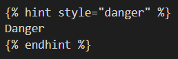
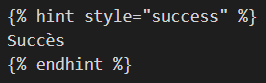

# CONSIGNES
Cette page a pour objectif d'unifier la mise en page de la documentation. Merci donc de vous y référer dès que vous avez un doute sur la mise en page de quelque chose.\
Si un élément ne figure pas dans cette page mais qu'il le devrait, merci de contacter <mark style="color:orange;">[DraftMan - Nicolas](discord:/users/207190782673813504)</mark> ou bien <mark style="color:orange;">[Hugo-broc](discord:/users/667362944606273576)</mark>.

**Comment se retrouver dans cette page ?**\
La mise en page de chaque élément se trouve sous un titre. Vous pouvez donc très facilement vous repérer dans cette page via le menu à droite. Des détails sur la mise en page de l'élément seront détaillés en-dessous du titre.

# Markdown

#### Gras
Syntaxe : `** **` ou `__ __`\
Exemple : `**Texte en gras**`\
Rendu : **Texte en gras**

#### Italique
Syntaxe : `* *` ou `_ _`\
Exemple : `*Texte en italique*`\
Rendu : *Texte en italique*

#### Barré
Syntaxe : `~~ ~~`\
Exemple : `~~Texte barré~~`\
Rendu : ~~Texte barré~~

#### Petit bloc de code
Syntaxe : ``` `Texte` ```\
Exemple : ``` `Texte dans un petit bloc de code` ```\
Rendu : `Texte dans un petit bloc de code`

#### Gros bloc de code
Syntaxe : ` ```Texte``` `\
Exemple :\
` ```\
Texte dans un gros bloc de code\
``` `\
Rendu :
```
Texte dans un gros bloc de code
```

#### Texte en couleur
Syntaxe : `<mark style="color:orange;"> </mark>`\
Exemple : `<mark style="color:orange;">Texte en orange</mark>`\
Rendu : <mark style="color:orange;">Texte en orange</mark>
> D'autres couleurs sont aussi disponibles.

#### Liens
##### Externes
Syntaxe : `[Texte](lien)`\
Exemple : `[Site DraftBot](https://draftbot.fr)`\
Rendu : <mark style="color:blue;">[Site DraftBot](https://draftbot.fr)</mark>
##### Internes
Syntaxe : `[Texte](page.md)`\
Exemple : `[Guide d'installation](installation.md)`\
Rendu : <mark style="color:blue;">[Guide d'installation](installation.md)</mark>
##### Ancrés à la page
Syntaxe : `[Lien ancré](page.md#ancrage)`\
Exemple: `[Liens](REPERTOIRE%20DE%20MISE%20EN%20PAGE.md#general)`\
Rendu : <mark style="color:blue;">[Général](REPERTOIRE%20DE%20MISE%20EN%20PAGE.md#general)</mark>

#### Titres
Les titres vous permettent de structurer votre texte.\
Syntaxe : `# `\
Exemple : `# Titre 1`\
Rendu : 

Syntaxe : `## `\
Exemple : `## Titre 2`\
Rendu : 

Syntaxe : `### `\
Exemple : `### Titre 3`\
Rendu : 

# Général

## DraftBot
Pour bien différencier la documentation et mettre en avant DraftBot, mettre son nom au format **gras** tout le temps :
> `**DraftBot**` ➜ **DraftBot**

↪️ **DraftBot** vous propose plusieurs systèmes.

## Premium
Dès qu'une option est premium, appliquer le format suivant **à la fin de la ligne** :
> `***(premium ✨)***` ➜ ***(premium ✨)***

↪️ Pour changer la couleur du log, lors de l'envoi : cliquez sur la palette de peinture et sélectionnez la couleur voulue. ***(premium ✨)***

## Permissions nécessaires
Quand une ou des permissions sont nécessaires pour pouvoir effectuer une action, utiliser le format avec avertissement :


**DraftBot** peut ? uniquement si vous disposez de la permission "*Permission*" ou que l'un de vos rôles peut utiliser la commande <mark style="color:orange;">?</mark> sur votre serveur.


↪️ Exemple de rendu :\


## Conseils, avertissements...
Ils permettent tous de conseiller les membres. Voici les différentes syntaxes à utiliser :
### Conseil
Permet de donner un conseil aux membres pour avoir une meilleure utilisation de DraftBot.

Exemple :\


Rendu :

La configuration du système de captcha n'est pas encore disponible sur le panel de **DraftBot**.


### Avertissement
Permet d'avertir les membres sur une utilisation difficile ou sur un retour en arrière impossible.

Exemple :\


Rendu :

Si le membre ne répond pas bout de 2 minutes ou qu'il échoue plus de 3 fois au captcha, il sera automatiquement expulsé !


### Danger
Permet de signaler un danger aux membres pour la fonctionnalité.

Exemple :\


Rendu :

En retirant la réaction ✅ les membres perdent également le rôle associé.


### Succès
Permet de montrer la fin d'une configuration ou bien le succès d'une configuration.

Exemple :\


Rendu :

La configuration du module est faite ! Vous aurez désormais accès aux logs de ce module dans le salon défini.



## Captures
Les captures permettent d'illustrer vos propos. Un certain format est à respecter :
- Ne pas afficher le pseudo et la photo de profil de DraftBot ;
- Supprimer le fond du message (fond Discord) ;
- Garder l'embed **et** les boutons (ne pas mettre soit l'un soit l'autre).
- Mettre un texte alternatif avec la capture : ``

↪️ Exemple de rendu :\
