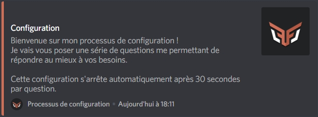
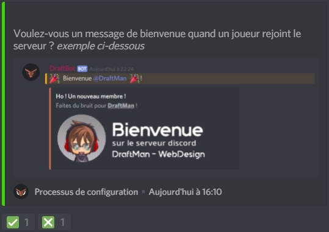

# Configuration

## Configuration de DraftBot

Pour démarrer le processus de configuration, utilisez la commande `!config` ou `@DraftBot#0535 config`. Répondez ensuite aux questions suivantes en utilisant les réactions ou en envoyant votre choix par écrit :

> Répondez ici par le préfix que vous souhaitez utiliser. Dans tous les cas, vous pourrez toujours utiliser `@DraftBot#0535` à la place du préfix pour utiliser une commande.

Pour répondre à cette question vous devrez cliquer sur l'une des deux réaction : 

* ✅ Pour activer le message de bienvenue 
* ❎ Pour désactiver le message de bienvenue

  

