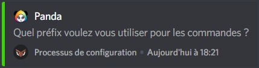
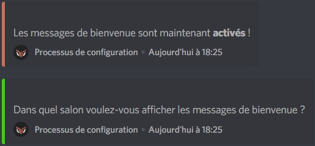

# Configuration

## Configuration de DraftBot

Pour démarrer le processus de configuration, utilisez la commande `!config` ou `@DraftBot#0535 config`. Répondez ensuite aux questions suivantes en utilisant les réactions ou en envoyant votre choix par écrit.

### Choix du préfix

Cliquez sur la réaction correspondant à votre choix :

* ✅ Pour changer de préfixe selon votre convenance et éviter les conflits avec les autres bots
* ❎ Pour conserver le préfixe actuel

Répondez ici par le préfixe que vous souhaitez utiliser. Dans tous les cas, vous pourrez toujours utiliser `@DraftBot#0535` à la place du préfixe pour utiliser une commande.

### Activation du message automatique de bienvenue

Pour répondre à cette question vous devrez cliquer sur l'une des deux réaction : 

* ✅ Pour activer le message de bienvenue 
* ❎ Pour désactiver le message de bienvenue

Répondez par le nom du salon dans lequel vous souhaitez que les messages de bienvenue soient envoyés.

