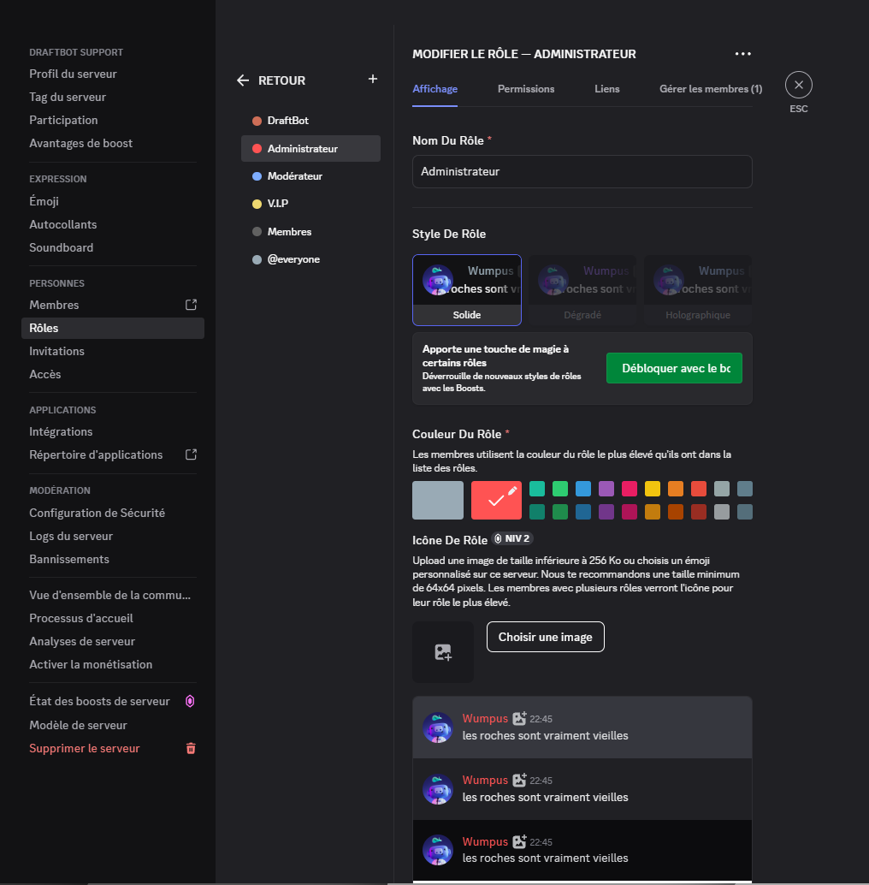
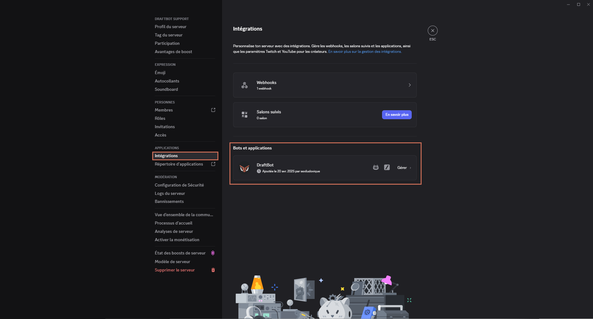

## Invitation de DraftBot

Commençons par inviter **DraftBot** sur le serveur en [`cliquant ici`](/invite).

::hint{ type="success" }
  Félicitations, 𝗗𝗿𝗮𝗳𝘁𝗕𝗼𝘁 est maintenant ajouté à votre serveur !
::

## Installation de DraftBot

Une fois **DraftBot** ajouté à votre serveur, il faut lui donner les permissions dont il a besoin. Pour cela, commencez par vous rendre dans les paramètres de votre serveur, dans la catégorie Rôles.

::hint{ type="warning" }
  La permission **Administrateur**  est **fortement recommandée** pour **DraftBot**.

  S'il n'en dispose pas, il faudra impérativement penser à lui attribuer les [permissions](#voici-des-indications-concernant-les-permissions-de-draftbot) dans ses autres rôles et chaque salon où il devra agir.
::

Si vous souhaitez que **DraftBot** puisse attribuer des rôles, assurez-vous que ceux-ci soient inférieurs dans la hiérarchie du serveur. Vous pouvez modifier l'ordre en faisant glisser les rôles de haut en bas :

::hint{ type="info" }
  Dans notre cas par exemple, **DraftBot** sera capable d'attribuer les deuxième, troisième et quatrième rôles, mais ne pourra pas donner le premier rôle.
::

### Voici des indications concernant les permissions de DraftBot

| Essentielles | Fortement recommandées |
|--------------|------------------------|
| Voir les salons | **Administrateur** |
| Gérer les webhooks | Gérer les salons |
| Envoyer des messages | Gérer les rôles |
| Envoyer des messages dans les fils | Gérer les émojis et stickers |
| Intégrer des liens | Voir les logs du serveur |
| Joindre des fichiers | Gérer les pseudos |
| Ajouter des réactions | Expulser des membres |
| Utiliser des émojis externes | Exclure temporairement des membres |
| Gérer les messages | Rendre les membres muets |
| Voir les anciens messages | Mettre en sourdine les membres |
|  | Déplacer des membres |

::hint{ type="success" }
  Grâce à cette installation et si vous avez choisi de faire confiance à 𝗗𝗿𝗮𝗳𝘁𝗕𝗼𝘁 en le laissant Administrateur, vous ne devriez pas rencontrer de problème. L'installation primaire est à présent terminée.
::

## Configuration des commandes
DraftBot utilise les commandes Slash de Discord, cela permet aux utilisateurs d’exécuter les commandes facilement en faisant `/`. Vous avez la possibilité de les configurer et y donner accès à certains **rôles**, **salons** et aux **membres**.

Pour configurer les commandes de DraftBot, il vous suffira d'aller dans les paramètres de **votre serveur** Discord, puis dans la catégorie **Intégrations**. Vous y trouverez tous les bots de votre serveur, y compris DraftBot. **Cliquez sur DraftBot** pour afficher toutes ses commandes.

::hint{ type="info" }
  Les permissions des commandes ne sont actuellement configurables que depuis Discord sur ordinateur ou Discord sur navigateur.
::

::hint{ type="danger" }
  Soyez attentif à la configuration de vos commandes Slash, elle pourrait compromettre la sécurité de votre serveur.
::

