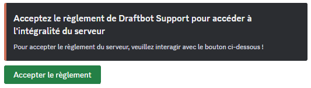
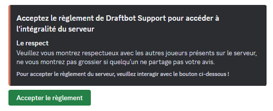
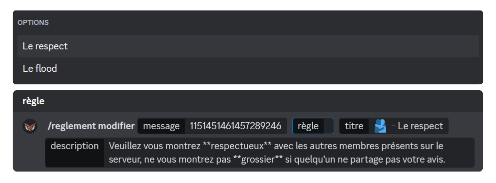
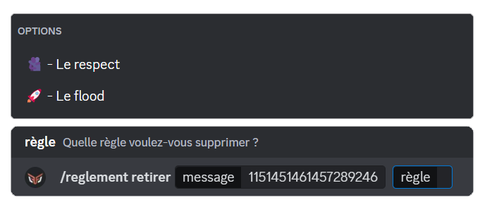

## Création du règlement

Pour commencer, vous allez devoir effectuer la commande \</reglement créer>. **DraftBot** vous donnera ensuite la possibilité **d'ajouter le rôle** que vous souhaitez attribuer aux membres, ainsi que de **verrouiller** ce rôle pour les empêcher de le retirer eux-mêmes.

Les membres reçoivent ce rôle une fois qu'ils ont pris connaissance du règlement et cliqué sur le bouton `Accepter le règlement`.

## Ajouter des règles

Maintenant que le message de règlement est créé, il ne contient encore aucune règle : c'est à vous de les ajouter une par une.

Pour cela, utilisez la commande \</reglement ajouter>. DraftBot vous demandera trois informations : le message du règlement, le titre de votre règle et sa description.

::hint{ type="warning" }
  Le champ "message du règlement" attend **l'identifiant** du message de règlement que vous venez de créer.
  Pour savoir comment le récupérer, consultez la page [Récupérer un identifiant](/docs/autres/recuperer-un-identifiant#identifiant-dun-message).
::

::hint{ type="info" }
  Lorsque l'ajout d'une règle est effectué, **DraftBot** proposera deux choix : ajouter une autre règle ou de remettre à plus tard.
::

::hint{ type="warning" }
  Le titre est limité à **256** caractères, tandis que la description est limitée à **1024** caractères.
::

## Modifier une règle

Vous pouvez modifier vos règles à tout moment, que ce soit pour faire une correction ou bien pour les rendre plus esthétiques selon vos envies. Vous aurez besoin de la commande \</reglement modifier>.

La procédure n'est pas très différente de la commande \</reglement ajouter>, à la différence qu'un champ apparaît : `règle`.

Ce champ vous permet de sélectionner **la règle** que vous souhaitez modifier.

::hint{ type="info" }
  Vous avez la possibilité de modifier les règles depuis le panel dans la catégorie [Messages](/dashboard/first/messages). L'Embed est intitulé **"Règlement du serveur"**.

  
::

## Retirer une règle

Si une règle ne vous plaît pas et que vous souhaitez la retirer, vous pouvez utiliser la commande \</reglement retirer>. Vous aurez juste à récupérer **l'identifiant** du message du règlement et sélectionner la **règle**.

