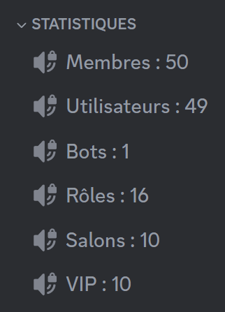
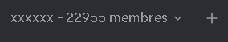
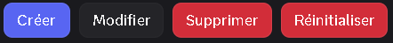

## Apparence des salons de statistiques

### Salons vocaux



::hint{ type="info" }
  Un délai de **15 minutes** est imposé entre chaque actualisation. Les serveurs [premium](/premium) <:icon_premium_:1096140508625125417> ont un délai de **10 minutes** imposé.
::

### Catégorie



::hint{ type="info" }
  Un délai de **15 minutes** est imposé entre chaque actualisation. Les serveurs [premium](/premium) <:icon_premium_:1096140508625125417> ont un délai de **10 minutes** imposé.
::

## Configuration du système

::tabs
  ::tab{ label="Via la commande /config" }

    ## Créer un salon

    Pour créer un salon de statistique, il vous suffira d'aller dans le menu **Salons de statistiques** de la commande /config. Si vous n'avez pas d'autres salons de statistiques configurés, **DraftBot** vous proposera de cliquer sur deux boutons :

    - **Configuration rapide**
    - **Configuration avancée**

    ::hint{ type="info" }
      Si vous choisissez la **Catégorie** comme type de salon et que vous souhaitez prendre une **catégorie existante**, vous devrez remettre à **DraftBot** l'[identifiant](/docs/autres/recuperer-un-identifiant) de cette catégorie.
    ::

    Une fois la méthode choisie (rapide ou avancée), vous devrez sélectionner la cible du compteur (membres, bots, rôle spécifique, etc.).

    ::collapse{ label="Afficher / masquer la liste des cibles" }

      | **NOM** | **EXPLICATION** |  |
      |---------|-----------------|--|
      | **Membres** | Tous les utilisateurs *(humains et bots)* étant dans votre serveur. |  |
      | **Membres (sans bot)** | Tous les utilisateurs humains étant dans votre serveur. |  |
      | **Bots** | Tous les utilisateurs bots étant dans votre serveur. |  |
      | **Rôles** | Tous les rôles dans votre serveur. |  |
      | **Salons** | Tous les salons dans votre serveur. |  |
      | **Membres ayant un rôle** | Tous les membres ayant un certain rôle dans votre serveur. |  |
      | **Salons d'une catégorie** | Tous les salons dans une certaine catégorie. |  |
      | **API personnalisée** | Données d'une API web. | <:icon_premium:1096140508625125417> |
    ::

    Lorsque vous avez créé votre salon, vous pourrez alors [configurer](#configurer-les-salons) vos salons.

    ## Configurer les salons

    

    - **Créer :** Créer un nouveau salon de statistiques.
    - **Modifier :** Modifier un salon existant.
    - **Supprimer :** Supprimer un salon existant.
    - **Réinitialiser :** Remettre à zéro le système.
  ::

  ::tab{ label="Depuis le panel" }
    [⫸ Accéder au panel de **DraftBot**](/dashboard/first/community)

    ## Créer un salon

    Pour créer un salon de statistiques, il suffit de cliquer sur le bouton "**Créer un salon**". Vous pouvez ensuite choisir une cible.

    ::collapse{ label="Afficher / masquer la liste des cibles" }

      | **NOM** | **EXPLICATION** |  |
      |---------|-----------------|--|
      | **Membres** | Tous les utilisateurs *(humains et bots)* étant dans votre serveur. |  |
      | **Membres (sans bot)** | Tous les utilisateurs humains étant dans votre serveur. |  |
      | **Bots** | Tous les utilisateurs bots étant dans votre serveur. |  |
      | **Rôles** | Tous les rôles dans votre serveur. |  |
      | **Salons** | Tous les salons dans votre serveur. |  |
      | **Membres ayant un rôle** | Tous les membres ayant un certain rôle dans votre serveur. |  |
      | **Salons d'une catégorie** | Tous les salons dans une certaine catégorie. |  |
      | **API personnalisée** | Données d'une API web. | <:icon_premium:1096140508625125417> |
    ::

    ## Configurer les salons

    Lorsque vous décidez de modifier un salon de statistiques, une série de paramètres apparaît. Vous pourrez **Modifier** ou **Supprimer** les salons de votre choix.
  ::
::

## Personnaliser le format du nom

### Salon


Vous pouvez modifier le nom d'un salon vocal en mettant ce que vous souhaitez, à condition qu'il soit mis avant le " : ".

::hint{ type="warning" }
  Faites bien attention à ne pas toucher au compteur de membres, sinon vous serez obligé de refaire une nouvelle configuration.
::

### Catégorie


Vous pouvez modifier le nom d'une catégorie en mettant ce que vous souhaitez, à condition qu'il soit mis avant le " – ".

::hint{ type="warning" }
  Faites bien attention à ne pas toucher au compteur de membres, sinon vous serez obligé de refaire une nouvelle configuration.
::

## API personnalisée

::hint{ type="info" }
  Cette fonctionnalité est réservée aux serveurs [premium](/premium) <:icon_premium_:1096140508625125417>.
::

La cible **API personnalisée** permet d’afficher une statistique provenant d’un **service externe**, via une requête HTTP/HTTPS vers une API web.

Cela peut servir par exemple à afficher :

- Le nombre d’utilisateurs inscrits sur un site
- Une donnée issue d'une backend
- Toute autre valeur numérique accessible via une API

::hint{ type="info" }
  Quelques petits points à savoir / faire attention :

  - L’API doit être accessible via une requête **HTTP GET**.
  Les identifiants peuvent être inclus directement dans l’URL, mais les **headers personnalisés ne sont pas pris en charge**.

  - Vérifiez que la réponse contient bien une **valeur numérique**.

  - Un délai de **10 minutes** est imposé entre chaque actualisation.
::

### Format

L’API doit renvoyer un objet JSON contenant une valeur exploitable.

**Exemple de réponse valide**
```
{"count": 42}
```

Dans cet exemple, DraftBot affichera `42` dans le salon de statistiques.

::hint{ type="info" }
  La valeur doit être un nombre et les chaînes de caractères ou objets complexes ne sont pas pris en charge.
::

### Exemple concret

Si votre API est accessible à l’adresse :

```
https://api.draftbot.fr/base/stats
```

et renvoie :

```
{"guilds":1008140,"users":53253590}
```

Le salon pourra afficher par exemple :

```
👤 Serveurs : 1008140
```

