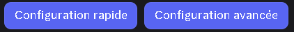

::hint{ type="info" }
  Il ne vous manquera plus que de changer le nom de la catégorie **"xxxxxx"** comme vous le souhaitez, en plus d'ajouter de nouveaux salons, sans dérégler le compteur de membres dans la catégorie.
::

::hint{ type="warning" }
  Faites bien attention à ne pas toucher au compteur de membres, sinon vous serez obligé de refaire une nouvelle configuration.
::

::hint{ type="info" }
  Tous les caractères avant le " - " dans le nom de la catégorie peuvent être modifiés.
::

::hint{ type="success" }
  Bravo ! Votre compteur de membres en forme de salons vocaux a été configuré !
::

//

## Apparence des salons de statistique

### Salons vocaux

::hint{ type="info" }
  Un délai de **10 minutes** est imposé entre chaque actualisation.
::

### Catégorie

::hint{ type="info" }
  Un délai de **10 minutes** est imposé entre chaque actualisation.
::

## Configuration

::tabs
  ::tab{ label="Via la commande /config" }

    ## Créer un salon

    Pour créer un salon de statistique, il vous suffira d'aller dans le menu **Salons de statistiques** de la commande /config. Si vous n'avez pas d'autres salons de statistiques configurés, **DraftBot** vous proposera de cliquer sur deux boutons :

    - **Configuration rapide**
    - **Configuration avancée**

    
  ::

  ::tab{ label="Depuis le panel" }
    [⫸ Accéder au panel de **DraftBot**](/dashboard/first/community)

    ## Créer un salon

    Pour créer un salon de statistiques, il suffit de cliquer sur le bouton "**Créer un salon**". Vous pouvez ensuite choisir une cible.

    ::collapse{ label="Afficher / masquer la liste des dibles" }

      | **NOM** | **EXPLICATION** |  |
      |---------|-----------------|--|
      | **Membres** | Tous les utilisateurs *(humains et bots)* étant dans votre serveur. |  |
      | **Membres (sans bot)** | Tous les utilisateurs humains étant dans votre serveur. |  |
      | **Bots** | Tous les utilisateurs bots étant dans votre serveur. |  |
      | **Rôles** | Tous les rôles dans votre serveur. |  |
      | **Salons** | Tous les salons dans votre serveur. |  |
      | **Membres ayant un rôle** | Tous les membres ayant un certain rôle dans votre serveur. |  |
      | **Salons d'une catégorie** | Tous les salons dans une certaine catégorie. |  |
      | **API personnalisée** | URL d'une API web. | <:icon_premium:1096140508625125417> |
    ::

    ## Modifier un salon

    Lorsque vous décidez de modifier un salon de statistiques, une série de paramètres apparaît. Vous trouverez dans cette catégorie chacun de ces paramètres détaillés de A à Z.
  ::
::
