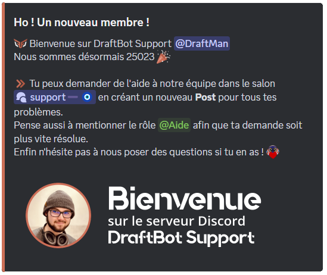
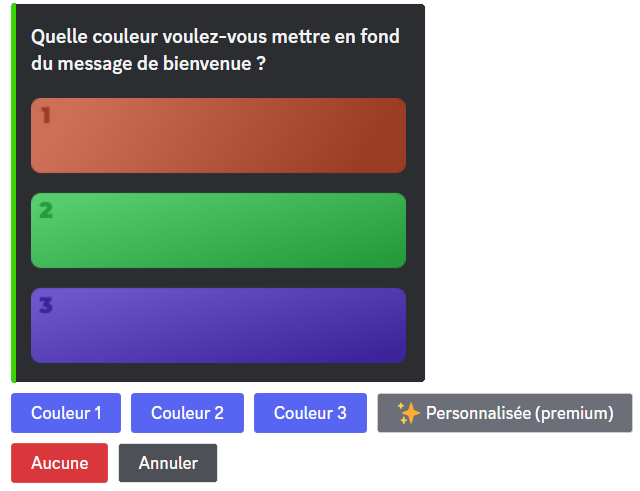
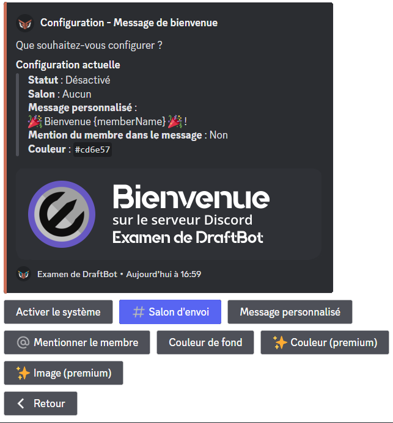
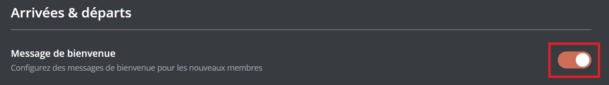
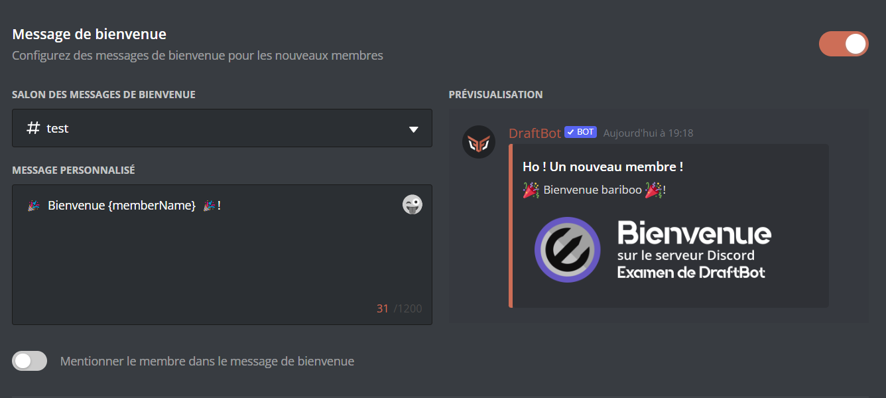
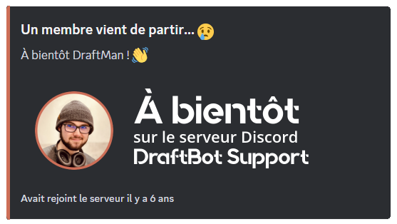
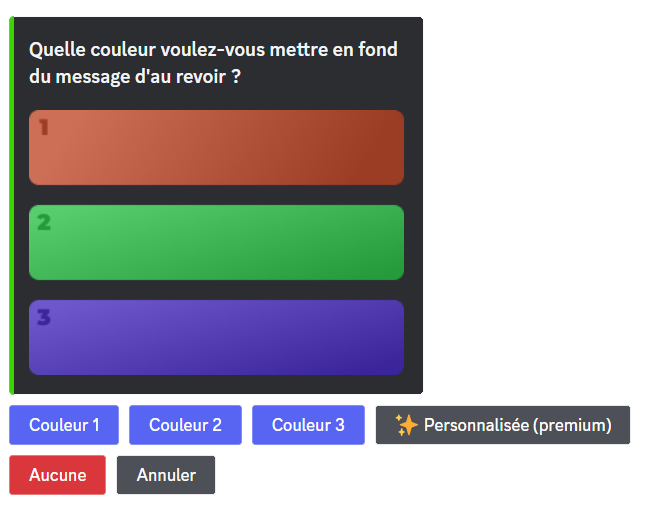
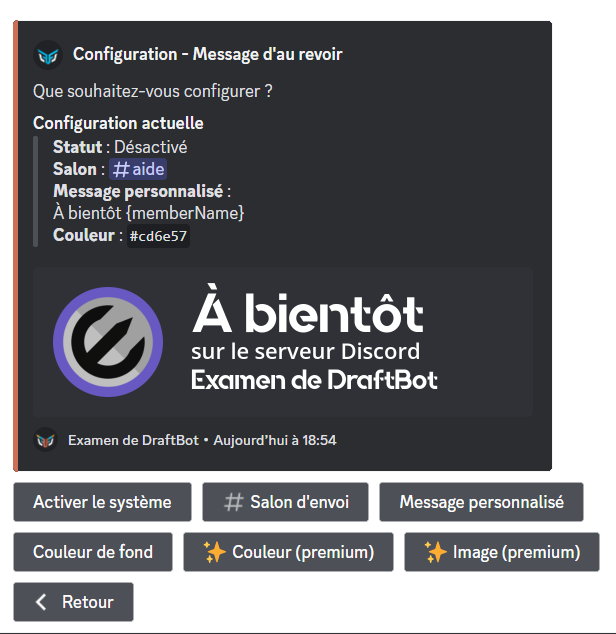
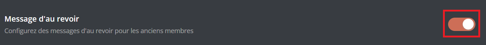
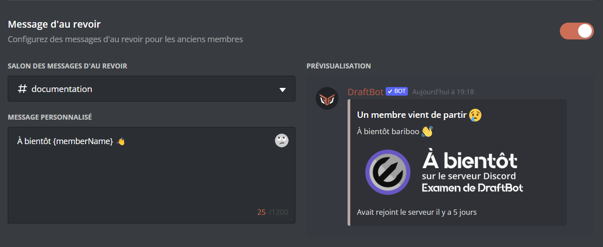

## Messages de bienvenue

Les messages de bienvenue sont envoyés lorsqu'un membre rejoint votre serveur. Ils permettent de souhaiter la bienvenue à un nouvel arrivant et de lui donner des informations sur votre serveur.

### Configuration

::tabs
  ::tab{ label="Via la commande /config" }
    Veuillez d'abord vous rendre dans la commande \</config> ➜ 👋
    Arrivées & départs ➜ "Message de bienvenue".

    Voici les différents boutons ainsi que leurs utilités :
    - "Activer le système" ➜ Permet d'activer ou désactiver le système.
    - "Salon d'envoi" ➜ Définir le salon où le message de bienvenue sera envoyé.
    - "Message personnalisé" ➜ Définir le message qui sera envoyé dans le message de bienvenue (maximum 1 200 caractères).

    ::collapse{ label="Variables" }
      Les variables sont des bouts de texte qui évoluent suivant la personne, le serveur, le salon ou encore le temps. Voici celles utilisables dans les messages de bienvenue de DraftBot.

      - `{user}` ➜ Mention du membre
      - `{user.id}` ➜ Identifiant du membre
      - `{user.username}` ➜ Pseudo du membre
      - `{user.nickname}` ➜ Surnom ou pseudo du membre
      - `{server}` ➜ Nom du serveur
      - `{server.id}` ➜ Identifiant du serveur
      - `{server.name}` ➜ Nom du serveur
      - `{server.membercount}` ➜ Nombre de membres sur le serveur
      - `{channel}` ➜ Mentions du salon
      - `{channel.id}` ➜ Identifiant du salon
      - `{channel.name}` ➜ Nom du salon
      - `{date}` ➜ Date actuelle (JJ/MM/AAAA)
      - `{time}` ➜ Heure actuelle (HH:MM)
      - `{timestamp}` ➜ Timestamp actuel en secondes
    ::

    - "Mentionner le membre" ➜ Une fois cette option activée, le membre sera mentionné dans le message de bienvenue.
    - "Couleur de fond" ➜ Permet de modifier la couleur de fond du message de bienvenue.

    ::hint{ type="info" }
      Vous avez le choix entre trois couleurs ainsi que celle par défaut qui rendra l'image transparente (avec le bouton "Aucune").

      Si vous souhaitez avoir une couleur personnalisée, vous devez souscrire à un abonnement [premium](/premium) <:icon_premium_:1096140508625125417>.

      
    ::

    - "Couleur" ➜ Définir la couleur de la barre latérale de votre message de bienvenue. (<:icon_premium:1096140508625125417>)
    - "Image" ➜ Permet d'ajouter une image de fond à votre message de bienvenue. (<:icon_premium:1096140508625125417>)

    ::hint{ type="info" }
      Les fonctionnalités accompagnées du symbole <:icon_premium:1096140508625125417> sont réservées aux serveurs [premium](/premium) <:icon_premium_:1096140508625125417>.
    ::

    ::hint{ type="info" }
      Les dimensions optimales de l'image sont de 1 000 x 300 pixels.
    ::

    
  ::

  ::tab{ label="Via le panel" }
    Veuillez d'abord vous rendre sur le [panel de **DraftBot**](/dashboard/first/welcome) ➜ Arrivées & départs.

    Vous devez ensuite activer le système en cliquant sur le bouton d'activation du module. Si vous voulez le désactiver, recliquez sur ce même bouton.

    

    ::hint{type="warning"}
      Une fois fini, n'oubliez pas d'enregistrer vos modifications avec le bouton "Enregistrer" en bas de la page.
    ::

    
  ::
::

::hint{ type="warning" }
  Les messages de bienvenue ne sont envoyés qu'une fois le **processus d'accueil** terminé et que les **règles du serveur** définies via Discord ont été acceptées.
::

## Messages d'au revoir

Les messages d'au revoir sont envoyés lorsqu'un membre quitte votre serveur. Ils permettent d'informer la communauté qu'un membre a quitté le serveur et de lui souhaiter bonne continuation.

### Configuration

::tabs
  ::tab{ label="Via la commande /config" }
    Veuillez d'abord vous rendre dans la commande \</config> ➜ 👋
    Arrivées & départs ➜ "Message d'au revoir".

    Voici les différents boutons ainsi que leurs utilités :
    - "Activer le système" ➜ Permet d'activer ou désactiver le système.
    - "Salon d'envoi" ➜ Définir le salon où le message d'au revoir sera envoyé.

    - "Message personnalisé" ➜ Définir le message qui sera envoyé dans le message d'au revoir.

    ::collapse{ label="Variables" }
      Les variables sont des bouts de texte qui évoluent suivant la personne, le serveur, le salon ou encore le temps. Voici celles utilisables dans les messages d'au revoir de DraftBot.

      - `{user}` ➜ Mention du membre
      - `{user.id}` ➜ Identifiant du membre
      - `{user.username}` ➜ Pseudo du membre
      - `{user.nickname}` ➜ Surnom ou pseudo du membre
      - `{user.tag}` ➜ Tag du membre _(Pseudo#0000)_
      - `{server}` ➜ Nom du serveur
      - `{server.id}` ➜ Identifiant du serveur
      - `{server.name}` ➜ Nom du serveur
      - `{server.membercount}` ➜ Nombre de membres sur le serveur
      - `{channel}` ➜ Mention du salon
      - `{channel.id}` ➜ Identifiant du salon
      - `{channel.name}` ➜ Nom du salon
      - `{date}` ➜ Date actuelle (JJ/MM/AAAA)
      - `{time}` ➜ Heure actuelle (HH:MM)
      - `{timestamp}` ➜ Timestamp actuel en secondes
    ::

    ::hint{ type="warning" }
      Votre message doit faire au maximum 1 200 caractères.
    ::

    - "Couleur de fond" ➜ Permet de modifier la couleur de fond du message d'au revoir.

    ::hint{ type="info" }
      Vous avez le choix entre trois couleurs ainsi que celle par défaut (avec le bouton "Aucune").

      Si vous souhaitez avoir une couleur personnalisée, vous devez souscrire à un abonnement [premium](/premium) <:icon_premium_:1096140508625125417>.

      
    ::

    - "Couleur" ➜ Définir la couleur de la barre latérale de votre message d'au revoir. (<:icon_premium:1096140508625125417>)
    - "Image" ➜ Permet d'ajouter une image de fond à votre message d'au revoir. (<:icon_premium:1096140508625125417>)

    ::hint{ type="info" }
      Les fonctionnalités accompagnées du symbole <:icon_premium:1096140508625125417> sont réservées aux serveurs [premium](/premium) <:icon_premium_:1096140508625125417>.
    ::

    ::hint{ type="info" }
      Les dimensions optimales de l'image sont de 1 000 x 300 pixels.
    ::

    
  ::

  ::tab{ label="Depuis le panel" }
    Veuillez d'abord vous rendre sur le [panel de **DraftBot**](/dashboard/first/welcome) ➜ Arrivées & départs.

    Vous devez d'abord activer le système en cliquant sur le bouton d'activation du module. Si vous voulez le désactiver, recliquez sur ce même bouton.

    

    ::hint{type="warning"}
      Une fois fini, n'oubliez pas d'enregistrer vos modifications avec le bouton "Enregistrer" en bas de la page.
    ::

    
  ::
::

