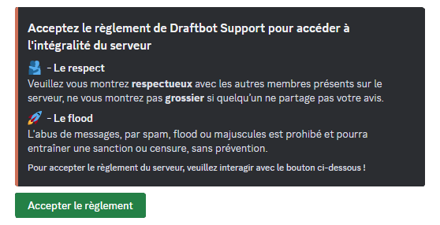

## Création du règlement

Pour commencez, vous allez devoir effectuer la commande </reglement créer>. **DraftBot** vous donnera ensuite la possibilité d'ajouter le rôle que vous souhaitez attribuer aux membres, une fois qu'ils ont pris connaissance du règlement et qu'ils ont cliqué sur le bouton "Accepter le règlement".

## Ajouter des règles

Maintenant que l'embed a été créé, vous aurez besoin d'ajouter des règles afin de conserver une bonne stabilité dans votre communauté. Pour cela, vous allez utiliser la commande </reglement ajouter>, DraftBot vous demandera : le message du règlement, le titre et la description de votre règle.

::hint{ type="warning" }
Pour le message du règlement, il s'agit de récupérer **l'identifiant** de l'embed du règlement que vous avez créé.
Pour savoir comment récupérer un identifiant : [Cliquez ici !](/docs/autres/recuperer-un-identifiant#identifiant-dun-message)
::

::hint{ type="info" }
Lorsque l'ajout d'une règle est effectuée, **DraftBot** proposera deux choix : ajouter une autre règle ou de remettre à plus tard.
::

::hint{ type="warning" }
Le titre est limité à 256 caractères, tandis que la description est limitée à 1 024 caractères.
::

## Modifier une règle

Vous pouvez modifier vos règles à tout moment, que se soit pour faire une correction ou bien pour le rendre plus esthétique selon vos envies. Vous aurez besoin de la commande </reglement modifier>. La procédure n'est pas très différente de la commande </reglement ajouter>, juste qu'un nouveau champ apparaît : **"règle"**.

Ce champ vous permet de sélectionner **la règle** que vous souhaitez modifier.

## Retirer une règle

Si une règle ne vous plaît pas et que vous souhaitez la retirer, vous pouvez utiliser la commande </reglement retirer>. Vous aurez juste à récupérer **l'identifiant** du message du règlement et sélectionner la **règle**.

