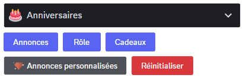
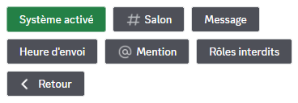
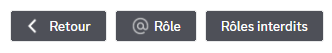
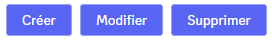
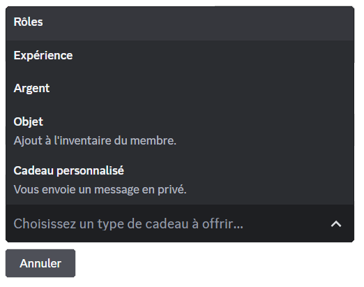
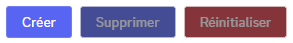
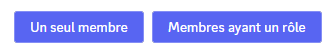
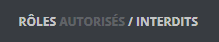

## Votre anniversaire

Vous pouvez définir votre anniversaire via [le panel de Draftbot](/dashboard/user/profil) ou avec la commande \</anniversaire définir>. Il vous suffira de mettre dans l'argument `[date]` votre date d'anniversaire.

Vous pouvez également voir la liste des dix prochains anniversaires définis sur le serveur grâce à la commande \</anniversaire liste>.

::hint{ type="warning" }
  Attention, pour changer votre date de naissance, il y a un délai d'attente progressif *(il augmente à chaque changement)*.

  - 1er changement : 1 jour
  - 2ème : 2 jours
  - 3ème : 6 mois
  - 4ème et plus : 1 an
::

## Modifier la visibilité de votre anniversaire

Grâce aux commandes \</anniversaire activer> & \</anniversaire désactiver>, vous pouvez *(par serveur individuel)* activer ou désactiver la visibilité de votre anniversaire. Vous pouvez aussi modifier ces paramètres depuis le panel  (dans la rubrique [profil](/dashboard/user/profil)).

::hint{ type="info" }
  Vous pouvez désactiver la visibilité de votre anniversaire sur tous les serveurs avec la commande \</anniversaire retirer>.
::

## Configuration des anniversaires sur le serveur

::tabs
  ::tab{ label="Via la commande /config" }
    Grâce à la commande \</config> vous pouvez paramétrer plusieurs options du système d'anniversaire.

    Avec les boutons présentés ci-dessous, vous pouvez :

    

    ## Annonces

    Grâce au bouton "Annonces", vous pouvez paramétrer l'envoi d'un message général à tous les membres lors du jour de leur anniversaire.

    

    - En cliquant sur le bouton "Système activer/désactiver", vous pouvez activer ou désactiver le système d'annonces d'anniversaire.
    - Avec le bouton "Salon", vous pouvez choisir le salon dans lequel le bot enverra les annonces d'anniversaire.
    - Grâce au troisième bouton "Message", vous pouvez paramétrer le message d'annonce.

    ::hint{ type="info" }
      Lorsque vous voulez paramétrer le message d'anniversaire, vous pouvez choisir entre prendre le message par défaut et un message personnalisé. Si vous prenez la deuxième option, vous pouvez utiliser les variables ci-dessous et le markdown de Discord.

      ::collapse{ label="Variables disponibles" }
        Membre :
        - `{user}` ou `{users}` ➜ Mention d'un ou plusieurs membres

        Serveur :
        - `{server}` ou `{server.name}` ➜ Nom du serveur
        - `{server.id}` ➜ Identifiant du serveur
        - `{server.membercount}` ➜ Nombre de membres sur le serveur

        Salon :
        - `{channel}` ➜ Mentions du salon
        - `{channel.id}` ➜ Identifiant du salon
        - `{channel.name}` ➜ Nom du salon

        Temps :
        - `{date}` ➜ Date actuelle (JJ/MM/AAAA)
        - `{time}` ➜ Heure actuelle (HH:MM)
        - `{timestamp}` ➜ Timestamp actuel en secondes
      ::
    ::

    - Avec l'aide du quatrième bouton "Heure d'envoi", vous pouvez définir l'heure à laquelle le message d'annonce d'anniversaire sera envoyé dans le salon que vous aurez défini au préalable.
    - Grâce à ce cinquième bouton "Mention", vous pouvez décider de mentionner un rôle lors de l'annonce qui sera envoyée lorsque quelqu'un fêtera son anniversaire.
    - Pour finir, avec le bouton "Rôles interdits", vous pouvez bloquer l'annonce d'un anniversaire à tous les membres qui possède un certain rôle.

    ## Rôle

    Avec l'option "Rôle", vous pouvez décider de donner un rôle de votre choix aux membres le jour de leurs anniversaire.

    

    - Grâce au bouton "Rôle", vous pouvez choisir un rôle temporaire qui mettra en avant le membre qui fêtera son anniversaire. Celui-ci conservera temporairement le rôle jusqu'à la fin de la journée.
    - Avec le bouton "Rôles autorisés/interdits", vous pouvez activer/désactiver la possibilité qu'un membre récupère le rôle temporaire le jour de son anniversaire grâce à un rôle autorisé/interdit.

    ## Cadeaux

    Vous pouvez accéder aux différents paramètres de cette option en cliquant sur le bouton "Cadeaux" :

    Proposez une magnifique surprise à vos membres le jour de leur anniversaire ! Ils seront sûrement ravis par votre générosité !

    

    En cliquant sur le bouton "Créer", vous pouvez choisir entre les quatre options ci-dessous pour créer une récompense ou un cadeau à offrir à vos membres qui fêteront leur anniversaire :

    

    Dans le menu déroulant, vous avez accès à plusieurs options, vous pouvez lire leurs explications ci-dessous :

    - La première option du menu déroulant "Expérience", vous pouvez donner de l'[expérience](/docs/modules/niveaux) en cadeau à un membre.
    - La deuxième option du menu déroulant "Argent", vous permet de donner de l'[argent](/docs/modules/economie) au membre qui fêtera son anniversaire.
    - Grâce à la troisième option "Objet", vous pouvez donner un [objet d'inventaire](/docs/modules/economie#objets-dinventaire) à la personne qui fête son anniversaire.
    - La dernière option "Cadeaux personnalisés", vous permet d'envoyer un message privé à la personne qui fête son anniversaire, cette fonctionnalité est pratique si par exemple, vous souhaitez lui offrir un Nitro ou alors juste lui écrire un petit message.

    *Avec les deux boutons restant du menu des "Cadeaux", vous pouvez modifier et supprimer les paramètres enregistrés avec l'aide du premier bouton :*

    - À l'aide du deuxième bouton "Modifier", vous pouvez modifier les options préalablement configurées.
    - Troisième et finalement avec le bouton "Supprimer", vous pouvez réinitialiser l'entièreté du système de "Cadeaux".

    ## Annonces personnalisées *(Avantage premium ✨)*

    

    - Premièrement, avec le bouton "Créer", vous pouvez accéder à deux options :

    

    - Avec l'option "Un seul membre", vous pouvez créer une annonce personnalisée lors de l'anniversaire de ce membre uniquement.
    - À l'aide de l'option "Membres ayant un rôle", vous pouvez créer une annonce personnalisée lors de l'anniversaire de tous les membres qui posséderont le rôle.

    *Avec les deux boutons restant du menu des "Annonces personnalisées", vous pouvez supprimer et réinitialiser les paramètres enregistrés avec l'aide du premier bouton :*

    - Avec le bouton "Supprimer", vous pouvez supprimer une annonce personnalisée que vous aurez créée auparavant.
    - Grâce au bouton "Réinitialiser", vous pouvez réinitialiser l'entièreté du système d'"Annonces personnalisées".
  ::

  ::tab{ label="Depuis le panel" }
    Grâce au [panel de Draftbot](/dashboard/first/birthdays), vous pouvez paramétrer plusieurs options du système d'anniversaire.

    Retrouvez ci-dessous les fonctionnalités configurables sur le panel.

    Comme vous le voyez sous vos yeux, vous avez accès aux fonctionnalités suivantes : Message d'annonce, Rôle temporaire, Cadeaux d'anniversaire et Annonces personnalisées *(Avantage premium ✨)*.

    ## Message d'annonce

    Lorsque l'option est activée, vous avez accès à des options de personnalisation ainsi que d'une prévisualisation. Dans les points ci-dessous, se trouvent des descriptions concernant les options personnalisables.

    - Avec la première option "Salon", vous pouvez choisir le salon dans lequel le bot enverra l'annonce d'anniversaire.
    - Avec l'aide de la deuxième option "Heure d'envoi", vous pouvez définir l'heure à laquelle le message d'annonce d'anniversaire sera envoyé dans le salon que vous aurez défini au préalable.
    - Grâce à la troisième option "Mention", vous pouvez décider de mentionner un rôle dans le message d'annonce.
    - Pour finir, avec le bouton "Rôles autorisés/interdits", vous autorisez/bloquez l'annonce d'un anniversaire à tous les membres qui possède au moins un des rôles autorisés ou interdits.

    N'oubliez pas que vous pouvez cliquer sur les boutons interdits/autorisés pour bien définir la fonctionnalité que vous souhaitez utiliser.

    

    - Grâce à la dernière option "Message", vous pouvez paramétrer le message d'annonce.

    ::hint{ type="info" }
      Lorsque vous voulez paramétrer le message d'anniversaire, vous pouvez choisir entre prendre le message par défaut et un message personnalisé. Si vous prenez la deuxième option, vous pouvez utiliser les variables ci-dessous et le markdown de Discord.

      

      
Variables disponibles\

      Membre :

      - `{user}` ou `{users}` ➜ Mention d'un ou plusieurs membres

      Serveur :

      - `{server}` ou `{server.name}` ➜ Nom du serveur
      - `{server.id}` ➜ Identifiant du serveur
      - `{server.membercount}` ➜ Nombre de membres sur le serveur

      Salon  :

      - `{channel}` ➜ Mentions du salon
      - `{channel.id}` ➜ Identifiant du salon
      - `{channel.name}` ➜ Nom du salon

      Temps :

      - `{date}` ➜ Date actuelle (JJ/MM/AAAA)
      - `{time}` ➜ Heure actuelle (HH:MM)
      - `{timestamp}` ➜ Timestamp actuel en secondes
      \

    ::

    ## Rôle temporaire

    Avec l'option "Rôle temporaire", vous pouvez gérer le fait d'un membre recevra un rôle exclusif uniquement le jour de son anniversaire.

    - Grâce à l'option "Rôle temporaire", vous pouvez choisir un rôle temporaire qui mettra en avant le membre qui fêtera son anniversaire. Celui-ci conservera temporairement le rôle jusqu'à la fin de la journée.
    - Avec le bouton "Rôles autorisés/interdits", vous pouvez activer/désactiver la possibilité qu'un membre récupère le rôle temporaire le jour de son anniversaire grâce à un rôle autorisé/interdit.

    ## Cadeaux d'anniversaire

    Proposez une magnifique surprise à vos membres le jour de leur anniversaire ! Ils seront sûrement ravis par votre générosité !

    En cliquant sur le bouton "Créer", vous pouvez choisir entre les quatre options dans le menu déroulant pour créer une récompense ou un cadeau à offrir à vos membres qui fêteront leur anniversaire :

    Dans le menu déroulant, vous avez accès à plusieurs options, vous pouvez lire leurs explications ci-dessous :

    - La première option du menu déroulant "Expérience", vous pouvez donner de l'[expérience](/docs/modules/niveaux) en cadeau à un membre.

    - Avec la deuxième option du menu déroulant "Monnaie", vous permet de donner de l'argent au membre qui fêtera son anniversaire. Vous pouvez vous référer au [système d'économie](/docs/modules/economie) au système d'économie.
    - Grâce à la troisième option "Objet d'inventaire", vous pouvez donner un [objet d'inventaire](/docs/modules/economie#objets-dinventaire) à la personne qui fête son anniversaire.
    - La dernière option "Personnalisés", vous permet d'envoyer un message privé à la personne qui fête son anniversaire, cette fonctionnalité est pratique si par exemple, vous souhaitez lui offrir un Nitro ou alors juste lui écrire un petit message.

    ## Annonces personnalisées *(Avantage premium ✨)*

    - Premièrement, grâce à l'option "Membre ou rôle", vous pouvez paramétrer une annonce selon si un ou des membres ont un rôle. Ou bien, individuellement avec seulement la mention du membre.

    - Deuxièmement, vous pouvez avec l'option "Salon textuel" choisir dans quel salon textuel l'annonce sera envoyée.

    - Finalement, vous pouvez créer un message avec l'outil de création de message ou bien d'Embed de DraftBot.
  ::
::

