## Présentation

Le système d'anniversaire permet aux membres de partager leur anniversaire simplement. Grâce à cela, vous pouvez leur offrir une attention particulière pour célébrer cette journée spéciale.
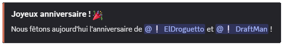

## Votre anniversaire

Vous pouvez définir votre anniversaire via [le panel de **DraftBot**](/dashboard/user/profil) ou avec la commande \</anniversaire définir>. Il vous suffira de mettre dans l'argument `Date` votre date d'anniversaire.

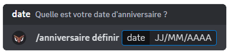

Vous pouvez également voir la liste des dix prochains anniversaires définis sur le serveur grâce à la commande \</anniversaire liste>.

::hint{ type="warning" }
  Attention, changer le jour ou le mois de votre date de naissance entraînera un délai d'attente progressif avant le prochain changement.

  - 1er changement : 1 jour
  - 2ème : 2 jours
  - 3ème : 6 mois
  - 4ème et plus : 1 an
::

## Modifier la visibilité de votre anniversaire

Grâce aux commandes \</anniversaire activer> & \</anniversaire désactiver>, vous pouvez *(par serveur individuel)* activer ou désactiver la visibilité de votre anniversaire. Vous pouvez aussi modifier ces paramètres depuis le panel  (dans la rubrique [profil](/dashboard/user/profil)).

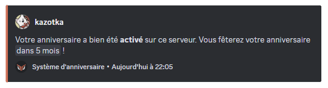

::hint{ type="info" }
  Vous pouvez désactiver la visibilité de votre anniversaire sur tous les serveurs avec la commande \</anniversaire retirer>.
::

## Configuration

### Mode d'anniversaire

Avant de débuter la configuration des anniversaires sur votre serveur, vous devez choisir quel mode souhaitez vous avoir.

| Mode Public | Mode Privé |
|-------------|------------|
| Les anniversaires sont les mêmes que ceux de la base de données globale | Les anniversaires définis ne sont disponibles que sur votre serveur |
| Ne nécessite qu'une seule configuration pour l'utilisateur | Permet à l'utilisateur de définir une date d'anniversaire uniquement sur votre serveur |
| Vous ne pouvez pas contrôler l'anniversaire des membres | Vous pouvez supprimer, modifier ou ajouter un anniversaire d'un membre sur votre serveur |
| Plus fiable pour l'attribution des récompenses | Plus adapté pour un serveur de type RPG où les dates sont fictives |

Une fois votre mode sélectionné, vous pouvez commencer à configurer le système.

::tabs
  ::tab{ label="Depuis le panel" }
    [⫸ Accéder au panel de **DraftBot**](/dashboard/first/birthdays)

    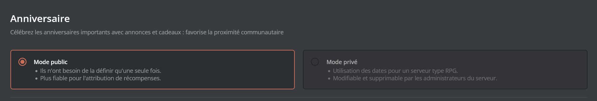
  ::

  ::tab{ label="Via la commande /config" }
    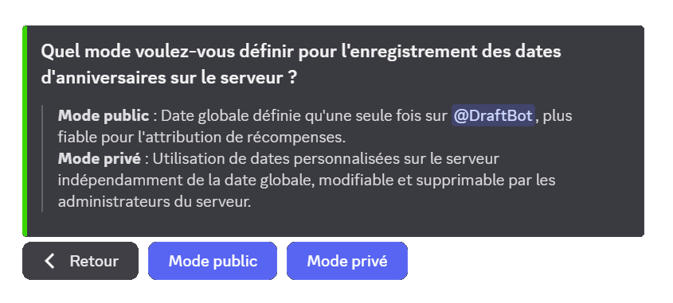
  ::
::

### Messages d'annonces

Vous pouvez, lors de l'anniversaire d'un de vos membres, envoyer une annonce dans un salon déterminé.

Vous devez paramétrer les informations suivantes :
- **Salon d'envoi :** Vous devez choisir le salon textuel où sera envoyée l'annonce
- **Heure d'envoi :** Vous devez choisir l'heure à laquelle sera envoyé le message
- **Rôle à mentionner :** Vous pouvez choisir un rôle à mentionner lors de l'annonce
- **Rôles autorisés / interdits :** Vous pouvez déterminer quels sont les rôles qui peuvent déclencher l'annonce
- **Message personnalisé :** Vous pouvez écrire un message personnalisé pour l'annonce.

::tabs
  ::tab{ label="Depuis le panel" }
    [⫸ Accéder au panel de **DraftBot**](/dashboard/first/birthdays)

    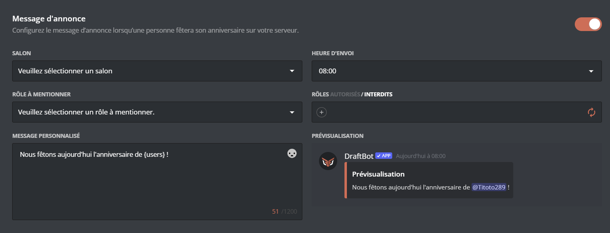
  ::

  ::tab{ label="Via la commande /config" }
    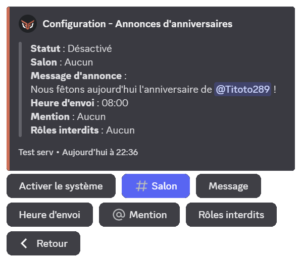
  ::
::

Vous pouvez personnaliser votre message avec différentes variables :

| Variable | Description | Exemple |
|----------|-------------|---------|
| `{user}` | Membre(s) fêtant leur anniversaire | @John, @Jane |
| `{role}` | Rôle temporaire d'anniversaire | @Anniversaire |
| `{gifts}` | Récompenses données | 500 💰, Rôle VIP |

*En plus des [autres variables](/docs/autres/variables) déjà disponibles globalement !*

### Rôle temporaire

Vous pouvez choisir de donner un rôle, le temps de la journée, au membre qui fête son anniversaire. Pour cela, sélectionnez le rôle à donner. Vous pouvez également paramétrer quels rôles peuvent recevoir ou non le **rôle temporaire**.

::hint{ type="info" }
  Si vous ne souhaitez pas mettre de restriction, ne sélectionnez aucun rôle et vérifiez que le mot `interdits` est en gras
::

::tabs
  ::tab{ label="Depuis le Panel" }
    [⫸ Accéder au panel de **DraftBot**](/dashboard/first/birthdays)

    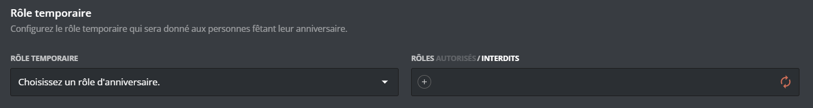
  ::

  ::tab{ label="Via la commande /config" }
    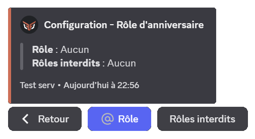
  ::
::

### Cadeau d'anniversaire

Vous pouvez choisir un cadeau à donner aux membres qui fêtent leur anniversaire. Voici les cadeaux que vous pouvez donner :

::tabs
  ::tab{ label="Rôle" }
    Vous pouvez offrir à vos membres des rôles. Pour ajouter un rôle aux cadeaux, sélectionnez le type **"Rôle"**.

    Choisissez ensuite le rôle à offrir.

    ::hint{ type="warning" }
      Le rôle sélectionné doit avoir été créé au préalable sur votre serveur, et être accessible à DraftBot (donc ne pas être situé plus haut que le rôle le plus élevé de DraftBot).
    ::
  ::

  ::tab{ label="Expérience"}
    Si le [système de niveaux](/docs/modules/niveaux) est activé, vous pouvez offrir à vos membres de l'expérience. Pour ajouter de l'expérience aux cadeaux, sélectionnez le type de **"Expérience"**.

    Choisissez ensuite le montant d'expérience à offrir.
  ::

  ::tab{ label="Argent" }
    Si le [système d'économie](/docs/modules/economie) est activé, vous pouvez ajouter une somme d'argent fictive aux cadeaux. Pour ajouter une somme d'argent aux cadeaux, sélectionnez le type **"Argent"**.

    Choisissez ensuite la somme d'argent à offrir.
  ::

  ::tab{ label="Objet Inventaire" }
    Vous pouvez offrir des objets fictifs à vos membres. Pour offrir des objets d'inventaire en cadeau, sélectionnez le type **"Objet d'inventaire"**.

    Choisissez ensuite :
    - L'objet à offrir
    - Le nombre d'objets à donner
  ::

  ::tab{ label="Cadeau Personnalisé" }
    Si vous souhaitez offrir à vos membres autre chose, comme des codes promotionnels, des clés d'activation numériques, ou bien des objets "réels", DraftBot a la solution !

    Pour ajouter un cadeau personnalisé, sélectionnez le type **"Cadeau personnalisé"**.

    Choisissez ensuite le nom de l'article.

    ::hint{ type="success" }
      Lorsqu'un membre recevra ce cadeau, vous serez notifié par DraftBot dans vos messages privés, et vous pourrez ainsi lui remettre "en main propre".
    ::
  ::
::

::hint{ type="info" }
  Vous pouvez offrir jusqu'à 2 cadeaux d'anniversaires. Les serveurs [premium](/premium) <:icon_premium:1096140508625125417> peuvent aller jusqu'à 5.
::

::tabs
  ::tab{ label="Depuis le Panel" }
    [⫸ Accéder au panel de **DraftBot**](/dashboard/first/birthdays)

    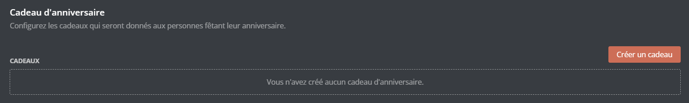
  ::

  ::tab{ label="Via la commande /config" }
    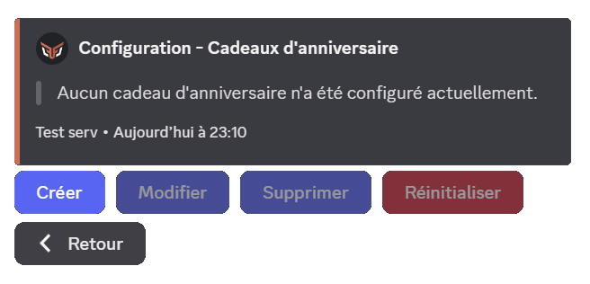
  ::
::

### Messages d'anniversaires ciblés

Vous pouvez également paramétrer pour certains rôles ou membres un message plus personnel.
Vous devez, dans la section `Annonces personnalisées`, choisir le rôle ou le membre concerné ainsi que le salon d'envoi. Vous pourrez ensuite rédiger votre message. Vous pouvez également choisir si les membres concernés par cette annonce pourront voir à l'avance le message d'annonce s'ils ont la permission Administrateur.

::hint{ type="info" }
  L'heure d'envoi sera la même que les autres annonces
::

::tabs
  ::tab{ label="Depuis le Panel" }
    [⫸ Accéder au panel de **DraftBot**](/dashboard/first/birthdays)

    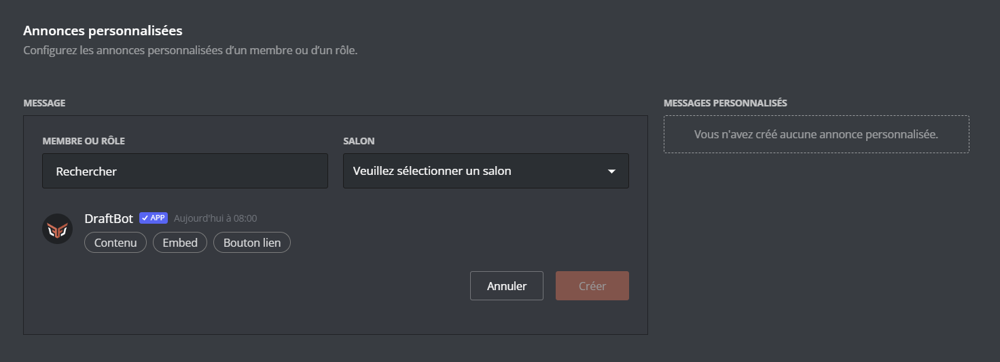
  ::

  ::tab{ label="Via la commande /config" }
    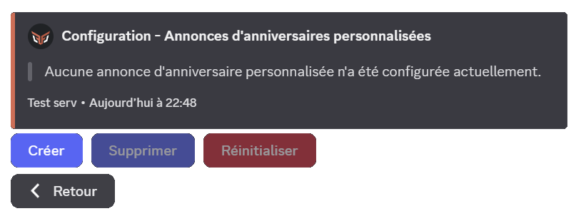
  ::
::

::hint{ type="info" }
  Cette fonctionnalité est réservée aux serveurs [premium](/premium) <:icon_premium:1096140508625125417>.
::

