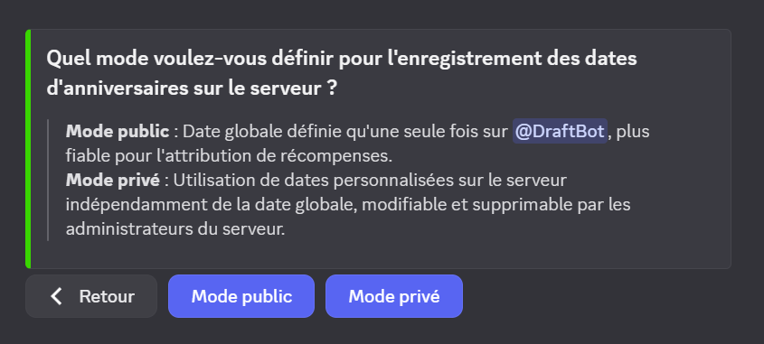
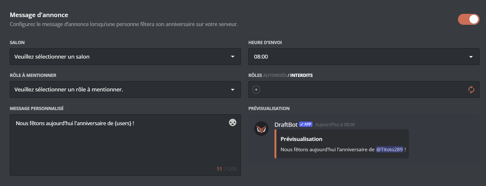
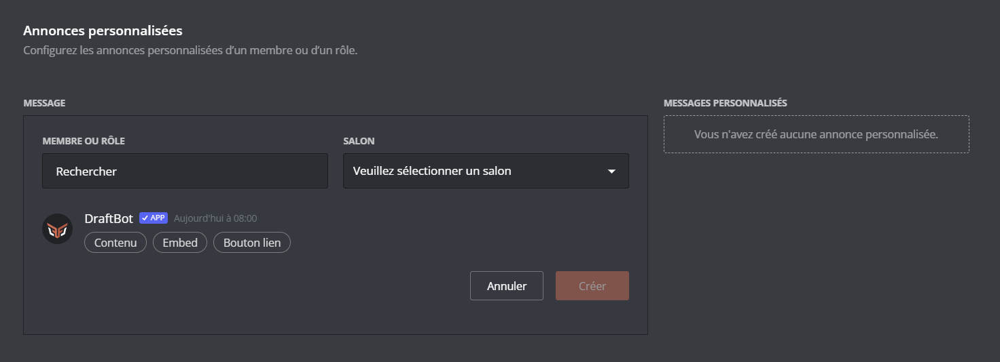
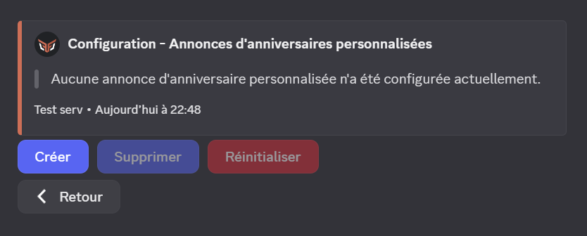

## Présentation

Le système d'anniversaire permet aux membre de partager leur anniversaire simplement. Grâce à cela vous pouvez leur offrir une attention particulière pour célebrer cette journée spéciale

## Votre anniversaire

Vous pouvez définir votre anniversaire via [le panel de Draftbot](/dashboard/user/profil) ou avec la commande \</anniversaire définir>. Il vous suffira de mettre dans l'argument `Date` votre date d'anniversaire.

Vous pouvez également voir la liste des dix prochains anniversaires définis sur le serveur grâce à la commande \</anniversaire liste>.

::hint{ type="warning" }
  Attention, pour changer votre date de naissance, il y a un délai d'attente progressif *(il augmente à chaque changement du mois ou du jour)*.

  - 1er changement : 1 jour
  - 2ème : 2 jours
  - 3ème : 6 mois
  - 4ème et plus : 1 an
::

## Modifier la visibilité de votre anniversaire

Grâce aux commandes \</anniversaire activer> & \</anniversaire désactiver>, vous pouvez *(par serveur individuel)* activer ou désactiver la visibilité de votre anniversaire. Vous pouvez aussi modifier ces paramètres depuis le panel  (dans la rubrique [profil](/dashboard/user/profil)).

::hint{ type="info" }
  Vous pouvez désactiver la visibilité de votre anniversaire sur tous les serveurs avec la commande \</anniversaire retirer>.
::

## Configuration des anniversaires sur le serveur

### Mode d'anniversaire
Avant de débuter la configuration des anniversaires sur votre serveur vous devez choisir quel mode souhaitez vous avoir.
| Mode Public | Mode Privé |
|-------------|------------|
| Les anniversaires sont les mêmes que ceux de la base de donnée globale | Les anniversaires ne correspondent pas à ceux de la base de données globale |
| Ne nécessite pas un reparamétrage pour l'utilisateur | Nécessite de mettre à nouveau un anniversaire pour l'utilisateur |
| Vous ne pouvez pas contrôler l'anniversaire des membres | Vous pouvez supprimer, modifier ou ajouter un anniversaire d'un membre sur votre serveur |
| Plus fiable pour l'attribution des récompenses | Plus efficace pour un serveur de type RPG |

Une fois votre mode sélectionné, vous pouvez commencer à configurer le système.

::tabs
  ::tab{ label="Depuis le panel" }
    
  ::

  ::tab{ label="Via la commande /config" }
    
  ::
::

### Message d'annonce

Vous pouvez, lors de l'anniversaire d'un de vos membres, envoyer une annonce dans un salon déterminé.

Vous devez paramétrer les informations suivantes :
- Salon d'envoi
    - Vous devez choisir le salon textuel où sera envoyé l'annonce
- Heure d'envoi
    - Vous devez choisir l'heure à laquelle sera envoyé le message

    ::hint{ type="info" }
      L'envoi du message est suscpetible de ne pas être exactement l'heure prévue mais peut être décalé de quelques minutes
    ::
- Rôle à mentionner
    - Vous pouvez choisir un rôle à mentionner lors de l'annonce
- Rôles autorisés / interdits
    - Vous pouvez déterminer quels sont les rôles qui peuvent déclencher l'annonce
- Message personnalisé
    - Vous pouvez écrire un  message personnalisé pour l'annonce.

    ::hint{ type="info" }
      Vous pouvez utilisez des variables dans votre message pour plus de personnalisation
    ::

    ::tabs
      ::tab{ label="Depuis le panel" }
        
      ::

      ::tab{ label="Via la commande /config" }
        
      ::
    ::

#### Message d'annonce personnalisé <:icon_premium:1096140508625125417>
Vous pouvez également paramétrer pour certains rôle ou membre un message plus personnel.
Vous devez, dans la section `Annonces personnalisées`, choisir le rôle ou le membre concerné ainsi que le salon d'envoi. Vous pourrez ensuite rédiger votre message. Vous pouvez également choisir si les membres concerné par cette annonce pourront voir à l'avance le message d'annonce.

    ::hint{ type="info" }
      L'heure d'envoi sera la même que les autres annonces
    ::

    ::tabs
      ::tab{ label="Depuis le Panel" }
        
      ::

      ::tab{ label="Via la commande /config" }
        
      ::
    ::

### Rôle temporaire
Vous pouvez choisir de donner un rôle, le temps de la journée, au membre qui fête son anniversaire. Pour cela sélectionner le rôle à donner. Vous pouvez également paramétrer quels rôles peuvent recevoir ou non le **rôle temporaire**.

    ::hint{ type="info" }
      Si vous ne souhaitez pas mettre de restriction, ne remplissez aucun rôle et vérifiez si le mot `interdits` soit bien en gras
    ::

    ::tabs
      ::tab{ label="Depuis le Panel" }
        
      ::

      ::tab{ label="Via la commande /config" }
        
      ::
    ::

### Cadeau d'anniversaire

Vous pouvez choisir un cadeau à donner pour les membres qui fêtent leur anniversaire. Voici les cadeau que vous pouvez donner :
- Un ou des rôles
- De l'expérience
- De l'argent
- Un objet d'inventaire
- Un objet personnalisé

Une fois votre type de cadeau sélectionné vous pourrez le paramétrez.

::hint{ type="info" }
  Vous pouvez créer jusqu'à **2 cadeaux** sans le premium <:icon_premium:1096140508625125417>

  Avec le premium <:icon_premium:1096140508625125417> vous pourrez en créer jusqu'à **5**
::

::tabs
  ::tab{ label="Tab 1" }
    
  ::

  ::tab{ label="Tab 2" }
    
  ::
::