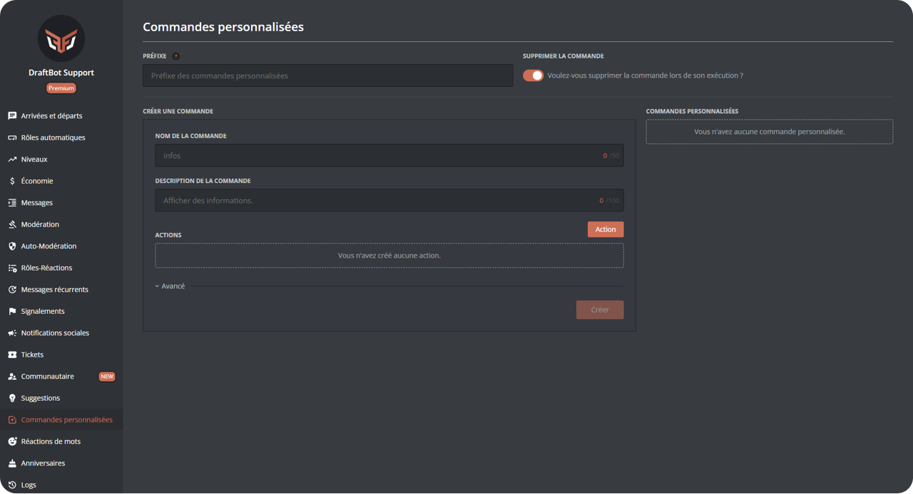
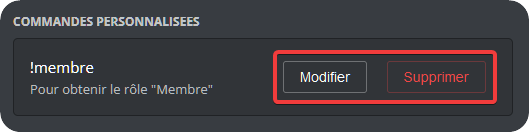
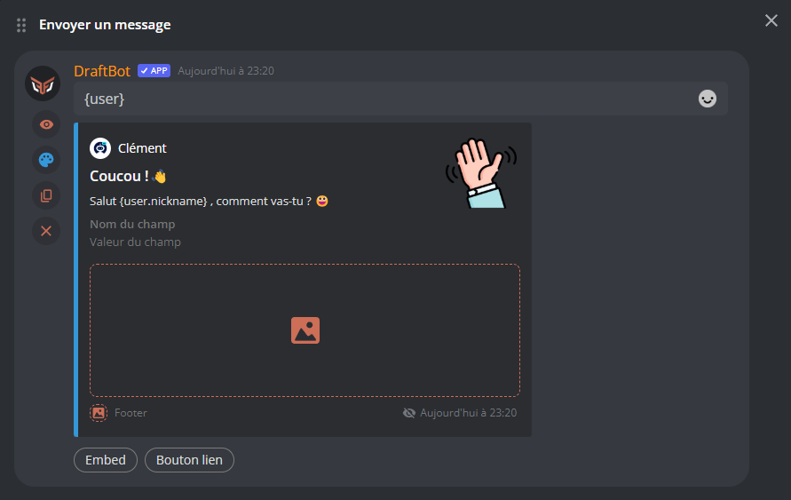
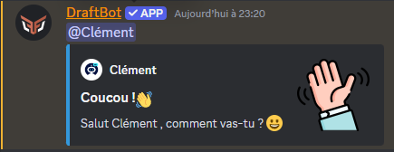

## Configuration

<!-- Depuis Discord -->
::tabs
  ::tab{ label="Via la commande /config" }
    Vous pouvez créer une commande personnalisée avec la commande \</config>, en vous rendant ensuite dans l'onglet "Commandes personnalisées" du sélecteur.
    DraftBot vous invitera alors à renseigner :

    * Le nom de la commande,
    * La description de la commande,
    * La / les [actions](https://draftbot.fr/docs/modules/commandes-personnalisees#actions) que votre commande devra réaliser.
    * Les rôles ou salons interdits/autorisés
    * Si la commande doit apparaître dans le \</aide> ou non,
    * Si vous souhaitez ajouter un mode lent à votre commande,
    * Si vous souhaitez définir une condition pour l'utiliser.

    ::hint{ type="info" }
    Lorsque vous exécutez une commande personnalisée, votre texte de déclenchement de commande reste dans le salon. Si vous souhaitez que **DraftBot** supprime votre commande, vous pouvez activer l'option correspondante dans \</config>, en vous rendant dans l'onglet "Commandes personnalisées" du sélecteur, puis en activant le bouton "Activer la suppression des commandes".
    ::
  ::

  ::tab{ label="Depuis le panel" }
    [Accéder au panel de **DraftBot**](/dashboard/first/custom-commands)

    Remplissez les divers champs (nom, description, actions...), cliquez sur le bouton "Créer", et votre commande personnalisée est immédiatement prête à l'emploi !

    { width=600px }

    ::hint{ type="success" }
      Pour plus de personnalisation, déroulez le menu "**avancé**" !
    ::
    ::hint{ type="info" }
    Besoin de modifier ou de supprimer une commande ?\
    Pas de problème ! Cliquez sur "Modifier" ou "Supprimer" sur le côté droit. 
    ::
  ::
::

## Actions
Les actions sont le coeur de votre commande personnalisée, et se répartissent en 4 types :
::tabs  
  ::tab{ label="Message" }
    1. **Envoyer un message** \
    *Lors de l'exécution de la commande, DraftBot enverra un message.*

    ::hint{ type="info" }
      Le message peut contenir du markdown et des variables. Si vous le configurez depuis le [Panel](/dashboard/first/custom-commands), vous pouvez même y ajouter des embeds !
    ::
    ::collapse{ label="Afficher un exemple :" }
      ### Exemple d'utilisation : 
      Voici une action **Envoyer un message**, configurée depuis le [Panel](/dashboard/first/custom-commands) :\
      
      À l'exécution de la commande, voici ce qu'on obtient :
      
    ::
  ::
  ::tab{ label="Rôles" }
    1. **Ajouter des rôles** 
    *Lors de l'exécution de la commande, DraftBot attribuera le/les rôles sélectionnés.*
    2. **Ajouter un rôle temporaire** 
    *Lors de l'exécution de la commande, Draftbot attribuera un rôle, puis le retitera après un temps de votre choix.*
    3. **Retirer des rôles** \
    *Lors de l'exécution de la commande, Draftbot retirera le/les rôles sélectionnés.*

    ::hint{ type="info" }
      Pour chacune de ces trois commandes, vous pouvez décider si vous souhaitez que la modification de rôle s'applique à la personne qui utilise la commande, ou à une autre personne, mentionnée dans la commande.
    ::
  ::
  ::tab{ label="Inventaire / Économie" }
    1. **Article de la boutique** \
    *En utilisant cette commande, le membre achètera l'objet sélectionné.*
    2. **Ajouter de l'argent** \
    *Lors de l'exécution de la commande, DraftBot ajoutera un montant défini d'argent au membre.*

    ::hint{ type="info" }
      Pour la commande **Ajouter de l'argent**, vou pouvez décider si vous souhaitez que la modification de rôle s'applique à la personne qui utilise la commande, ou à une autre personne, mentionnée dans la commande.
    ::
  ::
::

## Arguments

Les commandes personnalisées vous offrent la possibilité d'ajouter des arguments dans vos messages.

Voici les différentes variables d'arguments possibles avec **DraftBot** :

> `$1` ➜ Premier argument saisi après la commande.\
> `$2` ➜ Deuxième argument saisi après la commande.\
> `$1+` ➜ Tout ce qui est saisi après la commande.\
> `$2+` ➜ Tout ce qui est saisi après la commande sauf le premier argument.

### Valeur par défaut

> Il est possible d'assigner une valeur par défaut à votre variable.

Pour cela il suffit d'ajouter `={Votre valeur}` après les variables ci-dessus.

::hint{ type="info" }
**Exemple de commande personnalisée avec des arguments :**

* Message configuré : `$1 est maintenant $2+`
* Commande de l'utilisateur : `!adjectif @Jules fort et beau`
* Réponse de DraftBot : @Jules _est maintenant_ fort et beau
::

## Variables

Les commandes personnalisées vous offrent également la possibilité d'ajouter des variables dans vos messages.

Ouvrez le menu déroulant pour voir les différentes variables :

::collapse{ label="Variables disponible" }
  **Membre** :
  > `{user}` ➜ Mention du membre
  >
  > `{user.id}` ➜ Identifiant du membre
  >
  > `{user.username}` ➜ Pseudo du membre
  >
  > `{user.nickname}` ➜ Surnom ou pseudo du membre

  **Niveaux** :
  > `{level}` ➜ Niveau du membre _(uniquement si le système de niveaux est activé)_
  >
  > `{level.rank}` ➜ Place du membre *(uniquement pour les messages dans le système de niveaux)*
  >
  > `{money}` ➜ Argent du membre _(uniquement si le système d'économie est activé)_
  >
  > `{money.rank}` ➜ Place du membre *(uniquement si le système d'économie est activé)*
  >
  > `{birthday}` ➜ Date d'anniversaire du membre *(uniquement si le système est activé)*

  **Serveur** :
  > `{server}` ou `{​server.name}` ➜ Nom du serveur
  >
  > `{server.id}` ➜ Identifiant du serveur
  >
  > `{server.membercount}` ➜ Nombre de membres sur le serveur

  **Salon**  :
  > `{channel}` ➜ Mentions du salon
  >
  > `{channel.id}` ➜ Identifiant du salon
  >
  > `{channel.name}` ➜ Nom du salon

  **Temps** :
  > `{date}` ➜ Date actuelle (JJ/MM/AAAA)
  >
  > `{time}` ➜ Heure actuelle (HH:MM)
  >
  > `{timestamp}` ➜ Timestamp actuel en secondes
::
