## Configuration

<!-- Depuis Discord -->

::tabs
  ::tab{ label="Via la commande /config" }
    Vous pouvez créer une commande personnalisée avec la commande \</config>, en vous rendant ensuite dans l'onglet "Commandes personnalisées" du sélecteur.
    DraftBot vous invitera alors à renseigner :

    - Le **nom** de la commande,
    - La **description** de la commande,
    - La / les [actions](#actions) que votre commande devra réaliser,
    - Les rôles ou salons [interdits/autorisés](#options-avancees),
    - Si la commande doit [apparaître](#options-avancees) dans le \</aide> ou non,
    - Si vous souhaitez ajouter un [mode lent](#options-avancees) à votre commande,
    - Si vous souhaitez définir une [condition](#options-avancees) pour l'utiliser.

    ::hint{ type="info" }
      Lorsque vous exécutez une commande personnalisée, votre texte de déclenchement de commande reste dans le salon. Si vous souhaitez que **DraftBot** supprime votre commande, vous pouvez activer l'option correspondante dans \</config>, en vous rendant dans l'onglet "Commandes personnalisées" du sélecteur, puis en activant le bouton "Activer la suppression des commandes".
    ::
  ::

  ::tab{ label="Depuis le panel" }
    [⫸ Accéder au panel de **DraftBot**](/dashboard/first/custom-commands)

    Remplissez les divers champs (nom, description, actions...), cliquez sur le bouton "Créer", et votre commande personnalisée est immédiatement prête à l'emploi !

    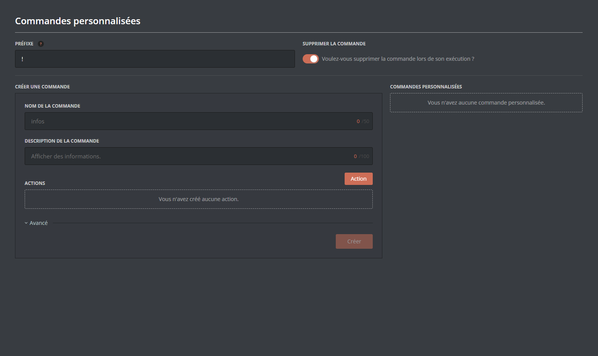

    ::hint{ type="success" }
      Pour plus de personnalisation, déroulez le menu "**avancé**" !
    ::

    ::hint{ type="info" }
      Besoin de modifier ou de supprimer une commande ?

      Pas de problème ! Cliquez sur "Modifier" ou "Supprimer" :

      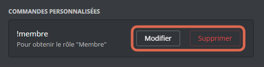
    ::
  ::
::

## Les actions

Les actions sont le cœur de votre commande personnalisée, et se répartissent en 4 types :

::tabs
  ::tab{ label="Message" }
    1. **Envoyer un message**

    *Lors de l'exécution de la commande, DraftBot enverra un message.*

    ::hint{ type="info" }
      Le message peut contenir du markdown et des variables. Si vous le configurez depuis le [Panel](/dashboard/first/custom-commands), vous pouvez même y ajouter des embeds !
    ::

    ::collapse{ label="Afficher un exemple :" }
      Voici une action **Envoyer un message**, configurée depuis le [Panel](/dashboard/first/custom-commands) :

      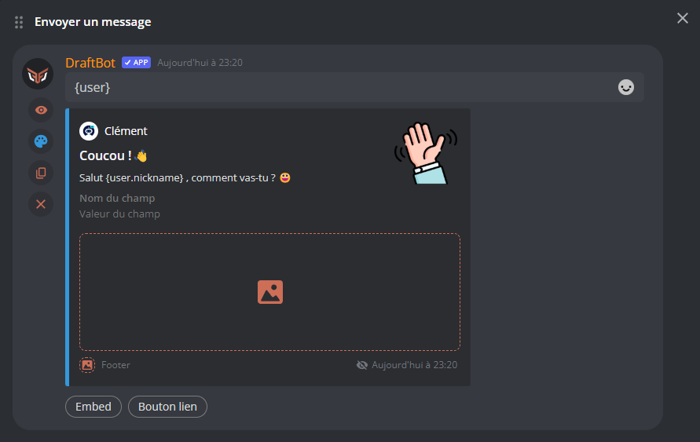

      À l'exécution de la commande, voici ce qu'on obtient :

      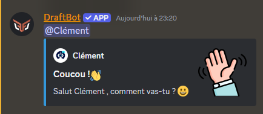
    ::
  ::

  ::tab{ label="Rôles" }
    1. **Ajouter des rôles**

    *Lors de l'exécution de la commande, DraftBot attribuera le/les rôles sélectionnés.*

    ::collapse{ label="Afficher un exemple :" }
      Voici une commande faisant appel à l'action **"Ajouter des rôles"** :

      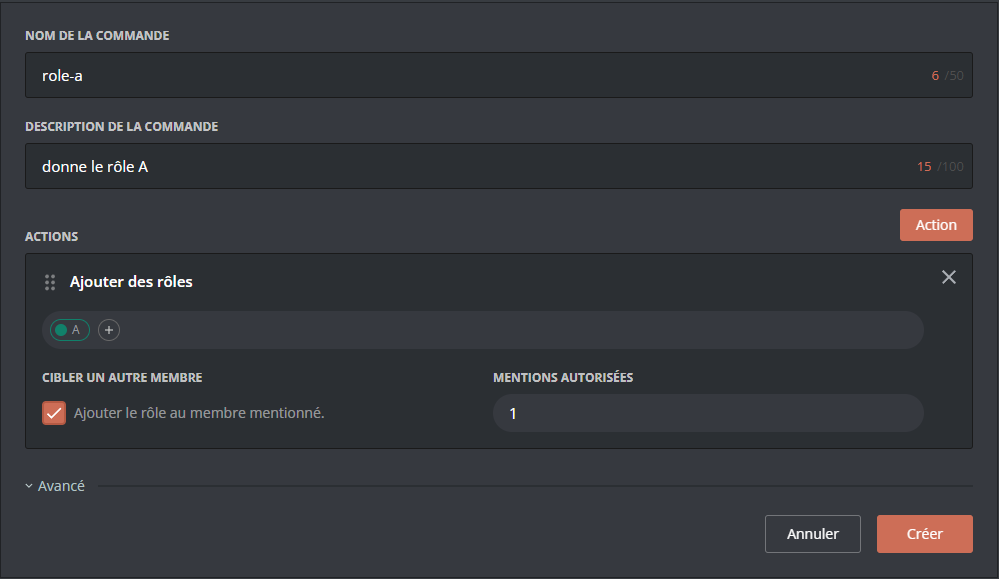

      ::hint{ type="success" }
        Si j'écris sur Discord `!role-a @Draftman`, le membre Draftman reçoit le rôle \<@A> !
      ::

      ::hint{ type="info" }
        💡 Pour plus de clarté, n'hésitez pas à combiner cette action avec une action **Envoyer un message**, pour que Draftbot puisse prévenir le membre qu'il a reçu un nouveau rôle !
      ::
    ::

    2. **Ajouter un rôle temporaire**

    *Lors de l'exécution de la commande, Draftbot attribuera un rôle, puis le retirera après un temps de votre choix.*

    ::collapse{ label="Afficher un exemple :" }
      Depuis le [Panel](/dashboard/first/custom-commands), il est très facile de régler avec précision la durée souhaitée :

      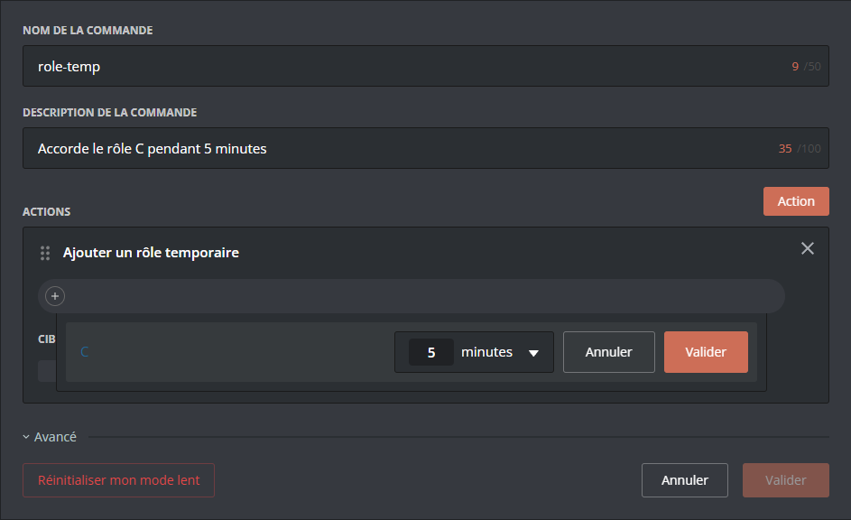

      ::hint{ type="success" }
        Si j'écris sur Discord `!role-temp`, je reçois le rôle \<@C> !

        Ensuite, au bout de 5 minutes, le rôle m'est retiré automatiquement.
      ::
    ::

    3. **Retirer des rôles**

    *Lors de l'exécution de la commande, Draftbot retirera le/les rôles sélectionnés.*

    ::collapse{ label="Afficher un exemple :" }
      Voici une fonction qui permet de retirer à un membre le rôle \<@A>, en le mentionnant :

      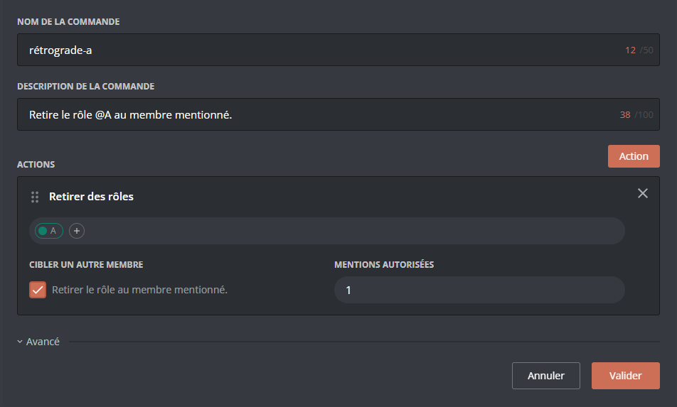

      ::hint{ type="success" }
        Si j'écris sur Discord `!retrograde-a @Draftman`, le membre \<@Draftman> perd instantanément le rôle \<@A> !
      ::
    ::

    ::hint{ type="info" }
      Si vous souhaitez que la commande s'applique directement au membre qui l'utilise, il suffit de décocher la case "cibler un autre membre".

      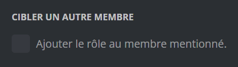
    ::
  ::

  ::tab{ label="Inventaire / Économie" }
    1. **Article de la boutique**

    *En utilisant cette commande, le membre achètera l'objet sélectionné.*

    ::collapse{ label="Afficher un exemple :" }
      La commande suivante permet l'achat d'un item par son utilisateur :

      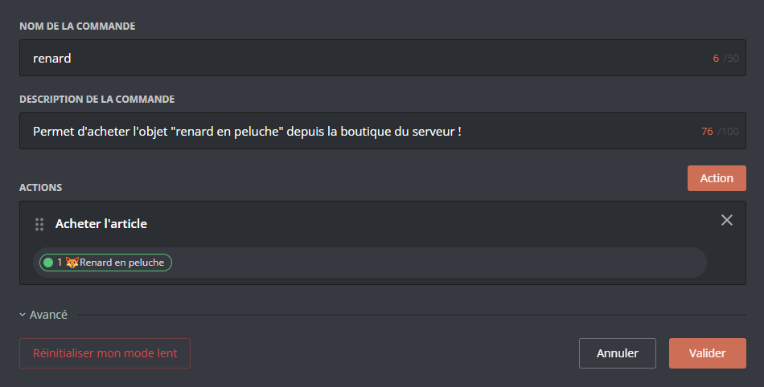

      ::hint{ type="success" }
        Si j'écris sur Discord `!renard`, l'objet **"🦊 Renard en peluche"** apparaît dans mon inventaire (et son prix est déduit de mon argent) !
      ::

      ::hint{ type="info" }
        DraftBot vous laisse le champ libre pour rédiger vous-même les confirmations d'achat :

        Pensez donc à combiner cette action avec l'action **Envoyer un message** !
      ::
    ::

    2. **Ajouter de l'argent**

    *Lors de l'exécution de la commande, DraftBot ajoutera un montant défini d'argent au membre.*

    ::collapse{ label="Afficher un exemple :" }
      Voici une commande `!donation`, qui permet d'ajouter 10💰 à un membre mentionné :

      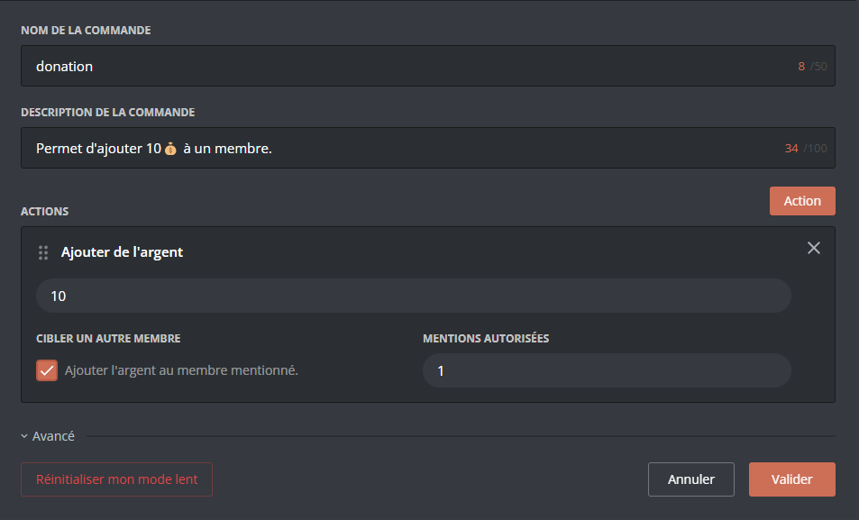

      ::hint{ type="success" }
        Si j'écris sur Discord `!donation @Draftman`, le membre \<@Draftman> reçoit instantanément 10💰 !
      ::

      ::hint{ type="info" }
        Vous pouvez aussi décider que cette commande ajoute la somme au membre qui l'utilise, et non à un membre mentionné. Pour cela, décochez la case "cibler un autre membre".
      ::
    ::
  ::
::

## Options Avancées

### A. Où les trouver ?

::tabs
  ::tab{ label="Via la commande /config" }
    ::hint{ type="success" }
      Les options avancées vous seront directement proposées par Draftbot lors de la configuration de la commande : Vous n'avez qu'à vous laisser guider !
    ::
  ::

  ::tab{ label="Depuis le Panel" }
    ::hint{ type="info" }
      Depuis le [Panel](/dashboard/first/custom-commands), vous pouvez faire apparaître ces options en cliquant sur "Avancé", en dessous de vos actions.
      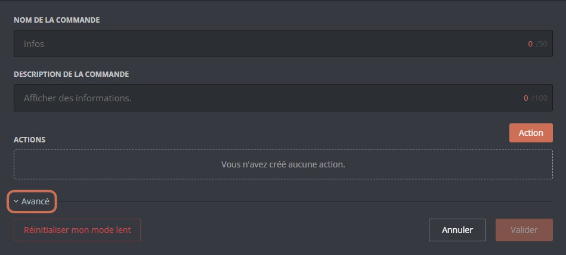
    ::
  ::
::

### B. Que font-elles ?

On peut regrouper les options avancées en 4 catégories :

::tabs
  ::tab{ label="Restrictions" }
    Il est possible de restreindre l'accès à une fonction selon deux critères :
    1. **Restreindre par Rôles**

    Vous pouvez réserver l'utilisation d'une fonction à certains rôles spécifiques, ou au contraire l'interdire uniquement à certains rôles spécifiques.

    2. **Restreindre par Salons**

    De la même façon, vous pouvez restreindre l'utilisation de votre fonction à certains salons spécifiques, ou l'interdire à certains salons spécifiques.

    ::hint{ type="info" }
      Pour basculer entre les modes "autoriser" et "interdire", cliquez sur "**AUTORISÉS/INTERDITS**".

      Le mode actif est écrit en blanc, tandis que l'autre est grisé.
      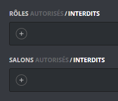
    ::
  ::

  ::tab{ label="Masquage" }
    Si vous ne souhaitez pas que la commande apparaisse dans le \</help>, vous pouvez activer ce bouton :

    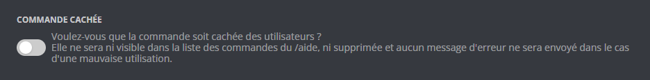

    ::hint{ type="warning" }
      Lorsque la commande est cachée, elle ne renverra pas de message d'erreur en cas de mauvaise utilisation !
    ::
  ::

  ::tab{ label="Mode lent" }
    Si vous souhaitez appliquer un *"cooldown"* (ou "temps de rechargement") à votre commande personnalisée, vous pouvez le paramétrer tout en souplesse, en renseignant les informations suivantes :
    - `Nombre d'utilisations` : le nombre d'utilisations par le même utilisateur avant de déclencher un temps de rechargement
    - `Durée du mode lent` : la durée de rechargement avant que l'utilisateur puisse utiliser de nouveau la commande.

    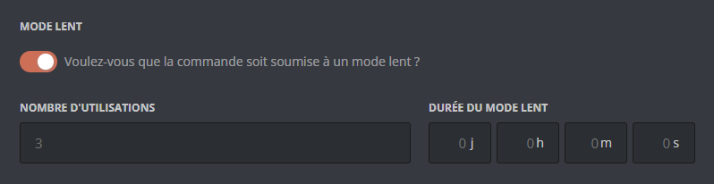

    ::hint{ type="success" }
      Si vous êtes modérateur/administrateur, vous pouvez réinitialiser votre propre nombre d'utilisations d'une commande ! Pour cela, rendez-vous sur le [Panel](/dashboard/first/custom-commands), cliquez sur "**Modifier**" à côté de la commande en question.

      Un bouton "**Réinitialiser mon mode lent**" apparaîtra en bas à gauche de l'écran :

      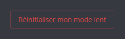
    ::
  ::

  ::tab{ label="Conditions" }
    Vous pouvez conditionner l'accès à votre commande en fonction de prérequis :
    - `Objet d'inventaire` : Le membre ne pourra accéder à la commande que s'il possède l'objet défini.
    - `Argent` : Le membre ne pourra accéder à la commande que s'il possède la somme d'argent définie.
    - `Niveau` : Seuls les membres d'un certain niveau pourront accéder à la commande.

    ::hint{ type="info" }
      Pour les options "objet d'inventaire" et "argent", vous pouvez décider si vous souhaitez que l'objet (ou la somme) soit déduit de l'inventaire du membre ou non.
    ::

    ::hint{ type="success" }
      Grâce au [Panel](/dashboard/first/custom-commands), vous pouvez configurer tout ça en quelques clics :
      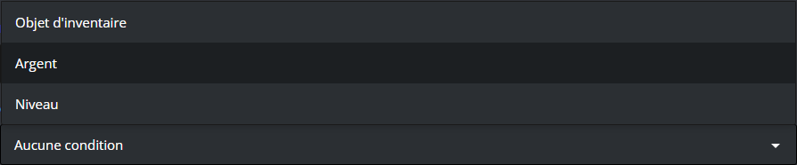
    ::
  ::
::

## Pour aller plus loin

### Les arguments

Vous pouvez rendre les messages de vos commandes personnalisées plus personnels et plus pertinents en utilisant des arguments !

::hint{ type="info" }
  Un "argument" est une information que vous donnez lorsque vous utilisez une commande.

  Par exemple, dans la commande `!compliment @Draftman cool`, `@Draftman` est le premier argument, et `cool` est le deuxième argument.
::

Voici les différentes variables d'arguments possibles avec **DraftBot** :

> `$1` ➜ Premier argument saisi après la commande.
>
> `$2` ➜ Deuxième argument saisi après la commande.
>
> `$1+` ➜ Tout ce qui est saisi après la commande.
>
> `$2+` ➜ Tout ce qui est saisi après la commande sauf le premier argument.

::collapse{ label="💡 Exemple :" }
  Reprenons la commande `!compliment @Draftman cool`.

  Si je veux que mon action "**Envoyer un message**" fasse dire à Draftbot "@draftman est super cool", je dois régler le message de DraftBot de cette façon `$1 est super $2`.

  ::hint{ type="info" }
    Si je souhaite que la commande fonctionne avec plusieurs mots d'affilée, il suffit de remplacer `$2` par `$2+` !
  ::
::

### Valeur par défaut

::hint{ type="success" }
  Il est possible d'assigner une valeur par défaut à votre variable :

  Pour cela, il suffit d'ajouter `={Votre valeur}` après les variables ci-dessus.

  En gardant le même exemple de commande, je peux par exemple préciser à DraftBot que, si aucun adjectif n'est rempli, il doit écrire "génial" par défaut.
::

### Les variables

Vous pouvez personnaliser vos actions de type message avec des variables :

| Variable | Description | Exemple |
|----------|-------------|---------|
| `{money}` | Argent | 1 234 |
| `{money.record}` | Record d'argent | 5 678 |
| `{money.currency_icon}` | Icône de la devise | 💰 |
| `{money.rank}` | Position dans le classement | 3 |
| `{money.next_user}` | Membre au dessus dans le classement | @DraftBot |
| `{money.next_user.id}` | Identifiant du membre au dessus dans le classement | 318312854816161792 |
| `{money.next_user.money}` | Quantité d'argent du membre au dessus dans le classement | 2 500 |
| `{money.next_user.money_diff}` | Différence d'argent avec le membre au dessus dans le classement | 2 500 |
| `{money.to_position:position=N}` | Argent nécessaire pour atteindre la position N dans le classement | 1 200 |
| `{level}` | Niveau | 25 |
| `{level.rank}` | Position dans le classement | 5 |
| `{level.next_user}` | Membre au dessus dans le classement | @DraftBot |
| `{level.next_user.id}` | Identifiant du membre au dessus dans le classement | 318312854816161792 |
| `{level.next_user.xp}` | Quantité d'expériene du membre au dessus dans le classement | 2 500 |
| `{level.next_user.xp_diff}` | Différence d'expérience avec le membre au dessus dans le classement | 15 389 |
| `{level.next_user.level}` | Niveau du membre au dessus dans le classement | 2 500 |
| `{level.next_user.level_diff}` | Différence de niveaux avec le membre au dessus dans le classement | 2 |
| `{xp}` | Expérience totale | 12 500 |
| `{xp.current_level}` | Expérience du niveau actuel | 250 |
| `{xp.next_level}` | Expérience nécessaire pour atteindre le niveau suivant | 750 |
| `{xp.to_level:level=N}` | Expérience nécessaire pour atteindre le niveau N | 15 000 |
| `{xp.to_position:position=N}` | Expérience nécessaire pour atteindre la position N dans le classement | 5,000 |
| `{birthday.date}` | Date de naissance | 15 mars |
| `{birthday.next}` | Prochain anniversaire | Dans 2 mois |
| `{age}` | Âge de l'utilisateur | 25 ans |

*En plus des [autres variables](docs/annexes/variables) déjà disponibles globalement !*
