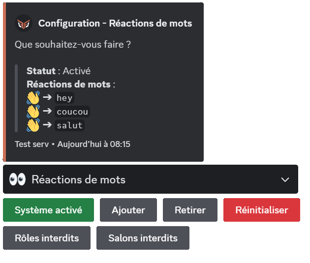
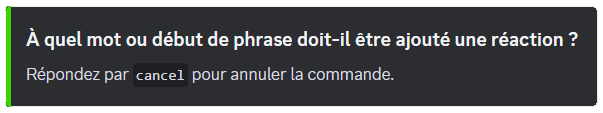
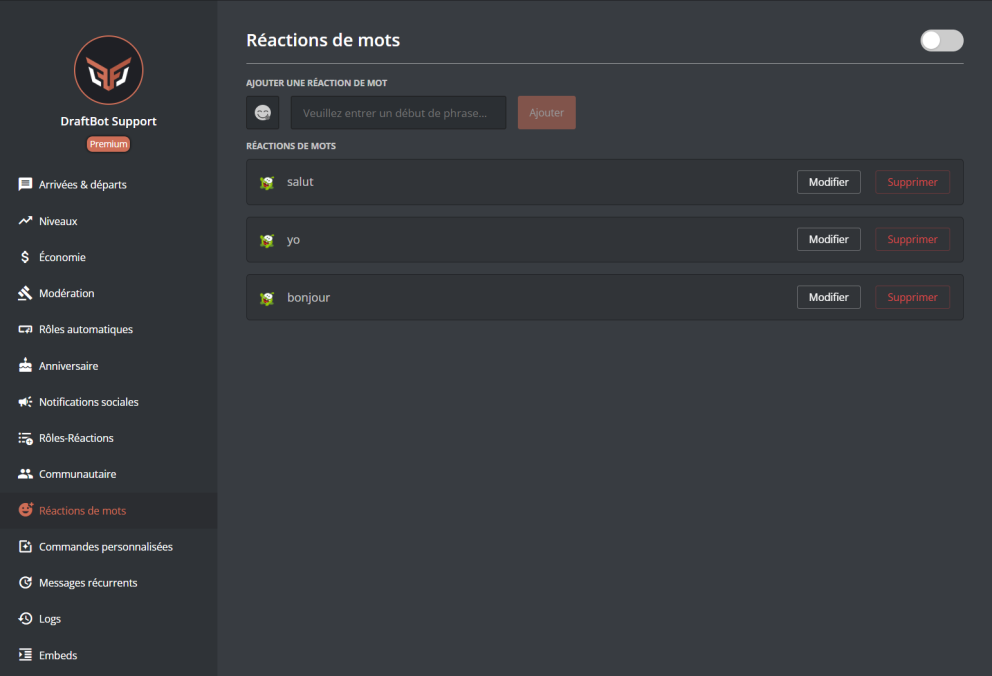

## À quoi sert-il ?

Le système de réactions de mots fait réagir **DraftBot** à des messages qui commencent par un mot prédéfini avec une réaction définie. Un aperçu du message est disponible ci-dessous :

::hint{ type="info" }
  Le bot ne réagira que lorsque le mot est en **début de phrase**.
::

## Configuration

::tabs
  ::tab{ label="Via la commande /config" }
    > Vous trouverez ci-dessous la configuration des réactions de mots avec la commande \</config>.

    ### Activer le système de réactions de mots

    

    Pour activer le système de réactions de mots, il faudra aller dans le système "👀 Réactions de mots" puis cliquer sur "Activer le système".

    ::hint{ type="info" }
      Pour désactiver le système, il suffira d'effectuer la même procédure : cliquer sur le bouton "Activer le système" qui sera devenu "Désactiver le système".
    ::

    ### Ajouter des réactions de mots

    Pour ajouter une réaction à un mot, il vous suffit de cliquer sur le bouton "Ajouter". Vous obtiendrez alors le message ci-dessous :

    

    ::hint{ type="warning" }
      Il n'est pas possible d'ajouter un émoji provenant d'un autre serveur.
    ::

    ### Supprimer des réactions de mots

    Si vous souhaitez supprimer une réaction en particulier, il vous suffira de cliquer sur le bouton "Retirer". Un sélecteur s'affichera et vous permettra de choisir la réaction de mot à supprimer.

    ### Lister les réactions de mots

    Vous pouvez voir les réactions de mots sur votre serveur depuis l'onglet de configuration des réactions de mots. Vous aurez alors une liste avec toutes vos réactions de mots.

    ### Restreindre les réactions

    Vous avez la possibilité de déterminer les rôles et/ou salons qui ne ferons pas réagir DraftBot <:draftbot:816002768971759636>

    ### Réinitialiser le système

    Si vous souhaitez supprimer **toutes** les réactions de mots, il suffira d'appuyer sur le bouton "Réinitialiser".

    ::hint{ type="danger" }
      Une réinitialisation est irréversible ! Une fois effectuée, elle remettra les trois réactions de mots par défaut, à savoir : "hey", "coucou" et "salut" avec la réaction "👋".
    ::
  ::

  ::tab{ label="Via le panel" }
    [⫸ Accéder au panel de **DraftBot**](/dashboard/first/words-reactions)

    

    ### Activer / Désactiver le système

    Vous pouvez activer ou désactiver la réaction de mot en haut à droite de la page grâce à un bouton.

    ### Ajouter une réaction de mot

    Vous pouvez ajouter une réaction de mot en mettant un **émoji** dans la case d'émoji et en mettant le mot concerné dans la case "Entrez un début de phrase". Vous pourrez alors "Ajouter" la réaction de mot.

    ::hint{ type="warning" }
      Il n'est pas possible d'ajouter un émoji provenant d'un autre serveur.
    ::

    ### Modifier une réaction de mot

    Pour modifier une réaction de mot, cliquez sur le bouton "Modifier" de la réaction de mot concernée. Les cases en haut se prérempliront : vous pourrez y modifier l'émoji et le mot. Il vous suffira de "Remplacer" pour que la modification soit prise en compte.

    ### Supprimer une réaction de mot

    Pour supprimer une réaction de mot, cliquez sur le bouton "Supprimer" de la réaction de mot concernée.

    ::hint{ type="info" }
      La suppression est irréversible, cela dit une validation de la suppression sera demandée.
      > Message en question : "Attention, vous avez des modifications non enregistrées".
    ::
  ::
::

## Informations supplémentaires

Si vous ne possédez pas le [premium](/premium), vous serez limité à 10 réactions de mots. En possédant le premium de **DraftBot**, vous pourrez créer des réactions de mots de manière illimitée.

Vous pouvez regarder le [comparatif entre version gratuite et premium](/premium#diff) ici.

