### Créer un ticket

Si vous rencontrez des difficultés et souhaitez en discuter avec le staff compétent, dans un salon confidentiel, vous pouvez ouvrir un ticket. Il y a deux méthodes pour ça :
- En utilisant la commande \</ticket>,
- En interagissant avec le bouton d'un message prévu à cet effet.

::tabs
  ::tab{ label="Via la commande /ticket" }

    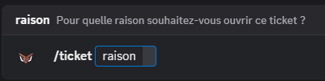
  ::

  ::tab{ label="Via un message dédié" }

    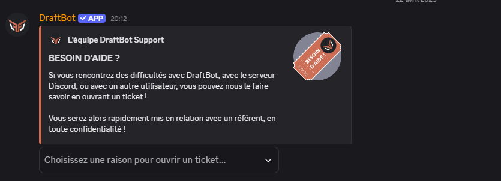
  ::
::

::hint{ type="info" }
  Lors de l'utilisation de la commande \</ticket>, la variable `raison` est facultative par défaut. Comme les gérants du serveur peuvent toutefois choisir de la rendre obligatoire, il est conseillé de toujours la remplir.
::

### Utiliser le ticket

Une fois votre ticket envoyé, un salon est créé par DraftBot pour que vous puissiez échanger avec les modérateurs les plus à même de pouvoir vous apporter l'aide dont vous avez besoin.

::hint{ type="info" }
  En dehors des administrateurs du serveur, l'équipe de modération et vous êtes les seuls habilités à accéder à ce salon.
::

Après que votre ticket a été créé, il peut y avoir un certain délai avant qu'un modérateur ne prenne contact avec vous. Soyez patients, et n'hésitez pas à commencer à expliquer la situation par avance !

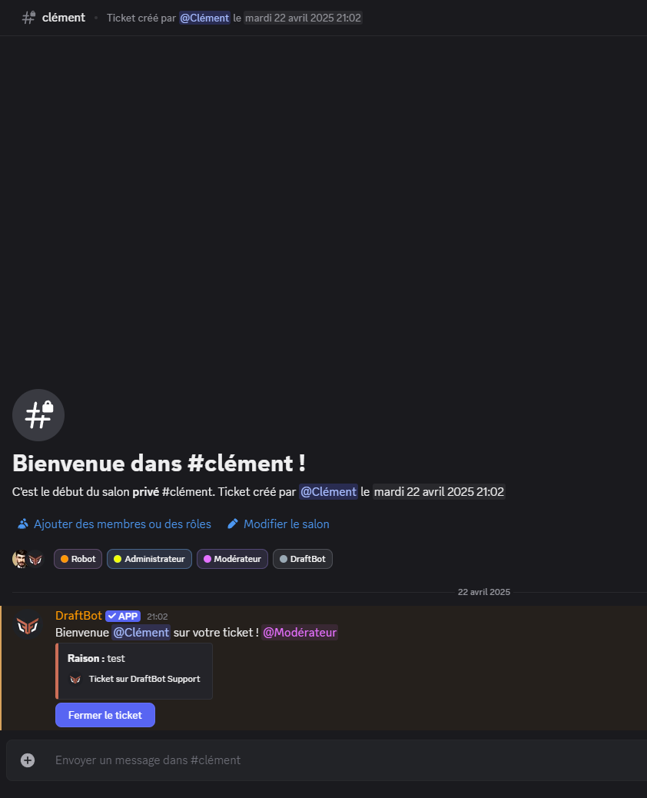

::hint{ type="info" }
  Certains serveurs configurent un système de validation des tickets. Dans ce cas, le salon est créé uniquement après que la demande d'ouverture de tickets a été validée par un modérateur.
::

### Clore un ticket

Une fois le sujet résolu, vous pouvez clôturer le ticket, ce qui, une fois que vous aurez confirmé ce choix, aura pour effet de fermer le salon que DraftBot avait ouvert pour l'occasion.

::hint{ type="info" }
  Un ticket ouvert peut être clôturé par un modérateur, ou par le membre qui l'a ouvert. Dans les deux cas, une confirmation sera demandée, ainsi qu'un motif de fermeture.
::

::hint{ type="info" }
  Notez que, sur les serveurs [premium](/premium) <:icon_premium_:1096140508625125417>, il est possible d'archiver automatiquement les tickets clôturés afin d'en garder trace.
::

### Modération des tickets

Les commandes suivantes offrent aux administrateurs et modérateurs de tickets un contrôle supplémentaire sur les accès d'un ticket :

::tabs
  ::tab{ label="Ouvrir un ticket" }
    La commande \</ticketmod ouvrir> permet d'ouvrir un ticket pour un membre dans un objectif de contact privé.

    Cela permet à un modérateur de créer un ticket pour un membre sans que ce dernier ne doive le faire lui-même.

    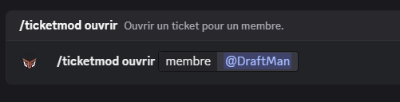
  ::

  ::tab{ label="Ajouter un accès" }
    La commande \</ticketmod ajouter> permet d'autoriser l'accès au contenu du ticket à un membre de votre choix.

    Cela permet à un modérateur d'accorder à un autre membre l'accès au salon de tickets. Cette commande peut se révéler utile dans le cas d'une résolution de conflits entre deux utilisateurs, par exemple.

    ::hint{ type="warning" }
      Si vous êtes modérateur de tickets, nous vous recommandons de prévenir le membre concerné par le ticket avant d'y inviter une autre personne, en particulier si des informations sensibles y ont été communiquées.
    ::

    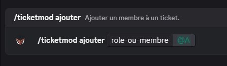
  ::

  ::tab{ label="Retirer un accès" }
    La commande \</ticketmod retirer> permet de retirer l'accès au contenu du ticket à un membre de votre choix.

    Cette fonctionnalité s'avère utile si un des membres, ou rôles, présents sur le ticket n'est pas concerné par celui-ci.

    ::hint{ type="info" }
      Vous ne pouvez pas retirer l'accès au ticket à un membre possédant les permissions d'administration, ou le rôle de modérateur de tickets.
    ::

    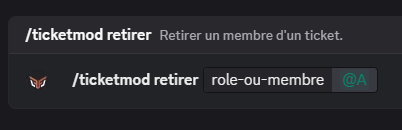
  ::
::

### Validation et Logs

Si un "Salon de validation de tickets & logs" a été configuré, il est possible de mettre en place sur le serveur un salon dans lequel apparaîtront toutes les notifications d'ouverture ou de fermeture de tickets.

En outre, si la fonction "Validation des tickets" est activée, c'est également dans ce salon que les modérateurs de tickets pourront valider (ou non) les demandes d'ouvertures de tickets.

::hint{ type="info" }
  La réception des demandes de tickets dans ce salon nécessite obligatoirement que les ouvertures de demandes soient configurées en mode **Manuel**.
::

## Configuration
Pour configurer le système de tickets, deux possibilités s'offrent à vous :
- Vous pouvez utiliser la commande \</config> puis cliquer dans la section "Tickets".
- Vous pouvez également vous rendre dans le [panel](/dashboard/first/tickets) en ligne.

::tabs
  ::tab{ label="Activation via /config" }
    Si le système n'est pas activé, le premier bouton sera gris et indiquera "Système désactivé".

    <:icon_arrows:1120818258883383307> Cliquer dessus activera alors le système.

    Une fois cela fait, le bouton deviendra vert et affichera "Système activé".

    <:icon_arrows:1120818258883383307> Cliquer à nouveau dessus aura pour effet de désactiver le système.

    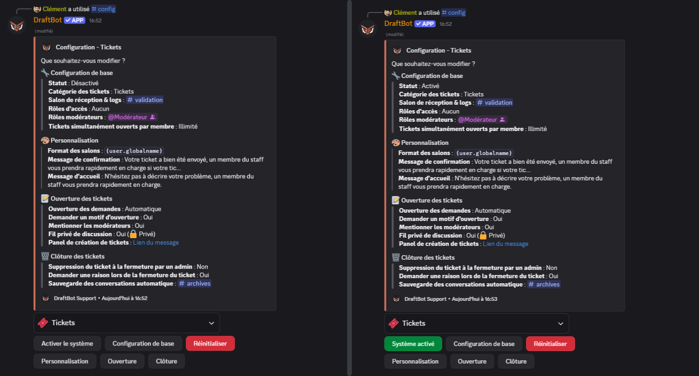

    ::hint{ type="info" }
      Si le module n'a jamais été configuré sur le serveur, seul un bouton "configurer le système" apparaîtra.
    ::

    ::collapse
      - Il vous sera alors demandé si vous souhaitez que l'ouverture des tickets s'effectue automatiquement, ou par validation manuelle.
      - Ensuite, vous devrez choisir si les utilisateurs seront obligés de saisir un motif d'ouverture de ticket ou non.
      - Il vous sera alors demandé si vous souhaitez affecter le système à une catégorie existante, ou laisser DraftBot en créer une pour vous
      - Vous pourrez ensuite définir, si vous le souhaitez, un salon de [logs/validation](#validation-et-logs)
    ::
  ::

  ::tab{ label="Activation via le panel" }
    [⫸ Accéder au panel de **DraftBot**](/dashboard/first/tickets)

    Depuis le panel DraftBot, vous pouvez activer le système de tickets en vous rendant dans la section "Tickets", et en cliquant sur le bouton pour le faire basculer en mode "on".

    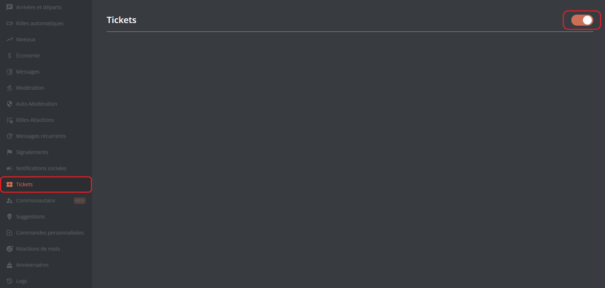

    Une fois le système activé, les options disponibles apparaissent comme ceci :
    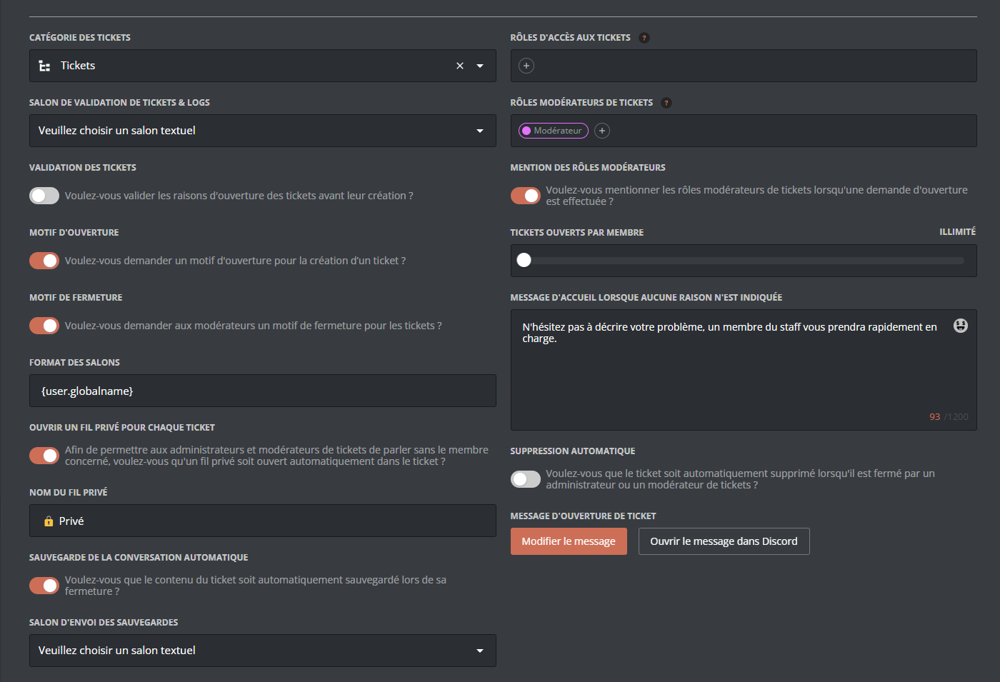
  ::
::

### Mise en fonction du module
Lorsque vous activez le système, plusieurs options

### Personnalisation

### Validation des tickets

### Message d'ouverture

### Motifs d'ouverture ou fermeture

### Fils privés

### Sauvegarde automatique

### Suppression automatique

### Rôles et mentions

### Restrictions

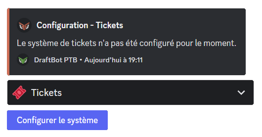

> **Catégorie** ➜ Permet de définir la catégorie de création des tickets. Vous pouvez demander à DraftBot de la créer automatiquement pour vous ou bien d'en utiliser une existante.

> **Salon de réception** ➜ Permet de définir le salon qui recevra les demandes d'ouverture de ticket. Si la validation est en mode **Automatique**, seul l'historique des fermetures et suppressions de ticket sera affiché dans ce salon. Vous pouvez demander à DraftBot de créer automatiquement le salon ou bien d'en utiliser un existant.

::hint{ type="info" }
  Le salon de réception des tickets se trouve par défaut dans la catégorie que vous avez indiquée, mais peut être déplacé dans une autre catégorie.
::

> **Supprimer le système** ➜ Permet de réinitialiser le système et revenir au bouton "Configurer le système".

::hint{ type="warning" }
  Cette action est irréversible, toute la configuration sera perdue.
::

> **Demande de confirmation** ➜ Permet de modifier le message de confirmation affiché lorsqu'un ticket est demandé (modifiable, uniquement, si la validation des tickets est en mode **Manuel**). Vous pouvez choisir la présentation "Par défaut" de DraftBot ou votre texte personnalisé en cliquant sur "Modifier".

> **Demande du motif d'ouverture** ➜ Permet d'obliger les membres à indiquer une raison d'ouverture du ticket. La raison fournie est indiquée dans le message d'accueil du ticket ainsi que sur la demande d'ouverture si la validation des tickets est en mode **Manuel**.

> **Message d'accueil** ➜ Permet de modifier la description du message d'accueil d'un ticket **uniquement** lorsqu'il a été ouvert via la commande \</ticketmod ouvrir>. Lorsqu'un ticket est ouvert via la commande \</ticket> la description du message d'accueil contient alors la raison indiquée par le membre.

> **Rôles modérateurs** ➜ Ajouter ou retirer des rôles n'ayant pas la permission "Administrateur" qui auront accès aux tickets. Plusieurs rôles peuvent être ajoutés.

> **Mentionner les modérateurs** ➜ Activer/désactiver la mention automatique des rôles indiqués comme rôles modérateurs à chaque nouveau ticket ouvert. Si cette option est activée, tous les rôles modérateurs seront mentionnés, il n'est actuellement pas possible de choisir les rôles à mentionner parmi la liste des rôles modérateurs.

> **Suppression admin** ➜ Les tickets sont directement supprimés si un administrateur de serveur ferme un ticket.

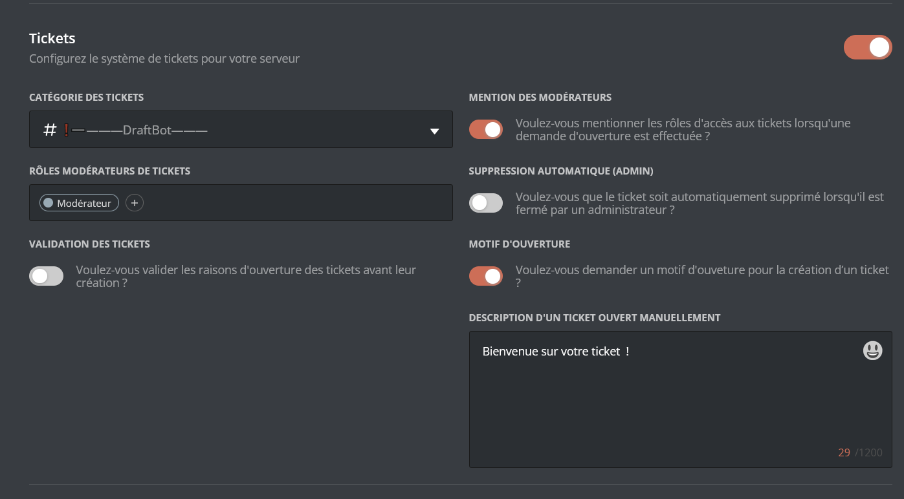

Sur le panel, dans la catégorie **Communautaire**, vous retrouverez sur la partie des **Tickets**, les mêmes possibilités de configuration qu'avec les commandes Slash sur Discord. Le message d'ouverture sera prochainement configurable sur le panel.

> ⚠️ Une fois vos modifications effectuées, n'oubliez pas d'enregistrer avec le bouton "Enregistrer" situé en bas de la page.

- **Catégorie des tickets** ➜ Permet de définir la catégorie de création des tickets. La catégorie doit avoir été préalablement créée. Pensez à actualiser la page du panel si vous avez créé une catégorie entre-temps.

- **Mention des modérateurs** ➜ Permet d'activer la mention automatique des modérateurs lors de l'ouverture d'un ticket.

- **Rôles modérateurs de tickets** ➜ Ajouter ou retirer des rôles n'ayant pas la permission Administrateur qui auront accès aux tickets. Plusieurs rôles peuvent être ajoutés.

- **Suppression automatique (admin)** ➜ Lorsque cette option est activée, les tickets sont directement supprimés si un administrateur ferme un ticket.

- **Validation des tickets** ➜ Lorsque la validation est activée, les demandes de tickets sont transférées dans le **salon de réception** et doivent être acceptées/refusées par les **modérateurs de tickets** ou administrateurs.

- **Motif d'ouverture** ➜ Permet d'astreindre ou non les membres à spécifier un motif d'ouverture du ticket lors de l'utilisation de \</ticket>. Son activation est conseillée afin d'éviter les abus de création de tickets ou les demandes sans raison particulière.

### Message d'ouverture

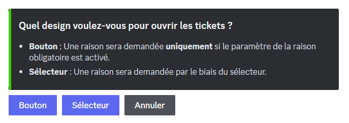

Le message d'ouverture permet aux membres de sélectionner une raison d'ouverture prédéfinie à partir d'un bouton ou sélecteur pour demander un ticket. Il peut être utilisé comme alternative ou complément de la commande \</ticket>.
Lors de sa première configuration, depuis la commande \</config> dans la section **Tickets** puis en cliquant sur "Message d'ouverture", vous devrez sélectionner le type de message d'ouverture souhaité :

- **Bouton** ➜ Une seule raison d'ouverture qui se présentera sur le texte du bouton sera configurable via ce mode.

- **Sélecteur** ➜ Ce mode permet d'ajouter plusieurs raisons d'ouverture de tickets. En suivant les instructions et questions posées par le bot, vous aurez la possibilité de personnaliser le nom des raisons, leurs émojis associés et descriptions.

::hint{ type="info" }
  Vous pouvez vous servir d'un message préalablement créé depuis l'Embed Creator sur le panel en cliquant sur "Message existant" sur la question posée après sélection du type de message d'ouverture pour personnaliser à votre guise l'embed de présentation ou via la commande \</envoyer>.
::

