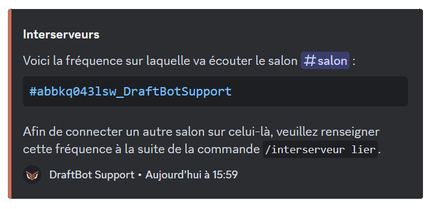
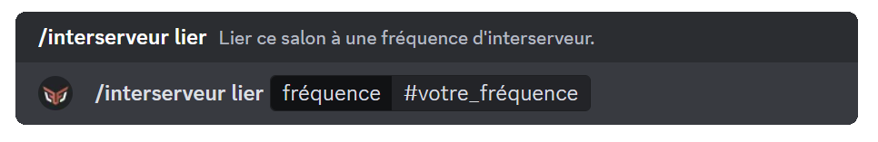

La fonctionnalité d'interserveurs permet à deux salons distincts de communiquer grâce à la simulation créée par DraftBot qui, prenant l'apparence de l'utilisateur, transmet les messages dans les salons connectés au vôtre.

## Les commandes

**Trois commandes sont à disposition pour gérer vos liaisons de salon :**

> \</interserveur générer> ➜ Générer une fréquence pour un interserveur.
>
> \</interserveur lier> ➜ Lier ce salon à une fréquence d'interserveur.
>
> \</interserveur gérer> ➜ Gérer la liaison interserveur du salon.

## Configurer l'interserveur

- Pour lier deux salons, il vous faut tout d'abord créer une fréquence, cette dernière est unique à chaque salon.

- Pour créer une fréquence, utilisez la commande \</interserveur générer>.

## Relier deux salons

Une fois la fréquence créée, utilisez la commande \</interserveur lier> dans le salon que vous souhaitez relier au premier.

::hint{ type="info" }
  Vous ne pouvez pas lier deux salons du même serveur.
::

::hint{ type="info" }
  Vous pouvez retrouver la fréquence configurée pour un salon en utilisant la commande \</interserveur gérer> dans le salon correspondant.
::

::hint{ type="warning" }
  Un cooldown est présent sur l'envoi des messages, il a été mis en place par sécurité afin d'éviter des abus.
::

::hint{ type="success" }
  **Félicitations !** L'interserveur est maintenant configuré sur votre serveur !
::

