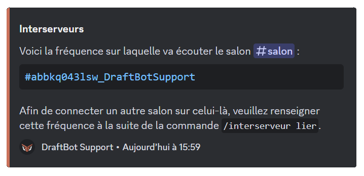
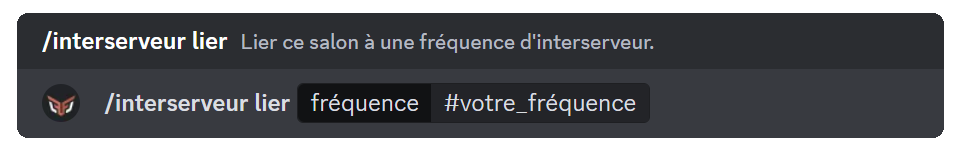

## Commandes disponibles

DraftBot met à votre disposition **trois commandes principales** pour gérer vos interserveurs.

### /interserveur générer

La commande \</interserveur générer> [crée une **fréquence unique**](#créer-une-fréquence) pour votre salon.

::hint{ type="info" }
  Chaque fréquence est propre à un salon et ne peut pas être dupliquée.
::

### /interserveur lier

Une fois la fréquence créée, utilisez \</interserveur lier> dans le **deuxième salon** que vous souhaitez relier au premier.

::hint{ type="info" }
  Les messages envoyés dans un salon seront automatiquement répliqués dans l'autre salon via DraftBot.
::

### /interserveur gérer

La commande \</interserveur gérer> permet de **consulter la fréquence** d'un salon ou de modifier sa liaison existante.

::hint{ type="info" }
  Cette commande est utile pour vérifier vos configurations ou retrouver une fréquence existante.
::

## Configurer un interserveur

Voici le processus étape par étape pour relier deux salons distincts.

### Créer une fréquence

- Utilisez \</interserveur générer> dans le **premier salon**.
- Une fréquence unique sera créée et affichée par DraftBot.

::hint{ type="success" }
  **Félicitations !** La fréquence est prête, vous pouvez maintenant relier un second salon !
::

### Relier un deuxième salon

- Dans le salon que vous souhaitez connecter, utilisez \</interserveur lier>.
- Indiquez la **fréquence du premier salon** pour établir la liaison.

::hint{ type="info" }
  Les messages envoyés dans un salon sont automatiquement répliqués dans l'autre salon via DraftBot.
::

### Vérifier ou gérer la liaison

- Utilisez \</interserveur gérer> pour consulter la fréquence ou modifier la connexion.
- Toutes les informations sur la liaison seront affichées.

::hint{ type="success" }
  **Félicitations !** L'interserveur est maintenant configuré sur votre serveur !
::

## Informations complémentaires

::hint{ type="info" }
  Vous ne pouvez pas lier deux salons du **même serveur**.
::

::hint{ type="info" }
  Vous pouvez configurer jusqu'à **1** interserveur. Les serveurs [premium](/premium) <:icon_premium_:1096140508625125417> n'ont pas de limite.
::

::hint{ type="warning" }
  Un cooldown est présent sur l'envoi des messages, il a été mis en place par sécurité afin d'éviter des abus.
::