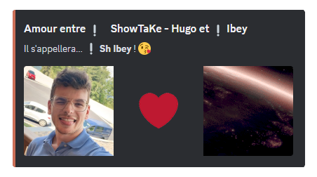
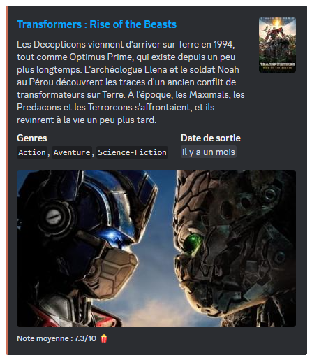

## Jeux

### /bingo

::card
---
title: Bingo
icon: twemoji:bullseye
to: /docs/modules/bingo
target: _blank
color: '#dd2e44'
---
  Organisez des parties de bingo captivantes où vos membres doivent deviner un nombre secret !
::

### /chifumi

La commande \</chifumi> vous permet d'accéder à ce jeu à **deux joueurs**. Il s'agit d'une adaptation du classique **Pierre-Feuille-Ciseaux**, c'est un face-à-face dont les joueurs choisissent entre ces trois coups.

Le déroulement du jeu :

- **La pierre** bat **les ciseaux** (en les émoussant).
- **Les ciseaux** battent **la feuille** (en la coupant).
- **La feuille** bat **la pierre** (en l'enveloppant).

Vous pouvez jouer à ce jeu avec la personne de **votre choix**, de façon **aléatoire**, ou avec **DraftBot**.

::hint{ type="info" }
  Vous avez la possibilité de choisir le mode de difficulté : "Facile", "Normale" ou "Difficile". En fonction de votre choix, DraftBot sera plus compliqué à vaincre.
::

::hint{ type="info" }
  Vous pouvez également choisir le nombre de tours que vous souhaitez (1 à 7 tours).
::

### /morpion

La commande \</morpion> vous permet d'accéder à ce jeu à **deux joueurs**. C'est un jeu de réflexion qui a pour but d'aligner avant son adversaire **3 symboles identiques** horizontalement, verticalement ou en diagonale. Chaque joueur à son propre symbole, une croix pour l'un, un cercle pour l'autre.

Vous pouvez jouer à ce jeu avec la personne de **votre choix**, de façon **aléatoire**, ou avec **DraftBot**.

::hint{ type="info" }
  Vous avez la possibilité de choisir le mode de difficulté : "Facile", "Normale" ou "Difficile". En fonction de votre choix, DraftBot sera plus compliqué à vaincre.
::

### /pendu

La commande \</pendu> vous permet d'accéder à ce jeu de réflexion **d'un seul joueur**. Le but est de deviner quelles sont les lettres qui composent le **mot secret**.

En cas d'erreur, **un petit bonhomme** se dessine petit à petit et s'il est complété, cela signifiera que vous êtes pendu et que vous avez perdu.

::hint{ type="info" }
  Même si le jeu est pour un seul joueur, d'autres membres peuvent vous aider à trouver le mot secret.
::

### /puissance4

La commande \</puissance4> vous permet d'accéder à ce jeu à **deux joueurs**. Il s'agit d'un jeu de stratégie qui a pour but d'aligner **une suite de 4 pions** de la même couleur sur une grille comptant 6 rangées et 7 colonnes. À tour de rôle, les deux joueurs placent un pion dans la colonne de leur choix.

Vous pouvez jouer à ce jeu avec le membre de **votre choix**, de façon **aléatoire**, ou avec **DraftBot**.

::hint{ type="info" }
  Vous avez la possibilité de choisir le mode de difficulté : "Facile", "Normale" ou "Difficile". En fonction de votre choix, DraftBot sera plus compliqué à vaincre.
::

### /demineur

La commande \</demineur> vous permet d'accéder à ce jeu de réflexion **d'un seul joueur**. Le but est de localiser des mines cachées dans une grille représentant un champ de mines virtuel.

Il donne au joueur des indices basés sur **la numérotation** des mines voisines dans chaque champ.

::hint{ type="info" }
  Vous avez la possibilité de choisir le mode de difficulté : "Facile", "Normale" ou "Difficile". En fonction de votre choix, la grille s'agrandira.
::

### /colormind

La commande \</colormind> vous permet d'accéder à ce jeu de logique pour **un seul joueur**. Il est l'équivalent du jeu **Mastermind**, le but consiste à trouver la bonne combinaison de couleur.

::hint{ type="info" }
  Vous avez la possibilité de choisir le mode de difficulté : "Facile", "Normale" ou "Difficile". En fonction de votre choix, le nombre de couleurs à trouver augmentera.
::

::hint{ type="info" }
  Il se peut qu'il y ait plusieurs fois la même couleur dans une combinaison.
::

## Utilitaires

### /sondage

Vous avez trois types de commandes avec la commande \</sondage> :

- \</sondage créer> ➜ Créer et lancer un sondage.
- \</sondage résultats> ➜ Voir les résultats d'un sondage.
- \</sondage terminer> ➜ Mettre fin à un sondage.

Lors de la création du sondage avec la commande \</sondage créer>, vous allez devoir définir **la question** du sondage, ainsi que les **différentes réponses** (10 réponses max). Pour insérer les réponses, vous devrez les mettre entre **guillemets** si elles contiennent des espaces.

Vous pouvez aussi, si vous le souhaitez, définir la durée du sondage et choisir le salon dans lequel il sera lancé.

Pour la durée, **DraftBot** accepte 3 formats différents :

| Formats | Description | Exemple |
|---------|-------------|---------|
| `m` | Le sondage durera x minutes | 30m |
| `h` | Le sondage durera x heures | 4h |
| `j` | Le sondage durera x jours | 7j |

### /evenement

Vous avez trois types de commandes avec la commande \</evenement> :

- \</evenement créer> ➜ Créer et lancer un évènement.
- \</evenement relancer> ➜ Relancer un évènement.
- \</evenement terminer> ➜ Mettre fin à un évènement.

Avec la commande \</evenement créer>, vous allez avoir besoin de définir **un nom** à votre évènement, le **nombre maximum** de participants, ainsi que **le temps** pour savoir quand commencera l'évènement.

Pour participer, les membres devront cliquer sur **la réaction** qui apparaîtra.

::hint{ type="info" }
  Vous avez la possibilité, si vous le souhaitez, de définir un rôle que vos membres recevront à la fin de l'évènement afin de prouver leur participation et de choisir le salon où l'évènement sera lancé.
::

### /couple

La commande \</couple> vous permet tout simplement de **créer un couple** sur votre serveur. DraftBot récupéra les avatars du **"Roméo"** et de la **"Juliette"** choisi, et il donnera par la même occasion un nom au couple défini.

### /blague

La commande \</blague> vous permet d'accéder à différents types de **blagues** disponibles sur [Blagues API](https://www.blagues-api.fr/) qui est une API rassemblant les **meilleures blagues françaises**. Les réponses des blagues seront cachées, il vous suffira de cliquer sur la zone cachée pour que les réponses vous soient révélées.

Les différents types de blagues :

- Aléatoire.
- Tout public.
- Humour noir.
- Développeur.
- 18+.
- Beauf.
- Blondes.

::hint{ type="info" }
  Vous avez la possibilité de gérer les types de blagues afin de les autoriser ou non sur votre serveur.
::

### /lancer-dés

La commande \</lancer-dés> vous permet d'effectuer un lancer de dés. Indiquez le nombre de dés (X) et le nombre de faces (Y), séparés par la lettre « d » (Ex : XdY ➜ 1d10).

- Vous pouvez ajouter un modificateur (Z) (`+`, `-` ou `x`) (Ex : 1d10 **+5**).
- Vous pouvez compléter avec des options : `-H` pour garder que le plus haut ou `-L` pour le plus bas (Ex : 3d10+5 **-L**).

::hint{ type="info" }
  Le nombre de dés ne peut pas dépasser 100.
::

### /tv

La commande \</tv> vous permet d'accéder à des informations sur **un film ou une série** disponible sur le site [The Movie Database](https://www.themoviedb.org/) (TMDB). Ainsi, il vous suffira de définir le nom du film ou de la série que vous recherchez à la suite de la commande.

Vous recevrez les informations suivantes :

- Le titre du film ou de la série.
- Le synopsis.
- Le(s) genre(s).
- La date de sortie.
- La note moyenne donnée par les utilisateurs.

