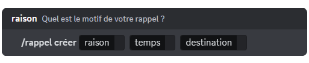

## Créer un rappel

Pour créer un rappel, vous devez effectuer la commande \</rappel créer>. DraftBot vous proposera ces champs :

- **La raison** : afin de connaître le motif de votre rappel.
- **Le temps** : dans combien de temps souhaitez-vous recevoir votre rappel.
- **La destination** : où souhaitez-vous le recevoir, entre vos messages privés ou dans le salon où le rappel a été créé.

::hint{ type="warning" }
  Vous pouvez créer jusqu'à 3 rappels en simultané. Les serveurs [premium](/premium) <:icon_premium_:1096140508625125417> peuvent en avoir jusqu'à 10 simultanément.
::

::hint{ type="warning" }
  Attention, les rappels doivent être inférieurs ou égaux à 3 mois.
::

::hint{ type="success" }
  🎉 Félicitations, vous avez créé un rappel ! Vous serez mentionné sur votre serveur par DraftBot ou averti dans vos messages privés le moment venu.
::

## Modifier un rappel

Vous pouvez modifier un rappel à tout moment, même s'il est déjà en cours, avec l'aide de la commande \</rappel modifier>. Vous n'aurez qu'à sélectionner le rappel que vous souhaitez modifier et choisir une nouvelle raison, un nouveau délai ainsi qu'une autre destination.

## Supprimer un rappel

Pour supprimer un rappel en cours, vous devez effectuer la commande \</rappel supprimer> et sélectionner le rappel que vous souhaitez retirer de la liste.

## Voir la liste des rappels

Il est possible de voir la liste des rappels avec la commande \</rappel liste>. Vous aurez un récapitulatif de tous les rappels en cours, classés en fonction de leur durée.
