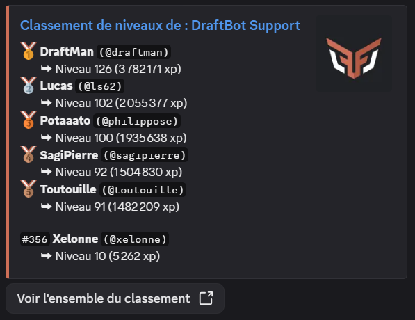
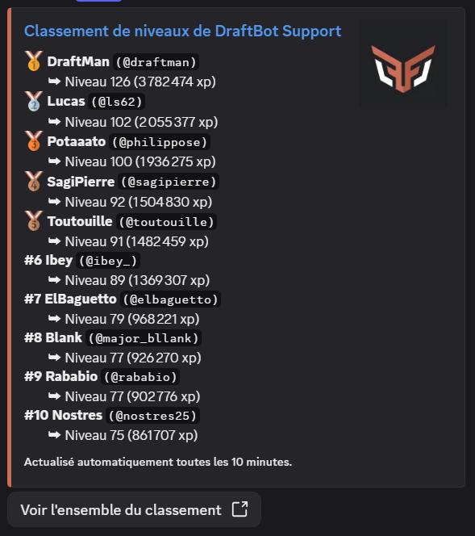
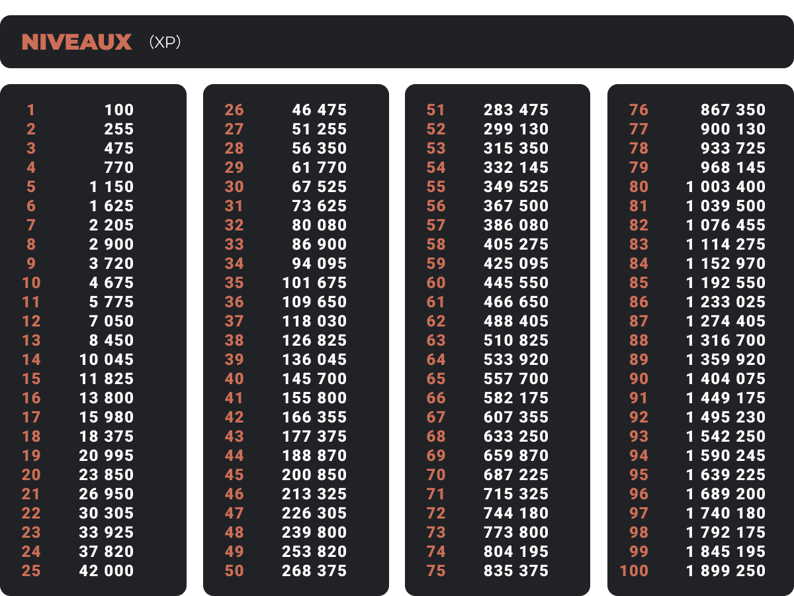
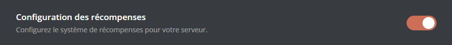

## Consulter votre niveau

Pour consulter votre progression personnelle, utilisez la commande \</niveau>.

::hint{ type="info" }
  Pour consulter la progression d'un autre membre, ajoutez simplement sa mention en argument de la commande \</niveau>.
::

## Récompenses de niveau

Pour consulter les récompenses mises à disposition par le serveur lors du passage de certains niveaux, utilisez la commande \</recompenses>.

Il peut s'agir de rôles (temporaires ou non), d'argent du [système d'économie](/docs/modules/economie), d'[objets d'inventaire](/docs/modules/inventaire), et même de récompenses personnalisées !

## Classement des membres

Vous pouvez afficher le classement des membres, du plus haut au plus bas niveau, de trois façons :

### Commande /topniveau

Vous pouvez afficher le classement via la commande \</topniveau>.

::hint{ type="success" }
  Si vous souhaitez afficher un nombre spécifique de lignes (seulement le top 3 par exemple), vous pouvez ajouter ce nombre en argument de la commande \</topniveau>.
::

### Classement en ligne

Si vous avez activé le [**classement en ligne**](#fonctionnalités-disponibles), vous pouvez le consulter depuis le bouton **"Voir l'ensemble du classement"** de la commande \</topniveau>.

::hint{ type="info" }
  Si vous êtes administrateur du serveur, vous pouvez également y accéder depuis le [**panel**](/dashboard/first/levels) dans le module **Niveaux** via le bouton **"Accéder au classement"**.
::

### Classement en temps réel

Pour les serveurs [premium](/premium), il est possible de mettre un place dans un salon dédié un classement des membres en temps réel et mis à jour automatiquement.

::hint{ type="success" }
  L'avantage de cette fonctionnalité est que le message affichant le classement peut afficher jusqu'à 25 membres et sera réactualisé toutes les 10 minutes automatiquement, sauf s'il n'y a pas de changements !
::

## Gérer les niveaux des membres

- \</dropxp>                : Crée un message qui offre de l'expérience au premier qui clique sur le bouton.
- \</adminxp ajouter>       : Ajouter de l'expérience à un membre.
- \</adminxp retirer>       : Retirer de l'expérience à un membre.
- \</adminxp réinitialiser> : Réinitialiser les niveaux de tout le serveur.
- \</adminxp définir>       : Définir l'expérience d'un membre.
- \</adminxp transférer>    : Transférer de l'expérience d'un membre à un autre.

::hint{ type="info" }
  Les commandes admin ne peuvent être utilisées que par les membres de votre serveur possédant les permissions administrateur.
::

## Gain d'expérience

L'expérience peut être gagnée de diverses manières, la plus répandue étant la **participation écrite** dans le serveur. Chaque message dans une fenêtre de 30 secondes rapporte une quantité d'expérience comprise entre deux valeurs configurées (15 à 25xp par défaut).

Grâce à l'**écosystème** de DraftBot, il vous sera possible de faire gagner de l'expérience aux membres de plusieurs autres manières : Giveaways, Boutique, Cadeaux d'anniversaires, Drop d'expérience dans les salons et Calendrier de l'avent.

Les serveurs [premium](/premium) pourront profiter d'un gain d'expérience en fonction de l'**activité vocale** : Chaque membre en vocal considéré comme actif, gagnera une quantité d'expérience comprise entre deux valeurs configurées (15 à 25xp par défaut) toutes les 2 minutes.

::hint{ type="info" }
  Le gain d'**expérience en vocal** est soumis à plusieurs conditions :
  - L'utilisateur ne doit pas être muet ou en sourdine (ni auto-sourdine, ni sourdine serveur).
  - Le salon ne doit pas être un salon de conférence ou un salon configuré comme AFK (configuration Discord).
  - Au moins 2 utilisateurs humains doivent être présents (non muet ou en sourdine) dans le même salon vocal.
::

Afin de gérer votre serveur avec granularité, il vous sera possible de bloquer/booster le gain d'expérience en fonction de conditions et dans d'autres cas plus avancés de le réinitialiser. Retrouvez l'ensemble des options avancées ci-dessous :

| **NOM** | **EXPLICATION** |  |
|---------|-----------------|--|
| **Rôles avec/sans gain d'expérience** | Restreindre le gain d'expérience à certains rôles |  |
| **Salons avec/sans gain d'expérience** | Restreindre le gain d'expérience à certains salons |  |
| **Rôles boosters** | Régler des multiplicateurs d'XP pour certains rôles |  |
| **Salons boosters** | Régler des multiplicateurs de gains pour certains salons |  |
| **Niveau Maximum** | Définir un niveau maximum | <:icon_premium:1096140508625125417> |
| **Gain d'expérience dans les fils de discussions** | Autoriser ou non les membres à gagner de l'expérience dans les fils |  |
| **Réinitialisation de l'expérience** | Définir si le niveau des membres est réinitialisé lorsqu'ils quittent le serveur |  |
| **Gain d'expérience par message en vocal** | Définir si les messages textuels envoyés dans les salons vocaux rapportent de l'expérience ou non |  |
| **Longs messages comptent double** | Définir si les longs messages donnent le double de points (250 caractères par défaut) |  |

::hint{ type="info" }
  Vous trouverez ci-dessous le nombre exact d’expériences nécessaires pour passer au niveau supérieur.

  
::

## Annonces de niveaux

Chaque palier ne devrait pas passer inaperçu, c'est pour cela qu'il vous est possible de configurer des annonces lorsqu'un utilisateur passe un niveau.

Conditionnées par un niveau minimum, les annonces seront envoyées dans un salon spécifique pour ne pas déranger la conversation ou directement dans le salon actif afin de donner de permettre à tout le monde de fêter ce gain de niveau.

## Configurer le système d'expérience

::tabs
  ::tab{ label="Depuis le panel" }

    [⫸ Accéder au panel de **DraftBot**](/dashboard/first/levels)

    Pour activer le module, la première étape est de cliquer sur ce bouton :

    

    Ensuite, l'ensemble des [fonctionnalités](#fonctionnalités-disponibles) apparaît :

    

    ::hint{type="warning"}
      Une fois vos modifications terminées, n'oubliez pas d'enregistrer vos modifications avec le bouton "Enregistrer" situé en bas de page !
    ::
  ::

  ::tab{ label="Via la commande /config" }

    Si vous souhaitez effectuer toute la configuration directement depuis Discord, vous pouvez le faire via la commande \</config>, puis en vous rendant dans l'onglet "Niveaux". Le menu ressemble alors à ceci :

    

    Le corps du **message** vous permet de consulter en un coup d'œil l'**état actuel** de votre système de niveaux, tandis que les **boutons** situés au-dessous vous permettent d'en **modifier la configuration**.

    ::collapse{ label="Statut" }
      Ce menu vous permet de :
      - Activer / Désactiver le système de niveaux ;
      - Activer / Désactiver le classement en ligne ;
      - Activer / Désactiver le classement sur Discord (<:icon_premium:1096140508625125417>).

      

      ::hint{ type="success" }
        Lorsque vous activez le classement sur Discord, vous avez le choix entre utiliser un salon existant ou laisser DraftBot en créer un pour vous. Vous pouvez même définir le nombre de lignes du classement à afficher !
      ::
    ::

    ::collapse{ label="Expérience" }
      Ce menu vous permet de :
      - Activer / Désactiver / Régler l'expérience reçue à chaque message ;
      - Activer / Désactiver / Régler l'expérience reçue en vocal (<:icon_premium:1096140508625125417>) ;
      - Activer / Désactiver le gain d'expérience dans les fils ;
      - Activer / Désactiver le gain d'expérience par message en vocal ;
      - Activer / Désactiver/ Régler le double xp pour les messages longs ;
      - Choisir si le niveau des membres quittant le serveur est remis à 0.

      
    ::

    ::collapse{ label="Récompenses de niveaux" }
      Ce menu vous permet de configurer les récompenses de niveau, vous pouvez ainsi :
      - Créer / Modifier / Supprimer une [récompense](#recompenses) ;
      - Réinitialiser les récompenses.

      
    ::

    ::collapse{ label="Annonces" }
      Ce menu sert à configurer les annonces de changement de niveau et de récompenses. Vous pouvez :
      - Configurer les annonces de changement de niveau :
          - Activer / Désactiver les annonces ;
          - Choisir le salon où faire les annonces ;
          - Configurer un niveau minimum pour les annonces ;
          - Personnaliser le message d'annonce.
      - Configurer les annonces d'obtention de récompenses :
          - Activer / Désactiver les annonces ;
          - Choisir le salon où faire les annonces ;
          - Personnaliser le message d'annonce.

      
    ::

    ::collapse{ label="Limitations & Boosts" }
      Ce menu sert à configurer des gains différents en fonction du rôle d'un membre ou du salon dans lequel il poste un message. Vous pouvez définir :
      - Pour quels rôles activer/désactiver le gain d'xp,
      - dans quels salons activer/désactiver le gain d'xp,
      - à quels rôles appliquer un multiplicateur (de x1.5 à x3),
      - à quels salons appliquer un multiplicateur (de x1.5 à x3).

      
    ::

    ::collapse{ label="Personnalisation" }
      Ce menu propose des personnalisations exclusives réservées aux serveurs [<:icon_premium:1096140508625125417> Premium](/premium) :
      - Définir un niveau maximum,
      - personnaliser la couleur de l'interface des niveaux (par défaut : orange).

      
    ::

    ::hint{ type="info" }
      Les fonctionnalités accompagnées du symbole <:icon_premium:1096140508625125417> sont réservées aux <:icon_premium:1096140508625125417>[serveurs premium](/premium) !
    ::
  ::
::

### Configurer les récompenses

La configuration de base des récompenses se fait comme ceci :

::tabs
  ::tab{ label="Depuis le panel" }

    [⫸ Accéder au panel de **DraftBot**](/dashboard/first/levels)

    Pour activer les récompenses depuis le [**Panel**](/dashboard/first/levels), il faut tout d'abord activer l'interrupteur situé en face de "Configuration des récompenses" :

    

    Ensuite, deux options s'offrent à vous :

    

    1. **Créer une récompense** : cette option permet de créer et assigner des récompenses aux passages de niveaux de votre choix. *(Apprenez à [créer une récompense](#creer_une_recompense) ! )*

    2. **Configurer les annonces** : Vous pouvez décider d'activer ou désactiver les annonces, choisir le salon dans lequel elles doivent apparaître, et même personnaliser le message !

    ::collapse{ label="Voir comment configurer les annonces :" }
      Vous pouvez :
      - Choisir si l'annonce doit être envoyée dans le salon actif, ou dans un salon dédié ;
          - Créer ou sélectionner un salon dédié ;
      - Personnaliser le message d'annonce.

      
    ::

    ::hint{ type="success" }
      Si vous avez déjà configuré des [articles de boutique](/docs/modules/economie#articles-de-boutique), ils apparaîtront en bas de l'écran, et vous pourrez les modifier / supprimer.
    ::
  ::

  ::tab{ label="Via la commande /config" }
    Via la commande \</config>, cliquez sur le bouton "Récompenses de niveaux". Un menu permettant de configurer les récompenses s'affiche alors, il permet de  :

    - Créer / Modifier / Supprimer une [récompense](#creer_une_recompense) ;
    - Réinitialiser les récompenses.

    
  ::
::

### Créer une récompense

DraftBot vous permet de récompenser l'activité de vos membres à travers des items de types variables :

::tabs
  ::tab{ label="Rôle" }
    Vous pouvez permettre à vos membres d'acquérir des rôles (temporaires ou permanents) lorsqu'ils atteignent un niveau défini. Pour ajouter un rôle aux récompenses, sélectionnez le type de récompense **"rôle"** ou **"rôle temporaire"**.

    Choisissez ensuite :
    - Le niveau requis ;
    - Le rôle à attribuer ;
    - La durée du rôle *(dans le cas d'un rôle temporaire)*.

    ::hint{ type="warning" }
      Le rôle sélectionné doit avoir été créé au préalable sur votre serveur, et être accessible à DraftBot (donc ne pas être situé plus haut que le rôle le plus élevé de DraftBot).
    ::
  ::

  ::tab{ label="Argent" }
    Si le [système d'économie](/docs/modules/economie) est activé, vous pouvez permettre à vos membres d'obtenir de l'argent de serveur pour récompenser leur montée de niveau. Pour ajouter une somme d'argent à la boutique, sélectionnez le type de récompense **"De l'argent"**.

    Choisissez ensuite :
    - Le niveau requis ;
    - La somme d'argent à accorder.
  ::

  ::tab{ label="Objet Inventaire" }
    Vous pouvez créer des objets fictifs à ajouter à l'inventaire. Pour offrir des objets d'inventaire en récompense au passage d'un niveau, sélectionnez le type de récompense **"Un objet d'inventaire"**.

    Choisissez ensuite :
    - Le niveau requis ;
    - L'objet à accorder ;
    - Le nombre de cet objet devant être donné.

    ::hint{ type="info" }
      Si vous n'avez pas encore d'objets en boutique, vous pouvez en [créer directement](#creer-des-objets-d-inventaire) !
    ::
  ::

  ::tab{ label="Article Personnalisé" }
    Si vous souhaitez permettre à vos membres d'acquérir d'autres articles, comme par exemple des codes promotionnels, des clés d'activation numériques, ou bien des objets "réels", DraftBot a la solution !

    Pour ajouter un article personnalisé aux récompenses, sélectionnez le type d'article **"Un article personnalisé"**.

    Choisissez ensuite :
    - Le niveau requis ;
    - Le nom de l'article.

    ::hint{ type="success" }
      Lorsqu'un membre gagnera cet item, vous serez notifié par DraftBot dans vos messages privés, et vous pourrez ainsi lui remettre "en main propre".
    ::
  ::
::

::hint{ type="info" }
  Vous pouvez mettre en place jusqu'à 10 récompenses de niveaux. Les serveurs [premium](/premium) n'ont aucune limite !
::

## Migration depuis MEE6

Si vous utilisiez déjà un système de niveaux via MEE6, vous avez la possibilité d'importer la progression de vos membres au système de niveaux de DraftBot !

Après avoir cliqué sur **Importer MEE6**, et confirmé que vous souhaitez procéder à l'importation, DraftBot récupèrera automatiquement toutes les informations de niveaux des membres.

::hint{ type="warning" }
  Assurez-vous que MEE6 est présent sur votre serveur et que son classement est accessible publiquement !
::

