## Consulter votre niveau

Pour consulter votre progression personnelle, utilisez la commande \</niveau>.

::hint{ type="info" }
  Pour consulter la progression d'un autre membre, ajoutez simplement sa mention en argument de la commande \</niveau>.
::

## Récompenses de niveau

Motivez vos membres en leur offrant des récompenses lorsqu'ils atteignent certains niveaux ! Pour consulter les récompenses disponibles sur votre serveur, utilisez la commande \</recompenses>.

| Type | Description | Exemple |
|------|-------------|---------|
| **Rôle permanent** | Attribution d'un rôle Discord définitif | Rôle "Actif" au niveau 10 |
| **Rôle temporaire** | Attribution d'un rôle pour une durée limitée | Rôle "VIP 7 jours" au niveau 20 |
| **Argent** | De l'argent du [système d'économie](/docs/modules/economie) | 5000 pièces au niveau 15 |
| **Objet d'inventaire** | Un ou plusieurs [objets d'inventaire](/docs/modules/inventaire) | 3x "Potion de boost" au niveau 25 |
| **Récompense personnalisée** | Une récompense que vous remettez manuellement | Code promo, goodies, etc. |

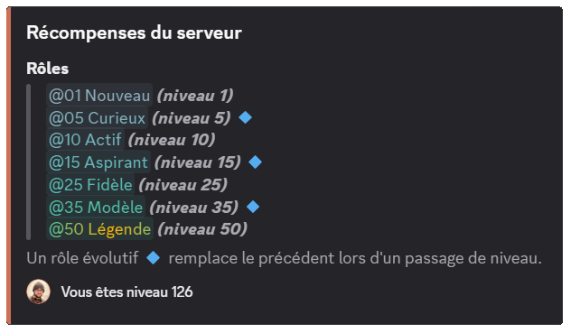

::hint{ type="info" }
  Vous pouvez créer jusqu'à **10 récompenses** gratuitement. Les serveurs [premium](/premium) n'ont **aucune limite** !
::

## Classement des membres

Vous pouvez afficher le classement des membres, du plus haut au plus bas niveau, de trois façons :

### Commande /topniveau

Vous pouvez afficher le classement via la commande \</topniveau>.

::hint{ type="success" }
  Si vous souhaitez afficher un nombre spécifique de lignes (seulement le top 3 par exemple), vous pouvez ajouter ce nombre en argument de la commande \</topniveau>.
::

::hint{ type="info" }
  Si l'option **"Voir les XP des autres utilisateurs"** est désactivée, les membres ne peuvent consulter que leur propre progression avec \</niveau>, mais les classements (\</topniveau> et le classement en ligne) **restent accessibles** à tous.
::

### Classement en ligne

Si vous avez activé le [**classement en ligne**](#fonctionnalités-disponibles), vous pouvez le consulter depuis le bouton **"Voir l'ensemble du classement"** de la commande \</topniveau>.

::hint{ type="info" }
  Si vous êtes administrateur du serveur, vous pouvez également y accéder depuis le [**panel**](/dashboard/first/levels) dans le module **Niveaux** via le bouton **"Accéder au classement"**.
::

### Classement en temps réel

Pour les serveurs [premium](/premium) <:icon_premium_:1096140508625125417>, il est possible de mettre en place dans un salon dédié un classement des membres en temps réel et mis à jour automatiquement.

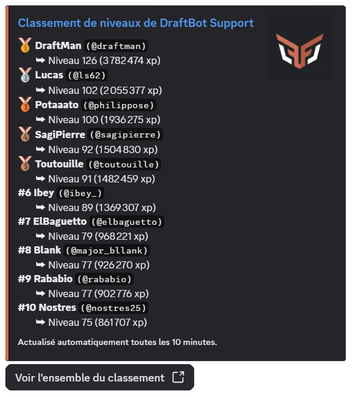

::hint{ type="success" }
  L'avantage de cette fonctionnalité est que le message affichant le classement peut afficher jusqu'à 25 membres et sera réactualisé toutes les 10 minutes automatiquement, sauf s'il n'y a pas de changements !
::

## Gérer les niveaux des membres

En tant qu'administrateur, vous disposez de plusieurs commandes pour gérer l'expérience des membres :

| Commande | Description |
|----------|-------------|
| \</dropxp> | Crée un message avec un bouton : le **premier membre** à cliquer gagne l'expérience. Vous pouvez définir une durée limite (maximum **10 minutes**). |
| \</adminxp ajouter> | Ajouter de l'expérience à un membre spécifique. |
| \</adminxp retirer> | Retirer de l'expérience à un membre. **Attention** : cela peut entraîner la perte de niveaux et de récompenses. |
| \</adminxp définir> | Définir exactement le montant d'XP d'un membre (remplace son XP actuelle). |
| \</adminxp transférer> | Transférer de l'expérience d'un membre à un autre (le donneur perd l'XP transférée). |
| \</adminxp réinitialiser> | **Réinitialiser tous les niveaux du serveur**. Cette action est irréversible ! |

::hint{ type="info" }
  Les commandes admin ne peuvent être utilisées que par les membres de votre serveur possédant la **permission administrateur**.
::

::hint{ type="warning" }
  Lorsque vous **retirez de l'XP** ou **définissez** une XP plus basse, les membres peuvent perdre des niveaux. Dans ce cas, leurs **rôles de récompense** seront automatiquement retirés.
::

## Gain d'expérience

### Expérience par message

La méthode principale pour gagner de l'expérience est la **participation écrite** dans le serveur. Chaque message rapporte une quantité d'expérience **aléatoire** comprise entre deux valeurs que vous configurez (par défaut entre **15 et 25 XP**).

::hint{ type="info" }
  Un **cooldown de 30 secondes** s'applique entre chaque gain d'XP pour un même membre. Cela évite le spam et encourage les conversations de qualité.
::

### Expérience en vocal

Les serveurs [premium](/premium) <:icon_premium_:1096140508625125417> peuvent activer le gain d'expérience en fonction de l'**activité vocale**. Chaque membre actif en vocal gagne une quantité d'expérience aléatoire (15 à 25 XP par défaut, configurable) **toutes les 2 minutes**.

::hint{ type="info" }
  **Conditions requises** pour gagner de l'XP en vocal :
  - L'utilisateur ne doit **pas être muet** ou **en sourdine** (ni auto-sourdine, ni sourdine serveur).
  - Le salon ne doit **pas être un salon de conférence** (stage) ou configuré comme **salon AFK** (dans les paramètres Discord).
  - **Au moins 2 utilisateurs humains** doivent être présents et actifs (non muets/sourdine) dans le même salon.

  Si ces conditions ne sont plus remplies, le membre cesse de gagner de l'XP jusqu'à ce qu'elles soient à nouveau respectées.
::

::hint{ type="info" }
  Cette fonctionnalité est réservée aux serveurs [premium](/premium) <:icon_premium_:1096140508625125417>.
::

### Autres gains d'expérience

Grâce à l'**écosystème** de DraftBot, vous pouvez offrir de l'expérience via d'autres fonctionnalités :
- **Giveaways** : Offrez de l'XP en récompense
- **Boutique d'économie** : Vendez de l'XP contre de l'argent de serveur
- **Cadeaux d'anniversaires** : Offrez de l'XP automatiquement
- **Drop d'expérience** (\</dropxp>) : Créez des événements interactifs
- **Calendrier de l'avent** : Récompenses quotidiennes en décembre

### Fils de discussion et forums

Le système de niveaux distingue deux types d'espaces de discussion :

- **Les fils de discussion (threads)** : créés dans les salons textuels ou d'annonces. Leur gain d'XP peut être activé/désactivé via l'option **"Gain d'expérience dans les fils de discussions"**.
- **Les posts de forums** : messages publiés dans les salons de type Forum. Leur gain d'XP est contrôlé par l'option **"Gain d'XP dans les posts"**.

::hint{ type="info" }
  Les fils de discussion et posts de forums **héritent automatiquement** des paramètres de leur salon parent concernant les listes blanches/noires et les multiplicateurs.
::

Afin de gérer votre serveur avec granularité, il vous sera possible de bloquer/booster le gain d'expérience en fonction de conditions et dans d'autres cas plus avancés de le réinitialiser.

### Listes blanches et noires

Les listes de **rôles** et **salons** vous permettent de contrôler finement qui peut gagner de l'XP et où :

- **Mode "avec" (whitelist)** : Seuls les membres/salons listés peuvent gagner de l'XP. Pour les rôles, il suffit qu'un membre possède **au moins un** rôle autorisé pour gagner de l'XP, même s'il possède d'autres rôles non listés.
- **Mode "sans" (blacklist)** : Les membres/salons listés ne peuvent **pas** gagner d'XP. Si un membre possède au moins un rôle interdit, il ne gagnera pas d'XP.

### Multiplicateurs d'expérience

Vous pouvez appliquer des **multiplicateurs** (x1.5, x2, x2.5, x3) à certains rôles ou salons pour booster le gain d'XP.

- Si un membre cumule plusieurs rôles avec boosts, **seul le boost le plus élevé** sera appliqué.
- Si un salon cumule les boosts d'une catégorie et d'un salon, **seul le boost du salon** sera appliqué.

::hint{ type="info" }
  Les boosts de rôles et de salons se cumulent entre eux.
::

### Options supplémentaires

D'autres options avancées sont disponibles pour affiner le système :

| Option | Description |
|--------|-------------|
| **Gain d'XP par message en vocal** | Lorsque cette option est activée, les messages textuels envoyés dans les salons vocaux rapportent de l'XP **uniquement si le membre est connecté en vocal** dans ce même salon. Si elle est désactivée, aucun message textuel dans les salons vocaux ne rapporte d'XP |
| **Longs messages comptent double** | Les messages de 250+ caractères (configurable 100-1500) donnent le double d'XP |
| **Voir les XP des autres utilisateurs** | Si désactivé, les membres ne voient que leur propre niveau via \</niveau>. Dans ce cas, la commande devient éphémère (visible uniquement par l'utilisateur qui l'utilise). Les administrateurs peuvent toujours consulter les niveaux de tous les membres |
| **Réinitialiser l'XP au départ du serveur** | Si activé, les membres qui quittent le serveur perdent définitivement leur progression. S'ils reviennent, ils repartent de zéro |
| **Réinitialiser l'XP au bannissement** | Si activé, les membres bannis perdent définitivement leur progression |
| **Personnalisation de la couleur** | Changez la couleur des embeds et cartes de niveau (option premium <:icon_premium:1096140508625125417>) |

::hint{ type="info" }
  Vous trouverez ci-dessous le nombre d'XP nécessaire pour passer au niveau supérieur avec la courbe par défaut.

  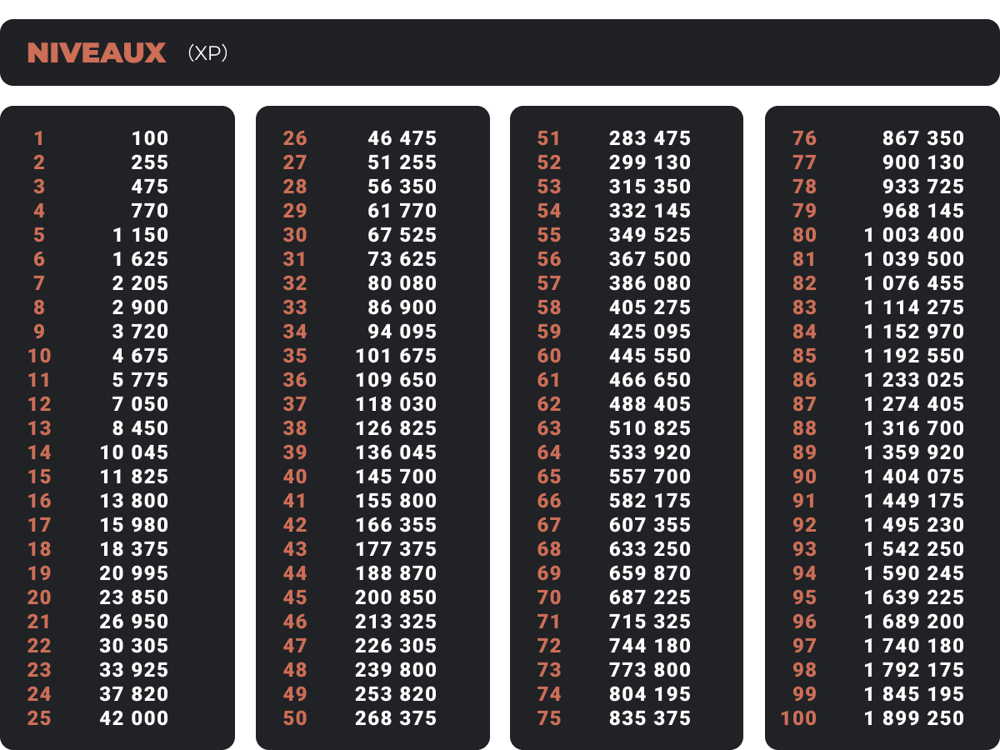
::

### Courbe d'expérience personnalisable

Vous pouvez modifier la **courbe d'expérience** pour ajuster la difficulté de progression des niveaux. Quatre courbes prédéfinies sont disponibles :

| Courbe | Difficulté | Description |
|--------|------------|-------------|
| **Constant** | Fixe | Chaque niveau nécessite exactement la même quantité d'XP |
| **Linéaire** | Croissante modérée | Chaque niveau nécessite progressivement plus d'XP de manière linéaire |
| **Exponentielle** | Croissante rapide | La difficulté augmente de manière exponentielle, les hauts niveaux sont beaucoup plus difficiles à atteindre (défaut) |
| **Custom** <:icon_premium:1096140508625125417> | Personnalisée | Définissez votre propre formule (réservé aux serveurs premium) |

::hint{ type="success" }
  **Multiplicateur de courbe** : Vous pouvez appliquer un multiplicateur global (x0.5, x1, x2, etc.) à la courbe sélectionnée pour ajuster la difficulté sans changer le style de progression.
::

::hint{ type="warning" }
  **Important** : Lorsque vous modifiez la courbe d'XP, tous les niveaux des membres sont **automatiquement recalculés** en fonction de leur XP totale. Si vous rendez les niveaux plus difficiles à atteindre, certains membres peuvent perdre des niveaux et leurs récompenses associées !
::

### Niveau maximum

Les serveurs [premium](/premium) peuvent définir un **niveau maximum** pour plafonner la progression. Une fois ce niveau atteint, les membres **ne gagnent plus aucune expérience** jusqu'à ce que le plafond soit relevé ou supprimé.

::hint{ type="info" }
  L'XP gagnée pendant cette période n'est pas comptabilisée rétroactivement.
::

## Annonces de niveaux

Chaque palier ne devrait pas passer inaperçu, c'est pour cela qu'il vous est possible de configurer des annonces lorsqu'un utilisateur passe un niveau.

### Annonces de passage de niveau

Vous pouvez configurer les annonces de montée de niveau avec **trois options** :

- **Désactivées** : Aucune annonce n'est envoyée
- **Dans le salon actuel** : L'annonce apparaît dans le salon où le membre a gagné le niveau
- **Dans un salon dédié** : L'annonce est envoyée dans un salon spécifique que vous choisissez

::hint{ type="info" }
  **Niveau minimum** : Définissez un seuil (ex: niveau 10) pour éviter de spammer les petits niveaux.

  **Couleur personnalisée** <:icon_premium:1096140508625125417> : Les serveurs premium peuvent changer la couleur de l'embed d'annonce.
::

::hint{ type="warning" }
  **Permissions requises** : Pour envoyer les annonces, DraftBot doit disposer des permissions suivantes dans le salon choisi : **Voir le salon**, **Envoyer des messages**, **Intégrer des liens** et **Joindre des fichiers**. Si ces permissions sont retirées, les annonces seront automatiquement désactivées.
::

#### Personnalisation du message

Le message d'annonce est **entièrement personnalisable** avec des variables dynamiques :

| Variable | Description | Exemple |
|----------|-------------|---------|
| `{user}` | Mention du membre | @DraftBot |
| `{user.id}` | ID du membre | 689210436019716137 |
| `{user.username}` | Nom d'utilisateur | DraftBot |
| `{user.nickname}` | Pseudo sur le serveur | Draft |
| `{user.globalname}` | Nom global Discord | DraftBot Official |
| `{level}` | Niveau atteint | 25 |
| `{server}` / `{server.name}` | Nom du serveur | Mon Super Serveur |
| `{server.id}` | ID du serveur | 382341865001844737 |
| `{server.membercount}` | Nombre de membres | 15000 |
| `{channel}` | Mention du salon | #général |
| `{channel.id}` | ID du salon | 923456789012345678 |
| `{channel.name}` | Nom du salon | général |
| `{date}`, `{time}`, `{timestamp}` | Date et heure actuelles | 15/01/2025 |

### Annonces de récompenses

Configurez des annonces **séparées** pour les récompenses de niveau. Elles utilisent les mêmes options et variables, avec en plus `{reward}` pour afficher la récompense obtenue.

## Configurer le système de niveaux

::tabs
  ::tab{ label="Depuis le panel" }

    [⫸ Accéder au panel de **DraftBot**](/dashboard/first/levels)

    Pour activer le module, la première étape est de cliquer sur le bouton en haut à droite :

    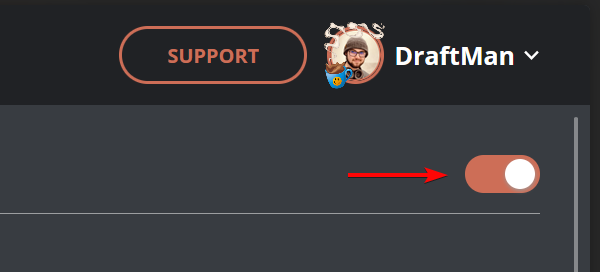

    Ensuite, l'ensemble des fonctionnalités apparaît :

    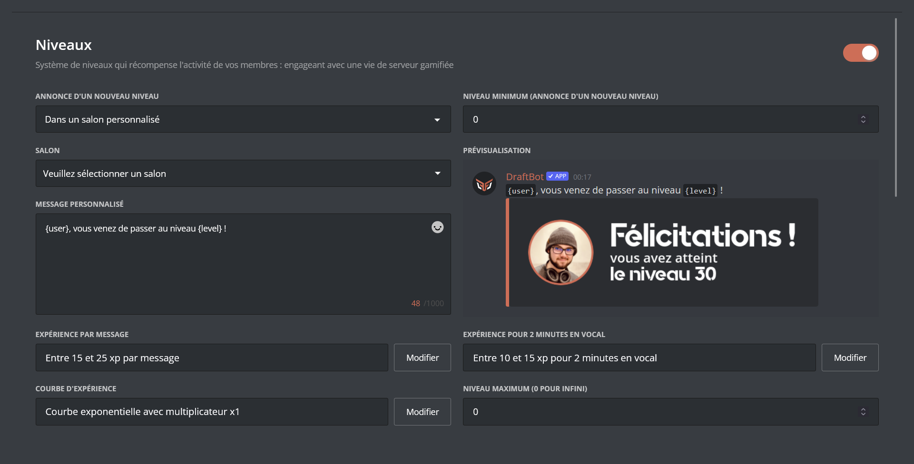

    ::hint{type="warning"}
      Une fois vos modifications terminées, n'oubliez pas de les enregistrer avec le bouton "Enregistrer" situé en bas de page !
    ::
  ::

  ::tab{ label="Via la commande /config" }

    Si vous souhaitez effectuer toute la configuration directement depuis Discord, vous pouvez le faire via la commande \</config>, puis en vous rendant dans l'onglet "Niveaux". Le menu ressemble alors à ceci :

    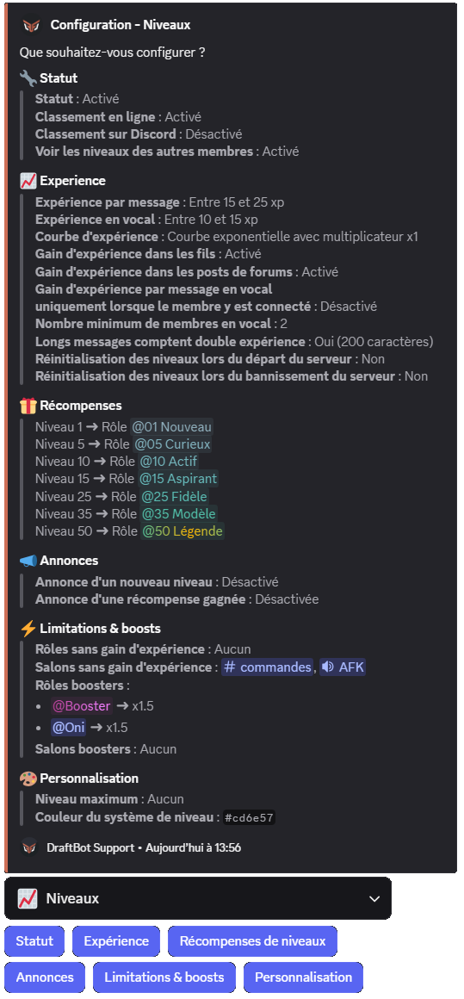

    Le corps du **message** vous permet de consulter en un coup d'œil l'**état actuel** de votre système de niveaux, tandis que les **boutons** situés au-dessous vous permettent d'en **modifier la configuration**.

    ::collapse{ label="Statut" }
      Ce menu vous permet de :
      - Activer / Désactiver le système de niveaux
      - Activer / Désactiver le classement en ligne
      - Activer / Désactiver le classement sur Discord (<:icon_premium:1096140508625125417>)

      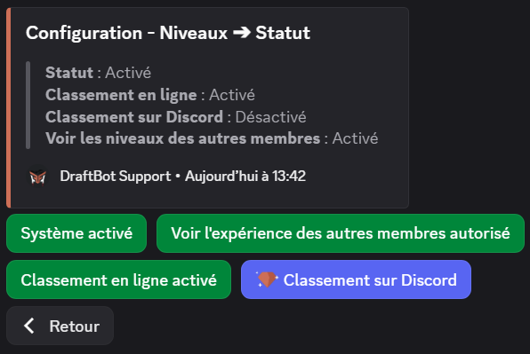

      ::hint{ type="success" }
        Lorsque vous activez le classement sur Discord, vous avez le choix entre utiliser un salon existant ou laisser DraftBot en créer un pour vous. Vous pouvez même définir le nombre de lignes du classement à afficher !
      ::
    ::

    ::collapse{ label="Expérience" }
      Ce menu vous permet de :
      - Activer / Désactiver / Régler l'expérience reçue à chaque message
      - Activer / Désactiver / Régler l'expérience reçue en vocal (<:icon_premium:1096140508625125417>)
      - Activer / Désactiver le gain d'expérience dans les fils
      - Activer / Désactiver le gain d'expérience par message en vocal
      - Activer / Désactiver/ Régler le double xp pour les messages longs
      - Choisir si le niveau des membres quittant le serveur est remis à 0

      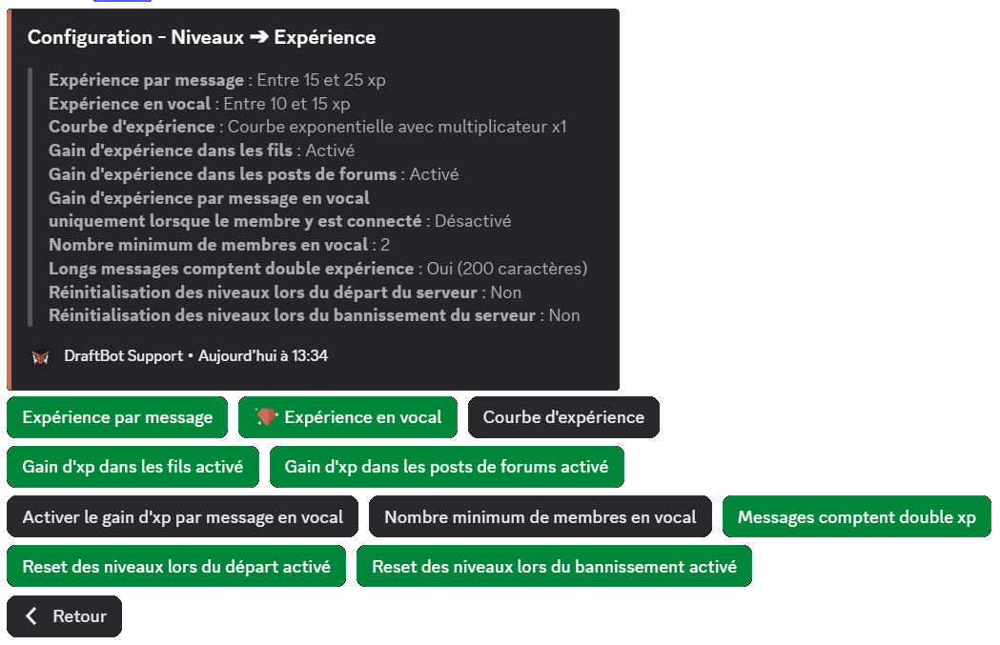
    ::

    ::collapse{ label="Récompenses de niveaux" }
      Ce menu vous permet de configurer les récompenses de niveau, vous pouvez ainsi :
      - Créer / Modifier / Supprimer une [récompense](#recompenses)
      - Réinitialiser les récompenses.

      
    ::

    ::collapse{ label="Annonces" }
      Ce menu sert à configurer les annonces de changement de niveau et de récompenses. Vous pouvez :
      - Configurer les annonces de changement de niveau :
          - Activer / Désactiver les annonces
          - Choisir le salon où faire les annonces
          - Configurer un niveau minimum pour les annonces
          - Personnaliser le message d'annonce
      - Configurer les annonces d'obtention de récompenses :
          - Activer / Désactiver les annonces
          - Choisir le salon où faire les annonces
          - Personnaliser le message d'annonce

      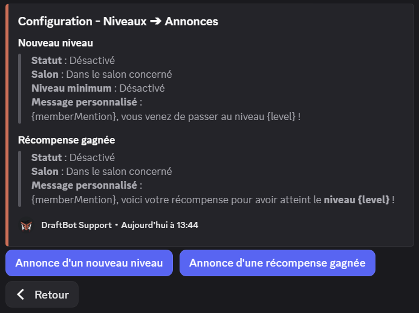
    ::

    ::collapse{ label="Limitations & Boosts" }
      Ce menu sert à configurer des gains différents en fonction du rôle d'un membre ou du salon dans lequel il poste un message. Vous pouvez définir :
      - Pour quels rôles activer/désactiver le gain d'xp,
      - dans quels salons activer/désactiver le gain d'xp,
      - à quels rôles appliquer un multiplicateur (de x1.5 à x3),
      - à quels salons appliquer un multiplicateur (de x1.5 à x3).

      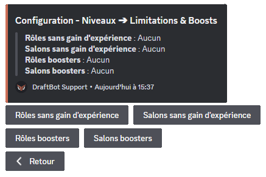
    ::

    ::collapse{ label="Personnalisation" }
      Ce menu propose des personnalisations exclusives réservées aux [serveurs premium](/premium) <:icon_premium:1096140508625125417> :
      - Définir un niveau maximum
      - Personnaliser la couleur de l'interface des niveaux (par défaut : orange)

      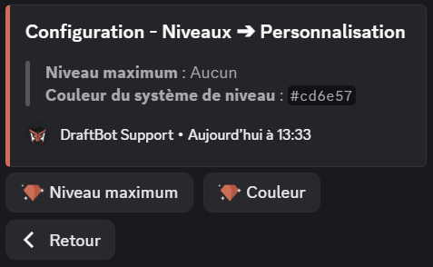
    ::

    ::hint{ type="info" }
      Les fonctionnalités accompagnées du symbole <:icon_premium:1096140508625125417> sont réservées aux serveurs [premium](/premium) <:icon_premium_:1096140508625125417>.
    ::
  ::
::

### Configurer les récompenses

La configuration de base des récompenses se fait comme ceci :

::tabs
  ::tab{ label="Depuis le panel" }

    [⫸ Accéder au panel de **DraftBot**](/dashboard/first/levels)

    Deux sections s'offrent à vous :

    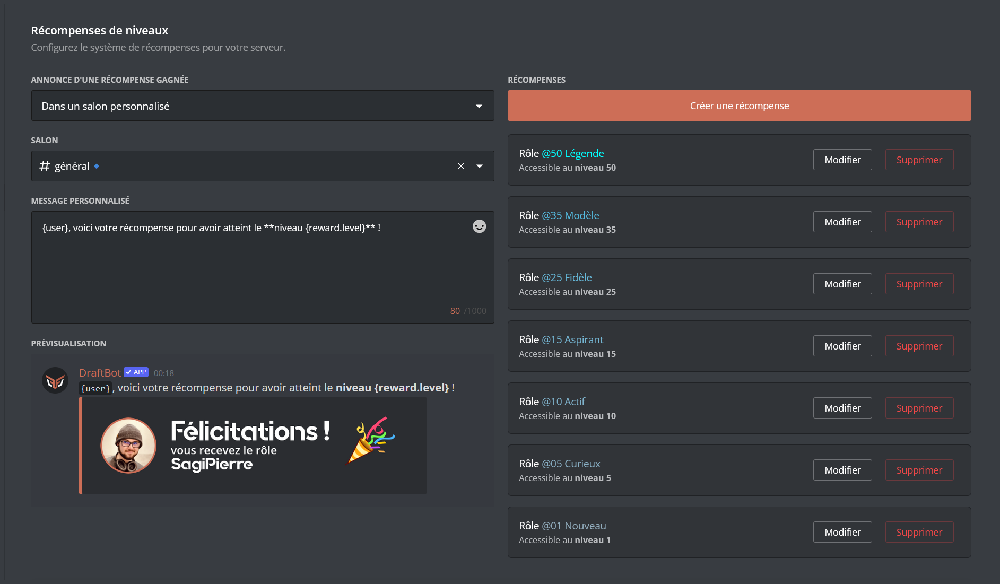

    1. **Créer une récompense** : cette option permet de créer et assigner des récompenses aux passages de niveaux de votre choix. *(Apprenez à [créer une récompense](#creer_une_recompense) ! )*

    2. **Configurer les annonces** : Vous pouvez décider d'activer ou désactiver les annonces, choisir le salon dans lequel elles doivent apparaître, et même personnaliser le message !

    ::collapse{ label="Voir comment configurer les annonces :" }
      Vous pouvez :
      - Choisir si l'annonce doit être envoyée dans le salon actif, ou dans un salon dédié
          - Créer ou sélectionner un salon dédié
      - Personnaliser le message d'annonce

      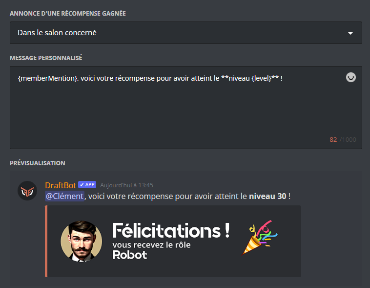
    ::

    ::hint{ type="success" }
      Si vous avez déjà configuré des [articles de boutique](/docs/modules/economie#articles-de-boutique), ils apparaîtront en bas de l'écran, et vous pourrez les modifier / supprimer.
    ::
  ::

  ::tab{ label="Via la commande /config" }
    Via la commande \</config>, cliquez sur le bouton "Récompenses de niveaux". Un menu permettant de configurer les récompenses s'affiche alors, il permet de  :

    - Créer / Modifier / Supprimer une [récompense](#creer_une_recompense)
    - Réinitialiser les récompenses

    
  ::
::

### Créer une récompense

DraftBot vous permet de récompenser l'activité de vos membres à travers des items de types variables :

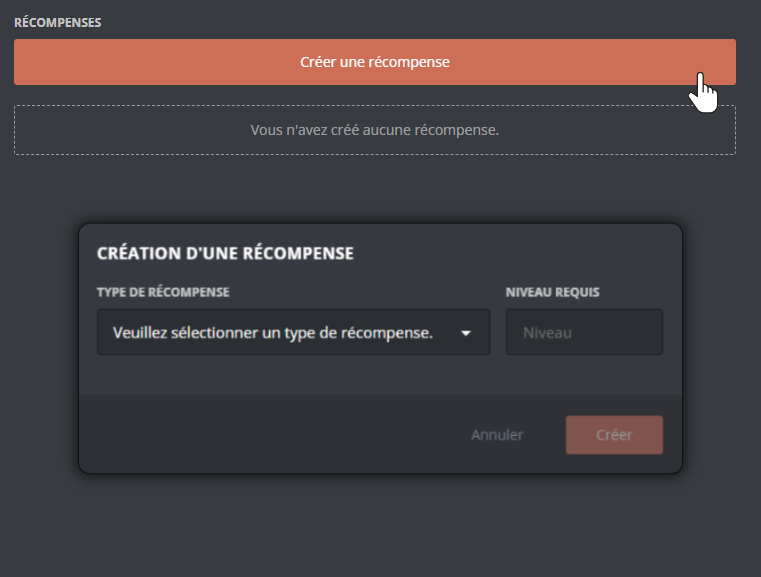

::tabs
  ::tab{ label="Rôle" }
    Vous pouvez permettre à vos membres d'acquérir des rôles (temporaires ou permanents) lorsqu'ils atteignent un niveau défini. Pour ajouter un rôle aux récompenses, sélectionnez le type de récompense **"rôle"** ou **"rôle temporaire"**.

    Choisissez ensuite :
    - Le niveau requis
    - Le rôle à attribuer
    - Le mode de cumul : **Cumulatif** ou **Évolutif**
    - La durée du rôle *(dans le cas d'un rôle temporaire)*

    ::hint{ type="info" }
      **Rôle Cumulatif** : Le membre conserve tous les rôles de récompense obtenus (niveau 5, 10, 15, etc.).

      **Rôle Évolutif** : Seul le rôle du dernier niveau atteint est conservé. Les anciens rôles de récompense évolutifs sont automatiquement retirés lors du prochain gain d'XP.
    ::

    ::hint{ type="success" }
      Dans la commande \</recompenses>, un indicateur **🔹** s'affiche à côté des récompenses de rôle configurées en mode **Évolutif**, permettant de les repérer facilement.
    ::

    ::hint{ type="warning" }
      Le rôle sélectionné doit avoir été créé au préalable sur votre serveur, et être accessible à DraftBot (donc ne pas être situé plus haut que le rôle le plus élevé de DraftBot).
    ::

    **Comportements particuliers :**

    - **Saut de niveaux** : Si un membre saute plusieurs niveaux d'un coup (via \</adminxp ajouter>), il reçoit **toutes les récompenses** des niveaux intermédiaires qu'il n'a pas encore obtenues. Par exemple, si un membre passe directement du niveau 5 au niveau 25, il recevra les récompenses des niveaux 10, 15, 20 et 25. Pour les rôles **évolutifs**, seul le rôle du niveau le plus élevé sera conservé.
    - **Perte de niveaux** : Si un membre descend en dessous du niveau requis (via \</adminxp retirer> ou modification de la courbe d'XP), les rôles de récompense sont **automatiquement retirés**. Les récompenses d'argent, d'objets et personnalisées ne seront pas retirées.
  ::

  ::tab{ label="Argent" }
    Si le [système d'économie](/docs/modules/economie) est activé, vous pouvez récompenser vos membres avec de l'argent virtuel du serveur.

    Choisissez :
    - Le niveau requis
    - La somme d'argent à accorder

    ::hint{ type="warning" }
      Le système d'économie doit être **activé** sur votre serveur pour utiliser ce type de récompense. Si vous le désactivez, un avertissement s'affichera lors de la configuration.
    ::

    ::hint{ type="info" }
      Contrairement aux rôles, l'argent donné **ne peut pas être retiré automatiquement** si le membre perd son niveau.
    ::
  ::

  ::tab{ label="Objet Inventaire" }
    Récompensez vos membres avec des [objets d'inventaire](/docs/modules/inventaire) personnalisés et fictifs.

    Choisissez :
    - Le niveau requis
    - L'objet à accorder (parmi ceux existant ou en créer un nouveau)
    - La quantité de cet objet (jusqu'à 1 million)

    ::hint{ type="info" }
      Comme l'argent, les objets donnés **ne peuvent pas être retirés automatiquement** si le membre perd son niveau.
    ::
  ::

  ::tab{ label="Article Personnalisé" }
    Offrez des récompenses **en dehors de Discord** : codes promotionnels, clés de jeux, goodies physiques, abonnements, etc.

    Choisissez :
    - Le niveau requis
    - Le nom/description de l'article (jusqu'à 250 caractères)

    ::hint{ type="success" }
      **Comment ça fonctionne ?** Lorsqu'un membre obtient cette récompense, **vous recevez une notification par message privé de DraftBot** avec les informations du membre. Vous pouvez alors lui remettre la récompense "en main propre" comme vous le souhaitez.
    ::

    ::hint{ type="info" }
      Idéal pour des récompenses uniques : accès à un salon privé, session de coaching, goodies personnalisés, etc.
    ::
  ::
::

::hint{ type="info" }
  Vous pouvez mettre en place jusqu'à 10 récompenses de niveaux. Les serveurs [premium](/premium) <:icon_premium_:1096140508625125417> n'ont aucune limite !
::

## Migration depuis MEE6

Si vous utilisiez déjà un système de niveaux via MEE6, vous avez la possibilité d'importer la progression de vos membres au système de niveaux de DraftBot !

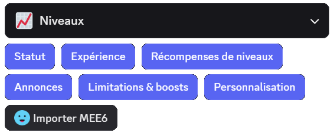

Après avoir cliqué sur **Importer MEE6**, et confirmé que vous souhaitez procéder à l'importation, DraftBot récupèrera automatiquement toutes les informations de niveaux des membres.

::hint{ type="warning" }
  Assurez-vous que MEE6 est présent sur votre serveur et que son classement est accessible publiquement !
::
