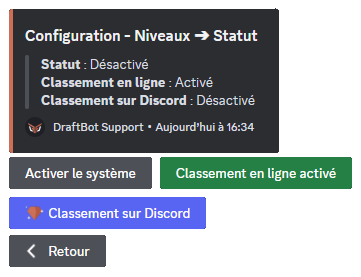
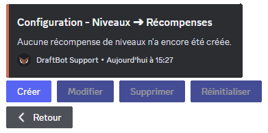
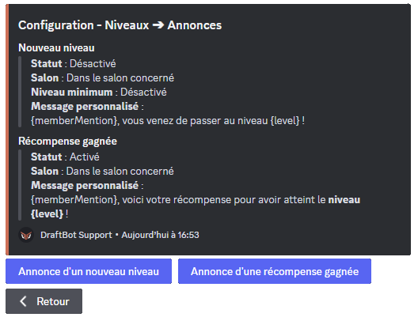
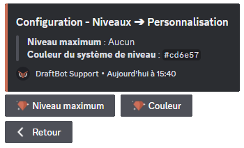
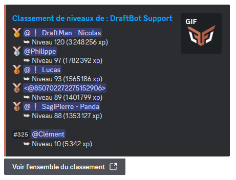
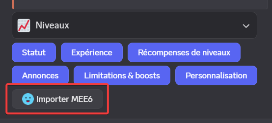

## Introduction
Le module de niveaux DraftBot comprend deux parties :

1. Le système d'**expérience**
2. Le système de **récompenses**

Ces deux systèmes peuvent être configurés depuis le [**panel** de DraftBot](/dashboard/first/levels), ou depuis Discord via la commande \</config>.

::hint{ type="info" }
  Lorsque vous utilisez la commande \</config>, si vous souhaitez ouvrir directement la configuration d'un module précis *(comme le module "Niveaux" par exemple)*, vous pouvez le préciser au moment d'entrer la commande : \</config> `Niveaux`
::

## Configurer le système d'expérience

::tabs
  ::tab{ label="Depuis le panel" }

    [⫸ Accéder au panel de **DraftBot**](/dashboard/first/levels)

    Pour activer le module, la première étape est de cliquer sur ce bouton :

    

    Ensuite, l'ensemble des [fonctionnalités](#fonctionnalites-disponibles) apparaît :

    

    ::hint{type="warning"}
      Une fois vos modifications terminées, n'oubliez pas d'enregistrer vos modifications avec le bouton "Enregistrer" situé en bas de page !
    ::
  ::

  ::tab{ label="Via la commande /config" }

    Si vous souhaitez effectuer toute la configuration directement depuis [Discord](https://discord.com/), vous pouvez le faire via la commande \</config>, puis en vous rendant dans l'onglet "Niveaux". Le menu ressemble alors à ceci :

    

    Le corps du **message** vous permet de consulter en un coup d'œil l'**état actuel** de votre système de niveaux, tandis que les **boutons** situés au dessous vous permettent d'en **modifier la configuration**.

    ::collapse{ label="Statut" }
      Ce menu vous permet de :
      - Activer / Désactiver le système de niveaux ;
      - Activer / Désactiver le classement en ligne ;
      - Activer / Désactiver le classement sur Discord (<:icon_premium:1096140508625125417>).

      

      ::hint{ type="success" }
        Lorsque vous activez le classement sur Discord, vous avez le choix entre utiliser un salon existant ou laisser DraftBot en créer un pour vous. Vous pouvez même définir le nombre de lignes du classement à afficher !
      ::
    ::

    ::collapse{ label="Expérience" }
      Ce menu vous permet de :
      - Activer / Désactiver / Régler l'expérience reçue à chaque message ;
      - Activer / Désactiver / Régler l'expérience reçue en vocal (<:icon_premium:1096140508625125417>) ;
      - Activer / Désactiver le gain d'expérience dans les fils ;
      - Activer / Désactiver le gain d'expérience par message en vocal ;
      - Activer / Désactiver/ Régler le double xp pour les messages longs ;
      - Choisir si le niveau des membres quittant le serveur est remis à 0.

      
    ::

    ::collapse{ label="Récompenses de niveaux" }
      Ce menu vous permet de configurer les récompenses de niveau, vous pouvez ainsi :
      - Créer / Modifier / Supprimer une [récompense](#recompenses) ;
      - Réinitialiser les récompenses.

      
    ::

    ::collapse{ label="Annonces" }
      Ce menu sert à configurer les annonces de changement de niveau et de récompenses. Vous pouvez :
      - Configurer les annonces de changement de niveau :
          - Activer / Désactiver les annonces ;
          - Choisir le salon où faire les annonces ;
          - Configurer un niveau minimum pour les annonces ;
          - Personnaliser le message d'annonce.
      - Configurer les annonces d'obtention de récompenses :
          - Activer / Désactiver les annonces ;
          - Choisir le salon où faire les annonces ;
          - Personnaliser le message d'annonce.

      
    ::

    ::collapse{ label="Limitations & Boosts" }
      Ce menu sert à configurer des gains différents en fonction du rôle d'un membre ou du salon dans lequel il poste un message. Vous pouvez définir :
      - Pour quels rôles activer/désactiver le gain d'xp,
      - dans quels salons activer/désactiver le gain d'xp,
      - à quels rôles appliquer un multiplicateur (de x1.5 à x3),
      - à quels salons appliquer un multiplicateur (de x1.5 à x3).

      
    ::

    ::collapse{ label="Personnalisation" }
      Ce menu propose des personnalisations exclusives réservées aux serveurs [<:icon_premium:1096140508625125417> Premium](/premium) :
      - Définir un niveau maximum,
      - personnaliser la couleur de l'interface des niveaux (par défaut : orange).

      
    ::

    ::hint{ type="info" }
      Les fonctionnalités accompagnées du symbole <:icon_premium:1096140508625125417> sont réservées aux <:icon_premium:1096140508625125417>[serveurs premium](/premium) !
    ::
  ::
::

::hint{ type="success" }
  Pour consulter votre progression personnelle, utilisez la commande \</niveau>. Pour consulter la progression d'un autre membre, ajoutez simplement sa mention en argument de la fonction \</niveau>.

  ::collapse{ label="Afficher un exemple :" }
    
  ::
::

## Fonctionnalités disponibles

Avec DraftBot, *vous* êtes aux commandes ! Le système de niveaux vous permet un haut niveau de personnalisation et vous donne la possibilité d'affiner tous les réglages pour un résultat unique, correspondant à *vos* besoins.

Voici les fonctionnalités configurables :

::collapse{ label="Afficher / masquer la liste de fonctionnalités" }

  | **NOM** | **EXPLICATION** |  |
  |---------|-----------------|--|
  | **Annonce d'un nouveau niveau** | Choisir si les annonces de niveau doivent être faites dans un salon spécifique ou directement dans le salon actif |  |
  | **Salon** | Choisir le salon dans lequel les passages de niveaux seront annoncés |  |
  | **Niveau Minimum** | Choisir à partir de quel niveau une annonce est envoyée |  |
  | **Message personnalisé** | Modifier le message des annonces de passage de niveau. |  |
  | **Expérience par message** | Régler la quantité d'expérience reçue pour l'envoi d'un message |  |
  | **Expérience pour 2 minutes  en vocal** | Définir la quantité d'expérience gagnée en vocal | <:icon_premium:1096140508625125417> |
  | **Rôles avec/sans gain d'expérience** | Restreindre le gain d'expérience à certains rôles |  |
  | **Rôles boosters** | Régler des multiplicateurs d'XP pour certains rôles |  |
  | **Salons boosters** | Régler des multiplicateurs de gains pour certains salons |  |
  | **Niveau Maximum** | Définir un niveau maximum | <:icon_premium:1096140508625125417> |
  | **Couleur du système de niveaux** | Personnaliser la couleur de l'interface niveaux | <:icon_premium:1096140508625125417> |

  ::hint{ type="success" }
    Lorsque vous choisissez un salon d'annonces pour les passages de niveaux ou les récompenses reçues, vous avez le choix entre utiliser un salon existant, ou laisser DraftBot en créer un nouveau pour vous !
  ::
::

En plus de ces fonctionnalités, 6 options à activer/désactiver vous permettent d'aller encore plus loin dans la configuration de votre économie :

::collapse{ label="Afficher / masquer la liste des options" }

  | **NOM** | **EXPLICATION** |  |
  |---------|-----------------|--|
  | **Gain d'expérience dans les fils de discussions** | Autoriser ou non les membres à gagner de l'expérience dans les fils |  |
  | **Réinitialisation de l'expérience** | Définir si le niveau des membres est réinitialisé lorsqu'ils quittent le serveur |  |
  | **Classement en ligne** | Activer ou non l'affichage du classement sur le web |  |
  | **Gain d'expérience par message en vocal** | Définir si les messages textuels envoyés dans les salons vocaux rapportent de l'expérience ou non |  |
  | **Classement sur Discord** | Activer ou non l'affichage dynamique du classement sur le serveur | <:icon_premium:1096140508625125417> |
  | **Longs messages comptent double** | Définir si les longs messages donnent le double de points |  |

  ::hint{ type="success" }
    Pour la configuration "Longs messages comptent double", vous pouvez même spécifier à partir de combien de caractères un message est considéré comme "long" (250 par défaut) !
  ::

  ::hint{ type="info" }
    Lorsque vous activez le Classement sur Discord, vous avez le choix entre utiliser un salon existant ou laisser DraftBot en créer un pour vous. Vous pouvez aussi choisir combien de lignes du classement doivent être affichées (10 par défaut).
  ::
::

::hint{ type="info" }
  Les fonctionnalités ou options accompagnées de l'icône <:icon_premium:1096140508625125417> sont exclusives, et réservées aux [<:icon_premium:1096140508625125417>serveurs premium](/premium).
::

## Récompenses
Une fois configuré, ce système permet aux membres de votre serveur de recevoir toutes sortes de récompenses lors du passage de certains niveaux. Il peut s'agir de rôles (temporaires ou non), d'argent du serveur, d'objets d'inventaire, et même d'articles personnalisés !

::hint{ type="success" }
  Vous pouvez décider quel niveau donne quelle récompense : le choix vous appartient !
::

::hint{ type="info" }
  Par défaut, DraftBot vous permet de mettre en place `10` récompenses de niveaux. Si votre serveur est [<:icon_premium:1096140508625125417>premium](/premium), vous n'aurez plus aucune limitation !
::

### Configurer les récompenses
La configuration de base des récompenses se fait comme ceci :

::tabs
  ::tab{ label="Depuis le panel" }

    [⫸ Accéder au panel de **DraftBot**](/dashboard/first/levels)

    Pour activer les récompenses depuis le [**Panel**](/dashboard/first/levels), il faut tout d'abord activer l'interrupteur situé en face de "Configuration des récompenses" :

    

    Ensuite, deux options s'offrent à vous :

    

    1. **Créer une récompense** : cette option permet de créer et assigner des récompenses aux passages de niveaux de votre choix. *(Apprenez à [créer une récompense](#creer_une_recompense) ! )*

    2. **Configurer les annonces** : Vous pouvez décider d'activer ou désactiver les annonces, choisir le salon dans lequel elle doivent apparaître, et même personnaliser le message !

    ::collapse{ label="Voir comment configurer les annonces :" }
      Vous pouvez :
      - Choisir si l'annonce doit être envoyée dans le salon actif, ou dans un salon dédié ;
          - Créer ou sélectionner un salon dédié ;
      - Personnaliser le message d'annonce.

      
    ::

    ::hint{ type="success" }
      Si vous avez déjà configuré des [articles de boutique](/docs/modules/economie#articles-de-boutique), ils apparaîtront en bas de l'écran, et vous pourrez les modifier / supprimer.
    ::
  ::

  ::tab{ label="Via la commande /config" }
    Via la commande \</config>, cliquez sur le bouton "Récompenses de niveaux". Un menu permettant de configurer les récompenses s'affiche alors, il permet de  :

    - Créer / Modifier / Supprimer une [récompense](#creer_une_recompense) ;
    - Réinitialiser les récompenses.

    
  ::
::

### Créer une récompense

DraftBot vous permet de récompenser l'activité de vos membres à travers des items de types variables :

::tabs
  ::tab{ label="Rôle" }
    Vous pouvez permettre à vos membres d'acquérir des rôles (temporaires ou permanents) lorsqu'ils atteignent un niveau défini. Pour ajouter un rôle aux récompenses, sélectionnez le type de récompense **"rôle"** ou **"rôle temporaire"**.

    Choisissez ensuite :
    - Le niveau requis ;
    - Le rôle à attribuer ;
    - La durée du rôle *(dans le cas d'un rôle temporaire)*.

    ::hint{ type="warning" }
      Le rôle sélectionné doit avoir été créé au préalable sur votre serveur, et être accessible à DraftBot (donc ne pas être situé plus haut que le rôle le plus élevé de DraftBot).
    ::
  ::

  ::tab{ label="Argent" }
    Si le [système d'économie](/docs/modules/economie) est activé, vous pouvez permettre à vos membres d'obtenir de l'argent de serveur pour récompenser leur montée de niveau. Pour ajouter une somme d'argent à la boutique, sélectionnez le type de récompense **"De l'argent"**.

    Choisissez ensuite :
    - Le niveau requis ;
    - La somme d'argent à accorder.
  ::

  ::tab{ label="Objet Inventaire" }
    Vous pouvez créer des objets fictifs à ajouter à l'inventaire. Pour offrir des objets d'inventaire en récompense au passage d'un niveau, sélectionnez le type de récompense **"Un objet d'inventaire"**.

    Choisissez ensuite :
    - Le niveau requis ;
    - L'objet à accorder ;
    - Le nombre de cet objet devant être donné.

    ::hint{ type="info" }
      Si vous n'avez pas encore d'objets en boutique, vous pouvez en [créer directement](#creer-des-objets-d-inventaire) !
    ::
  ::

  ::tab{ label="Article Personnalisé" }
    Si vous souhaitez permettre à vos membres d'acquérir d'autres articles, comme par exemple des codes promotionnels, des clés d'activation numériques, ou bien des objets "réels", DraftBot a la solution !

    Pour ajouter un article personnalisé aux récompenses, sélectionnez le type d'article **"Un article personnalisé"**.

    Choisissez ensuite :
    - Le niveau requis ;
    - Le nom de l'article.

    ::hint{ type="success" }
      Lorsqu'un membre gagnera cet item, vous serez notifié par DraftBot dans vos messages privés, et vous pourrez ainsi lui remettre "en main propre".
    ::
  ::
::

### Créer des objets d'inventaire
Il est possible de créer des objets d'inventaire depuis le menu de création d'article.

Pour cela, il faut :
- Cliquer sur "Créer un objet" dans le menu de sélection d'objet ;
- Entrer le nom de l'objet.

::hint{ type="info" }
  Il est également possible d'entrer dans le menu de création d'objet depuis la section [**Économie**](/dashboard/first/economy)  du Panel DraftBot !
::

::hint{ type="success" }
  Vous pouvez intégrer des émojis Discord au nom de votre objet !
::

## Classement

Vous pouvez afficher le classement des membres, du plus haut au plus bas niveau, de trois façons :

::collapse{ label="En entrant la commande /topniveau sur discord" }
  Vous pouvez afficher le classement via la commande \</topniveau> :

  

  ::hint{ type="success" }
    Si vous souhaitez afficher un nombre spécifique de lignes (seulement le top 3 par exemple), vous pouvez ajouter ce nombre en argument de la commande \</topniveau> :

    
  ::
::

::collapse{ label="En ligne, depuis le Panel" }
  Si vous avez activé le [**classement en ligne**](#fonctionnalites-disponibles), vous pouvez le consulter :
  - En vous rendant sur le [**panel**](/dashboard/first/levels) et en cliquant sur le bouton **"Accéder au classement"** ;
  - En utilisant la commande \</topniveau> puis en cliquant sur le bouton **"Voir l'ensemble du classement"**.

  
::

::collapse{ label="Via un salon dédié (premium)" }
  Si vous avez [activé le classement sur Discord](#fonctionnalites-disponibles), vous pouvez le consulter en vous rendant dans le salon dédié sur votre serveur.

  

  ::hint{ type="success" }
    L'avantage de cette méthode est que le message affichant le classement sera réactualisé toutes les 10 minutes automatiquement, sauf s'il n'y a pas de changements !
  ::
::

## Commandes Niveaux
Il existe plusieurs commandes pratiques pour rendre l'intégration et la maintenance du système de niveaux aussi fluide et flexible que possible pour vous.

### Commandes générales

::hint{ type="info" }
  Les commandes générales sont celles qui peuvent être utilisées par tout membre, sauf restriction spécifique :
::

- \</dropxp>      : Crée un message qui offre de l'expérience au premier qui clique sur le bouton.
- \</niveau>      : Permet d'afficher le niveau que vous, ou un autre membre, avez atteint.
- \</recompenses> : Permet d'afficher les [récompenses de niveau](#recompenses).
- \</topniveau>   : Permet d'afficher le [classement](#classement) des membres.

::hint{ type="info" }
  Lors de l'utilisation de \</dropxp>, vous pouvez définir la durée du drop !

  
::

### Commandes Admin

::hint{ type="info" }
  Les commandes admin ne peuvent être utilisées que par les membres de votre serveur possédant les permissions administrateur.
::

- \</adminxp ajouter>       : Ajouter de l'expérience à un membre.
- \</adminxp retirer>       : Retirer de l'expérience à un membre.
- \</adminxp réinitialiser> : Réinitialiser les niveaux de tout le serveur.
- \</adminxp définir>       : Définir l'expérience d'un membre.
- \</adminxp transférer>    : Transférer de l'expérience d'un membre à un autre.

## Migration depuis MEE6

Si vous utilisiez déjà un système de niveaux via MEE6, vous avez la possibilité d'importer la progression de vos membres au système de niveaux de DraftBot !

Après avoir cliqué sur **Importer MEE6**, et confirmé que vous souhaitez procéder à l'importation, DraftBot récupèrera automatiquement toutes les informations de niveaux des membres.

::hint{ type="warning" }
  Assurez-vous que MEE6 est présent sur votre serveur et que son classement est accessible publiquement !
::

