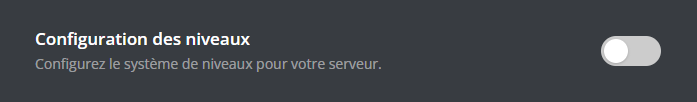
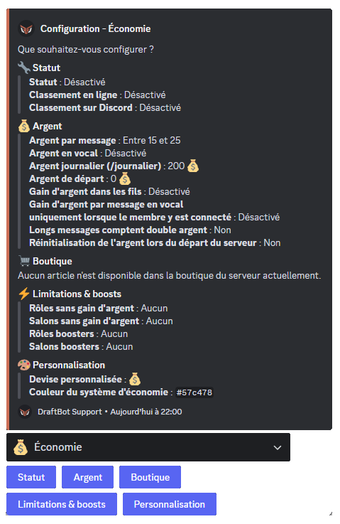

## Introduction
Le module de niveaux DraftBot comprend deux parties :

1. Le système d'expérience
2. Les récompenses

Ces deux systèmes peuvent être configurés depuis le [**panel** de DraftBot](/dashboard/first/levels), ou depuis Discord via la commande \</config>.

## Configurer le système d'expérience

::tabs
  ::tab{ label="Depuis le panel" }

    [⫸ Accéder au panel de **DraftBot**](/dashboard/first/levels)

    Pour activer le module, la première étape est de cliquer sur ce bouton :

    

    Ensuite, l'ensemble des [fonctionnalités](#fonctionnalites-disponibles) apparaît :

    

    ::hint{type="warning"}
      Une fois vos modifications terminées, n'oubliez pas d'enregistrer vos modifications avec le bouton "Enregistrer" situé en bas de page !
    ::
  ::

  ::tab{ label="Via la commande /config" }

    Si vous souhaitez effectuer toute la configuration directement depuis [Discord](https://discord.com/), vous pouvez le faire via la commande \</config>, puis en vous rendant dans l'onglet "Économie". Le menu ressemble alors à ceci :

    

    Le corps du **message** vous permet de consulter en un coup d'œil l'**état actuel** de votre système de niveaux, tandis que les **boutons** situés au dessous vous permettent d'en **modifier la configuration**.

    ::collapse{ label="Statut" }
      Ce menu vous permet de :
      - Activer / Désactiver le système de niveaux,
      - Activer / Désactiver le classement en ligne,
      - Activer / Désactiver le classement sur Discord (<:icon_premium:1096140508625125417>).

      

      ::hint{ type="success" }
        Lorsque vous activez le classement sur Discord, vous avez le choix entre utiliser un salon existant ou laisser DraftBot en créer un pour vous. Vous pouvez même définir le nombre de lignes du classement à afficher !
      ::
    ::

    ::collapse{ label="Expérience" }
      Ce menu vous permet de :
      - Activer / Désactiver / Régler l'expérience reçue à chaque message,
      - Activer / Désactiver / Régler l'expérience reçue en vocal (<:icon_premium:1096140508625125417>),
      - Activer / Désactiver le gain d'expérience dans les fils,
      - Activer / Désactiver le gain d'expérience par message en vocal,
      - Activer / Désactiver/ Régler le double xp pour les messages longs,
      - Choisir si le niveau des membres quittant le serveur est remis à 0.

      
    ::

    ::collapse{ label="Récompenses de niveaux" }
      Ce menu vous permet de configurer les récompenses de niveau, vous pouvez ainsi :
      - Créer / Modifier / Supprimer une [récompense](#recompenses),
      - Réinitialiser les récompenses.

      
    ::

    ::collapse{ label="Annonces" }
      Ce menu sert à configurer les annonces de changement de niveau et de récompenses. Vous pouvez :
      - Configurer les annonces de changement de niveau :
          - Activer / Désactiver les annonces
          - Choisir le salon où faire les annonces
          - Configurer un niveau minimum pour les annonces
          - Personnaliser le message d'annonce
      - Configurer les annonces d'obtention de récompenses :
          - Activer / Désactiver les annonces
          - Choisir le salon où faire les annonces
          - Personnaliser le message d'annonce

      
    ::

    ::collapse{ label="Limitations & Boosts" }
      Ce menu sert à configurer des gains différents en fonction du rôle d'un membre ou du salon dans lequel il poste un message. Vous pouvez :
      - Définir pour quels rôles activer/désactiver le gain d'xp,
      - Définir dans quels salons activer/désactiver le gain d'xp,
      - Définir à quels rôles appliquer un multiplicateur (de x1.5 à x3),
      - Définir à quels salons appliquer un multiplicateur (de x1.5 à x3).

      
    ::

    ::collapse{ label="Personnalisation" }
      Ce menu propose des personnalisations exclusives réservées aux [<:icon_premium:1096140508625125417>serveurs Premium](/premium) :
      - Définir un niveau maximum,
      - Personnaliser la couleur de l'interface des niveaux (orange par défaut).

      
    ::

    ::hint{ type="info" }
      Les fonctionnalités accompagnées du symbole <:icon_premium:1096140508625125417> sont réservées aux abonnés <:icon_premium:1096140508625125417>[DraftBot premium](/premium) !
    ::
  ::
::

### Migration depuis MEE6

Si vous passez de MEE6 à DraftBot, vous avez la possibilité d'importer les niveaux de vos membres pour ne pas perdre leur progression.

::hint{ type="info" }
  Assurez-vous que MEE6 est présent sur votre serveur et que son classement est accessible publiquement.
::

Après avoir cliqué sur **Importer MEE6**, DraftBot vous demandera de confirmer l'importation.

::hint{ type="success" }
  Les niveaux de MEE6 ont été importés avec succès.
::

