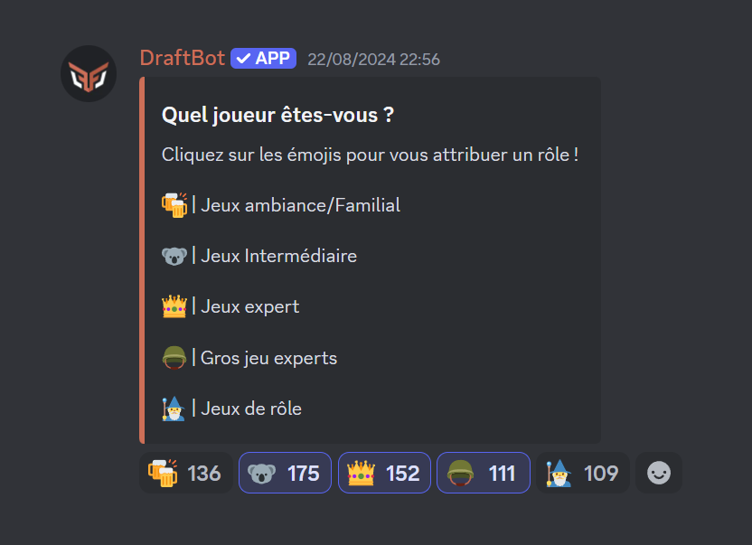
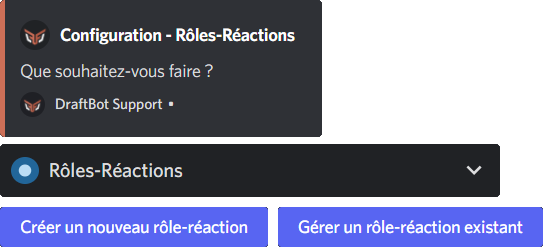
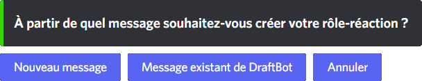
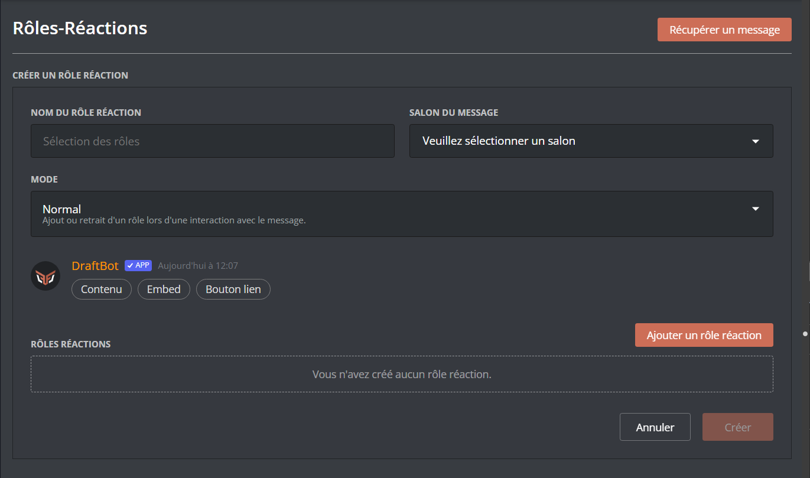
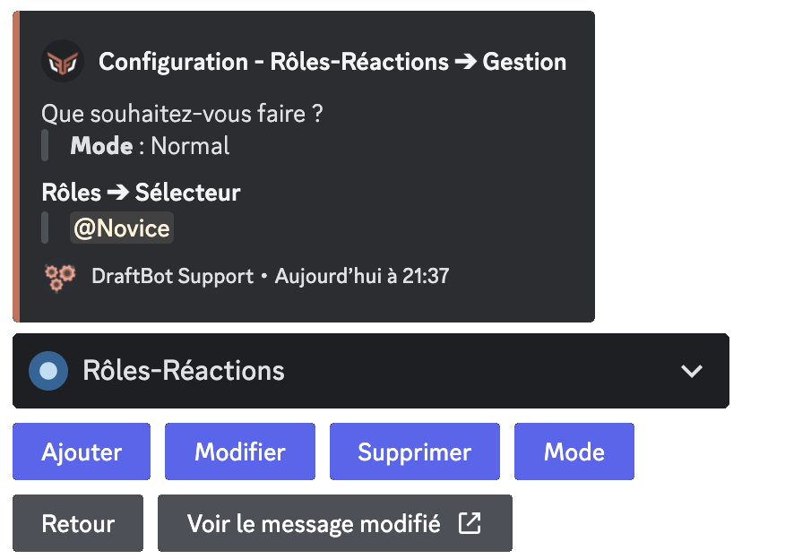
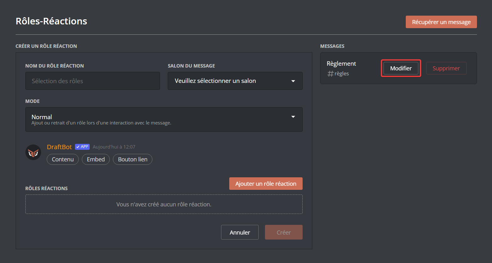

## Présentation

Un message avec des rôles-réactions vous permet de mettre à disposition de vos utilisateurs un message accompagné de réactions permetteant s'auto attribuer des rôles.

## Créer un rôle-réaction

::tabs
  ::tab{ label="Via la commande /config" }
    Pour créer un rôle-réaction, rendez-vous dans \</config> puis dans la rubrique "🧿 Rôles-Réactions" (*dans le sélecteur*). Ensuite, cliquez sur "Créer un nouveau rôle-réaction".

    

    Une fois cela fait, plusieurs choix s'offriront à vous :

    - ***Nouveau message*** ➜ **DraftBot** créera un embed au titre personnalisé.
    - ***Message existant de DraftBot*** ➜ Le bot récupérera un message de **DraftBot** ayant déjà été envoyé.

    ::hint{ type="warning" }
      Pour créer un rôle-réaction à partir d'un message déjà envoyé, il vous faudra récupérer son [identifiant](/docs/autres/recuperer-un-identifiant#identifiant-dun-message).
    ::

    ::hint{ type="info" }
      Si vous souhaitez créer un message pour votre rôle-réaction, voici les différentes possibilités :

      - *Depuis la commande \</envoyer>* : Permet d'envoyer un message simple sous l'identité de **DraftBot**.
      - *Depuis l'Embed Creator du [panel](/dashboard/first/messages)* : Permet la création complète et facile d'un message ou d'un embed entièrement personnalisable.
    ::

    

    ::hint{ type="warning" }
      Les rôles-réactions ne peuvent être ajoutés qu'aux messages envoyés par **DraftBot**.
    ::

    L'intégralité de la création est ensuite guidée par **DraftBot**, il vous demandera le rôle devant être ajouté lors d'une interaction avec le message et le format du rôle-réaction.

    ::hint{ type="info" }
      Il est possible de donner un rôle temporairement un choisissant les boutons comme format.
    ::

    ::hint{ type="success" }
      Félicitations ! Le rôle-réaction est maintenant créé. Nous allons pouvoir y ajouter d'autres rôles et continuer à le personnaliser.
    ::
  ::

  ::tab{ label="Via le panel" }
    [Accéder au panel des rôles-réactions](/dashboard/first/roles-reactions)

    Pour configurer le système de rôles-réactions, accédez à la page de configuration et sélectionnez le serveur souhaité.

    Tout d'abord, sélectionnez le salon dans lequel sera envoyé le message de rôle-réaction via le sélecteur situé au dessus de l'Embed Creator.

    Voici les différentes possibilitées de définir le message sur lequel les membres devront intéragir pour recevoir un rôle :

    - En créant un nouveau message ou / et un embed grâce à l'Embed Creator se trouvant au centre de la page.
    - En utilisant un message de **DraftBot** préalablement créé. Pour le récupérer, cliquez sur le bouton "`Récupérer un message`" situé en haut à droite de la page. Renseignez ensuite le salon dans lequel se trouve le message, ainsi que l'[identifiant du message](/docs/autres/recuperer-un-identifiant#identifiant-dun-message) à récupérer. Cliquez ensuite sur "Récupérer".

    Ajoutez ensuite vos associations d'émoji et de rôles. Vous pouvez en ajouter jusqu'à 10 par message.

    ::hint{ type="info" }
      Le premium permet de doubler la limite et ajouter jusqu'à 20 rôles réactions par message.
    ::

    Vous pouvez modifier le mode des rôles-réactions du message grâce au sélecteur situé juste en dessous de l'Embed Creator.

    ::hint{ type="info" }
      Vous pouvez nommer vos rôles-réactions. Pour se faire,  rendez-vous dans la liste contenant les rôles-réaction existants puis modifiez le nom du rôle-réaction en cliquant sur "SANS NOM".

      
    ::

    
  ::
::

## Gérer un rôle-réaction

::tabs
  ::tab{ label="Via la commande /config" }
    Pour gérer votre rôle-réaction, rendez vous dans \</config> puis dans la rubrique "🧿 Rôles-Réactions" (*dans le sélecteur*). Ensuite, cliquez sur "Gérer un rôle-réaction existant".

    ::hint{ type="info" }
      Pour accéder au rôle-réaction, vous devrez renseigner l'[identifiant](/docs/autres/recuperer-un-identifiant#identifiant-dun-message) du message contenant le rôle-réaction.
    ::

    ### Ajouter ou retirer un rôle à votre rôle-réaction

    Pour ajouter un nouveau rôle à votre rôle-réaction, vous n'aurez qu'à cliquer sur "Ajouter". **DraftBot** vous demandera ensuite le rôle à ajouter ainsi que le format.

    Pour retirer un rôle de son rôle-réaction, vous devrez cliquer sur "Supprimer". Le bot demandera par la suite le rôle à enlever.

    ### Modifier un rôle-réaction

    Si vous souhaitez changer le rôle que le membre recevra en interagissant avec un bouton, une réaction ou un rôle à choix dans un sélecteur, cliquez sur "Modifier". **DraftBot** vous invitera à sélectionner le rôle à modifier et celui par lequel vous souhaitez le remplacer.

    ### Les différents modes

    Les modes servent à modifier la manière dont vos membres pourront sélectionner les rôles et la manière dont ils les garderont.
    Pour modifier le mode d'un rôle-réaction, cliquez sur "Mode".

    Le seul mode disponible à tous les formats est le mode *Normal* (ajout ou retrait d'un rôle lors d'une interaction avec le message).

    - *Inversé* : Suppression du rôle lors de l'ajout de la réaction et ajout du rôle lors du retrait de celle-ci.
    - *Simple* : Ajout ou retrait du rôle lors de l'ajout de la réaction, la réaction est immédiatement retirée.
    - *Ajout du rôle définitif* : Retrait de la réaction de l'utilisateur lors de l'ajout du rôle et impossibilité de retirer le rôle.
    - *Retrait du rôle définitif* : Retrait de la réaction de l'utilisateur lors du retrait du rôle et impossibilité de se remettre le rôle.

    

    ::hint{ type="success" }
      Vous savez maintenant comment gérer votre rôle-réaction !
    ::
  ::

  ::tab{ label="Via le panel" }
    [Accéder au panel de **DraftBot**](/dashboard/first/roles-reactions)

    Pour gérer un rôle-réaction existant, rendez vous tout d'abord sur le panel via le lien ci-dessus puis dans la rubrique "Rôles-Réactions".

    À droite de la page, vous retrouverez la liste contenant tous les rôles-réactions existants sur le serveur. Pour en modifier un, cliquer sur "Modifier".

    Vous pourrez par la suite modifier les rôles-réactions de différentes façons :

    - En modifiant le message du rôle-réaction via l'Embed Creator se trouvant au centre de la page.
    - En modifiant le mode du rôle-réaction à l'aide du sélecteur se trouvant juste en dessous de l'Embed Creator.
    - En ajoutant, modifiant ou supprimant un rôle-réaction dans la section se trouvant en dessous du sélecteur de mode.

    ::hint{ type="success" }
      Enfin, cliquez sur "Modifier" : votre rôle-réaction est modifié !
    ::

    
  ::
::