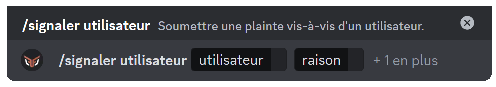
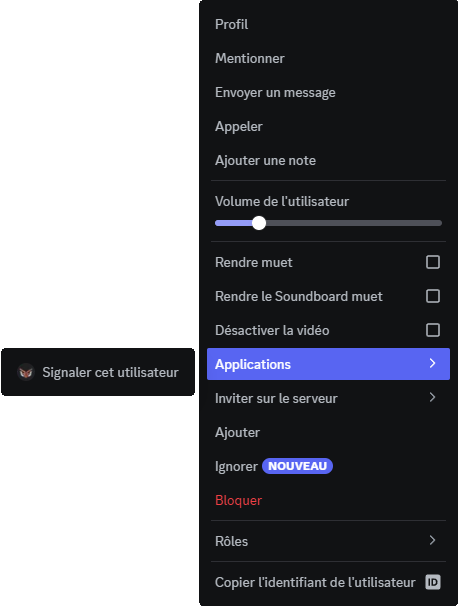
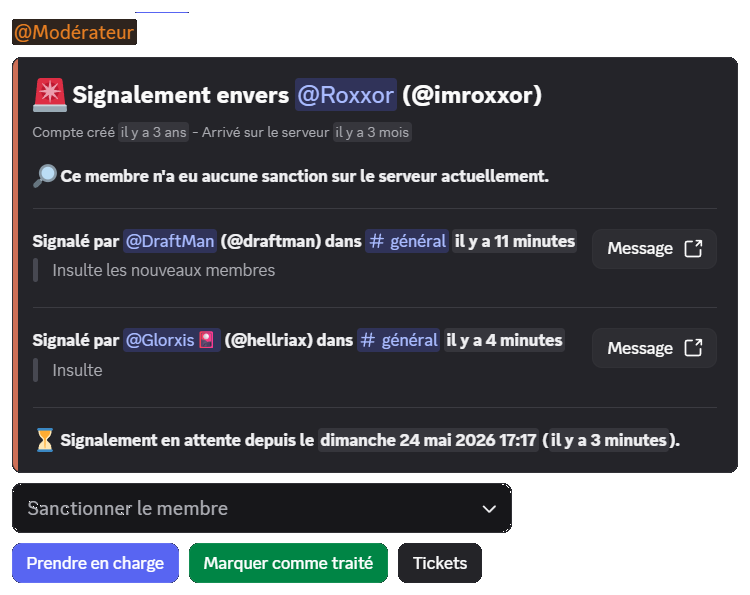
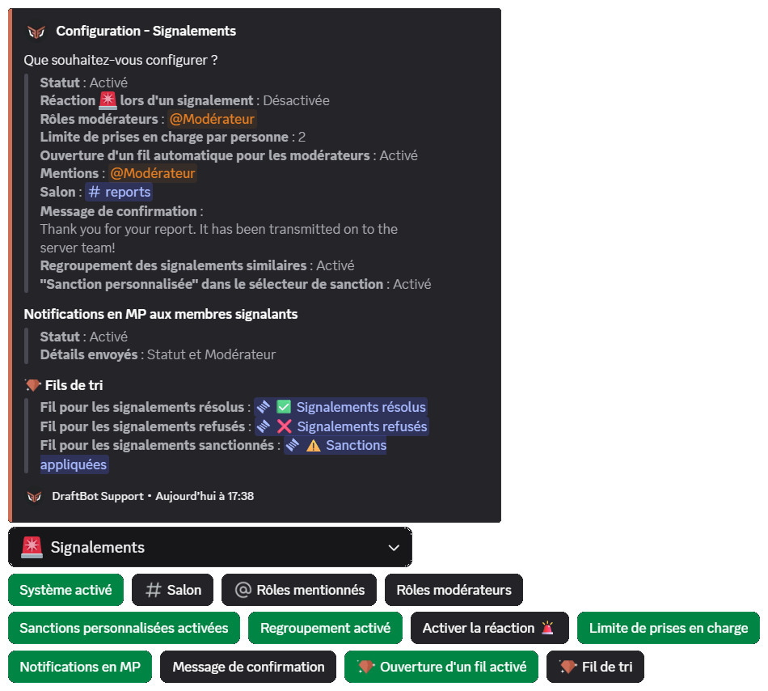
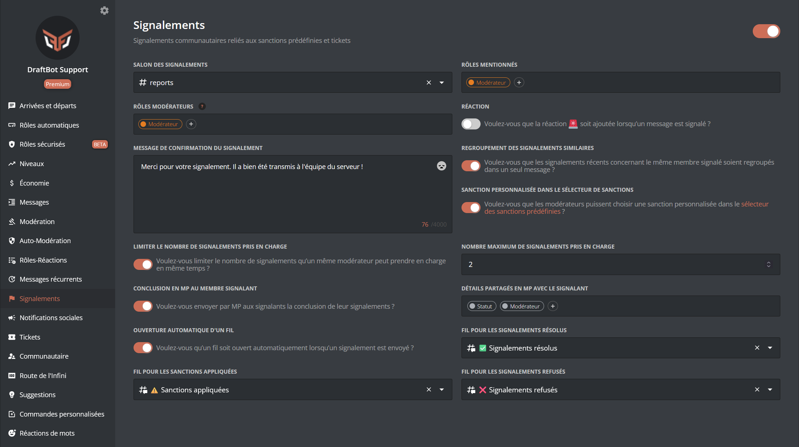
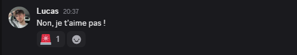

## Utilisation

Pour effectuer un signalement, il suffit d'exécuter la commande \</signaler>. Vous sélectionnez l'utilisateur ou le message qui ne respecte pas les règles qui ont été instaurées sur le serveur.

Lors du signalement d'un **utilisateur**, l'option `source` permet d'indiquer où l'infraction a été constatée (salon textuel, vocal, message privé ou autre).

Vous pouvez également joindre une capture (PNG, JPEG ou GIF) via l'option `image`, disponible sur les deux variantes de la commande.

Vous pouvez aussi passer par le menu contextuel de Discord : clic droit sur un membre → **Applications** → **Signaler cet utilisateur**, ou clic droit sur un message → **Applications** → **Signaler ce message**. Un formulaire s'ouvre alors pour saisir la raison, la source (pour un utilisateur).

## Gestion des signalements

Une fois qu'une personne a signalé un utilisateur ou un message, vous recevrez un **message de signalement** dans le salon que vous aurez défini auparavant :

Le message regroupe les informations utiles sur le membre signalé (date d'arrivée sur le serveur, date de création du compte, accès rapide à l'historique des sanctions via le bouton **Voir les sanctions** (affiché uniquement au membre qui clique) ainsi que le contexte du signalement (salon, source, lien vers le message signalé).

Vous aurez alors différentes possibilités :

- "**Prendre en charge**" ➜ Indique que vous êtes en train de vous occuper du signalement. Si un autre modérateur a déjà pris le signalement en charge, une confirmation vous sera demandée avant de vous ajouter à la liste.

- "**Marquer comme traité**" ➜ Clôture le signalement.

Vous pouvez ensuite sélectionner l'issue à donner au signalement parmi les options suivantes : **Membre sanctionné**, **Signalement résolu**, et **Signalement refusé**. Si le membre signalé a été sanctionné dans l'heure qui précède (via `/ban`, `/mod` ou autre), DraftBot vous proposera de lier cette sanction au signalement en un clic. Une fois l'issue sélectionnée, vous pourrez ajouter un **contexte** facultatif visible sur le message de signalement et également transmis au membre signalant en MP si le détail correspondant est activé dans la configuration des notifications.

- "**Tickets**" ➜ Affiche les tickets déjà liés au signalement et permet d'en ouvrir un nouveau pour le membre signalé ou le membre à l'origine du signalement (disponible uniquement si le système de tickets est activé).

- "**Sanctionner le membre**" ➜ Permet de sanctionner directement le membre signalé via une **sanction prédéfinie** ou une **sanction personnalisée** (**Note**, **Avertir**, **Expulser**, **Réduire au silence**, **Bannir**). Pour une sanction personnalisée temporaire, vous indiquez également une durée (formats `1h`, `30m`, `2d`…). Vous pouvez supprimer les messages récents du membre selon une fenêtre prédéfinie (1h, 6h, 12h, 24h, 3 jours, 7 jours), joindre des images à la sanction, et ajouter un **contexte** : ce contexte est inscrit dans l'historique des sanctions du membre (jamais transmis au membre sanctionné) et complété automatiquement par un lien vers le message de signalement. Le sélecteur n'apparaît que si au moins une sanction prédéfinie est enregistrée ou si l'option **Sanction personnalisée** est activée dans la configuration.

::hint{ type="info" }
  Une fois le signalement clôturé (résolu, refusé ou sanctionné), les boutons d'action sont remplacés par un unique bouton **Remettre le signalement en attente** qui restaure les actions initiales.
::

## Intégrations
Le système de signalement intègre plusieurs fonctionnalités afin d’offrir une expérience utilisateur agréable et pratique.

### Sanctions prédéfinies
Le système intègre des sanctions prédéfinies pour sanctionner les personnes signalées, évitant ainsi d’avoir à exécuter la commande \</mod> à chaque fois.

::hint{ type="info" }
  La configuration du système des sanctions prédéfinies est requise.
::

::card
---
title: Sanctions prédéfinies
icon: twemoji:shield
to: docs/modules/moderation#sanctions-prédéfinies
target: _blank
color: '#22427C'
---
  Une sanction prédéfinie est une sanction préconfigurée servant à centraliser différents actes de modération en une seule commande.
::

### Tickets
Le système intègre également les tickets. Il permet d’ouvrir un ticket pour le membre signalé ou le membre signalant, afin de discuter ou d’en savoir plus sur l'objet du signalement.

::hint{ type="info" }
  La configuration du système de tickets est requise.
::

::card
---
title: Tickets
icon: twemoji:ticket
to: docs/modules/tickets#configuration
target: _blank
color: '#ff4e28'
---
  Offrez la possibilité à vos membres de créer des tickets pour qu'ils puissent avoir une discussion privée avec l'équipe de votre serveur.
::

## Configuration
Pour activer le système de signalement, il faut d’abord le configurer. Vous avez plusieurs moyens de le configurer.

### Activation du système
Avant toute chose, pour que vos membres aient la possibilité de signaler un utilisateur ou un message, il faut activer le système.

::tabs
  ::tab{ label="Depuis la commande /config" }
    Exécutez la commande \</config>, puis sélectionnez depuis le menu déroulant `Signalement`.

    Vous trouverez ensuite un bouton bleu indiquant `Activer le système`. Cliquez dessus pour l’activer.

    
  ::

  ::tab{ label="Depuis le panel"}
    [⫸ Accéder au panel de **DraftBot**](/dashboard/first/reports)

    Vous trouverez ensuite un bouton gris à gauche, sur la même ligne que le titre. Cliquez dessus pour l’activer.

    
  ::
::

### Réaction
Vous pouvez configurer une réaction qui avertit les autres membres ou le destinataire du message que celui-ci a été signalé.

::tabs
  ::tab{ label="Depuis la commande /config" }
    Exécutez la commande \</config>, puis sélectionnez depuis le menu déroulant `Signalement` ➔ `Activer la réaction`.
  ::

  ::tab{ label="Depuis le panel"}
    [⫸ Accéder au panel de **DraftBot**](/dashboard/first/reports)

    Vous trouverez l'option depuis la catégorie "Réaction".
  ::
::

### Fil automatique
Pour une organisation optimale, vous pouvez configurer l’ouverture automatique d’un fil à chaque signalement d’un utilisateur ou d’un message.

::hint{ type="info" }
  Cette fonctionnalité est réservée aux serveurs [premium](/premium) <:icon_premium_:1096140508625125417>.
::

::tabs
  ::tab{ label="Depuis la commande /config" }
    Exécutez la commande \</config>, puis sélectionnez depuis le menu déroulant `Signalement` ➔ `Activer l'ouverture d'un fil`.
  ::

  ::tab{ label="Depuis le panel"}
    [⫸ Accéder au panel de **DraftBot**](/dashboard/first/reports)

    Vous trouverez l'option depuis la catégorie "Ouverture automatique d'un fil".
  ::
::

### Rôles mentionnés
Pour rester informé, vous pouvez ajouter un ou plusieurs rôles qui seront mentionnés à chaque nouveau signalement. Les mentions globales `@everyone` et `@here` sont également prises en charge.

::tabs
  ::tab{ label="Depuis la commande /config" }
    Exécutez la commande \</config>, puis sélectionnez depuis le menu déroulant `Signalement` ➔ `Rôles mentionnés`.
  ::

  ::tab{ label="Depuis le panel"}
    [⫸ Accéder au panel de **DraftBot**](/dashboard/first/reports)

    Vous trouverez l'option depuis la catégorie "Rôles mentionnés".
  ::
::

### Réception des signalements
Il est possible de centraliser tous les signalements des membres dans un seul salon.

::tabs
  ::tab{ label="Depuis la commande /config" }
    Exécutez la commande \</config>, puis sélectionnez depuis le menu déroulant `Signalement` ➔ `Salon`.
  ::

  ::tab{ label="Depuis le panel"}
    [⫸ Accéder au panel de **DraftBot**](/dashboard/first/reports)

    Vous trouverez l'option depuis la catégorie "Salon des signalements".
  ::
::

### Gestion des signalements
Pour simplifier la gestion des signalements, vous pouvez accorder l’accès à un rôle spécifique pour le traitement des signalements.

::tabs
  ::tab{ label="Depuis la commande /config" }
    Exécutez la commande \</config>, puis sélectionnez depuis le menu déroulant `Signalement` ➔ `Rôles modérateurs`.
  ::

  ::tab{ label="Depuis le panel"}
    [⫸ Accéder au panel de **DraftBot**](/dashboard/first/reports)

    Vous trouverez l'option depuis la catégorie "Rôles modérateurs".
  ::
::

### Limite de prises en charge par modérateur
Pour répartir la charge entre modérateurs et éviter qu'un seul ne bloque les signalements en cours, vous pouvez définir le nombre maximum de signalements qu'une même personne peut prendre en charge en simultané (entre 1 et 10).

::tabs
  ::tab{ label="Depuis la commande /config" }
    Exécutez la commande \</config>, puis sélectionnez depuis le menu déroulant `Signalement` ➔ `Limite de prises en charge`.
  ::

  ::tab{ label="Depuis le panel"}
    [⫸ Accéder au panel de **DraftBot**](/dashboard/first/reports)

    Vous trouverez l'option depuis la catégorie "Limite de prises en charge par personne".
  ::
::

### Regroupement des signalements similaires
Lorsque cette option est activée, les signalements visant le même membre dans un court intervalle (15 minutes) sont regroupés afin d'éviter d'avoir plusieurs messages quasiment identiques dans le salon de signalements. Les nouveaux signalements viennent enrichir le message existant.

::tabs
  ::tab{ label="Depuis la commande /config" }
    Exécutez la commande \</config>, puis sélectionnez depuis le menu déroulant `Signalement` ➔ `Activer le regroupement`.
  ::

  ::tab{ label="Depuis le panel"}
    [⫸ Accéder au panel de **DraftBot**](/dashboard/first/reports)

    Vous trouverez l'option depuis la catégorie "Regroupement des signalements similaires".
  ::
::

### Sanctions personnalisées
En complément des sanctions prédéfinies, vous pouvez autoriser les modérateurs à appliquer une **sanction personnalisée** depuis le sélecteur "Sanctionner le membre" du message de signalement (note, avertissement, expulsion, mise au silence, bannissement, avec raison et durée libres).

::tabs
  ::tab{ label="Depuis la commande /config" }
    Exécutez la commande \</config>, puis sélectionnez depuis le menu déroulant `Signalement` ➔ `Activer les sanctions personnalisées`.
  ::

  ::tab{ label="Depuis le panel"}
    [⫸ Accéder au panel de **DraftBot**](/dashboard/first/reports)

    Vous trouverez l'option depuis la catégorie `"Sanction personnalisée" dans le sélecteur de sanction`.
  ::
::

### Notifications en MP aux signalants
Vous pouvez informer automatiquement par message privé les membres ayant effectué un signalement lorsque celui-ci est **clôturé** (résolu, refusé ou sanctionné). Vous choisissez quels détails leur transmettre parmi : **Statut**, **Modérateur**, **Contexte** et **Sanction**. Si aucun détail n'est sélectionné, le membre reçoit uniquement la confirmation que son signalement a été traité.

::hint{ type="info" }
  Les membres peuvent désactiver eux-mêmes ces notifications via un bouton directement présent sur le message reçu en MP.
::

::tabs
  ::tab{ label="Depuis la commande /config" }
    Exécutez la commande \</config>, puis sélectionnez depuis le menu déroulant `Signalement` ➔ `Notifications en MP`.
  ::

  ::tab{ label="Depuis le panel"}
    [⫸ Accéder au panel de **DraftBot**](/dashboard/first/reports)

    Vous trouverez l'option depuis la catégorie "Notifications en MP aux membres signalants".
  ::
::

### Message de confirmation
Vous pouvez personnaliser le message de confirmation pour informer vos utilisateurs que leurs signalements ont bien été envoyés.

::tabs
  ::tab{ label="Depuis la commande /config" }
    Exécutez la commande \</config>, puis sélectionnez depuis le menu déroulant `Signalement` ➔ `Message de confirmation`.
  ::

  ::tab{ label="Depuis le panel"}
    [⫸ Accéder au panel de **DraftBot**](/dashboard/first/reports)

    Vous trouverez l'option depuis la catégorie "Message de confirmation du signalement".
  ::
::

Vous pouvez personnaliser votre message avec différentes variables propres au signalement :

| Variable | Description | Exemple |
|----------|-------------|---------|
| `{target}` | Membre signalé | @draftman |
| `{target_message.url}` | Lien du message signalé | https://discord.com/... |
| `{reason}` | Motif du signalement | Spam |

::hint{ type="info" }
  Cette liste n'est pas exhaustive, d'autres [variables globales](/docs/autres/variables) sont également disponibles.
::

### Fil de tri
Vous pouvez trier vos signalements traités dans plusieurs fils pour une meilleure organisation.

Voici les différents fils :
- Fil pour les signalements résolus
- Fil pour les signalements sanctionnés
- Fil pour les signalements refusés

::hint{ type="info" }
  Cette fonctionnalité est réservée aux serveurs [premium](/premium) <:icon_premium_:1096140508625125417>.
::

::tabs
  ::tab{ label="Depuis la commande /config" }
    Exécutez la commande \</config>, puis sélectionnez depuis le menu déroulant `Signalement` ➔ `Fil de tri`.
  ::

  ::tab{ label="Depuis le panel"}
    [⫸ Accéder au panel de **DraftBot**](/dashboard/first/reports)

    Vous trouverez l'option depuis les catégories :

    - "Fil pour les signalements résolus"
    - "Fil pour les signalements sanctionnés"
    - "Fil pour les signalements refusés"
  ::
::
