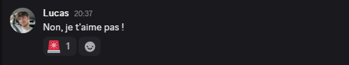

## Utilisation

Pour effectuer un signalement, il suffit d'exécuter la commande \</signaler>. Vous sélectionnez soit l'utilisateur ou le message qui ne respecte pas les règles que vous avez instaurées.

Vous pouvez aussi utiliser l'option `Application`, qui vous permet d'effectuer un signalement en quelques clics. Pour cela, faites un clic droit sur l'élément concerné, puis cliquez sur `Application`. Ensuite, vous sélectionnez soit **l'utilisateur**, soit le **message** concerné.

## Gestion des signalements

Une fois qu'une personne aura signalé un utilisateur ou un message, vous recevrez un **message de signalement** dans le salon que vous aurez défini auparavant :

Vous aurez alors différentes possibilités :

- "**Prendre en charge**" ➜ Indique que vous êtes en train de vous occuper du signalement.

- "**Marquer comme traité**" ➜ Marque le signalement comme résolu.

Vous pouvez ensuite sélectionner la raison de la résolution du signalement parmi les options suivantes : **Membre sanctionné**, **Signalement résolu**, et **Signalement refusé**. Une fois la raison sélectionnée, vous pourrez ajouter un commentaire facultatif.

- "**Ouvrir un ticket**" ➜ Permet d'ouvrir un ticket pour le membre concerné ou le membre à l'origine du signalement (disponible uniquement si le système de tickets est activé).

- "**Sanctionner le membre**" ➜ Permet de sanctionner le membre signalé avec une sanction prédéfinie (disponible uniquement si des sanctions prédéfinies sont enregistrées).

::hint{ type="info" }
  Vous pourrez toujours remettre le signalement en attente via le bouton **Remettre le signalement en attente** situé sur le message de signalement.
::

## Intégrations
Le système de signalement intègre plusieurs systèmes afin d’offrir une expérience utilisateur agréable et pratique.

### Sanctions prédéfinies
Le système intègre des sanctions prédéfinies pour sanctionner les personnes signalées, évitant ainsi d’avoir à exécuter la commande <\/mod> à chaque fois.

::hint{ type="info" }
  La configuration du système des sanctions prédéfinies est requise.
::

::card
---
title: Sanctions prédéfinies
icon: twemoji:shield
to: docs/modules/moderation#sanctions-prédéfinies
target: _blank
color: '#22427C'
---
  Une sanction prédéfinie est une sanction préconfigurée servant à centraliser différents actes de modération en une seule commande.
::

### Tickets
Le système intègre également les tickets. Il permet d’ouvrir un ticket pour le membre signalé ou le membre signalant, afin de discuter ou d’en savoir plus sur l'objet du signalement.

::hint{ type="info" }
  La configuration du système de tickets est requise.
::

::card
---
title: Tickets
icon: twemoji:ticket
to: docs/modules/tickets#configuration
target: _blank
color: '#ff4e28'
---
  Offrez la possibilité à vos membres de créer des tickets pour qu'ils puissent avoir une discussion privée avec l'équipe de votre serveur.
::

## Configuration
Pour activer le système de signalement, il faut d’abord le configurer. Vous avez plusieurs moyens de le configurer

### Activation du système
Avant toute chose, pour que vos membres aient la possibilité de signaler un utilisateur ou un message, il faut activer le système.

::tabs
  ::tab{ label="Depuis la commande /config" }
    Exécuter la commande \</config>, puis sélectionner depuis le menu déroulant `Signalement`.

    Vous trouverez ensuite un bouton bleu indiquant `Activer le système`. Cliquez dessus pour l’activer.

    
  ::

  ::tab{ label="Depuis le panel"}
    [⫸ Accéder au panel de **DraftBot**](/dashboard/first/reports)

    Vous trouverez ensuite un bouton gris à gauche, sur la même ligne que le titre. Cliquez dessus pour l’activer.

    
  ::
::

### Réaction
Vous pouvez configurer une réaction qui avertit les autres membres ou le destinataire du message que celui-ci a été signalé.

::tabs
  ::tab{ label="Depuis la commande /config" }
    Exécuter la commande \</config>, puis sélectionner depuis le menu déroulant `Signalement` ➔ `Activer la réaction`.
  ::

  ::tab{ label="Depuis le panel"}
    [⫸ Accéder au panel de **DraftBot**](/dashboard/first/reports)

    Vous trouverez l'option, depuis la catégorie "Réaction".
  ::
::

### Fil automatique
Pour une organisation optimale, vous pouvez configurer l’ouverture automatique d’un fil à chaque signalement d’un utilisateur ou d’un message.

::hint{ type="info" }
  Cette fonctionnalité est réservée aux serveurs [premium](/premium) <:icon_premium_:1096140508625125417>.
::

::tabs
  ::tab{ label="Depuis la commande /config" }
    Exécuter la commande \</config>, puis sélectionner depuis le menu déroulant `Signalement` ➔ `Activer l'ouverture d'un fil.`.
  ::

  ::tab{ label="Depuis le panel"}
    [⫸ Accéder au panel de **DraftBot**](/dashboard/first/reports)

    Vous trouverez l'option, depuis la catégorie "Ouverture automatique d'un fil".
  ::
::

### Rôle mentionné
Pour rester informé, vous pouvez ajouter un rôle qui vous permettra d’être mentionné à chaque nouveau signalement.

::tabs
  ::tab{ label="Depuis la commande /config" }
    Exécuter la commande \</config>, puis sélectionner depuis le menu déroulant `Signalement` ➔ `Rôle mentionné`.
  ::

  ::tab{ label="Depuis le panel"}
    [⫸ Accéder au panel de **DraftBot**](/dashboard/first/reports)

    Vous trouverez l'option, depuis la catégorie "Rôle mentionné".
  ::
::

### Réception des signalements
Il est possible de centraliser tous les signalements des membres dans un seul salon.

::tabs
  ::tab{ label="Depuis la commande /config" }
    Exécuter la commande \</config>, puis sélectionner depuis le menu déroulant `Signalement` ➔ `Salon`.
  ::

  ::tab{ label="Depuis le panel"}
    [⫸ Accéder au panel de **DraftBot**](/dashboard/first/reports)

    Vous trouverez l'option, depuis la catégorie "Salon des signalements".
  ::
::

### Gestion des signalements
Pour simplifier la gestion des signalements, vous pouvez accorder l’accès à un rôle spécifique pour le traitement des signalements.

::tabs
  ::tab{ label="Depuis la commande /config" }
    Exécuter la commande \</config>, puis sélectionner depuis le menu déroulant `Signalement` ➔ `Rôles modérateurs`.
  ::

  ::tab{ label="Depuis le panel"}
    [⫸ Accéder au panel de **DraftBot**](/dashboard/first/reports)

    Vous trouverez l'option, depuis la catégorie "Rôles modérateurs".
  ::
::

### Message de confirmation
Vous pouvez personnaliser le message de confirmation pour informer vos utilisateurs que leurs signalements ont bien été envoyés.

::tabs
  ::tab{ label="Depuis la commande /config" }
    Exécuter la commande \</config>, puis sélectionner depuis le menu déroulant `Signalement` ➔ `Message de confirmation`.
  ::

  ::tab{ label="Depuis le panel"}
    [⫸ Accéder au panel de **DraftBot**](/dashboard/first/reports)

    Vous trouverez l'option, depuis la catégorie "Message de confirmation du signalement".
  ::
::

Vous pouvez personnaliser votre message avec différentes variables :

| Variable | Description | Exemple |
|----------|-------------|---------|
| `{target}` | Membre signalé | @draftman |
| `{target_message.url}` | Lien du message signalé | https://discord.com/... |
| `{reason}` | Motif du signalement | Spam |

*En plus des [autres variables](/docs/autres/variables) déjà disponibles globalement !*

### Fil de tri
Vous pouvez trier vos signalements traités dans plusieurs fils pour une meilleure organisation.

Voici les différents fils :
- Fil pour les signalements résolus
- Fil pour les signalements sanctionnés
- Fil pour les signalements refusés

::hint{ type="info" }
  Cette fonctionnalité est réservée aux serveurs [premium](/premium) <:icon_premium_:1096140508625125417>.
::

::tabs
  ::tab{ label="Depuis la commande /config" }
    Exécuter la commande \</config>, puis sélectionner depuis le menu déroulant `Signalement` ➔ `Fil de tri`.
  ::

  ::tab{ label="Depuis le panel"}
    [⫸ Accéder au panel de **DraftBot**](/dashboard/first/reports)

    Vous trouverez l'option, depuis les catégories :

    - "Fil pour les signalements résolus"
    - "Fil pour les signalements sanctionnés
    - "Fil pour les signalements refusés"
  ::
::
