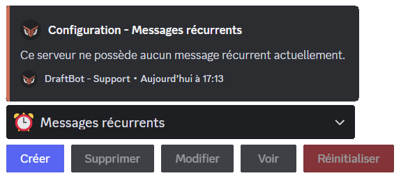
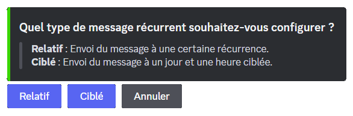
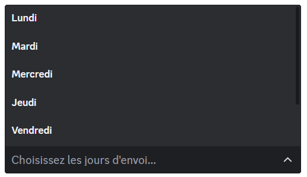
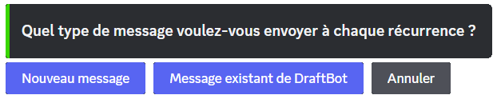
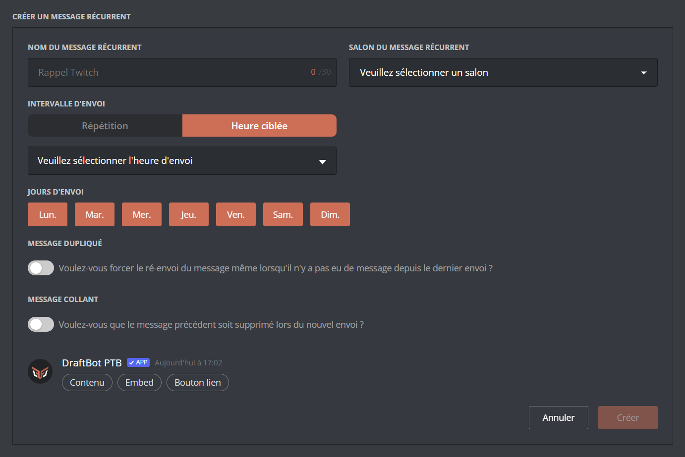

## Créer un message récurrent

::tabs
  ::tab{ label="Via la commande /config" }

    ::hint{ type="warning" }
      Vous avez la possibilité, lors de la configuration, si vous souhaitez un message contenant un embed, de sélectionner un message déjà créé. Pour se faire, rendez-vous sur le [panel](/dashboard/first/messages) dans la catégorie "message".
    ::

    Pour commencer, exécutez la commande \</config> puis sélectionnez ":alarm_clock: Messages récurrents" dans le sélecteur. Pour terminer, cliquez sur `"Créer"`. Draftbot vous guidera tout au long de la procédure :

    

    ### Nommer votre message récurrent

    La première chose à faire sera de nommer votre message. Ce nom permet de le distinguer dans la liste de vos messages récurrents.

    ::hint{ type="info" }
      Ce nom n'est pas visible par les membres de votre serveur.
    ::

    ### Intervalle d'envoi

    La prochaine chose à faire est de définir la fréquence à laquelle le message doit être envoyé. Vous avez le choix entre deux types d'intervalles :

    ***Relatif** : Envoi du message à une certaine récurrence.*

    ***Ciblé** : Envoi du message à un jour et une heure ciblée.*

    

    ::tabs
      ::tab{ label="Relatif" }

        ### Heure d'envoi

        Commencez d'abord par entrer la récurrence à laquelle vous souhaitez que votre message soit envoyé.

        Ensuite, vous avez la possibilité de limiter les horaires d'envoi de votre message récurrent.  Le bot vous demandera une plage horaire durant laquelle le message doit être envoyé.

        ::hint{ type="info" }
          Cela veut dire que pendant l'intervalle de temps que vous définissez ici, votre message s'enverra à chaque récurrence que vous avez configurée à l'étape précédente.
        ::

        ### Jours d'envoi

        Vous pouvez également décider de limiter l'envoi de votre message récurrent à certains jours. Pour ce faire, choisissez les jours où le message **doit être envoyé** dans le sélecteur.

        
      ::

      ::tab{ label="Ciblé" }

        ### Heure d'envoi

        Commencez d'abord par entrer l'heure à laquelle vous souhaitez que votre message soit envoyé.

        ::hint{ type="info" }
          *L'heure est basée sur [le fuseau horaire français](https://time.is/fr/Paris)*.
        ::

        ### Jours d'envoi
        Vous pouvez également décider de limiter l'envoi de votre message récurrent à certains jours. Pour se faire, choisissez les jours où le message __doit être envoyé__ dans le sélecteur.

        
      ::
    ::

    ### Définir le message

    Pour ajouter votre message, vous avez deux possibilités :

    - Sélectionner un message existant en récupérant son [identifiant](/docs/autres/recuperer-un-identifiant#identifiant-dun-message).
    - Créer un message directement depuis le bouton `"Nouveau message"`.

    ::hint{ type="info" }
      N'hésitez pas à utiliser le [Markdown](https://support.discord.com/hc/en-us/articles/210298617-Markdown-Text-101-Chat-Formatting-Bold-Italic-Underline) de Discord.
    ::

    ::hint{ type="warning" }
      Ce message est assez peu personnalisable. C'est pourquoi nous vous conseillons de créer un message entièrement customisé depuis le [panel](/dashboard/first/messages) et de le sélectionner par la suite grâce à son [identifiant](/docs/autres/recuperer-un-identifiant#identifiant-dun-message).
    ::

    

    #### Sélectionner le salon

    Finalement, sélectionnez le salon dans lequel le message doit être envoyé.

    #### Options supplémentaires

    Le bot terminera par vous poser différentes questions :

    - Voulez-vous que le message récurrent ne soit pas envoyé lorsqu'il est le dernier message du salon ? ➜ Cela permet de ne pas avoir plusieurs fois le même message à la suite lorsqu'il n'y a pas eu d'activité depuis le dernier envoi.

    - Voulez-vous que le dernier message envoyé soit supprimé ? ➜ Cette fonctionnalité permet de garder la dernière version du message en bas du salon et de rendre ce dernier plus propre. *(Avantage [premium ✨](/premium/))*

    ::hint{ type="success" }
      Félicitations ! Votre message récurrent est maintenant créé et configuré ! :tada:
    ::
  ::

  ::tab{ label="Via le panel" }

    [Tout d'abord, accédez au panel de DraftBot.](/dashboard/user)

    Rendez-vous ensuite dans la rubrique "Messages récurrents". Une fois fait, vous pourrez configurer une multitude d'options :

    - `"Nom du message récurrent"` ➜ Donner un nom à votre message pour le retrouver dans la liste de tous vos messages récurrents !

    ::hint{ type="info" }
      Ce nom n'est pas visible par les membres de votre serveur.
    ::

    - `"Salon du message récurrent"` ➜ Sélectionnez le salon dans lequel le message doit être envoyé.
    - `"Intervalle d'envoi"` ➜ Choisissez le type d'intervalle.

    ::tabs
      ::tab{ label="Répétition" }
        ➜ *Envoi du message à une certaine récurrence.*

        Commencez d'abord par entrer la récurrence à laquelle vous souhaitez que votre message soit envoyé.

        Ensuite, vous avez la possibilité de limiter les horaires d'envoi de votre message récurrent. Pour se faire, définissez une plage horaire dans "Heure d'envoi".

        ::hint{ type="info" }
          Cela veut dire que durant l'intervalle de temps que vous définissez ici, votre message s'enverra à chaque récurrence que vous avez configuré lors de l'étape d'avant.
        ::
      ::

      ::tab{ label="Heure ciblée" }
        ➜ *Envoi du message à un jour et une heure ciblée.*

        Définissez simplement l'heure à laquelle vous souhaitez que votre message soit envoyé dans le sélecteur.

        ::hint{ type="info" }
          *L'heure est basée sur [le fuseau horaire français](https://time.is/fr/Paris)*.
        ::
      ::
    ::

    - `"Jours d'envoi"` ➜ Vous avez la possibilité de restreindre l'envoi du message à certains jours de la semaine.

    ::hint{ type="info" }
      Dans la configuration de base, tous les jours sont des jours d'envoi.
    ::

    - `"Message dupliqué"` ➜ Une fois cette option activée, le message récurrent ne s'enverra pas s'il n'y a pas eu de message depuis le dernier envoi.
    - `"Message collant"` ➜ Lors de l'envoi du message récurrent, le bot supprimera automatiquement le message précédent *(Avantage [premium ✨](/premium/))*

    
  ::
::
