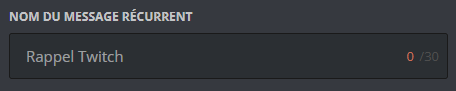
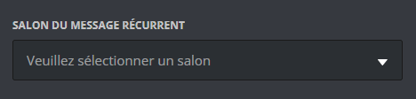
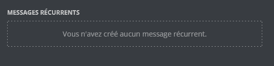

## Créer un message récurrent

::tabs
  ::tab{ label="Via la commande /config" }

  ::hint{ type="danger" }
Nous vous conseillons de créer ton message personnalisé en amont. Pour se faire, rendez-vous sur le [panel](/dashboard/first/messages) dans la catégorie message.  
  ::

Pour commencer, rendez-vous sur la commande `/config` puis sélectionnez ":alarm_clock: Messages récurrents" dans le sélecteur. Pour terminer, cliquez sur "Créer". Draftbot vous guidera tout au long de la procédure :

### Configurer un message récurrent

La première chose à faire sera de nommer votre message. Ce nom permet de le distinguer dans la liste de vos messages récurrents.

::hint{ type="info" }
Ce nom n'est pas affiché aux membres de votre serveur.
::

#### Interval d'envoi

La prochaine chose à faire est de définir la fréquence à laquelle le message doit être envoyé. Vous avez le choix entre deux types d'intervalles :

> ***Relatif** : Envoi du message à une certaine récurrence.*

> ***Ciblé** : Envoi du message à un jour et une heure ciblée.*

  ::tabs
    ::tab{ label="Relatif" }
      #### Heure d'envoi
    
      Commencez d'abord par entrer la récurrence à laquelle vous souhaitez que votre message soit envoyé.

      Ensuite, vous avez la possibilité de limiter les horaires d'envoi de votre message récurrent. C'est à dire que durant l'intervalle de temps que vous définissez ici, votre message s'enverra à chaque récurrence que vous avez configuré lors de l'étape n°1.

      #### Jour(s) d'envoi
      Par la suite, vous avez le choix de sélectionner les jours où le message récurrent pourrait être envoyé dans les options du sélecteur.

      
    ::

     ::tab{ label="Ciblé" }
    
      #### Heure d'envoi
    
      Commencez d'abord par entrer l'heure à laquelle vous souhaitez que votre message soit envoyé.

      ::hint{ type="info" }
      *L'heure est basée sur [le fuseau horaire français.(https://time.is/fr/Paris){target=_blank}*
      :
    
       #### Jour(s) d'envoi
      Par la suite, vous avez le choix de sélectionner les jours où le message récurrent pourrait être envoyé dans les options du sélecteur.

       

    ::
  ::  

### Votre message

Vous êtes rendu à la création de votre message et vous avez deux possibilitées :
- Sélectionner un message existant en récupérant son [identifiant](https://www.draftbot.fr/docs/autres/recuperer-un-identifiant#identifiant-dun-message){target=_blank}.
- Créer un message directement depuis le bouton "Nouveau message".

::hint{ type="warning" }
Ce message est malheureusement très peu personnalisable. C'est pourquoi nous te conseillons de créer à un message entièrement customisé depuis le [panel](/dashboard/first/messages){target=_blank}
::

  ::hint{ type="info" }
N'hésitez pas à utiliser le [Markdown](https://support.discord.com/hc/en-us/articles/210298617-Markdown-Text-101-Chat-Formatting-Bold-Italic-Underline){target=_blank} de Discord.
  ::
::
  ::tab{ label="Via le panel" }

## L'interface du panel

    ::collapse{ label="Paramètres basiques du message" }

### Nommer le message

La première chose à faire sera de nommer votre message. Ce nom, qui n'est pas affiché aux membres de votre serveur, permet de le distinguer dans la liste de vos messages récurrents.

      

### Sélectionner le salon

Par la suite, vous devrez sélectionner le salon dans lequel sera envoyé le message via un menu déroulant.

    ::
    ::collapse{ label="Envoi du message" }

### Intervalle d'envoi

    - Vous devez sélectionner le type d'intervalle pour l'envoi **"Répétition"** ou **"Heure ciblée"**.

    > ***Répétition** : Envoi du message à une certaine récurrence.*
    > ***Heure ciblée** : Envoi du message à un jour et une heure ciblée.*

### Heure d'envoi

Entrez l'heure à laquelle vous souhaitez que le message soit envoyé.

  

    ::hint{ type="info" }
      *L'heure est basée sur le fuseau horaire français.*
    ::

    ### Jour(s) d'envoi
Par la suite, vous avez le choix de sélectionner les jours où le message récurrent pourrait être envoyé avec des boutons.

  ::hint{ type="warning" }
Après cela vous pourez créer votre message via l'interface de DraftBot ci-dessous.

  ::
    ::

### Liste

Sur le **[panel de DraftBot](/dashboard/user)**, vous pouvez accéder à une liste de vos messages récurrents déjà créés et les modifier, ou les supprimer.

::

## Fonctionnalité suplémantaire

Les fonctionnalités ci-dessous sont disponibles sur les deux systèmes de configuration *( \</config> & via le **[panel de DraftBot](/dashboard/user)** )*. Leur but est de pouvoir ajouter une dernière touche de personnalisation à votre message si vous le souhaitez.

### Message dupliqué

Le **"message dupliqué"** est une option qui permet de forcer le renvoi du message même s'il n'y a pas eu de message depuis le dernier envoi.

### Message collant

Cette fonctionnalité permet de supprimer le message précédent lors d'un nouvel envoi. *(Avantage [premium ✨](https://www.draftbot.fr/premium/) )*

