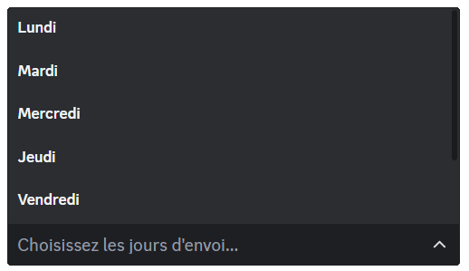
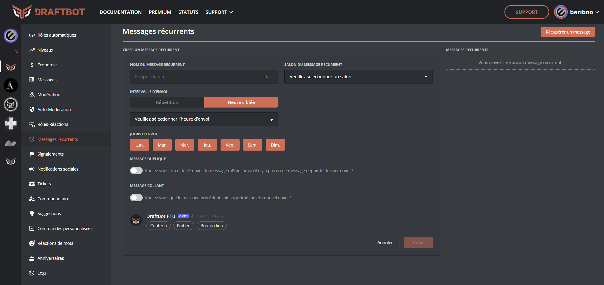
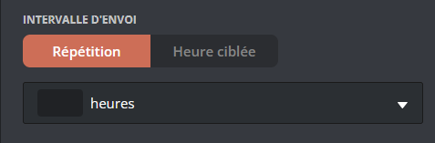
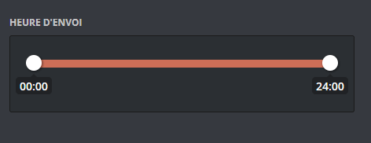
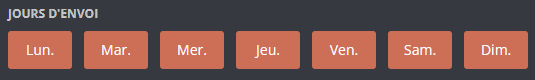
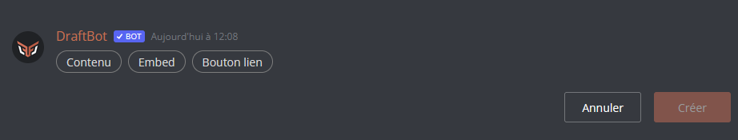

## Créer un message récurrent

::tabs
  ::tab{ label="Via la commande /config" }

    ::hint{ type="warning" }
Vous avez la possibilité, lors de la configuration, si vous souhaitez un message contenant un embed, de sélectionner un message déjà créer. Pour se faire, rendez-vous sur le [panel](/dashboard/first/messages) dans la catégorie "message".  
    ::

Pour commencer, exécutez la commande `/config` puis sélectionnez ":alarm_clock: Messages récurrents" dans le sélecteur. Pour terminer, cliquez sur "Créer". Draftbot vous guidera tout au long de la procédure :

### Configurer un message récurrent

La première chose à faire sera de nommer votre message. Ce nom permet de le distinguer dans la liste de vos messages récurrents.

    ::hint{ type="info" }
Ce nom n'est pas visible par les membres de votre serveur.
    ::

### Interval d'envoi

La prochaine chose à faire est de définir la fréquence à laquelle le message doit être envoyé. Vous avez le choix entre deux types d'intervalles :

***Relatif** : Envoi du message à une certaine récurrence.*

***Ciblé** : Envoi du message à un jour et une heure ciblée.*

    ::tabs
      ::tab{ label="Relatif" }
        ### Heure d'envoi
      
        Commencez d'abord par entrer la récurrence à laquelle vous souhaitez que votre message soit envoyé.

        Ensuite, vous avez la possibilité de limiter les horaires d'envoi de votre message récurrent. C'est à dire que durant l'intervalle de temps que vous définissez ici, votre message s'enverra à chaque récurrence que vous avez configuré lors de l'étape n°1.

        ### Jour(s) d'envoi
        Par la suite, vous avez le choix de sélectionner les jours où le message récurrent pourrait être envoyé dans les options du sélecteur.

        
      ::

      ::tab{ label="Ciblé" }
      
        ### Heure d'envoi
      
        Commencez d'abord par entrer l'heure à laquelle vous souhaitez que votre message soit envoyé.

        ::hint{ type="info" }
        *L'heure est basée sur [le fuseau horaire français](https://time.is/fr/Paris){target=_blank}* :
        ::
      
        ### Jour(s) d'envoi
        Par la suite, vous avez le choix de sélectionner les jours où le message récurrent pourrait être envoyé dans les options du sélecteur.

        

      ::
    ::  

### Votre message

Vous êtes rendu à la création de votre message et vous avez deux possibilitées :

- Sélectionner un message existant en récupérant son [identifiant](https://www.draftbot.fr/docs/autres/recuperer-un-identifiant#identifiant-dun-message){target=_blank}.
- Créer un message directement depuis le bouton "Nouveau message".

    ::hint{ type="warning" }
Ce message est malheureusement très peu personnalisable. C'est pourquoi nous te conseillons de créer à un message entièrement customisé depuis le [panel](/dashboard/first/messages){target=_blank}.
    ::

    ::hint{ type="info" }
N'hésitez pas à utiliser le [Markdown](https://support.discord.com/hc/en-us/articles/210298617-Markdown-Text-101-Chat-Formatting-Bold-Italic-Underline){target=_blank} de Discord.
    ::
  
### Fonctionnalités supplémentaires

- "Message dupliqué" ➜ Une fois cette option activée, le message récurrent ne s'enverra pas si il n'y a pas eu de messages depuis le dernier envoi.
- Message collant ➜ *(Avantage [premium ✨](https://www.draftbot.fr/premium/) )*
  
  ::
  
  ::tab{ label="Via le panel" }

[Accéder au panel de DraftBot](https://www.draftbot.fr/dashboard/user){target=_blank}

Rendez-vous ensuite dans la rubrique "Messages récurrents", une fois là-bas, vous pourrez configurer une multitude d'options :

- "Nom du message récurrent" ➜ Donner un nom à votre message pour le retrouver dans la liste de tous vos messages récurrents !

    ::hint{ type="info" }
Ce nom n'est pas visible par les membres de votre serveur.
    ::

- "Salon du message récurrent" ➜ Sélectionner le salon dans lequel le message doit être envoyé.
- "Jours d'envoi" ➜ Vous avez la possibilité de restreindre l'envoi du message à certains jours de la semaine.
- "Message dupliqué" ➜ Une fois cette option activée, le message récurrent ne s'enverra pas si il n'y a pas eu de messages depuis le dernier envoi.
- Message collant ➜ *(Avantage [premium ✨](https://www.draftbot.fr/premium/) )*

### Intervalle d'envoi

    - Vous devez sélectionner le type d'intervalle pour l'envoi **"Répétition"** ou **"Heure ciblée"**.

    > ***Répétition** : Envoi du message à une certaine récurrence.*
    > ***Heure ciblée** : Envoi du message à un jour et une heure ciblée.*

### Heure d'envoi

Entrez l'heure à laquelle vous souhaitez que le message soit envoyé.

  

    ::hint{ type="info" }
      *L'heure est basée sur le fuseau horaire français.*
    ::

    ### Jour(s) d'envoi
Par la suite, vous avez le choix de sélectionner les jours où le message récurrent pourrait être envoyé avec des boutons.

  ::hint{ type="warning" }
Après cela vous pourez créer votre message via l'interface de DraftBot ci-dessous.

  ::

## Fonctionnalité suplémentaire

Les fonctionnalités ci-dessous sont disponibles sur les deux systèmes de configuration *( \</config> & via le **[panel de DraftBot](/dashboard/user)** )*. Leur but est de pouvoir ajouter une dernière touche de personnalisation à votre message si vous le souhaitez.

### Message dupliqué

Le **"message dupliqué"** est une option qui permet de forcer le renvoi du message même s'il n'y a pas eu de message depuis le dernier envoi.

### Message collant

Cette fonctionnalité permet de supprimer le message précédent lors d'un nouvel envoi.
