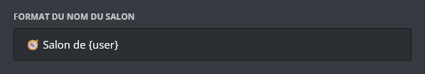

## Utiliser des salons temporaires

Pour obtenir votre salon vocal, il vous faudra rejoindre le salon vocal "hub". Il s'agit d'un salon vocal permettant la création de votre salon vocal temporaire. Il se nomme par défaut `➕ Créer votre salon`.

Lorsque vous créerez un salon vocal temporaire, vous aurez la possibilité de configurer votre salon par le biais d'un [message](#utilisation-du-configurateur) *(option désactivable)*.

Lorsque le dernier membre présent dans le salon se déconnectera, ce dernier sera automatiquement supprimé par **DraftBot**.

## Utilisation du configurateur

Lorsque vous créez un salon vocal, un embed apparaît dans le **salon textuel du vocal**. Il contient toutes les permissions de modération liées au salon vocal.

::hint{ type="warning" }
  Cet embed permet notamment d'utiliser toutes les permissions de modération, et ce, même si le membre n'a pas activé l'authentification à deux facteurs (puisque l'utilisateur passe par le bot et non pas par son compte).
::

::collapse{ label="Liste détaillée de chaque fonction de l'embed de configuration" }
  - **Ouvert** : Cette fonction permet d'ouvrir le salon à tous les membres, excepté ceux de la **liste noire** et des dérogations par défaut.

  ::hint{ type="info" }
    En mode ouvert, les utilisateurs présents la liste blanche ont les permissions micro, vidéo et soundboards.
  ::

  - **Fermé** : Cette fonction verrouille le salon à tous les membres, excepté ceux de la **liste blanche** et les dérogations par défaut.

  - **Liste Blanche** : Cette fonction permet d'ajouter des membres qui seront **autorisés à rejoindre** le salon peu importe le mode (Public, Fermé, Privé) et recevront toutes les permissions micro, vidéo & soundboards.
  - **Liste Noire** : Cette fonction permet d'ajouter des membres qui **ne pourront pas rejoindre** le salon vocal.

  - **Purge** : La purge permet de déconnecter tous les membres présents dans le salon à l'exception de ceux de la liste blanche, du propriétaire du salon, des modérateurs et administrateurs.
  - **Micro** : Cette fonction permet d'activer/désactiver le micro de tous les participants du salon vocal.
  - **Vidéo** : Tout comme la fonction précédente, elle permet d'autoriser/refuser la permission d'utiliser la caméra ou le partage d'écran de tous les participants du salon vocal.
  - **Soundboard** : Cette fonction permet d'activer/désactiver l'utilisation des soundboards pour tous les participants du salon vocal.

  - **Transférer la propriété** : Cette fonction permet de transférer les droits de gestion du salon vocal à quelqu'un d'autre.

  ::hint{ type="info" }
    Si le propriétaire quitte le vocal, vous avez la possibilité de reprendre la propriété en appuyant sur le bouton **Transférer la propriété**.
  ::

  ::hint{ type="danger" }
    Un transfert de propriété dans un salon vocal est permanent.
    Vous perdrez l'accès à l'embed de configuration du **salon vocal**.
  ::
::

## Configuration du système

### Création d'un hub
Pour créer votre système de salons vocaux temporaires, vous devez configurer le système de salons vocaux temporaires. Pour cela, vous avez plusieurs moyens de le mettre en place.

::tabs
  ::tab{ label="Depuis la commande /config" }
    Pour activer les salons vocaux temporaires, il vous suffira d'exécuter la commande \</config>, de sélectionner depuis le menu déroulant "`Salons vocaux temporaires`" et de cliquer sur le bouton "`Créer un Hub`".

    /// Ajouter une capture
  ::

  ::tab{ label="Depuis le panel" }
    Pour activer les salons vocaux temporaires, vous devez vous rendre sur le panel puis dans la catégorie [Communautaire](www.draftbot.fr/dashboard/first/community).

    /// Ajouter une capture
  ::
::

::hint{ type="info" }
  La création de plusieurs hubs est réservée aux serveurs possédant un [premium](/premium) <:icon_premium_:1096140508625125417>.
::

::hint{ type="success" }
  **Félicitation, vous venez de créer votre hub !**
::

## Gérer votre hub
Après avoir mis en place votre hub, vous avez maintenant la possibilité de le configurer de manière plus avancée.

### Activation / Désactivation d'un hub
Il est possible d'activer et de désactiver un hub pour empêcher DraftBot d'empêcher les utilisateurs de créer leurs salons vocaux.

::tabs
  ::tab{ label="Depuis la commande /config" }
    Pour activer et désactiver un hub, il vous suffira d'exécuter la commande \</config>, de sélectionner depuis le menu déroulant "`Salons vocaux temporaires`" et de cliquer sur le bouton "`Modifier un hub`". Après avoir cliqué sur le bouton, vous verrez que votre hub est activé via le bouton vert qui est nommé "`Système activé`".

    /// Ajouter une capture

    Si vous souhaitez le désactiver, cliquez sur ce bouton afin que DraftBot empêche les utilisateurs de créer leurs salons vocaux.
  ::

  ::tab{ label="Depuis le panel" }
    INDISPO

    /// Ajouter une capture
  ::
::

::hint{ type="warning" }
  Néanmoins, les utilisateurs auront toujours la possibilité de se rendre au salon où vous avez configuré le hub, mais DraftBot ne leur crée pas leur salon.
::

### Catégorie
Pour organiser correctement votre serveur, vous pouvez modifier la catégorie où DraftBot crée les salons vocaux des membres.

::tabs
  ::tab{ label="Depuis la commande /config" }
    Pour modifier l'emplacement des salons vocaux lors de la création, il vous suffira d'exécuter la commande \</config>, de sélectionner depuis le menu déroulant "`Salons vocaux temporaires`" et de cliquer sur le bouton "`Catégorie `".

    Après avoir cliqué sur le bouton, vous aurez un message de confirmation, cliquez sur oui si vous souhaitez faire la modification.

    Vous aurez le choix entre :

    - **Nouvelle catégorie** : DraftBot met en place une nouvelle catégorie pour vous.
    - **Utiliser une catégorie existante** : Vous entrez le nom ou l'identifiant de la catégorie.

    /// Ajouter une capture
  ::

  ::tab{ label="Depuis le panel" }
    Pour modifier l'emplacement des salons vocaux lors de la création, vous devez vous rendre sur le panel puis dans la catégorie [Communautaire] (www.draftbot.fr/dashboard/first/community) puis "`Salons vocaux temporaires (privateroom)`". puis vous cliquez sur le bouton "`modifier`".

    Vous aurez le choix entre :

    - **Créer** : DraftBot met en place une nouvelle catégorie pour vous.
    - **Sélectionner** : Vous entrez le nom ou l'identifiant de la catégorie.

    /// Ajouter une capture
  ::
::

## Personnaliser le format du nom du salon

Pour définir les noms de salons, vous devez remplacer le nom existant par celui que vous souhaitez.
Afin d'éviter des salons dits doublons, il est conseillé d'indiquer au moins une variable.

::collapse{ label="Liste des variables" }

  Vous pouvez utiliser les variables suivantes pour nommer un salon vocal lors de sa création :

  

  - `{user}` pour afficher le pseudonyme du membre sur le serveur.
  - `{user.username}` pour afficher le nom Discord du membre.
  - `{user.tag}` pour afficher le pseudonyme avec le tag du membre (Pseudo#0000).
  - `{index}` pour numéroter le salon.
  - `{random-word}` pour attribuer un mot aléatoire parmi une liste de mots de **DraftBot**.
  - `{custom-word}` pour attribuer un mot aléatoire parmi une liste personnalisable.
::

::hint{ type="info" }
  Cette fonctionnalité est réservée aux serveurs [premium](/premium) <:icon_premium_:1096140508625125417>.
::

