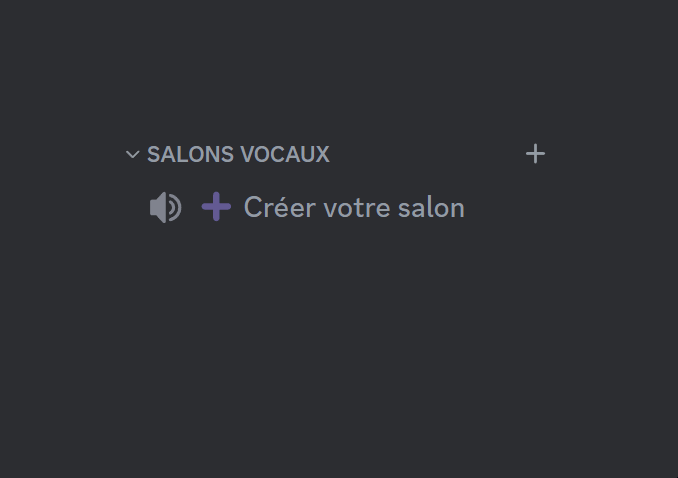
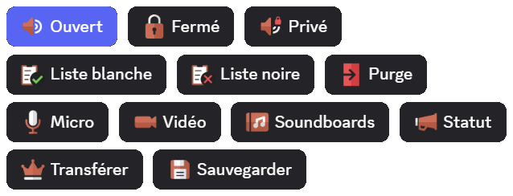
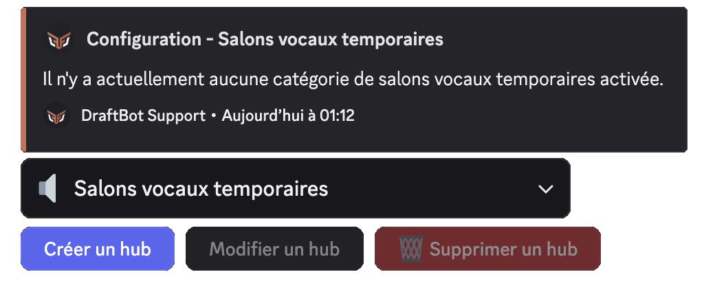
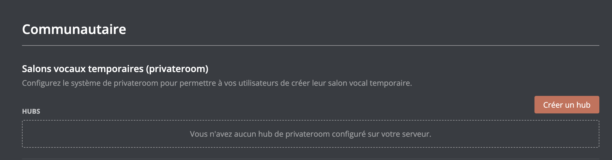

## Utiliser des salons temporaires

Pour obtenir votre salon vocal, il vous faudra rejoindre le salon vocal "hub". Il s'agit d'un salon vocal permettant la création de votre salon vocal temporaire. Il se nomme par défaut `➕ Créer votre salon`.

Lorsque vous créerez un salon vocal temporaire, vous aurez la possibilité de configurer votre salon par le biais d'un [message](#utilisation-du-configurateur) *(option désactivable)*.

Lorsque le dernier membre présent dans le salon se déconnectera, ce dernier sera automatiquement supprimé par **DraftBot**.

## Utilisation de l'embed de réglages

Lorsque vous créez un salon vocal, un embed apparaît dans le **salon textuel du vocal**. Il contient toutes les permissions de modération liées au salon vocal.

::hint{ type="warning" }
  Cet embed permet notamment d'utiliser toutes les permissions de modération, et ce, même si le membre n'a pas activé l'authentification à deux facteurs (puisque l'utilisateur passe par le bot et non pas par son compte).
::

::collapse{ label="Liste détaillée de chaque fonction de l'embed de configuration" }
  - **Ouvert** : Cette fonction permet d'ouvrir le salon à tous les membres, excepté ceux de la **liste noire** et des dérogations par défaut.

  ::hint{ type="info" }
    En mode ouvert, les utilisateurs présents la liste blanche ont les permissions micro, vidéo et soundboards.
  ::

  - **Fermé** : Cette fonction verrouille le salon à tous les membres, excepté ceux de la **liste blanche** et les dérogations par défaut.

  - **Liste Blanche** : Cette fonction permet d'ajouter des membres qui seront **autorisés à rejoindre** le salon peu importe le mode (Public, Fermé, Privé) et recevront toutes les permissions micro, vidéo & soundboards.
  - **Liste Noire** : Cette fonction permet d'ajouter des membres qui **ne pourront pas rejoindre** le salon vocal.

  - **Purge** : La purge permet de déconnecter tous les membres présents dans le salon à l'exception de ceux de la liste blanche, du propriétaire du salon, des modérateurs et administrateurs.
  - **Micro** : Cette fonction permet d'activer/désactiver le micro de tous les participants du salon vocal.
  - **Vidéo** : Tout comme la fonction précédente, elle permet d'autoriser/refuser la permission d'utiliser la caméra ou le partage d'écran de tous les participants du salon vocal.
  - **Soundboard** : Cette fonction permet d'activer/désactiver l'utilisation des soundboards pour tous les participants du salon vocal.

  - **Transférer la propriété** : Cette fonction permet de transférer les droits de gestion du salon vocal à quelqu'un d'autre.

  ::hint{ type="info" }
    Si le propriétaire quitte le vocal, vous avez la possibilité de reprendre la propriété en appuyant sur le bouton **Transférer la propriété**.
  ::

  ::hint{ type="danger" }
    Un transfert de propriété dans un salon vocal est permanent.
    Vous perdrez l'accès à l'embed de configuration du **salon vocal**.
  ::
::

## Configuration du système

### Création d'un hub
Pour créer votre système de salons vocaux temporaires, vous devez d’abord le configurer. Il existe plusieurs méthodes pour le mettre en place.

::tabs
  ::tab{ label="Depuis la commande /config" }
    Exécuter la commande \</config>, puis sélectionner depuis le menu déroulant `Salons vocaux temporaires` ➔ `Créer un Hub`.

    
  ::

  ::tab{ label="Depuis le panel" }
    Vous devez vous rendre sur le panel puis dans la catégorie [Communautaire](www.draftbot.fr/dashboard/first/community).

    
  ::
::

::hint{ type="info" }
  Par défaut, vous ne pouvez créer qu'un hub. Les serveurs [premium](/premium) <:icon_premium_:1096140508625125417> n'ont pas de limite.
::

::hint{ type="success" }
  **Félicitations, vous venez de créer votre hub !**
::

## Gérer votre hub
Après avoir mis en place votre hub, vous avez maintenant la possibilité de le configurer de manière plus avancée.

### Activation / Désactivation d'un hub
Il est possible d'activer et de désactiver un hub pour choisir si la création de salons vocaux par les utilisateurs est permise ou non.

::tabs
  ::tab{ label=" Depuis la commande /config" }
    Exécuter la commande \</config>, puis sélectionner depuis le menu déroulant `Salons vocaux temporaires` ➔ `Modifier un hub`.

    Après avoir cliqué sur le bouton, vous verrez que votre hub est activé via le bouton vert qui est nommé `Système activé`.

    ::hint{ type="info" }
      Si le module est activé, cliquer sur ce bouton le désactivera. À l'inverse, s'il est désactivé, cliquer dessus activera le module.
    ::
  ::
::

::hint{ type="warning" }
  Même si le module est désactivé, le salon vocal qui servait de hub ne disparaîtra pas. En revanche, il deviendra un simple salon vocal classique.
::

### Catégorie
Pour organiser correctement votre serveur, vous pouvez modifier la catégorie où DraftBot crée les salons vocaux des membres.

::tabs
  ::tab{ label="Depuis la commande /config" }
    Exécuter la commande \</config>, puis sélectionner depuis le menu déroulant `Salons vocaux temporaires` ➔ `Modifier un hub` ➔ `Catégorie`.

    Après avoir cliqué sur le bouton,  un message de confirmation apparaîtra. Cliquez sur `Oui` si vous souhaitez appliquer la modification.

    Vous aurez le choix entre :

    - **Nouvelle catégorie** : DraftBot met en place une nouvelle catégorie pour vous.
    - **Utiliser une catégorie existante** : Vous entrez le nom ou l'identifiant de la catégorie.
  ::

  ::tab{ label="Depuis le panel" }
    Allez dans le panel, puis dans la catégorie [Communautaire](dashboard/first/community). Ensuite, cliquez sur `Salons vocaux temporaires (privateroom)` et enfin sur le bouton `Modifier`.

    Vous aurez le choix entre plusieurs options dans la catégorie.

    - **Créer** : DraftBot met en place une nouvelle catégorie pour vous.
    - **Sélectionner** : Vous pouvez sélectionner (par son nom ou  son [identifiant](/docs/autres/recuperer-un-identifiant)) une catégorie pré existante.
  ::
::

### Changer le hub
Vous pouvez modifier le salon où DraftBot crée un salon lorsqu’un utilisateur le rejoint.

::tabs
  ::tab{ label="Depuis la commande /config" }
    Exécuter la commande \</config>, de sélectionner depuis le menu déroulant `Salons vocaux temporaires` ➔ `Modifier un hub` ➔ `Hub (salon)`.

    Après avoir cliqué sur le bouton,  un message de confirmation apparaîtra. Cliquez sur `Oui` si vous souhaitez appliquer la modification.

    Vous aurez le choix entre :

    - **Nouvelle catégorie** : DraftBot met en place une nouvelle catégorie pour vous.
    - **Utiliser une catégorie existante** : Vous entrez le nom ou l'identifiant de la catégorie.
  ::

  ::tab{ label="Depuis le panel" }
    Allez dans le panel, puis dans la catégorie [Communautaire](dashboard/first/community). Ensuite, cliquez sur `Salons vocaux temporaires (privateroom)` et enfin sur le bouton `Modifier`.

    Vous aurez le choix entre plusieurs options dans la catégorie salon de création.

    - **Créer** : DraftBot met en place une nouvelle catégorie pour vous.
    - **Sélectionner** : Vous pouvez sélectionner (par son nom ou  son [identifiant](/docs/autres/recuperer-un-identifiant)) une catégorie pré existante.
  ::
::

### Format des salons vocaux

Pour rendre les salons vocaux plus esthétiques, vous pouvez personnaliser le format du salon vocal temporaire en y ajoutant des mots, des emojis et des variables.

::tabs
  ::tab{ label="Depuis la commande /config" }
    Exécuter la commande \</config>, puis sélectionner depuis le menu déroulant `Salons vocaux temporaires` ➔ `Modifier un hub` ➔ `Nom des salons`.

    Vous aurez le choix de choisir plusieurs varibales disponible dans la liste ci-dessous.
  ::

  ::tab{ label="Depuis le panel" }
    Allez dans le panel, puis dans la catégorie [Communautaire](dashboard/first/community). Ensuite, cliquez sur `Salons vocaux temporaires (privateroom)` et enfin sur le bouton `Modifier`.

    Vous avez la possibilité de mettre des variables parmi la liste ci-dessous :
  ::
::

::collapse{ label="Liste des variables" }

  - `{user}` pour afficher le pseudonyme du membre sur le serveur.
  - `{user.username}` pour afficher le nom Discord du membre.
  - `{user.tag}` pour afficher le pseudonyme avec le tag du membre (Pseudo#0000).
  - `{index}` pour numéroter le salon.
  - `{random-word}` pour attribuer un mot aléatoire parmi une liste de mots de **DraftBot**.
  - `{custom-word}` pour attribuer un mot aléatoire parmi une liste personnalisable.

  ::hint{ type="info" }
    La variable `{custom-word}` doit être configurée depuis le panel.
  ::
::

::hint{ type="info" }
  Cette fonctionnalité est réservée aux serveurs [premium](/premium) <:icon_premium_:1096140508625125417>.
::

### Permissions par défaut
Vous pouvez définir les permissions par défaut à appliquer aux salons vocaux temporaires.

::tabs
  ::tab{ label="Depuis la commande /config" }
    Exécuter la commande \</config>, puis sélectionner depuis le menu déroulant `Salons vocaux temporaires` ➔ `Modifier un hub` ➔ `Permissions par défaut`.

    Vous aurez le choix entre deux options :

    - **Celles de la catégorie** : DraftBot reprend les permissions de la catégorie et les applique au salon vocal temporaire de l’utilisateur.

    - **Celles du salon de création** : DraftBot reprend les permissions du hub et les applique au salon vocal temporaire de l’utilisateur.
  ::

  ::tab{ label="Depuis le panel" }
    Allez dans le panel, puis dans la catégorie [Communautaire](dashboard/first/community). Ensuite, cliquez sur `Salons vocaux temporaires (privateroom)` et enfin sur le bouton `Modifier`.

    Vous aurez le choix entre plusieurs options dans la catégorie permissions du salon.

    - **Celles de la catégorie** : DraftBot reprend les permissions de la catégorie et les applique au salon vocal temporaire de l’utilisateur.

    - **Celles du salon de création** : DraftBot reprend les permissions du hub et les applique au salon vocal temporaire de l’utilisateur.
  ::
::

### Permissions du créateur
DraftBot peut permettre à vos utilisateurs un haut niveau de personnalisation de leurs salons vocaux temporaires. Bien sûr, vous pouvez choisir ce qu'ils auront la possibilité de personnaliser, point par point.

- **Créer une invitation** : Permet au créateur de créer des invitations pour le salon vocal.
- **Modifier le salon** : Donne la permission de modifier les paramètres du salon.
- **Changer les permissions** : Permet de changer l'ensemble des paramètres du salon. Le créateur pourra créer des dérogations et attribuer ou refuser des permissions aux membres et rôles de son choix.
- **Voix prioritaire** : Le son de tous les participants sera diminué lorsque le créateur du salon parlera.

::hint{ type="info" }
  Pour utiliser la `voix prioritaire`, il faut que l'activation du micro soit en mode "[Appuyer-Pour-Parler](https://support.discord.com/hc/fr/articles/211376518-Introduction-aux-modes-d-entr%C3%A9e-vocale-Appuyer-pour-parler-et-Activation-vocale)".
::

::hint{ type="danger" }
  **Si vous accordez la permission `Changer les permissions`, les créateurs pourront s'attribuer eux-mêmes des permissions, ce qui pourrait compromettre la sécurité de votre serveur. Nous vous recommandons de n'accorder cette permission que si vous êtes sûr de savoir ce que vous faites !**
::

::tabs
  ::tab{ label="Depuis la commande /config" }
    Exécuter la commande \</config>, puis sélectionner depuis le menu déroulant `Salons vocaux temporaires` ➔ `Modifier un hub` ➔ `Permissions du créateur`.

    La liste des différentes permissions apparaîtra alors.
  ::

  ::tab{ label="Depuis le panel" }
    Allez dans le panel, puis dans la catégorie [Communautaire](dashboard/first/community). Ensuite, cliquez sur `Salons vocaux temporaires (privateroom)` et enfin sur le bouton `Modifier`.

    Vous aurez le choix entre plusieurs options, dans la catégorie "permissions du créateur du salon".
  ::
::

### Limite de membres
Vous pouvez définir la limite de membres autorisés à rejoindre un salon vocal temporaire d'un utilisateur.

::tabs
  ::tab{ label="Depuis la commande /config" }
    Exécuter la commande \</config>, puis sélectionner depuis le menu déroulant `Salons vocaux temporaires` ➔ `Modifier un hub` ➔ `Limite de membres`.

    Vous aurez la possibilité de choisir n'importe quelle valeur comprise entre **0** et **99**.

    ::hint{ type="info" }
      Si vous souhaitez qu'il n'y ait aucune limite : indiquez 0.
    ::
  ::

  ::tab{ label="Depuis le panel" }
    Allez dans le panel, puis dans la catégorie [Communautaire](dashboard/first/community). Ensuite, cliquez sur `Salons vocaux temporaires (privateroom)` et enfin sur le bouton `Modifier`.

    Vous aurez la possibilité de définir la limite, depuis la catégorie "limite d’utilisateurs".
  ::
::

### Salons permanents
Les salons permanents sont des salons qui restent même après le départ de l’utilisateur d’un salon vocal. Cette fonctionnalité empêche DraftBot de supprimer le salon vocal. Elle est souvent utilisée par les propriétaires de serveurs qui souhaitent créer un salon vocal sans utiliser le système.

::hint{ type="info" }
  Notez que DraftBot l’ajoute automatiquement au salon permanent depuis la commande \</config>.
::

::tabs
  ::tab{ label="Depuis la commande /config" }
    Exécuter la commande \</config>, puis sélectionner depuis le menu déroulant `Salons vocaux temporaires` ➔ `Modifier un hub` ➔ `Salons permanents`.

    Un menu permettant d'ajouter ou retirer des salons permanents apparaîtra.
  ::

  ::tab{ label="Depuis le panel" }
    Allez dans le panel, puis dans la catégorie [Communautaire](dashboard/first/community). Ensuite, cliquez sur `Salons vocaux temporaires (privateroom)` et enfin sur le bouton `Modifier`.

    Vous aurez la possibilité d'ajouter ou retirer des salons permanents, dans la catégorie "salons permanents".
  ::
::

## Embed de réglages
Les utilisateurs peuvent configurer directement leurs salons vocaux via une interface située dans le salon textuel de leur salon vocal temporaire.

::tabs
  ::tab{ label="Depuis la commande /config" }
    Exécuter la commande \</config>, puis sélectionner depuis le menu déroulant `Salons vocaux temporaires` ➔ `Modifier un hub` ➔ `Embed de réglages activé`.

    Après avoir cliqué sur le bouton, vous verrez que votre hub est activé via le bouton vert qui est nommé `Système activé`.

    ::hint{ type="info" }
      Si le module est activé, cliquer sur ce bouton le désactivera. À l'inverse, s'il est désactivé, cliquer dessus activera le module.
    ::
  ::

  ::tab{ label="Depuis le panel" }
    Allez dans le panel, puis dans la catégorie [Communautaire](dashboard/first/community). Ensuite, cliquez sur `Salons vocaux temporaires (privateroom)` et enfin sur le bouton `Modifier`.

    Vous aurez la possibilité de configurer depuis la catégorie "Configuration du salon".
  ::
::

### Rôles d'accès
Cette option permet d’autoriser un rôle à rejoindre le salon vocal temporaire par défaut.

::hint{ type="info" }
  Par défaut, **@everyone** ont accès aux salons vocaux temporaires.
::

::tabs
  ::tab{ label="Depuis la commande /config" }
    Exécuter la commande \</config>, puis sélectionner depuis le menu déroulant `Salons vocaux temporaires` ➔ `Modifier un hub` ➔ `Rôles d'accès`.

    Vous aurez le choix entre deux options.

    - **@everyone** : Par défaut, tout le monde pourrons rejoindre un salon vocal temporaire. (sauf si le propriétaire mets le salon vocal en `Fermé` ou `Privée`)
    - **Rôle personnalisé** : Choisissez un rôle que vous avez déjà mis en place.
  ::

  ::tab{ label="Depuis le panel" }
    Allez dans le panel, puis dans la catégorie [Communautaire](dashboard/first/community). Ensuite, cliquez sur `Salons vocaux temporaires (privateroom)` et enfin sur le bouton `Modifier`.

    Vous aurez la possibilité de configurer depuis la catégorie "Rôle d'accès aux salons temporaires".
  ::
::

### Rôles d'accès aux réglages
Il est possible de configurer des rôles pour qu’ils puissent ou non modifier l’embed de réglages, même si c’est le créateur du salon.

::tabs
  ::tab{ label="Depuis la commande /config" }
    Exécuter la commande \</config>, puis sélectionner depuis le menu déroulant `Salons vocaux temporaires` ➔ `Modifier un hub` ➔ `Rôles d'accèx aux réglages`.

    Vous pourrez ajouter ou supprimer des rôles autorisés ou interdits.
  ::

  ::tab{ label="Depuis le panel" }
    Allez dans le panel, puis dans la catégorie [Communautaire](dashboard/first/community). Ensuite, cliquez sur `Salons vocaux temporaires (privateroom)` et enfin sur le bouton `Modifier`.

    Vous aurez la possibilité de configurer depuis la catégorie "Rôles avec/sans accès au menu de configuration".
  ::
::

### Rôles modérateurs
Cette option permet à vos modérateurs d'être immunisés de toutes restrictions dans salons vocaux temporaires.

::tabs
  ::tab{ label="Depuis la commande /config" }
    Exécuter la commande \</config>, puis sélectionner depuis le menu déroulant `Salons vocaux temporaires` ➔ `Modifier un hub` ➔ `Rôles modérateurs`.

    Vous pourrez ajouter ou supprimer des rôles autorisés ou interdits.
  ::

  ::tab{ label="Depuis le panel" }
    Allez dans le panel, puis dans la catégorie [Communautaire](dashboard/first/community). Ensuite, cliquez sur `Salons vocaux temporaires (privateroom)` et enfin sur le bouton `Modifier`.

    Vous aurez la possibilité de configurer depuis la catégorie "Rôles immunisés contre l'édition de permissions".
  ::
::

### Permissions des membres en liste blanche
Cette option vous permet de décider si les membres de la liste blanche ont la possibilité d'accéder aux trois permissions suivantes.

- <:micro:1146811975280627783> **Micro**
- <:video:1146811983870558298> **Vidéo**
- <:soundboard:1146811981504970762> **Soundboards**

::tabs
  ::tab{ label="Depuis la commande /config" }
    Exécuter la commande \</config>, puis sélectionner depuis le menu déroulant `Salons vocaux temporaires` ➔ `Modifier un hub` ➔ `Permissions des membres en liste blanche`.

    Vous pourrez ajouter ou retirer les trois permissions.
  ::

  ::tab{ label="Depuis le panel" }
    Allez dans le panel, puis dans la catégorie [Communautaire](dashboard/first/community). Ensuite, cliquez sur `Salons vocaux temporaires (privateroom)` et enfin sur le bouton `Modifier`.

    Vous aurez la possibilité de configurer depuis la catégorie "Permissions des membres en liste blanche".
  ::
::

### Personnalisation des boutons de réglages
Vous pouvez personnaliser les boutons de réglage des Embed. Grâce à cela, vous pouvez désactiver des boutons de réglage afin que vos membres ne les utilisent pas.

::tabs
  ::tab{ label="Depuis la commande /config" }
    Exécuter la commande \</config>, puis sélectionner depuis le menu déroulant `Salons vocaux temporaires` ➔ `Modifier un hub` ➔ `Personnalisation des boutons de réglages`.

    Vous pourrez ajouter ou supprimer des rôles autorisés ou interdits.
  ::

  ::tab{ label="Depuis le panel" }
    Allez dans le panel, puis dans la catégorie [Communautaire](dashboard/first/community). Ensuite, cliquez sur `Salons vocaux temporaires (privateroom)` et enfin sur le bouton `Modifier`.

    Vous aurez la possibilité de configurer depuis la catégorie "Boutons du menu de configuration activés".
  ::
::

