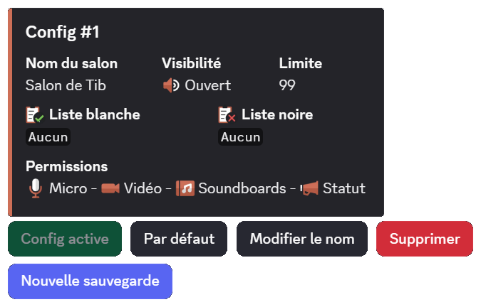

## Utiliser des salons temporaires

Pour obtenir votre salon vocal, il vous faudra rejoindre le salon vocal "hub". Il s'agit d'un salon vocal permettant la création de votre salon vocal temporaire. Il se nomme par défaut `➕ Créer votre salon`.

Lorsque vous créerez un salon vocal temporaire, vous aurez la possibilité de configurer votre salon par le biais d'un [message](#utilisation-du-configurateur) *(option désactivable)*.

Lorsque le dernier membre présent dans le salon se déconnectera, le salon temporaire sera automatiquement supprimé par **DraftBot**.

## Utilisation de l'embed de réglages

Lorsque vous créez un salon vocal, un embed apparaît dans le **salon textuel du vocal**. Il contient toutes les permissions de modération liées au salon vocal.

- **Ouvert** : Cette fonction permet d'ouvrir le salon à tous les membres, excepté ceux de la **liste noire** et des dérogations par défaut.

::hint{ type="info" }
  En mode ouvert, les utilisateurs présents dans la liste blanche ont les permissions micro, vidéo et soundboards.
::

- **Fermé** : Cette fonction verrouille le salon à tous les membres, excepté ceux de la **liste blanche** et les dérogations par défaut.

- **Privé** : Cette fonction verrouille et cache le salon à tous les membres, excepté ceux de la **liste blanche** et les dérogations par défaut.

- **Liste Blanche** : Cette fonction permet d'ajouter des membres qui seront **autorisés à rejoindre** le salon peu importe le mode (Public, Fermé, Privé) et recevront toutes les permissions micro, vidéo & soundboards.

- **Liste Noire** : Cette fonction permet d'ajouter des membres qui **ne pourront pas rejoindre** le salon vocal.

::hint{ type="info" }
  Lorsqu'un membre ou un rôle est ajouté à la liste noire d'un salon temporaire, les personnes concernées sont automatiquement déconnectées.
::

- **Exclure** : Cette fonction permet d'**exclure temporairement** un membre du salon vocal. Le membre exclu est immédiatement déconnecté et ne pourra pas rejoindre le salon jusqu'à la prochaine session. Ce bouton n'est disponible que lorsqu'une **sauvegarde est active**. Voir la section [Sauvegardes de configuration](#sauvegardes-de-configuration) pour plus de détails.

- **Purge** : La purge permet de déconnecter tous les membres présents dans le salon à l'exception de ceux de la liste blanche, du propriétaire du salon, des modérateurs et administrateurs. Une confirmation avec la liste des membres concernés est affichée avant l'action.
- **Micro** : Cette fonction permet d'activer/désactiver le micro de tous les participants du salon vocal.
- **Vidéo** : Tout comme la fonction précédente, elle permet d'autoriser/refuser la permission d'utiliser la caméra ou le partage d'écran de tous les participants du salon vocal.
- **Soundboard** : Cette fonction permet d'activer/désactiver l'utilisation des soundboards pour tous les participants du salon vocal.

- **Réglages** : Cette fonction ouvre un formulaire permettant de **modifier le nom** du salon vocal et la **limite de membres** (de 0 à 99, où 0 signifie aucune limite). Cela permet aux membres de personnaliser leur salon **sans avoir besoin de la permission "Modifier le salon"** dans les permissions du créateur, ni de l'**A2F** requise par Discord sur les serveurs communautaires.

::hint{ type="warning" }
  Discord limite les modifications de salon à **2 fois toutes les 10 minutes**. **DraftBot** affiche le nombre de modifications restantes et un délai d'attente si la limite est atteinte.
::

- **Transférer la propriété** : Cette fonction permet de transférer les droits de gestion du salon vocal à quelqu'un d'autre.

::hint{ type="info" }
  Si le propriétaire quitte le vocal et que la **réquisition de salon** est activée par un administrateur, n'importe quel utilisateur peut récupérer la propriété en appuyant sur le bouton **Transférer**.
::

::hint{ type="danger" }
  Un transfert de propriété dans un salon vocal est permanent.
  Vous perdrez l'accès à l'embed de configuration du **salon vocal**.
::

- **Sauvegardes** <:icon_premium_:1096140508625125417> : Cette fonction permet de **sauvegarder** et **charger** des configurations complètes de salon vocal. Consultez la section [Sauvegardes de configuration](#sauvegardes-de-configuration) pour plus de détails.

## Configuration du système

### Création d'un hub
La configuration du système de salons vocaux temporaires peut se faire depuis la commande \</config> ou depuis le panel web.

::tabs
  ::tab{ label="Depuis la commande /config" }
    Exécuter la commande \</config>, puis sélectionner depuis le menu déroulant `Salons vocaux temporaires` ➔ `Créer un hub`.

    
  ::

  ::tab{ label="Depuis le panel" }
    [⫸ Accéder au panel de **DraftBot**](/dashboard/first/community)

    Vous devez vous rendre sur le panel puis dans la catégorie [Communautaire](www.draftbot.fr/dashboard/first/community).

    
  ::
::

::hint{ type="info" }
  Par défaut, vous ne pouvez créer qu'un seul hub. Les serveurs [premium](/premium) <:icon_premium_:1096140508625125417> n'ont pas de limite.
::

::hint{ type="success" }
  **Félicitations, vous venez de créer votre hub !**
::

## Gérer votre hub
Après avoir mis en place votre hub, vous avez maintenant la possibilité de le configurer de manière plus avancée.

### Activation / Désactivation d'un hub
Il est possible d'activer et de désactiver un hub pour choisir si la création de salons vocaux par les utilisateurs est permise ou non.

::tabs
  ::tab{ label=" Depuis la commande /config" }
    Exécuter la commande \</config>, puis sélectionner depuis le menu déroulant `Salons vocaux temporaires` ➔ `Modifier un hub`.

    Après avoir cliqué sur le bouton, vous verrez que votre hub est activé via le bouton vert qui est nommé `Système activé`.

    ::hint{ type="info" }
      Si le module est activé, cliquer sur ce bouton le désactivera. À l'inverse, s'il est désactivé, cliquer dessus activera le module.
    ::
  ::
::

::hint{ type="warning" }
  Même si le module est désactivé, le salon vocal qui servait de hub ne disparaîtra pas. En revanche, il deviendra un simple salon vocal classique.
::

Pour organiser correctement votre serveur, vous pouvez modifier la catégorie dans laquelle DraftBot crée les salons vocaux des membres.

### Catégorie
Pour organiser correctement votre serveur, vous pouvez modifier la catégorie dans laquelle DraftBot crée les salons vocaux des membres.

::tabs
  ::tab{ label="Depuis la commande /config" }
    Exécuter la commande \</config>, puis sélectionner depuis le menu déroulant `Salons vocaux temporaires` ➔ `Modifier un hub` ➔ `Catégorie`.

    Après avoir cliqué sur le bouton, un message de confirmation apparaîtra. Cliquez sur `Oui` si vous souhaitez appliquer la modification.

    Vous aurez le choix entre :

    - **Nouvelle catégorie** : DraftBot met en place une nouvelle catégorie pour vous.
    - **Utiliser une catégorie existante** : Vous entrez le nom ou l'identifiant de la catégorie.
  ::

  ::tab{ label="Depuis le panel" }
    [⫸ Accéder au panel de **DraftBot**](/dashboard/first/community)

    Allez dans le panel, puis dans la catégorie [Communautaire](dashboard/first/community). Ensuite, cliquez sur `Salons vocaux temporaires (privateroom)` et enfin sur le bouton `Modifier`.

    Vous aurez le choix entre plusieurs options dans la catégorie.

    - **Créer** : DraftBot met en place une nouvelle catégorie pour vous.
    - **Sélectionner** : Vous pouvez sélectionner (par son nom ou son [identifiant](/docs/autres/recuperer-un-identifiant)) une catégorie pré existante.
  ::
::

### Changer le hub
Vous pouvez modifier le salon dans lequel DraftBot crée un salon lorsqu’un utilisateur le rejoint.

::tabs
  ::tab{ label="Depuis la commande /config" }
    Exécuter la commande \</config>, de sélectionner depuis le menu déroulant `Salons vocaux temporaires` ➔ `Modifier un hub` ➔ `Hub (salon)`.

    Après avoir cliqué sur le bouton,  un message de confirmation apparaîtra. Cliquez sur `Oui` si vous souhaitez appliquer la modification.

    Vous aurez le choix entre :

    - **Nouvelle catégorie** : DraftBot met en place une nouvelle catégorie pour vous.
    - **Utiliser une catégorie existante** : Vous entrez le nom ou l'identifiant de la catégorie.
  ::

  ::tab{ label="Depuis le panel" }
    [⫸ Accéder au panel de **DraftBot**](/dashboard/first/community)

    Allez dans le panel, puis dans la catégorie [Communautaire](dashboard/first/community). Ensuite, cliquez sur `Salons vocaux temporaires (privateroom)` et enfin sur le bouton `Modifier`.

    Vous aurez le choix entre plusieurs options dans la catégorie salon de création.

    - **Créer** : DraftBot met en place une nouvelle catégorie pour vous.
    - **Sélectionner** : Vous pouvez sélectionner (par son nom ou  son [identifiant](/docs/autres/recuperer-un-identifiant)) une catégorie pré existante.
  ::
::

### Format des salons vocaux

Pour rendre les salons vocaux plus esthétiques, vous pouvez personnaliser le format du salon vocal temporaire en y ajoutant des mots, des emojis et des variables.

::tabs
  ::tab{ label="Depuis la commande /config" }
    Exécuter la commande \</config>, puis sélectionner depuis le menu déroulant `Salons vocaux temporaires` ➔ `Modifier un hub` ➔ `Nom des salons`.

    Vous aurez la possibilité de choisir plusieurs variables parmi celles listées ci-dessous.
  ::

  ::tab{ label="Depuis le panel" }
    [⫸ Accéder au panel de **DraftBot**](/dashboard/first/community)

    Allez dans le panel, puis dans la catégorie [Communautaire](dashboard/first/community). Ensuite, cliquez sur `Salons vocaux temporaires (privateroom)` et enfin sur le bouton `Modifier`.

    Vous avez la possibilité de mettre des variables parmi la liste ci-dessous :
  ::
::

::collapse{ label="Liste des variables" }

  - `{user}` pour afficher le pseudonyme du membre sur le serveur.
  - `{user.username}` pour afficher le nom Discord du membre.
  - `{user.tag}` pour afficher le pseudonyme avec le tag du membre (Pseudo#0000).
  - `{index}` pour numéroter le salon.
  - `{random-word}` pour attribuer un mot aléatoire parmi une liste de mots de **DraftBot**.
  - `{custom-word}` pour attribuer un mot aléatoire parmi une liste personnalisable.

  ::hint{ type="info" }
    La variable `{custom-word}` doit être configurée depuis le panel.
  ::
::

::hint{ type="info" }
  Cette fonctionnalité est réservée aux serveurs [premium](/premium) <:icon_premium_:1096140508625125417>.
::

### Permissions par défaut
Vous pouvez définir les permissions par défaut à appliquer aux salons vocaux temporaires.

::tabs
  ::tab{ label="Depuis la commande /config" }
    Exécuter la commande \</config>, puis sélectionner depuis le menu déroulant `Salons vocaux temporaires` ➔ `Modifier un hub` ➔ `Permissions par défaut`.

    Vous aurez le choix entre deux options :

    - **Celles de la catégorie** : DraftBot reprend les permissions de la catégorie et les applique au salon vocal temporaire de l’utilisateur.

    - **Celles du salon de création** : DraftBot reprend les permissions du hub et les applique au salon vocal temporaire de l’utilisateur.
  ::

  ::tab{ label="Depuis le panel" }
    [⫸ Accéder au panel de **DraftBot**](/dashboard/first/community)

    Allez dans le panel, puis dans la catégorie [Communautaire](dashboard/first/community). Ensuite, cliquez sur `Salons vocaux temporaires (privateroom)` et enfin sur le bouton `Modifier`.

    Vous aurez le choix entre plusieurs options dans la catégorie permissions du salon.

    - **Celles de la catégorie** : DraftBot reprend les permissions de la catégorie et les applique au salon vocal temporaire de l’utilisateur.

    - **Celles du salon de création** : DraftBot reprend les permissions du hub et les applique au salon vocal temporaire de l’utilisateur.
  ::
::

### Permissions du créateur
DraftBot offre à vos utilisateurs un niveau élevé de personnalisation pour leurs salons vocaux temporaires, tout en vous permettant, en tant qu'administrateur, de définir précisément quelles options de personnalisation ils auront à leur disposition.

- **Créer une invitation** : Permet au créateur de créer des invitations pour le salon vocal.
- **Modifier le salon** : Donne la permission de modifier les paramètres du salon.
- **Changer les permissions** : Permet de changer l'ensemble des paramètres du salon. Le créateur pourra créer des dérogations et attribuer ou refuser des permissions aux membres et rôles de son choix.
- **Voix prioritaire** : Le son de tous les participants sera diminué lorsque le créateur du salon parlera.
- **Définir le statut du salon vocal** : Le créateur aura la possibilité de définir le statut du salon vocal.
- **Utiliser les soundboards** : Donner la possibilité d'utiliser les soundboards.

::hint{ type="info" }
  Pour utiliser la `voix prioritaire`, il faut que l'activation du micro soit en mode "[Appuyer-Pour-Parler](https://support.discord.com/hc/fr/articles/211376518-Introduction-aux-modes-d-entr%C3%A9e-vocale-Appuyer-pour-parler-et-Activation-vocale)".
::

::hint{ type="danger" }
  **Si vous accordez la permission `Changer les permissions`, les créateurs pourront s'attribuer eux-mêmes des permissions, ce qui pourrait compromettre la sécurité de votre serveur. Nous vous recommandons de n'accorder cette permission que si vous êtes sûr de savoir ce que vous faites !**
::

::tabs
  ::tab{ label="Depuis la commande /config" }
    Exécuter la commande \</config>, puis sélectionner depuis le menu déroulant `Salons vocaux temporaires` ➔ `Modifier un hub` ➔ `Permissions du créateur`.

    La liste des différentes permissions apparaîtra alors.
  ::

  ::tab{ label="Depuis le panel" }
    [⫸ Accéder au panel de **DraftBot**](/dashboard/first/community)

    Allez dans le panel, puis dans la catégorie [Communautaire](dashboard/first/community). Ensuite, cliquez sur `Salons vocaux temporaires (privateroom)` et enfin sur le bouton `Modifier`.

    Vous aurez le choix entre plusieurs options, dans la catégorie "permissions du créateur du salon".
  ::
::

### Limite de membres
Vous pouvez définir la limite de membres autorisés à rejoindre un salon vocal temporaire d'un utilisateur.

::tabs
  ::tab{ label="Depuis la commande /config" }
    Exécuter la commande \</config>, puis sélectionner depuis le menu déroulant `Salons vocaux temporaires` ➔ `Modifier un hub` ➔ `Limite de membres`.

    Vous aurez la possibilité de choisir n'importe quelle valeur comprise entre **0** et **99**.

    ::hint{ type="info" }
      Si vous souhaitez qu'il n'y ait aucune limite : indiquez 0.
    ::
  ::

  ::tab{ label="Depuis le panel" }
    [⫸ Accéder au panel de **DraftBot**](/dashboard/first/community)

    Allez dans le panel, puis dans la catégorie [Communautaire](dashboard/first/community). Ensuite, cliquez sur `Salons vocaux temporaires (privateroom)` et enfin sur le bouton `Modifier`.

    Vous aurez la possibilité de définir la limite, depuis la catégorie "limite d’utilisateurs".
  ::
::

### Salons permanents
Les salons permanents sont des salons qui restent même après le départ de l’utilisateur d’un salon vocal. Cette fonctionnalité empêche DraftBot de supprimer le salon vocal. Elle est souvent utilisée par les propriétaires de serveurs qui souhaitent créer un salon vocal sans utiliser le système.

::hint{ type="info" }
  Notez que DraftBot l’ajoute automatiquement au salon permanent depuis la commande \</config>.
::

::tabs
  ::tab{ label="Depuis la commande /config" }
    Exécuter la commande \</config>, puis sélectionner depuis le menu déroulant `Salons vocaux temporaires` ➔ `Modifier un hub` ➔ `Salons permanents`.

    Un menu permettant d'ajouter ou retirer des salons permanents apparaîtra.
  ::

  ::tab{ label="Depuis le panel" }
    [⫸ Accéder au panel de **DraftBot**](/dashboard/first/community)

    Allez dans le panel, puis dans la catégorie [Communautaire](dashboard/first/community). Ensuite, cliquez sur `Salons vocaux temporaires (privateroom)` et enfin sur le bouton `Modifier`.

    Vous aurez la possibilité d'ajouter ou retirer des salons permanents, dans la catégorie "salons permanents".
  ::
::

## Embed de réglages
Les utilisateurs peuvent configurer directement leurs salons vocaux via une interface située dans le salon textuel de leur salon vocal temporaire.

::tabs
  ::tab{ label="Depuis la commande /config" }
    Exécuter la commande \</config>, puis sélectionner depuis le menu déroulant `Salons vocaux temporaires` ➔ `Modifier un hub` ➔ `Embed de réglages activé`.

    Après avoir cliqué sur le bouton, vous verrez que votre hub est activé via le bouton vert qui est nommé `Système activé`.

    ::hint{ type="info" }
      Si le module est activé, cliquer sur ce bouton le désactivera. À l'inverse, s'il est désactivé, cliquer dessus activera le module.
    ::
  ::

  ::tab{ label="Depuis le panel" }
    [⫸ Accéder au panel de **DraftBot**](/dashboard/first/community)

    Allez dans le panel, puis dans la catégorie [Communautaire](dashboard/first/community). Ensuite, cliquez sur `Salons vocaux temporaires (privateroom)` et enfin sur le bouton `Modifier`.

    Vous aurez la possibilité de configurer depuis la catégorie "Configuration du salon".
  ::
::

### Rôles d'accès
Cette option permet d’autoriser un rôle à rejoindre le salon vocal temporaire par défaut.

::hint{ type="info" }
  Par défaut, **@everyone** a accès aux salons vocaux temporaires.
::

::tabs
  ::tab{ label="Depuis la commande /config" }
    Exécuter la commande \</config>, puis sélectionner depuis le menu déroulant `Salons vocaux temporaires` ➔ `Modifier un hub` ➔ `Rôles d'accès`.

    Vous aurez le choix entre deux options.

    - **@everyone** : Par défaut, tout le monde pourra rejoindre un salon vocal temporaire. (sauf si le propriétaire met le salon vocal en `Fermé` ou `Privé`)
    - **Rôle personnalisé** : Choisissez un rôle que vous avez déjà mis en place.
  ::

  ::tab{ label="Depuis le panel" }
    [⫸ Accéder au panel de **DraftBot**](/dashboard/first/community)

    Allez dans le panel, puis dans la catégorie [Communautaire](dashboard/first/community). Ensuite, cliquez sur `Salons vocaux temporaires (privateroom)` et enfin sur le bouton `Modifier`.

    Vous aurez la possibilité de configurer depuis la catégorie "Rôle d'accès aux salons temporaires".
  ::
::

### Rôles d'accès aux réglages
Il est possible de configurer des rôles pour qu’ils puissent ou non modifier l’embed de réglages, même si c’est le créateur du salon.

::tabs
  ::tab{ label="Depuis la commande /config" }
    Exécuter la commande \</config>, puis sélectionner depuis le menu déroulant `Salons vocaux temporaires` ➔ `Modifier un hub` ➔ `Rôles d'accès aux réglages`.

    Vous pourrez ajouter ou supprimer des rôles autorisés ou interdits.
  ::

  ::tab{ label="Depuis le panel" }
    [⫸ Accéder au panel de **DraftBot**](/dashboard/first/community)

    Allez dans le panel, puis dans la catégorie [Communautaire](dashboard/first/community). Ensuite, cliquez sur `Salons vocaux temporaires (privateroom)` et enfin sur le bouton `Modifier`.

    Vous aurez la possibilité de configurer depuis la catégorie "Rôles avec/sans accès au menu de configuration".
  ::
::

### Rôles modérateurs
Cette option permet à vos modérateurs d'être immunisés de toutes restrictions dans salons vocaux temporaires.

::tabs
  ::tab{ label="Depuis la commande /config" }
    Exécuter la commande \</config>, puis sélectionner depuis le menu déroulant `Salons vocaux temporaires` ➔ `Modifier un hub` ➔ `Rôles modérateurs`.

    Vous pourrez ajouter ou supprimer des rôles autorisés ou interdits.
  ::

  ::tab{ label="Depuis le panel" }
    [⫸ Accéder au panel de **DraftBot**](/dashboard/first/community)

    Allez dans le panel, puis dans la catégorie [Communautaire](dashboard/first/community). Ensuite, cliquez sur `Salons vocaux temporaires (privateroom)` et enfin sur le bouton `Modifier`.

    Vous aurez la possibilité de configurer depuis la catégorie "Rôles immunisés contre l'édition de permissions".
  ::
::

### Permissions des membres en liste blanche
Cette option vous permet de décider si les membres de la liste blanche ont la possibilité d'accéder aux quatres permissions suivantes.

- <:micro:1146811975280627783> **Micro**
- <:video:1146811983870558298> **Vidéo**
- <:soundboard:1146811981504970762> **Soundboards**
- <:status:1391998728415477771> **Statut**

::tabs
  ::tab{ label="Depuis la commande /config" }
    Exécuter la commande \</config>, puis sélectionner depuis le menu déroulant `Salons vocaux temporaires` ➔ `Modifier un hub` ➔ `Permissions des membres en liste blanche`.

    Vous pourrez ajouter ou retirer les 4 permissions.
  ::

  ::tab{ label="Depuis le panel" }
    [⫸ Accéder au panel de **DraftBot**](/dashboard/first/community)

    Allez dans le panel, puis dans la catégorie [Communautaire](dashboard/first/community). Ensuite, cliquez sur `Salons vocaux temporaires (privateroom)` et enfin sur le bouton `Modifier`.

    Vous aurez la possibilité de configurer depuis la catégorie "Permissions des membres en liste blanche".
  ::
::

### Personnalisation des boutons de réglages
Vous pouvez personnaliser les boutons de réglage de l'embed. Grâce à cela, vous pouvez désactiver les boutons de réglages afin que vos membres ne les utilisent pas.

::tabs
  ::tab{ label="Depuis la commande /config" }
    Exécuter la commande \</config>, puis sélectionner depuis le menu déroulant `Salons vocaux temporaires` ➔ `Modifier un hub` ➔ `Personnalisation des boutons de réglages`.

    Vous pourrez activer ou désactiver les boutons de votre choix.
  ::

  ::tab{ label="Depuis le panel" }
    [⫸ Accéder au panel de **DraftBot**](/dashboard/first/community)

    Allez dans le panel, puis dans la catégorie [Communautaire](dashboard/first/community). Ensuite, cliquez sur `Salons vocaux temporaires (privateroom)` et enfin sur le bouton `Modifier`.

    Vous aurez la possibilité de configurer depuis la catégorie "Boutons du menu de configuration activés".
  ::
::

### Réquisition de salon

Lorsque cette option est activée, les membres présents dans un salon vocal temporaire peuvent **récupérer la propriété** du salon si le propriétaire l'a quitté, en cliquant sur le bouton **Transférer**. Le membre qui réquisitionne deviendra le nouveau propriétaire du salon.

::hint{ type="info" }
  Si cette option est désactivée, les membres ne pourront pas récupérer un salon dont le propriétaire est parti.
::

::tabs
  ::tab{ label="Depuis la commande /config" }
    Exécuter la commande \</config>, puis sélectionner depuis le menu déroulant `Salons vocaux temporaires` ➔ `Modifier un hub` ➔ `Réquisition de salons autorisé`.

    Le bouton bascule entre activé et désactivé.
  ::

  ::tab{ label="Depuis le panel" }
    [⫸ Accéder au panel de **DraftBot**](/dashboard/first/community)

    Allez dans le panel, puis dans la catégorie [Communautaire](dashboard/first/community). Ensuite, cliquez sur `Salons vocaux temporaires (privateroom)` et enfin sur le bouton `Modifier`.

    Vous trouverez l'option **Réquisition** permettant d'autoriser les membres à récupérer un salon vocal temporaire inactif.
  ::
::

### Sauvegardes
Cette option permet d'activer ou de désactiver le système de **sauvegardes de configuration** pour les salons vocaux temporaires.

::hint{ type="info" }
  Cette fonctionnalité est réservée aux serveurs [premium](/premium) <:icon_premium_:1096140508625125417>.
::

::tabs
  ::tab{ label="Depuis la commande /config" }
    Exécuter la commande \</config>, puis sélectionner depuis le menu déroulant `Salons vocaux temporaires` ➔ `Modifier un hub` ➔ `Sauvegardes`.

    Le bouton bascule entre activé et désactivé.
  ::

  ::tab{ label="Depuis le panel" }
    [⫸ Accéder au panel de **DraftBot**](/dashboard/first/community)

    Allez dans le panel, puis dans la catégorie [Communautaire](dashboard/first/community). Ensuite, cliquez sur `Salons vocaux temporaires (privateroom)` et enfin sur le bouton `Modifier`.

    Vous trouverez l'option **Sauvegardes** permettant d'autoriser les membres à sauvegarder la configuration de leur salon vocal temporaire.
  ::
::

## Sauvegardes de configuration

::hint{ type="info" }
  Cette fonctionnalité est réservée aux serveurs [premium](/premium) <:icon_premium_:1096140508625125417> et doit être activée par un administrateur dans la configuration du hub.
::

Les sauvegardes permettent aux membres de **sauvegarder** et **charger** des configurations complètes de leur salon vocal temporaire. Cela inclut :

- La **visibilité** du salon (ouvert, fermé, privé)
- La **limite de membres**
- Le **nom du salon**
- Les **listes blanche et noire** (membres et rôles) — automatiquement mises à jour dans la sauvegarde par défaut lors de chaque ajout ou retrait
- Les **permissions** (micro, vidéo, soundboard, statut)

Chaque membre peut avoir jusqu'à **5 sauvegardes** par hub.

::hint{ type="info" }
  Le bouton **Exclure** permet d'exclure temporairement un membre du salon vocal sans affecter les sauvegardes. Contrairement à la liste noire, l'exclusion ne persiste pas dans les sauvegardes et prend fin à la prochaine session.
::

### Créer une sauvegarde
En cliquant sur le bouton **Sauvegardes** puis **Nouvelle sauvegarde**, vous avez deux options :

- **Config actuelle** : Enregistre la configuration actuelle de votre salon (visibilité, permissions, listes, limite, nom).
- **Config vierge** : Crée une sauvegarde avec les paramètres par défaut du serveur.

Un aperçu de la configuration est affiché avant confirmation.

### Charger une sauvegarde
Sélectionnez une sauvegarde dans le menu déroulant, puis cliquez sur **Charger** pour appliquer cette configuration à votre salon vocal actuel. Toutes les permissions, listes et paramètres de la sauvegarde seront appliqués.

### Sauvegarde par défaut
Vous pouvez définir une sauvegarde comme **par défaut**. Celle-ci sera automatiquement chargée à chaque fois que vous créerez un nouveau salon vocal temporaire.

::hint{ type="info" }
  Lorsqu'une sauvegarde par défaut est définie, chaque modification du salon sera gardé d'un salon à un autre (changement de visibilité, de permissions, etc.).
::

### Gérer les sauvegardes
Depuis l'interface, vous pouvez :

- **Modifier le nom** d'une sauvegarde
- **Supprimer** une sauvegarde (avec confirmation)
- **Définir par défaut** une sauvegarde

### Importer une sauvegarde

Il est possible d'**importer une sauvegarde depuis un autre hub ou un autre serveur** où vous avez des sauvegardes existantes. Le processus se déroule en plusieurs étapes :

1. Sélectionnez le **serveur** source
2. Sélectionnez le **hub** source
3. Sélectionnez la **sauvegarde** à importer

::hint{ type="warning" }
  Lors d'une importation depuis un autre serveur, les **rôles** présents dans les listes blanche/noire ne seront pas importés (ils sont propres au serveur d'origine). Seuls les **membres** seront conservés s'ils sont présents sur le serveur de destination.
::

