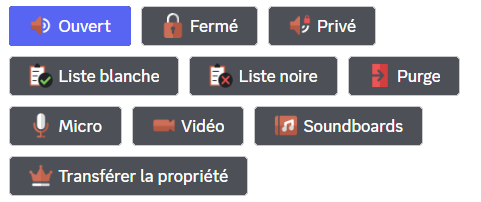

## Utiliser des salons temporaires

Pour obtenir votre salon vocal, il vous faudra rejoindre le salon vocal "hub". Il s'agit d'un salon vocal permettant la création de votre salon vocal temporaire. Il se nomme par défaut `➕ Créer votre salon`.

Lorsque vous créerez un salon vocal temporaire, vous aurez la possibilité de configurer votre salon par le biais d'un [message](#utilisation-du-configurateur) *(option désactivable)*.

Lorsque le dernier membre présent dans le salon se déconnectera, ce dernier sera automatiquement supprimé par **DraftBot**.

## Utilisation du configurateur

Lorsque vous créez un salon vocal, un embed apparaît dans le **salon textuel du vocal**. Il contient toutes les permissions de modération liées au salon vocal.

::hint{ type="warning" }
  Cet embed permet notamment d'utiliser toutes les permissions de modération, et ce, même si le membre n'a pas activé l'authentification à deux facteurs (puisque l'utilisateur passe par le bot et non pas par son compte).
::

::collapse{ label="Liste détaillée de chaque fonction de l'embed de configuration" }
  - **Ouvert** : Cette fonction permet d'ouvrir le salon à tous les membres, excepté ceux de la **liste noire** et des dérogations par défaut.

  ::hint{ type="info" }
    En mode ouvert, les utilisateurs présents la liste blanche ont les permissions micro, vidéo et soundboards.
  ::

  - **Fermé** : Cette fonction verrouille le salon à tous les membres, excepté ceux de la **liste blanche** et les dérogations par défaut.

  - **Liste Blanche** : Cette fonction permet d'ajouter des membres qui seront **autorisés à rejoindre** le salon peu importe le mode (Public, Fermé, Privé) et recevront toutes les permissions micro, vidéo & soundboards.
  - **Liste Noire** : Cette fonction permet d'ajouter des membres qui **ne pourront pas rejoindre** le salon vocal.

  - **Purge** : La purge permet de déconnecter tous les membres présents dans le salon à l'exception de ceux de la liste blanche, du propriétaire du salon, des modérateurs et administrateurs.
  - **Micro** : Cette fonction permet d'activer/désactiver le micro de tous les participants du salon vocal.
  - **Vidéo** : Tout comme la fonction précédente, elle permet d'autoriser/refuser la permission d'utiliser la caméra ou le partage d'écran de tous les participants du salon vocal.
  - **Soundboard** : Cette fonction permet d'activer/désactiver l'utilisation des soundboards pour tous les participants du salon vocal.

  - **Transférer la propriété** : Cette fonction permet de transférer les droits de gestion du salon vocal à quelqu'un d'autre.

  ::hint{ type="danger" }
    Un transfert de propriété dans un salon vocal est permanent.
    Vous perdrez l'accès à l'embed de configuration du **salon vocal**.
  ::
::

## Configuration du système

::tabs
  ::tab{ label="Via la commande /config" }

    ## Créer un hub de salons vocaux temporaires

    Pour activer les salons vocaux temporaires, il vous suffira d'aller dans le menu **Salons vocaux temporaires** de la commande \</config> et de cliquer sur le bouton **Créer un hub**.

    ::hint{ type="warning" }
      Par défaut, **DraftBot** limite les serveurs à **un seul hub**. Cela dit, si l'offre **[premium](/premium)** est activée sur votre serveur, vous pourrez créer jusqu'à **5 hubs**.
    ::

    **DraftBot** vous demandera ensuite de choisir **la catégorie** où seront créés les salons vocaux.

    ::hint{ type="info" }
      Les salons vocaux déjà existants dans cette catégorie seront supprimés par DraftBot si vous ne les rendez pas permanents.
    ::

    ## Modifier un hub de salons vocaux temporaires

    Pour modifier un hub de salons vocaux temporaires, vous devrez accéder au menu en allant dans le système **Salons vocaux temporaires** de la commande \</config>. Vous devrez ensuite **Modifier un hub**.

    

    ### Activer/Désactiver un Hub

    Pour activer ou désactiver la création de salons temporaires, vous devrez cliquer sur le bouton **Activer le système**. Vous verrez alors le menu se mettre à jour.

    ### Changer la catégorie des Salons Vocaux Temporaires

    Pour changer la catégorie des salons vocaux temporaires, il vous suffira de cliquer sur le bouton **Catégorie**. Vous devrez ensuite choisir de créer une nouvelle catégorie ou en sélectionner une existante.

    ### Changer le salon hub

    Pour changer le salon vocal de redirection vers les salons temporaires, il suffira d'appuyer sur le bouton **Hub (salon)**. Vous devrez ensuite indiquer [l'identifiant du salon](/docs/autres/recuperer-un-identifiant) de votre choix.

    ### Permissions par défaut des salons temporaires

    Vous pourrez choisir à partir de quelles permissions DraftBot devra se baser pour les dérogations par défaut des salons temporaires en appuyant sur le bouton **Permissions par défaut** ce qui vous permettra de choisir entre les permissions du **salon vocal hub** ou les **permissions de la catégorie**.

    ### Définir les permissions du créateur du salon vocal

    Vous pourrez également définir les permissions du créateur du salon vocal en appuyant sur le bouton **Permissions du créateur**. Un sélecteur apparaîtra avec les 4 options suivantes :
    - **Créer une invitation** : Permet au créateur de créer des invitations pour le salon vocal.
    - **Modifier le salon** : Donne la permission de modifier les paramètres du salon tels que **le nom, la limite de membres, etc.**
    - **Changer les permissions** : Permet de changer l'ensemble des paramètres du salon. Le créateur pourra créer des dérogations et attribuer ou refuser des permissions aux membres et rôles de son choix.

    - **Voix prioritaire** : Le son de tous les participants sera diminué lorsque le créateur du salon parlera.

    ::hint{ type="warning" }
      Cette option ne fonctionne qu'en cas d'utilisation du mode "Appuyer pour parler".
    ::

    ::hint{ type="warning" }
      Veillez à désactiver les options que vous ne souhaitez pas laisser modifiables dans les permissions du salon **et** l'embed de configuration.
    ::

    ### Définir la limite de membre

    Vous pouvez définir la limite de membres autorisés à rejoindre un salon vocal en appuyant sur le bouton **Limite de membre**. Vous devrez ensuite indiquer une valeur entre 0 et 99 qui correspond au nombre de participants maximal. Indiquer "0" comme limite revient à la désactiver.

    Par défaut, la limite de membres est définie à **99 participants**.

    ::hint{ type="warning" }
      Veuillez également noter que la limite de membre peut être changée à tout moment par **le créateur du salon** s'il possède la permission **Modifier le salon**.
    ::

    ### Ajouter/Supprimer un salon permanent

    ::hint{ type="info" }
      Par défaut, lorsque le dernier membre quitte un salon vocal présent dans la catégorie des salons vocaux temporaires, il est instantanément supprimé.
    ::

    Pour qu'un salon soit conservé dans la catégorie même après déconnexion du dernier membre, il vous faudra appuyer sur le bouton **Salons permanents**. Un menu s'ouvrira alors et vous permettra d'ajouter ou supprimer des salons vocaux qui seront marqués comme permanents.

    ### Activer/Désactiver l'embed de réglages

    Pour activer ou désactiver l'embed de réglages, il vous suffira d'utiliser le bouton.

    - Cliquer sur le bouton **Embed de réglages activé** activera la fonction et le bouton deviendra **Activer l'embed de réglages** et inversement pour désactiver le système.

    En résumé :

    - Embed de réglages activé ➜ Activer l'embed de réglages
    - Activer l'embed de réglages ➜ Embed de réglages activé

    ### Personnaliser les boutons de réglages

    Pour personnaliser les boutons de réglages, vous devrez d'abord appuyer sur le bouton **Personnaliser les boutons de réglages** qui vous amènera sur un sélecteur. Cochez toutes les options que vous souhaitez rendre disponibles dans l'embed de configuration du salon.

    ::hint{ type="info" }
      Si vous avez déjà configuré cette option et souhaitez y apporter des modifications, assurez-vous de sélectionner l'ensemble des options de votre choix y compris celles qui étaient déjà activées auparavant.
    ::

    ### Configurer les rôles d'accès aux réglages

    Pour ajouter/supprimer des rôles qui auront accès à l'embed de configuration, il faudra appuyer sur le bouton **Rôles d'accès aux réglages**. qui vous amènera sur un message composé des 4 boutons suivants, pouvant varier selon le type de liste de rôle choisi.

    - **Ajouter des rôles interdits** : Permet d'ajouter des rôles à la liste des rôles interdits d'utilisation de l'embed de configuration.
    - **Supprimer des rôles interdits** : Permet de supprimer des rôles de la liste des rôles interdits d'utilisation de l'embed de configuration.
    - **Réinitialiser les rôles interdits** : Permet de réinitialiser la liste des rôles interdits d'utilisation de l'embed de configuration.
    - **Restreindre à des rôles** : Ce bouton change le type de filtrage, permettant de marquer les rôles ajoutés à la liste comme rôles autorisés à l'utilisation l'embed de configuration du salon.

    ::collapse{ label="Restriction de rôles" }
      - **Ajouter des rôles interdits** : Permet d'ajouter des rôles à la liste des rôles interdits d'utilisation de l'embed de configuration.
      - **Supprimer des rôles interdits** : Permet de supprimer des rôles de la liste des rôles interdits d'utilisation de l'embed de configuration.
      - **Réinitialiser les rôles interdits** : Permet de réinitialiser la liste des rôles interdits d'utilisation de l'embed de configuration.
      - **Restreindre à des rôles** : Ce bouton change le type de filtrage, permettant de marquer les rôles ajoutés à la liste comme rôles autorisés à l'utilisation l'embed de configuration du salon.
    ::

    ::collapse{ label="Autorisation de rôles" }
      - **Ajouter des rôles autorisés** : Permet d'ajouter des rôles à la liste des rôles autorisés à l'utilisation de l'embed de configuration.
      - **Supprimer des rôles autorisés** : Permet de supprimer des rôles de la liste des rôles autorisés à l'utilisation de l'embed de configuration.
      - **Réinitialiser les rôles autorisés** : Permet de réinitialiser la liste des rôles autorisés à l'utilisation de l'embed de configuration.
      - **Interdire à des rôles** : Ce bouton change le type de filtrage, permettant de marquer les rôles ajoutés à la liste comme rôles interdits à l'utilisation l'embed de configuration du salon.
    ::

    ## Supprimer un hub de salons vocaux temporaires

    Pour supprimer un hub de salons vocaux temporaires, il vous suffira d'aller dans le menu **Salons vocaux temporaires** de la commande \</config> et de cliquer sur le bouton **Supprimer un hub**.

    ::hint{ type="danger" }
      Cette action sera irréversible une fois le message de confirmation validé : *Êtes-vous sûr de vouloir supprimer la seule catégorie de salons vocaux temporaires du serveur ?*
    ::
  ::

  ::tab{ label="Via le panel" }

    ## Créer un Hub

    Pour créer votre système de salons vocaux temporaires, vous devez passer par un salon vocal qui s'occupera de créer le salon temporaire et de donner les permissions requises au propriétaire du salon. Ce salon se nomme un **Hub**.

    Pour créer un hub, il suffit de cliquer sur le bouton "**Créer un hub**". Il y aura une liste d'informations à remplir, qui seront mentionnées dans la partie **Modifier un Hub**.

    ::hint{ type="warning" }
      Par défaut, **DraftBot** limite les serveurs à **un seul hub**. Cela dit, si l'offre **[premium](/premium)** est activée sur votre serveur, vous pourrez créer jusqu'à **5 hubs**.
    ::

    ## Modifier un Hub

    Lorsque vous venez de créer votre hub, ou bien lorsque vous cliquez sur le bouton "**Editer**" de votre hub, une série de paramètres apparaît. Vous trouverez dans cette catégorie chacun de ces paramètres détaillé de A à Z.

    ## Changer la catégorie des salons

    Pour définir quelle catégorie accueillera le système de salons vocaux temporaires, il y a deux options possibles :
    - Créer une catégorie : Vous devez cliquer sur le bouton "**Créer**" et taper le nom de la catégorie.
    - Utiliser une catégorie existante : En cliquant sur le bouton "**Sélectionner**", un sélecteur apparaîtra et vous pourrez choisir la catégorie à utiliser.

    ::hint{ type="info" }
      Nous vous recommandons de choisir une catégorie vierge afin d'éviter les problèmes de suppression de salons permanents ainsi que le désordre qu'une grande quantité de salons peut provoquer.
    ::

    ## Changer le salon de création (Hub)

    Il y a à nouveau deux options pour définir un salon hub dans une catégorie :
    - Créer un salon : Vous devez cliquer sur le bouton "**Créer**", indiquer un nom et **DraftBot** se chargera de créer le salon avec les permissions adéquates.
    - Utiliser un salon existant : Si votre salon est déjà prêt, vous pouvez cliquer sur le bouton "**Sélectionner**" et indiquer quel salon utiliser.

    ## Changer les permissions par défaut

    Les salons vocaux temporaires utilisent par défaut les permissions de la catégorie à leur créations, mais vous pouvez également changer ceci en choisissant entre **les permissions de la catégorie** et **celles du hub**.

    ## Changer les permissions du propriétaire

    Vous pouvez attribuer certaine(s) permission(s) supplémentaire(s) au propriétaire du salon. Il suffit simplement de **cocher les permissions** que vous voulez attribuer.

    - **Créer une invitation :** Le propriétaire pourra créer des invitations menant à son salon vocal.
    - **Modifier le salon :** Le propriétaire pourra changer des paramètres tels que le nom ou la taille du salon.
    - **Changer les permissions :** Le propriétaire pourra changer les permissions des membres à l'intérieur de son salon vocal.

    ::hint{ type="danger" }
      Veuillez noter qu'il s'agit d'une option sensible, elle influe sur toutes les autres permissions du salon.
      > *Par défaut, elle est donc décochée et déconseillée pour les serveurs communautaires.*
    ::

    - **Voix prioritaire :** Lorsque le propriétaire parlera, le volume des participants sera diminué si le salon est en "Appuyer pour parler".

    ::hint{ type="warning" }
      Ces fonctionnalités peuvent être contournées par le configurateur de salon vocal. Veuillez donc penser à désactiver les options "sensibles" à la fois dans les permissions du salon et dans l'embed de configuration.
    ::

    ### Ajouter/Supprimer des salons permanents

    ::hint{ type="info" }
      Par défaut, lorsque le dernier membre quitte un salon vocal présent dans la catégorie des salons vocaux temporaires, il est instantanément supprimé.
    ::

    Pour ajouter des salons permanents, il suffit d'appuyer sur l'icône "**+**" et d'indiquer le nom du salon.

    Pour supprimer un salon permanent, il suffit simplement d'**appuyer sur la croix** à côté du salon permanent à retirer.

    ### Définir la limite de membres

    Pour définir la limite de membres, il suffit juste de sélectionner la valeur que vous voulez. Notez également que la valeur "**illimité**" retire la limite de membres.

    ::hint{ type="warning" }
      Veuillez également noter que la limite de membre peut être changée à tout moment par **le créateur du salon** s'il possède la permission **Modifier le salon**.
    ::

    ### Ajouter un rôle d'accès aux salons

    Vous pouvez définir un rôle que les membres du serveur devront avoir pour rejoindre un salon vocal temporaire. Un sélecteur vous permettra de choisir le rôle souhaité. Par défaut, le rôle d'accès est **@eveyone**.

    ### Définir l'accès au configurateur de salon

    Vous pouvez définir les accès à la configuration de 2 manières différentes :
    - En retirant l'accès par défaut à tous les rôles et à ajouter les rôles exemptés.
    - En donnant l'accès par défaut à tous les rôles sauf ceux listés.

    Il suffit simplement de cliquer sur "**Avec**" pour la première option, ou bien "**Sans**" pour la deuxième option.

    Pour ajouter des rôles, il suffit de cliquer sur le bouton "**+**". Pour supprimer des rôles, il suffit de cliquer sur la **croix** à côté de leur nom.

    ### Définir les boutons de configurations

    Vous pouvez ajouter des boutons de configuration en appuyant sur le bouton "**+**".

    Vous pouvez supprimer des boutons de configuration en cliquant sur la **croix** à côté de leur nom.

    ::hint{ type="info" }
      Par défaut, tous les boutons de configuration sont activés.

      Notez également que ce menu n'apparaîtra pas si vous n'avez pas activé la "**configuration du salon**".
    ::

    ## Supprimer un Hub

    Pour supprimer un hub, il vous suffit d'aller dans la partie **Salons vocaux privés** du [panel de DraftBot](/dashboard/user/profil) et de **supprimer** le hub de votre choix.

    ::hint{ type="danger" }
      Vous aurez une confirmation avant de supprimer votre hub (voir image ci-dessous). Après confirmation, votre hub sera **définitivement supprimé**.

      
    ::
  ::
::

## Personnaliser le format du nom du salon *(**Avantage premium ✨**)*

Pour définir les noms de salons, vous devez remplacer le nom existant par celui que vous souhaitez.
Afin d'éviter des salons dits doublons, il est conseillé d'indiquer au moins une variable.

::collapse{ label="Liste des variables" }

  Vous pouvez utiliser les variables suivantes pour nommer un salon vocal lors de sa création :

  

  - `{user}` pour afficher le pseudonyme du membre sur le serveur.
  - `{user.username}` pour afficher le nom Discord du membre.
  - `{user.tag}` pour afficher le pseudonyme avec le tag du membre (Pseudo#0000).
  - `{index}` pour numéroter le salon.
  - `{random-word}` pour attribuer un mot aléatoire parmi une liste de mots de **DraftBot**.
  - `{custom-word}` pour attribuer un mot aléatoire parmi une liste personnalisable.
::
