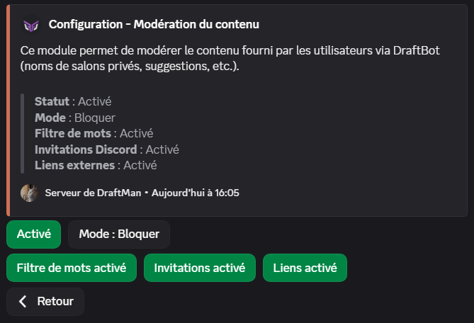
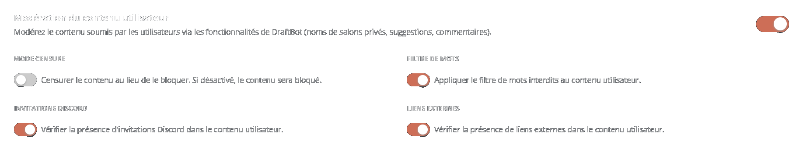

## Détection d'infractions

Les **infractions** correspondent à un déclenchement de l'auto-modération : envoi d'un mot interdit, d'un lien interdit, etc. Les [**sanctions**](#sanctions-automatiques) correspondent aux actions de modération : avertissement du membre, exclusion, bannissement, etc.

::tabs
  ::tab{ label="Via la commande /config" }
    Rendez-vous d'abord dans la catégorie **`🔨 Modération`** de la commande \</config> puis appuyez sur **`Détection d'infractions`**.

    Vous pourrez ensuite configurer les différents modules :

    

    ::hint{ type="info" }
      Une fois dans le module de votre choix, **n'oubliez pas d'activer le système** via le premier bouton :

      
    ::
  ::

  ::tab{ label="Via le panel" }
    [⫸ Accéder au panel de **DraftBot**](/dashboard/first/auto-moderation)

    Rendez-vous dans la rubrique **`🛡️ Auto-Modération`**.

    

    Cliquez sur l'icône :gear: d'un module pour le configurer et activez-le avec le bouton placé à droite du :gear:.

    ::hint{ type="warning" }
      Une fois configuré, n'oubliez pas d'enregistrer vos modifications avec le bouton **`Sauvegarder`** en bas de la page.
    ::
  ::
::

Tous les modules incluent ces options, permettant de les configurer indépendamment :

- **Mode silencieux** : Si activé, DraftBot ne répondra pas à l'infraction par un message explicatif.
- **Salons ignorés** : Salons dans lesquels l'auto-modération est désactivée.
- **Rôles ignorés** : Rôles ignorés par l'auto-modération.

::hint{ type="info" }
  Les **administrateurs** ainsi que les autres **bots** du serveur sont automatiquement ignorés par l'auto-modération.
::

### Vocabulaire interdit

Vous pouvez choisir des expressions (mots) qui seront bloquées par DraftBot.

Ajouter un ``*`` au début et/ou à la fin du mot permet de bloquer les mots avec une correspondance partielle : `chat*` permettra de détecter `chats`, `c h a t`, `chaaaaaat` ou `c.h.a.t`.

- L'option **blocage des messages** permet de bloquer les messages avant leur envoi, grâce au système d'AutoMod Discord <:automod:1369109533284106260> tout en comptabilisant l'infraction dans l'historique du membre.

::hint{ type="warning" }
  Seul les **1000 premiers mots** sont pris en charge en raison d'une limitation de Discord.
::

- Si l'option **censure** est activée, DraftBot renverra le message bloqué via un webhook avec le nom de l'utilisateur, sa photo de profil et l'expression censurée.

### Invitations Discord

Ce module permet d'interdire la publication de liens d'invitations dans les salons de votre serveur (les invitations vers votre serveur ne sont pas bloquées).

- L'option **invitations autorisées** permet de définir des invitations qui seront ignorées par le système d'auto-modération.

- L'option **serveurs immunisés** permet d'étendre l'option précédente à toutes les invitations possible d'un serveur en particulier en précisant son [identifiant](/docs/autres/recuperer-un-identifiant#identifiant-dun-serveur).

::hint{ type="info" }
  Cette option est une fonctionnalité réservée aux serveurs [premium](/premium) <:icon_premium_:1096140508625125417>.
::

- Si l'option **censure** est activée, DraftBot renverra le message via un webhook avec le nom de l'utilisateur, sa photo de profil et le lien d'invitation censuré.

::hint{ type="info" }
  Toutes les invitations sont analysées, celles qui mènent à votre serveur ou à un salon vocal de votre serveur sont automatiquement ignorées.
::

### Liens externes

Ce module permet d'interdire la publication de liens sur votre serveur.

- L'option **noms de domaine autorisés/interdits** permet d'interdire ou d'ignorer uniquement certains liens en précisant le nom de domaine ; par exemple `draftbot.fr`.

- Si l'option **censure** est activée, DraftBot renverra le message via un webhook avec le nom de l'utilisateur, sa photo de profil et le lien censuré.

### Majuscules excessives

Ce module permet de limiter la quantité de majuscules dans les messages.

- Le **pourcentage de majuscules** correspond au pourcentage maximal de caractères en majuscule autorisé dans un message.

- Le **nombre de caractères minimum** est le nombre minimal de caractères que doit comporter un message pour que l'auto-modération le prenne en compte.

### Émojis excessifs

Ce module permet de limiter l'utilisation des émojis dans les messages.

- Le **pourcentage d'émojis du message** correspond au pourcentage minimal d'émojis que doit contenir un message pour que l'auto-modération le prenne en compte.

- Le **nombre d'émojis minimum** est le nombre minimal d'émojis que doit comporter un message pour que l'auto-modération le prenne en compte.

### Pings interdits

Ce module permet d'interdire la mention de certains membres ou rôles spécifiques.

Sélectionnez les mentions que vous souhaitez interdire dans le champ **membres ou rôles**.

- L'option **blocage des messages** permet de bloquer les messages contenant la mention interdite avant leur envoi, grâce au système d'AutoMod Discord <:automod:1369109533284106260>, tout en comptabilisant l'infraction dans l'historique du membre.

### Mentions excessives

Ce module permet d'empêcher le spam de mentions.

- L'**intervalle de temps** est la durée pendant laquelle le nombre de mentions envoyées par un membre ne doit pas dépasser la limite fixée.

- La **limite de mentions** est le nombre maximal de mentions qu'un membre peut envoyer durant l'intervalle de temps défini.

- Si l'option **supprimer** est activée, DraftBot supprimera les messages contenant le spam de mentions. Attention, cela provoque des mentions fantômes.

::hint{ type="info" }
  Une mention fantôme, ou *ghost ping* est une notification de mention avec l'impossibilité de voir la mention.
::

- L'option **blocage des messages** permet de bloquer les messages avant leur envoi, grâce au système d'AutoMod Discord <:automod:1369109533284106260>, tout en comptabilisant l'infraction dans l'historique du membre.

::hint{ type="info" }
  Le comptage des mentions est indépendant pour chaque membre.
::

### Spam de messages

Ce module permet d'empêcher le spam de messages.

- L'**intervalle de temps** est la durée pendant laquelle le nombre de messages, envoyés par un membre, ne doit pas dépasser la limite fixée.

- La **limite de messages** est le nombre maximal de messages autorisé par membre durant l'intervalle de temps défini.

::hint{ type="info" }
  Le comptage de messages est indépendant pour chaque membre.
::

### Markdown interdit

Ce module vous permet de bloquer l'utilisation des markdowns de votre choix parmi :
- Code en bloc
- Code en ligne
- Lien masqué
- Spoiler
- Titre
- Sous-texte
- Liste
- Citation

Si la **suppression du markdown** est activée, DraftBot renverra le message bloqué via un webhook, avec le nom de l'utilisateur et sa photo de profil, en supprimant le markdown (activé par défaut).

::hint{ type="info" }
  Retrouvez les détails des différents markdowns sur [cette page](/docs/autres/markdown).
::

## Modération du contenu utilisateur

Ce module permet de modérer le contenu fourni par les utilisateurs à travers les fonctionnalités de DraftBot, comme les noms de [salons vocaux temporaires](/docs/modules/salons-vocaux-temporaires) ou les [suggestions](/docs/modules/suggestions) (titre, description et commentaires).

Il réutilise les règles d'auto-modération déjà configurées sur votre serveur :
- **Vocabulaire interdit** : utilise la liste de mots interdits configurée dans le module [Vocabulaire interdit](#vocabulaire-interdit).
- **Invitations Discord** : détecte les liens d'invitation Discord.
- **Liens externes** : détecte les liens, en tenant compte des domaines autorisés/interdits configurés dans le module [Liens externes](#liens-externes).

### Modes de fonctionnement

- **Bloquer** : Le contenu est refusé et l'utilisateur reçoit un message d'erreur éphémère indiquant les raisons du blocage.
- **Censurer** : Le contenu problématique est remplacé par des caractères de censure, et l'action est effectuée avec le contenu censuré.

### Configuration

::tabs
  ::tab{ label="Via la commande /config" }
    Rendez-vous dans la catégorie **`🔨 Modération`** de la commande \</config> puis cliquez sur le bouton **`Modération du contenu`**.

    
  ::

  ::tab{ label="Via le panel" }
    [⫸ Accéder au panel de **DraftBot**](/dashboard/first/auto-moderation)

    Rendez-vous dans la rubrique **`🛡️ Auto-Modération`**, puis dans la section **`Modération du contenu utilisateur`**.

    
  ::
::

Vous pourrez ensuite configurer :
- **Statut** : Activer ou désactiver le module.
- **Mode** : Choisir entre le mode **Bloquer** ou **Censurer**.
- **Filtre de mots** : Activer ou désactiver la vérification du vocabulaire interdit.
- **Invitations** : Activer ou désactiver la détection des invitations Discord.
- **Liens** : Activer ou désactiver la détection des liens externes.

::hint{ type="warning" }
  Ce module ne s'applique pas aux messages envoyés dans les salons textuels (ceux-ci sont gérés par les modules de [détection d'infractions](#détection-dinfractions) ci-dessus). Il s'applique uniquement au contenu soumis par les utilisateurs via les fonctionnalités de DraftBot.
::

## Sanctions automatiques

Les sanctions automatiques permettent d'appliquer automatiquement des actions de modération aux membres après une quantité définie d'[**infractions**](#détection-dinfractions).

::tabs
  ::tab{ label="Via la commande /config" }
    Rendez-vous d'abord dans la catégorie **`🔨 Modération`** de la commande \</config> puis appuyez sur **`Sanctions automatiques`**.

    Vous pourrez ensuite configurer les sanctions automatiques :

    
  ::

  ::tab{ label="Via le panel" }
    [⫸ Accéder au panel de **DraftBot**](/dashboard/first/auto-moderation)

    Vous pourrez ensuite configurer les sanctions automatiques.

    

    ::hint{ type="warning" }
      Une fois fini, n'oubliez pas d'enregistrer vos modifications avec le bouton **`Sauvegarder`** à droite de la page.
    ::
  ::
::

- **Sanction** : Le type de sanction à appliquer lors du déclenchement de l'automatisation de la sanction (avertissement par exemple).
- **Nombre d'infractions** : Une fois ce nombre d'infractions atteint, la sanction automatique est appliquée.

::hint{ type="info" }
  Le comptage d'infractions est indépendant pour chaque membre.
::

- **Infraction** : Définir quel type d'infraction sera comptabilisé pour la sanction automatique.
- **Intervalle de temps** : La sanction automatique se déclenche si le nombre d'infractions défini précédemment est atteint durant cet intervalle de temps.

::hint{ type="info" }
  Vous pouvez configurer jusqu'à 10 sanctions automatiques. Les serveurs [premium](/premium) <:icon_premium_:1096140508625125417> peuvent en avoir 50.
::

