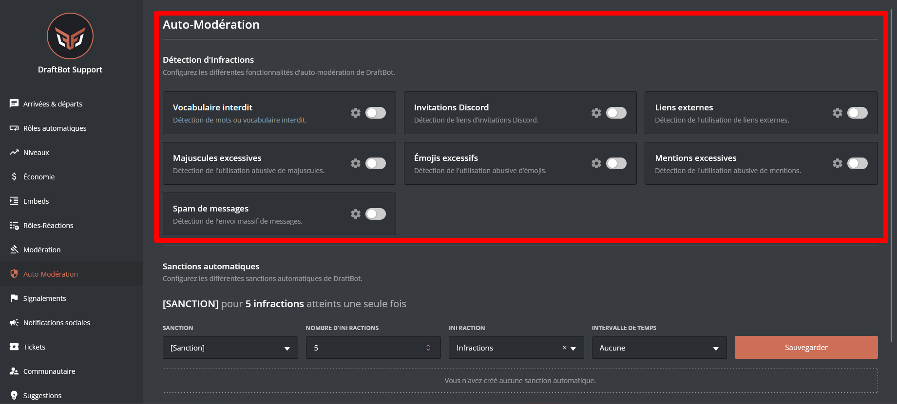

## Détection d'infractions

Les infractions servent à bloquer les mauvais comportements tels que les spams, les publicités, ou encore les insultes.

::tabs
  ::tab{ label="Via la commande /config" }
    Rendez-vous d'abord dans la catégorie **`🔨 Modération`** de la commande \</config> puis appuyez sur **`Détection d'infractions`**. Vous pourrez ensuite configurer les différents modules :

    

  ::hint{ type="warning" }
    Sachez que certaines fonctionnalités apparaissant dans l'image ci dessus *(`Masquer le nom du modérateur en MP`, `Cacher les réponses des commandes` et `Sanctions prédéfinies`)* disponibles via la commande \</config> n'apparaissent pas sur cette page. **Cette dernière traite uniquement de l'auto-modération.** Si vous recherchez des informations concernant la modération, consultez la page prévue à cet effet ➜ **[`🔨 Modération`](https://draftbot.fr/docs/modules/moderation)**.
  ::

  ## Options récurentes

  - Censure
  - Mode silencieux
  - Salons ignorés
  - Rôles ignorés

  ::hint{ type="info" }
    Les options présente ci-dessus peuvent ne pas être présente dans certain modules de détection d'infractions.
  ::

    ::hint{ type="info" }

    **N'oubliez pas à activer le système**, via le premier bouton :

    

    ::
  ::

  ::tab{ label="Via le panel" }
    [Accéder au panel de **DraftBot**](/dashboard/first/auto-moderation)

    Rendez-vous dans la rubrique **`🛡️ Auto-Modération`**.

    

    ## Options récurentes :

    - Censure
    - Mode silencieux
    - Salons ignorés
    - Rôles ignorés

  ::hint{ type="info" }
    Les options présente ci-dessus peuvent ne pas être présente dans certain modules de détection d'infractions.
  ::

    ::hint{ type="warning" }
      Une fois fini, n'oubliez pas d'enregistrer vos modifications avec le bouton **`Sauvegarder`** en bas de la page.
    ::
  ::
::

## Sanctions automatiques

Système permettant d'**appliquer des sanctions automatiques aux membres ayant commis des actions interdites dans l'auto-modération**.

### Configuration

::tabs
  ::tab{ label="Via la commande /config" }
    Rendez-vous d'abord dans la catégorie **`🔨 Modération`** de la commande \</config> puis appuyez sur **`Sanctions automatiques`**. Vous pourrez ensuite configurer les différents modules :

    

  ::

  ::tab{ label="Via le panel" }
    Rendez-vous ensuite dans la rubrique **`🛡️ Auto-Modération`**.

    

    Programer une sanction automatique 

    ::hint{ type="warning" }
      Une fois fini, n'oubliez pas d'enregistrer vos modifications avec le bouton **`Sauvegarder`** à droite de la page.
    ::
  ::
::
