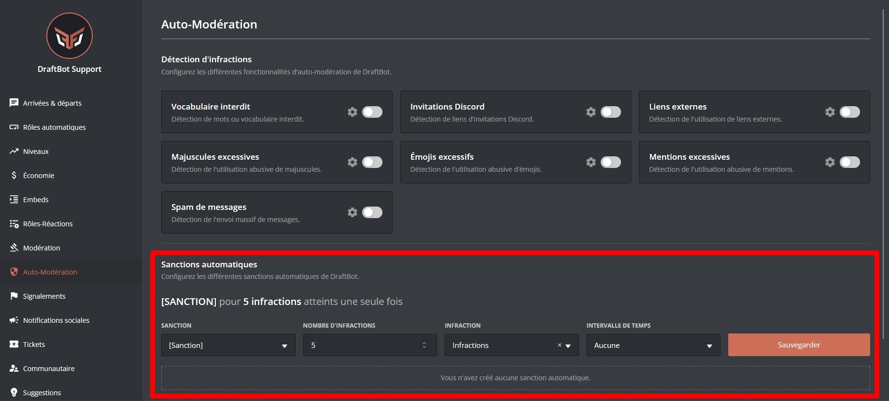

## Détection d'infractions

Les infractions servent à bloquer les mauvais comportements tels que les spams, les publicités, ou encore les insultes.

::tabs
  ::tab{ label="Via la commande /config" }
    Rendez-vous d'abord dans la catégorie **`🔨 Modération`** de la commande \</config> puis appuyez sur **`Détection d'infractions`**.

    Vous pourrez ensuite configurer les différents modules :

    

    ::hint{ type="warning" }
      Sachez que certaines fonctionnalités apparaissant dans l'image ci-dessus *(`Masquer le nom du modérateur en MP`, `Cacher les réponses des commandes` et `Sanctions prédéfinies`)* disponibles via la commande \</config> n'apparaissent pas sur cette page. **Cette dernière traite uniquement de l'auto-modération.**

      Si vous recherchez des informations concernant la modération, consultez la [page prévue à cet effet](/docs/modules/moderation).
    ::

    ::hint{ type="info" }

      **N'oubliez pas d'activer le système**, via le premier bouton :

      
    ::
  ::

  ::tab{ label="Via le panel" }
    [⫸ Accéder au panel de **DraftBot**](/dashboard/first/auto-moderation)

    Rendez-vous dans la rubrique **`🛡️ Auto-Modération`**.

    

    ::hint{ type="info" }
      Les options ci-dessus peuvent ne pas être présentes dans certains modules de détection d'infractions.
    ::

    ::hint{ type="warning" }
      Une fois fini, n'oubliez pas d'enregistrer vos modifications avec le bouton **`Sauvegarder`** en bas de la page.
    ::
  ::
::

## Options récurrentes

- Censure : Si désactivé, le message sera supprimé.
- Mode silencieux : Si activé, DraftBot ne répondra pas aux infractions avec un message explicatif.
- Salons ignorés : Salons ignorés par l'auto-modération.
- Rôles ignorés : Rôles ignorés par l'auto-modération.

## Options spécifiques

- Mots interdits ➜ Mode strict : Si activé, DraftBot ne comptera que les correspondances **exactes** du mot inscrit.
- Liens externes ➜ Noms de domaine : Autorise ou interdit des noms de domaine globalement (exemple : `draftbot.fr`).
- Majuscules excessives ➜ Pourcentage de majuscules : Pourcentage maximum de majuscules dans un message.
- Majuscules excessives ➜ Nombre de caractères minimum : Nombre de caractères minimum pour compter l'infraction.

::hint{ type="info" }
  Les options ci-dessus peuvent ne pas être présentes dans certains modules de détection d'infractions.
::

## Sanctions automatiques

Les sanctions automatiques permettent d'appliquer des actions de modération aux membres après une quantité définie d'infractions.

### Configuration

::tabs
  ::tab{ label="Via la commande /config" }
    Rendez-vous d'abord dans la catégorie **`🔨 Modération`** de la commande \</config> puis appuyez sur **`Sanctions automatiques`**.

    Vous pourrez ensuite configurer les sanctions automatiques :

    
  ::

  ::tab{ label="Via le panel" }
    [⫸ Accéder au panel de **DraftBot**](/dashboard/first/auto-moderation)

    Vous pourrez ensuite configurer les sanctions automatiques.

    

    ::hint{ type="warning" }
      Une fois fini, n'oubliez pas d'enregistrer vos modifications avec le bouton **`Sauvegarder`** à droite de la page.
    ::
  ::
::

### Options disponibles

- Sanction : Le type de sanction à appliquer.
- Nombre d'infractions : Nombre d'infractions avant d'appliquer la sanction.
- Infraction : Type d'infractions concernées (si vous laissez "Infraction", cela inclura toutes les infractions).
- Intervalle de temps : Intervalle pendant lequel se cumulent les infractions.

::hint{ type="info" }
  Une fois la sanction automatique enregistrée, une phrase complète la décrira pour une compréhension plus simple.
::

