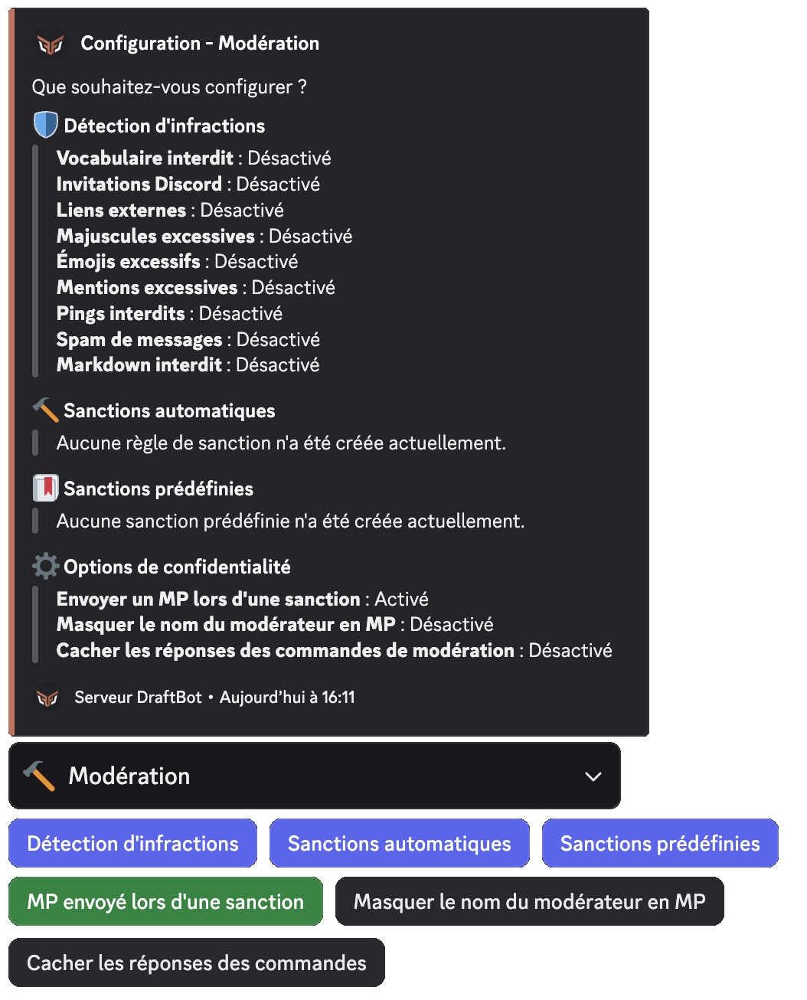
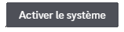
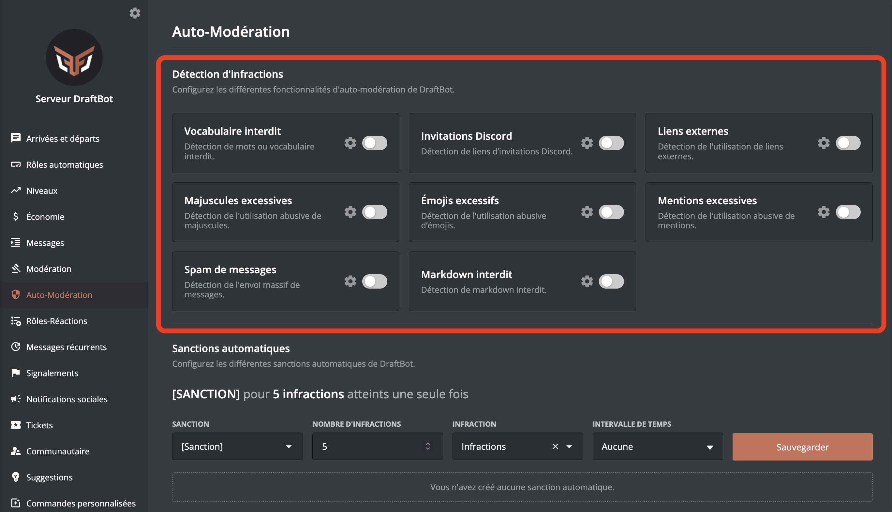
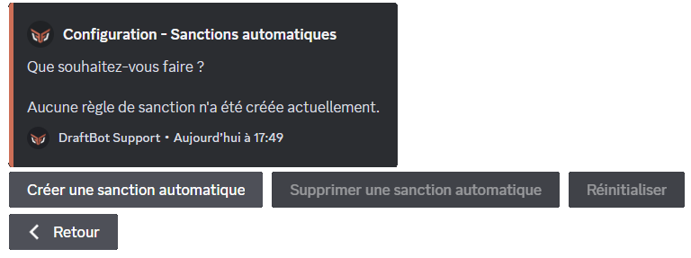
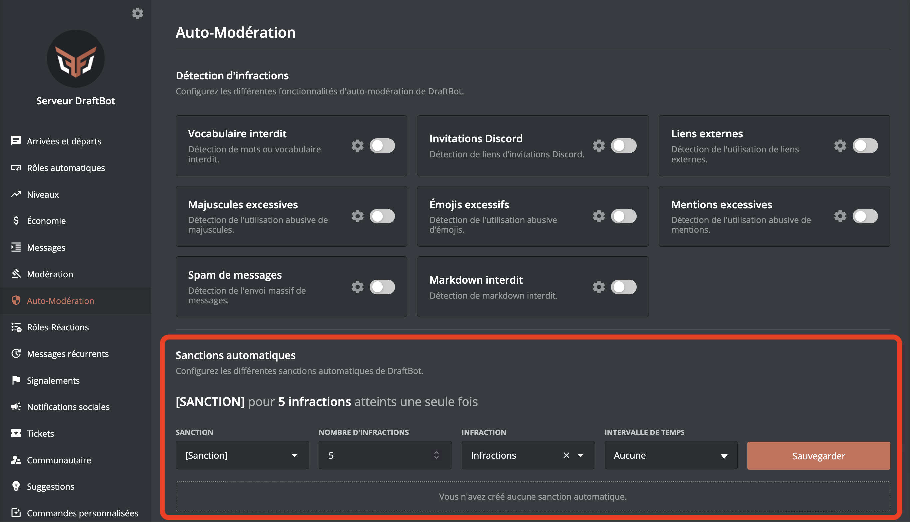

## Détection d'infractions

Le système de détection d'infractions permet d'empêcher les mauvais comportements.

::tabs
  ::tab{ label="Via la commande /config" }
    Rendez-vous d'abord dans la catégorie **`🔨 Modération`** de la commande \</config> puis appuyez sur **`Détection d'infractions`**.

    Vous pourrez ensuite configurer les différents modules :

    

    ::hint{ type="warning" }
      Certaines fonctionnalités disponibles via la commande \</config> apparaissant dans l'image ci-dessus *(`Masquer le nom du modérateur en MP`, `Cacher les réponses des commandes` et `Sanctions prédéfinies`)* n'apparaissent pas sur cette page de documentation. **Cette dernière traite uniquement de l'auto-modération.**

      Si vous recherchez des informations concernant la modération, consultez la [page prévue à cet effet](/docs/modules/moderation).
    ::

    ::hint{ type="info" }

      **N'oubliez pas d'activer le système**, via le premier bouton :

      
    ::
  ::

  ::tab{ label="Via le panel" }
    [⫸ Accéder au panel de **DraftBot**](/dashboard/first/auto-moderation)

    Rendez-vous dans la rubrique **`🛡️ Auto-Modération`**.

    

    Cliquez sur l'icône :gear: d'un module pour le configurer et activez-le avec le bouton placé à droite du :gear:.

    ::hint{ type="warning" }
      Une fois fini, n'oubliez pas d'enregistrer vos modifications avec le bouton **`Sauvegarder`** en bas de la page.
    ::
  ::
::

### Modules

::collapse{ label="Vocabulaire interdit" }
  Vous pouvez choisir des expressions (mots) qui seront bloquées par DraftBot.

  Ajouter un ``*`` au début et/ou à la fin du mot permet de bloquer les mots avec une correspondance partielle : `chat*` permettra de détecter `chats`, `c h a t`, `chaaaaaat` ou`c.h.a.t`.

  L'option **blocage des messages** permet de bloquer les messages avant leur envoi grâce au système d'AutoMod Discord <:automod:1369109533284106260> tout en comptabilisant l'infraction dans l'historique du membre.

  Si la **censure** est activée, DraftBot renverra le message bloqué en supprimant l'expression interdite.
::

::collapse{ label="Invitations Discord"}
  Ce module permet d'interdire la publication de liens d'invitations pour des serveurs autres que le votre dans vos salons.

  L'option **invitations autorisées** permet de définir des invitations qui seront ignorées par le système d'auto-modération.

  L'option **serveurs immunisés** permet d'étendre l'option précédente à toutes les invitations possible d'un serveur en particulier en précisant son [identifiant](/docs/autres/recuperer-un-identifiant#identifiant-dun-serveur).

  ::hint{ type="info" }
    Cette option est une fonctionnalité réservée aux serveurs [premium](/premium) <:icon_premium_:1096140508625125417>.
  ::
  Si la **censure** est activée, DraftBot renverra le message bloqué en supprimant le lien d'invitation.
::

::collapse{ label="Liens externes" }
  Ce module permet d'interdire la publication de liens sur votre serveur.

  L'option **noms de domaines autorisés/interdits** permet de n'interdire ou ignorer que certains liens (sélectionnez le mode adapté) en précisant le nom de domaine ; par exemple `draftbot.fr`.

  Si la **censure** est activée, DraftBot renverra le message bloqué en supprimant le lien interdit.
::

::collapse{ label="Majuscules excecives" }
  Ce module permet de limiter la quantité de majuscules dans les messages.

  Le **pourcentage de majuscules** correspond au pourcentage maximal de caractères en majuscule autorisé dans un message.

  Le **nombre de caractères minimum** est le nombre minimal de caractères que doit comporter un message pour que l'auto-modération le prenne en compte.
::

::collapse{ label="Émojis excessifs" }
  Ce module permet de limiter l'utilisation des émojis dans les messages.

  Le **pourcentage d'émojis du message** correspond au pourcentage minimal d'émojis que doit contenir un message pour que l'auto-modération le prenne en compte.

  Le **nombre d'émojis maximum** est le nombre maximal d'émojis qu'un message peut comporter.
::

::collapse{ label="Mentions excessives" }
  Ce module permet d'empêcher le spam de mentions.

  L'**intervalle de temps** est la durée pendant laquelle le nombre de mentions envoyées par un membre ne doit pas dépasser la limite fixée.

  La **limite de mentions** est le nombre maximal de mentions qu'un membre peut envoyer durant l'intervalle de temps défini.

  Si l'option **supprimer** est activée, DraftBot supprimera les messages contenant le spam de mentions. Attention, cela provoque des mentions fantômes.

  ::hint{ type="info" }
    Une mention fantôme, ou *ghost ping* est une notification de mention avec l'impossibilité de voir la mention.
  ::

  L'option **blocage des messages** permet de bloquer les messages avant leur envoi grâce au système d'AutoMod Discord <:automod:1369109533284106260> tout en comptabilisant l'infraction dans l'historique du membre.

  ::hint{ type="info" }
    Le comptage des mentions est indépendant pour chaque membre.
  ::
::

::collapse{ label="Spam de messages" }
  Ce module permet d'empêcher le spam de messages.

  L'**intervalle de temps** est la durée pendant laquelle le nombre de messages envoyés par un membre ne doit pas dépasser la limite fixée.

  La **limite de messages** est le nombre maximal de messages par membre autorisé durant l'intervalle de temps défini.

  ::hint{ type="info" }
    Le comptage de messages est indépendant pour chaque membre.
  ::
::

::collapse{ label="Markdown interdit" }
  Ce module vous permet de bloquer l'utilisation des markdowns de votre choix parmi :
  - Code en bloc
  - Code en ligne
  - Lien masqué
  - Spoiler
  - Titre
  - Sous-texte
  - Liste
  - Citation

  Si la **suppression du markdown** est activé, DraftBot renverra le message bloqué en supprimant le markdown (activé par défaut).

  ::hint{ type="info" }
    Retrouvez les détails des différents markdowns sur [cette page](/docs/autres/markdown).
  ::
::

### Options récurrentes

- **Mode silencieux** : Si activé, DraftBot ne répondra pas à l'infraction par un message explicatif.
- **Salons ignorés** : Salons dans lesquels l'auto-modération est inactive.
- **Rôles ignorés** : Rôles ignorés par l'auto-modération.

## Sanctions automatiques

Les sanctions automatiques permettent d'appliquer des actions de modération automatiquement aux membres après une quantité définie d'infractions.

### Configuration

::tabs
  ::tab{ label="Via la commande /config" }
    Rendez-vous d'abord dans la catégorie **`🔨 Modération`** de la commande \</config> puis appuyez sur **`Sanctions automatiques`**.

    Vous pourrez ensuite configurer les sanctions automatiques :

    
  ::

  ::tab{ label="Via le panel" }
    [⫸ Accéder au panel de **DraftBot**](/dashboard/first/auto-moderation)

    Vous pourrez ensuite configurer les sanctions automatiques.

    

    ::hint{ type="warning" }
      Une fois fini, n'oubliez pas d'enregistrer vos modifications avec le bouton **`Sauvegarder`** à droite de la page.
    ::
  ::
::

### Options disponibles

- **Sanction** : Le type de sanction à appliquer lors du déclenchement de l'automatisation de la sanction (avertissement par exemple).
- **Nombre d'infractions** : Une fois ce nombre d'infractions atteint, la sanction automatique est appliquée.

::hint{ type="info" }
  Le comptage d'infractions est indépendant pour chaque membre.
::
- **Infraction** : Définir quel type d'infraction sera comptabilisé pour la sanction automatique.
- **Intervalle de temps** : La sanction automatique se déclenche si le nombre d'infractions défini précédemment est atteint durant cet intervalle de temps.

::hint{ type="warning" }
  Les **infractions** correspondent à un déclenchement de l'auto-modération : envoi d'un mot interdit, d'un lien interdit, etc. Les **sanctions** correspondent aux actions de modération : avertissement du membre, exclusion, bannissement, etc.
::

::hint{ type="info" }
  Une fois la sanction automatique enregistrée, une phrase complète la décrira pour une compréhension plus simple.
::

::hint{ type="info" }
  Vous pouvez configurer jusqu'à 10 sanctions automatiques. Les serveurs [premium](/premium) <:icon_premium_:1096140508625125417> peuvent en avoir 50.
::
