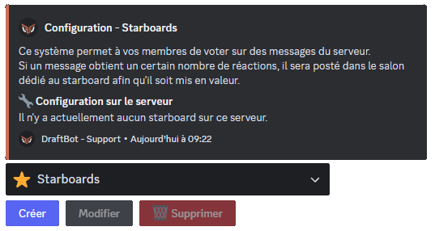
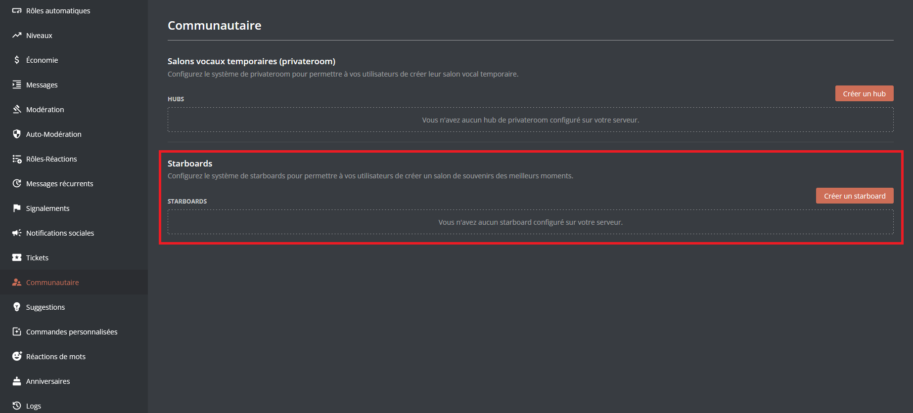
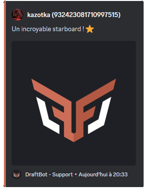

## Comment ça marche ?

Le système de starboard met en avant les messages recevant un certain nombre de réactions `⭐`, qui seront alors affichés par DraftBot dans un salon dédié, choisi ou créé lors de la configuration.

## Configuration du système

::tabs
  ::tab{ label="Via la commande /config" }

    ### Créer un starboard

    Pour ajuster les paramètres de niveaux directement sur Discord, utilisez la commande \</config>, puis sélectionnez l'onglet "Starboard". Après avoir cliqué sur le bouton "Créer", laissez-vous guider par les questions afin de configurer le starboard à l'image de votre serveur.

    Vous pouvez notamment définir le salon du starboard, ainsi que son nom.
    La personnalisation de l'emoji est réservée aux serveurs [premium](/premium).

    

    ::hint{ type="info" }
      Vous pourrez ensuite modifier ou supprimer les starboards existants via les boutons "Modifier" et "Supprimer".
    ::
  ::

  ::tab{ label="Via le panel" }
    Pour configurer le système via le [panel](/dashboard/first/community), il vous suffit de vous diriger dans l'onglet "Communautaire". Ensuite, descendez dans la liste des systèmes et vous trouverez la section dédiée aux starboards.

    

    ### Créer un starboard

    Pour créer un starboard, descendez dans la partie dédiée aux starboards et cliquez sur "Créer un hub". Par la suite, DraftBot vous proposera une sorte de menu de configuration pour configurer votre premier starboard.

    

    ::hint{ type="info" }
      Vous pourrez ensuite modifier ou supprimer les starboards existants via les boutons "Modifier" et "Supprimer".

      Vous pouvez aussi désactiver votre starboard tout en le conservant en décochant la case à gauche du bouton "Modifier".
      
    ::
  ::
::

## Options disponibles

### Salon

- **Conditions par salon** : Permet de modifier le nombre de réactions nécessaires pour publier un message, individuellement en fonction des salons.

- **Salon pouvant être mis en avant** : Permet de choisir des salons dont les messages pourront apparaître dans le starboard.

### Réaction

- **Émoji** : Permet de modifier l'émoji par défaut du starboard [(premium ✨)](/premium)

- **Réactions minimums** : Permet de définir un nombre minimum de réactions (entre 1 et 25).

- **Retirer les réactions de l'auteur** :  Permet de retirer la réaction de l'emoji du starboard laissée par l'auteur sur ses propres messages.

- **Ignorer les messages des bots** : Permet d'empêcher la mise en avant des messages des bots.

    ### Rôles

- **Rôles pouvant être mis en avant** : Permet de définir les rôles dont les messages peuvent apparaître dans le starboard.

- **Rôles pouvant voter** : Permet de définir les rôles dont les réactions sont comptabilisées avant qu'un message soit mis en avant.

### Personnalisation

- Permet de modifier le contenu du message, de le **mettre ou non dans un embed**.

- Si l'embed est activé, il sera possible de changer sa couleur. [(premium ✨)](/premium)

::collapse{ label="Variables disponibles" }

  - `{user}` ➜ Surnom du membre sur le serveur.
  - `{user.username}` ➜ Pseudo du compte du membre.
  - `{user.globalname}` ➜ Nom affiché du compte du membre.
  - `{emoji}` ➜ Emoji du starboard.
  - `{emoji.count}` ➜ Nombre de réactions.
  - `{message.url}` ➜ Lien vers le message.

  
::

## Les différents formats

::tabs
  ::tab{ label="Message via un Embed" }
    
  ::

  ::tab{ label="Message sans Embed" }
    
  ::
::

